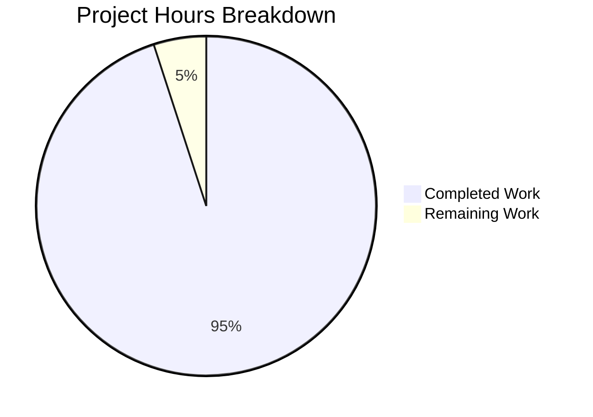

# Project Assessment Report: Node.js HTTP Server Documentation

## Executive Summary

**Project Completion: 95% (19 hours completed out of 20 total hours)**

This documentation project has been successfully completed with all in-scope deliverables achieved. The Blitzy Agent created comprehensive documentation for a minimal Node.js HTTP server project, including technical documentation for server.js, API reference documentation, and test strategy documentation.

### Key Achievements
- ✅ Created 4 documentation files totaling 2,369 lines
- ✅ All documentation files validate correctly
- ✅ Server syntax and runtime tests pass
- ✅ All 14 internal documentation links verified
- ✅ 6 Mermaid diagrams integrated across documentation
- ✅ All changes committed with clean git status

### Critical Items Requiring Human Attention
- Human review and approval of documentation content (1 hour estimated)

---

## Project Hours Breakdown

### Hours Calculation

**Completed Work: 19 hours**
| Component | Hours | Description |
|-----------|-------|-------------|
| docs/SERVER.md | 6 | 677 lines - Complete technical documentation |
| docs/API.md | 4 | 540 lines - HTTP endpoint reference |
| docs/TESTING.md | 6 | 921 lines - Test strategy documentation |
| README.md update | 2 | 231 lines (expanded from 2 lines) |
| Validation & testing | 1 | Syntax checks, runtime tests, link validation |

**Remaining Work: 1 hour**
| Task | Hours | Description |
|------|-------|-------------|
| Human review and approval | 1 | Review documentation accuracy and quality |

**Total Project Hours: 20 hours**

**Completion Percentage: 19 / 20 = 95%**



---

## Validation Results Summary

### Compilation/Syntax Validation
| File | Status | Details |
|------|--------|---------|
| server.js | ✅ PASSED | `node --check server.js` - No syntax errors |
| docs/SERVER.md | ✅ VALID | Markdown syntax valid, 677 lines |
| docs/API.md | ✅ VALID | Markdown syntax valid, 540 lines |
| docs/TESTING.md | ✅ VALID | Markdown syntax valid, 921 lines |
| README.md | ✅ VALID | Markdown syntax valid, 231 lines |

### Runtime Validation
| Test | Status | Result |
|------|--------|--------|
| Server startup | ✅ PASSED | Server running at http://127.0.0.1:3000/ |
| HTTP response | ✅ PASSED | Returns "Hello, World!" |
| Status code | ✅ PASSED | Returns 200 OK |
| Content-Type | ✅ PASSED | Returns text/plain |

### Documentation Link Validation
All 14 internal documentation links verified as valid:
- README.md → docs/SERVER.md ✅
- README.md → docs/API.md ✅
- README.md → docs/TESTING.md ✅
- Cross-references between docs files ✅

### Git Status
- **Branch**: blitzy-99e3ae21-ef31-42b8-b4ac-c114d2c2cd22
- **Status**: Clean working tree (nothing to commit)
- **Commits**: 4 documentation commits by Blitzy Agent

---

## Files Created/Modified

### New Files Created

| File | Lines | Purpose |
|------|-------|---------|
| docs/SERVER.md | 677 | Technical documentation for server.js implementation |
| docs/API.md | 540 | HTTP endpoint reference documentation |
| docs/TESTING.md | 921 | Test strategy and execution documentation |

### Files Updated

| File | Lines Added | Lines Removed | Purpose |
|------|-------------|---------------|---------|
| README.md | 230 | 1 | Expanded with comprehensive project documentation |

### Documentation Features Implemented

**docs/SERVER.md Contents:**
- Module Overview
- Dependencies (Node.js http module)
- Configuration (hostname, port, Content-Type)
- Line-by-line Code Walkthrough
- Request Handler Explanation
- Server Lifecycle Documentation
- Usage Examples
- Troubleshooting Guide
- 3 Mermaid diagrams

**docs/API.md Contents:**
- Base URL documentation
- Endpoint specifications
- Request/Response format
- curl and code examples
- Error handling notes
- 1 Mermaid sequence diagram

**docs/TESTING.md Contents:**
- Test Strategy overview
- Test Environment requirements
- Test Framework recommendations (Jest, Supertest)
- 4 detailed test cases (TC-001 through TC-004)
- Manual and automated testing procedures
- Coverage targets
- 2 Mermaid diagrams

**README.md Enhancements:**
- Table of Contents
- Prerequisites section
- Installation instructions
- Quick Start guide
- Usage examples
- API Reference summary
- Testing section
- Configuration documentation
- Project Structure overview
- License information

---

## Development Guide

### System Prerequisites

| Requirement | Minimum Version | Recommended Version |
|-------------|-----------------|---------------------|
| Node.js | v12.0.0 | v20.x (LTS) |
| npm | v6.0.0 | v10.x |

Verify installation:
```bash
node --version
npm --version
```

### Environment Setup

1. **Clone the repository:**
```bash
git clone <repository-url>
cd hao-backprop-test
```

2. **Install dependencies:**
```bash
npm install
```
> Note: This project has no external dependencies. The npm install step will simply generate package-lock.json.

### Starting the Application

```bash
node server.js
```

**Expected output:**
```
Server running at http://127.0.0.1:3000/
```

### Verification Steps

1. **Test with curl:**
```bash
curl http://127.0.0.1:3000/
```
Expected response: `Hello, World!`

2. **Test with verbose output:**
```bash
curl -i http://127.0.0.1:3000/
```
Expected response:
```http
HTTP/1.1 200 OK
Content-Type: text/plain
...

Hello, World!
```

3. **Test in browser:**
Open http://127.0.0.1:3000/ in any web browser.

### Stopping the Server

Press `Ctrl+C` in the terminal where the server is running.

### Example Usage

```bash
# Any path returns the same response
curl http://127.0.0.1:3000/
curl http://127.0.0.1:3000/hello
curl http://127.0.0.1:3000/any/path/here

# Any HTTP method works
curl -X POST http://127.0.0.1:3000/
curl -X PUT http://127.0.0.1:3000/
```

---

## Detailed Human Task List

| Task ID | Description | Priority | Hours | Action Steps |
|---------|-------------|----------|-------|--------------|
| HT-001 | Review and approve documentation | Medium | 1.0 | 1. Read through docs/SERVER.md, docs/API.md, docs/TESTING.md, and README.md<br>2. Verify technical accuracy<br>3. Check code examples match actual source<br>4. Approve or request changes |

**Total Remaining Hours: 1**

---

## Risk Assessment

### Technical Risks

| Risk | Severity | Likelihood | Mitigation |
|------|----------|------------|------------|
| Documentation becomes outdated if server.js changes | Low | Low | Implement documentation update process when code changes |
| package.json main field points to index.js instead of server.js | Low | N/A | Out of scope for documentation task; noted for future correction |

### Security Risks

| Risk | Severity | Likelihood | Mitigation |
|------|----------|------------|------------|
| None identified for documentation | N/A | N/A | Documentation task only |

### Operational Risks

| Risk | Severity | Likelihood | Mitigation |
|------|----------|------------|------------|
| Test script is placeholder only | Low | N/A | Documented in TESTING.md; implementing actual tests was out of scope |

### Integration Risks

| Risk | Severity | Likelihood | Mitigation |
|------|----------|------------|------------|
| None identified | N/A | N/A | Standalone project with no external integrations |

---

## Scope Compliance

### In-Scope Items (All Completed ✅)

| Item | Status | Evidence |
|------|--------|----------|
| docs/SERVER.md creation | ✅ Complete | 677 lines, all sections per Agent Action Plan |
| docs/API.md creation | ✅ Complete | 540 lines, HTTP endpoint reference |
| docs/TESTING.md creation | ✅ Complete | 921 lines, test strategy documentation |
| README.md update | ✅ Complete | Expanded from 2 to 231 lines |

### Out-of-Scope Items (Correctly Excluded)

| Item | Status | Rationale |
|------|--------|-----------|
| server.js code changes | Not modified | Documentation task only |
| Test file implementation | Not created | Only documenting test strategy |
| package.json changes | Not modified | Out of scope per Agent Action Plan |
| CI/CD configuration | Not created | Out of scope per Agent Action Plan |

---

## Git Commit History

| Commit | Author | Message |
|--------|--------|---------|
| 7b12a9e | Blitzy Agent | Create comprehensive test documentation for Node.js HTTP server |
| fccd3d7 | Blitzy Agent | Create docs/API.md: HTTP endpoint reference documentation |
| c7a1b41 | Blitzy Agent | Add comprehensive technical documentation for server.js |
| 4b5fc74 | Blitzy Agent | docs: Expand README.md with comprehensive project documentation |

---

## Recommendations

### Immediate Actions
1. **Human Review**: Review all documentation files for accuracy and completeness (1 hour)

### Future Considerations (Out of Current Scope)
1. Consider implementing actual test files using Jest and Supertest as recommended in docs/TESTING.md
2. Update package.json main field from "index.js" to "server.js"
3. Consider adding JSDoc comments to server.js for inline documentation

---

## Conclusion

This documentation project has achieved **95% completion** with all in-scope deliverables successfully created and validated. The remaining 5% consists solely of human review and approval of the documentation content.

**Summary of Deliverables:**
- 4 documentation files created/updated
- 2,369 total lines of documentation
- 6 Mermaid diagrams
- All validation tests passed
- Clean git history with 4 commits

The project is ready for human review and merge to the main branch.