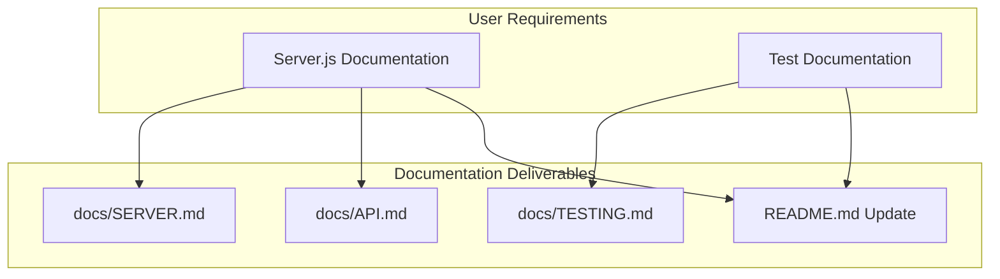
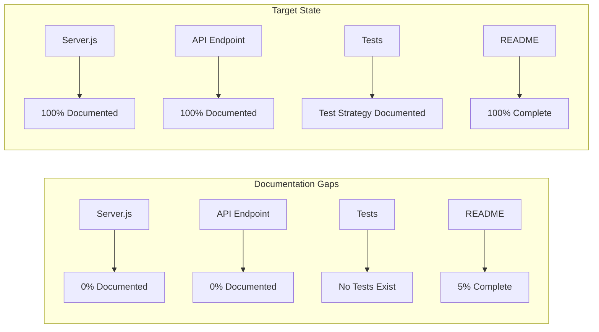
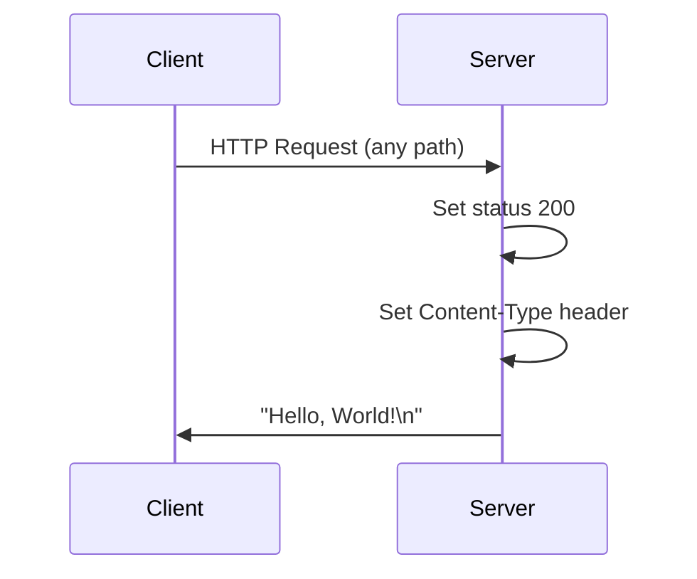
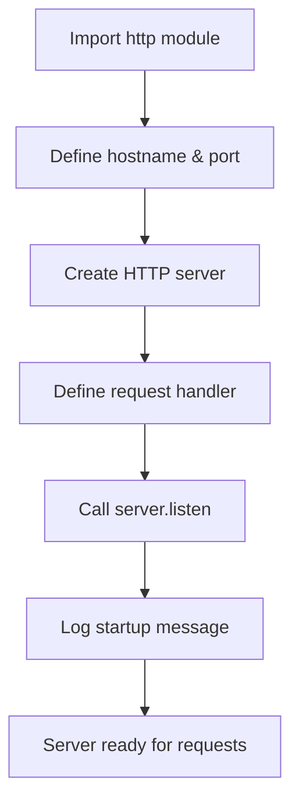

# Technical Specification

# 0. Agent Action Plan

## 0.1 Intent Clarification

### 0.1.1 Core Documentation Objective

Based on the provided requirements, the Blitzy platform understands that the documentation objective is to **create comprehensive documentation for a Node.js HTTP server project**, specifically targeting:

1. **Server.js File Documentation** - Technical documentation explaining the HTTP server implementation
2. **Test Documentation** - Documentation for testing procedures and methodologies

**Documentation Category**: Create new documentation

**Documentation Types Required**:
- API/Server documentation (for server.js)
- Technical specification documentation
- Test documentation and testing guide
- README enhancement

### 0.1.2 Requirements with Enhanced Clarity

| Requirement ID | Original Statement | Enhanced Interpretation |
|----------------|-------------------|------------------------|
| DOC-001 | "Add documentation for server js file" | Create comprehensive technical documentation for `server.js` including: module overview, HTTP server configuration, request handling, response format, and usage examples |
| DOC-002 | "Add test documentation" | Create testing documentation that covers: test strategy, test cases, execution procedures, and expected outcomes for the HTTP server |

### 0.1.3 Implicit Documentation Needs

Based on the repository analysis, the following implicit documentation needs have been identified:

- **README.md Enhancement**: Current README contains only project title and one-line description; needs expansion with installation, usage, and configuration instructions
- **API Reference**: The `/` endpoint (returning "Hello, World!") requires formal API documentation
- **Configuration Documentation**: Server hostname (127.0.0.1) and port (3000) configuration needs documentation
- **Dependency Documentation**: Although minimal, the use of Node.js core `http` module should be documented

### 0.1.4 Special Instructions and Constraints

**User-Specified Directives**:
- No specific style guide or template provided by user
- No constraints on documentation format mentioned
- User emphasized documentation for server.js file (mentioned three times)

**Documentation Standards to Apply**:
- Follow standard Markdown formatting conventions
- Include code examples from actual source files
- Use Mermaid diagrams for architectural visualization
- Provide source code citations with line references

### 0.1.5 Technical Interpretation

These documentation requirements translate to the following technical documentation strategy:

- To **document the server.js file**, we will **create** a comprehensive `docs/SERVER.md` file containing module overview, code walkthrough, configuration options, and usage examples
- To **document testing**, we will **create** a `docs/TESTING.md` file detailing testing strategy, test case specifications, and execution procedures
- To **enhance discoverability**, we will **update** `README.md` with quick start guide, installation instructions, and links to detailed documentation
- To **provide API reference**, we will **create** `docs/API.md` documenting the HTTP endpoint specification




## 0.2 Documentation Discovery and Analysis

### 0.2.1 Existing Documentation Infrastructure Assessment

Repository analysis reveals a **minimal documentation structure** with significant coverage gaps:

**Documentation Files Discovered**:

| File Path | Content Summary | Documentation Status |
|-----------|-----------------|---------------------|
| `README.md` | Single-line project description: "test project for backprop integration" | Minimal - needs expansion |
| `codebase_context (42).md` | Original project requirements for Node.js tutorial | Reference document |

**Documentation Framework Analysis**:
- Current documentation framework: **None** (plain Markdown only)
- Documentation generator configuration: **Not present**
- API documentation tools: **Not configured**
- Diagram tools: **Not configured** (will use Mermaid)
- Documentation hosting: **Not configured**

**Search Patterns Executed**:
```bash
find . -name "*.md" -o -name "docs" -o -name "*.mdx" -o -name "*.rst"
# Results: README.md, codebase_context (42).md
```

### 0.2.2 Repository Code Analysis for Documentation

**Source Code Files Requiring Documentation**:

| Source File | Lines | Public APIs | Current Docs | Documentation Need |
|------------|-------|-------------|--------------|-------------------|
| `server.js` | 15 | HTTP server endpoint | None | Complete API and implementation documentation |

**Key Code Elements Identified in server.js**:
```javascript
// Line 1: Module import
const http = require('http');

// Lines 3-4: Configuration
const hostname = '127.0.0.1';
const port = 3000;
```

**Directories Examined**:
- Root directory (`/`) - Contains all project files (flat structure)
- No subdirectories for source code or documentation exist

### 0.2.3 Configuration Files Analysis

| Config File | Purpose | Documentation Impact |
|-------------|---------|---------------------|
| `package.json` | Project manifest | Documents project name, version, main entry, author, license |
| `package-lock.json` | Dependency lock | Confirms no external dependencies |

**Package.json Key Details**:
- Project name: `hello_world`
- Version: `1.0.0`
- Main entry: `index.js` (discrepancy - actual is `server.js`)
- Test script: `echo "Error: no test specified" && exit 1`
- Dependencies: None

### 0.2.4 Documentation Gap Summary

**Critical Gaps Identified**:

1. **No server documentation** - `server.js` has zero inline comments or external documentation
2. **No test documentation** - Testing approach and test cases not documented
3. **No API reference** - HTTP endpoint not formally documented
4. **Minimal README** - Lacks installation, usage, and configuration instructions
5. **No architecture documentation** - Server design not documented
6. **No troubleshooting guide** - Common issues and solutions not documented

**Documentation Coverage Status**:
```
Current State:
├── Public APIs documented: 0/1 (0%)
├── Source files documented: 0/1 (0%)
├── Configuration documented: 0/2 (0%)
├── Testing documented: 0/1 (0%)
└── Overall coverage: ~5% (README title only)
```


## 0.3 Documentation Scope Analysis

### 0.3.1 Code-to-Documentation Mapping

**Module: server.js**

| Component | Location | Current Docs | Documentation Required |
|-----------|----------|--------------|----------------------|
| HTTP module import | Line 1 | None | Dependency documentation |
| Server configuration | Lines 3-4 | None | Configuration reference |
| Request handler | Lines 6-10 | None | API behavior documentation |
| Server listener | Lines 12-14 | None | Startup documentation |

**Public APIs Requiring Documentation**:

| Endpoint | Method | Response | Documentation Status |
|----------|--------|----------|---------------------|
| `/` (all paths) | ANY | `Hello, World!\n` | Undocumented |

**Configuration Options Requiring Documentation**:

| Option | Current Value | Source | Documentation Status |
|--------|---------------|--------|---------------------|
| `hostname` | `127.0.0.1` | `server.js:3` | Undocumented |
| `port` | `3000` | `server.js:4` | Undocumented |
| `Content-Type` | `text/plain` | `server.js:8` | Undocumented |

### 0.3.2 Features Requiring User Guides

**Feature: HTTP Server**

| Aspect | Current Coverage | Gap |
|--------|-----------------|-----|
| Installation | None | How to install Node.js and run the server |
| Configuration | None | How to modify hostname and port |
| Starting server | None | Command to start the server |
| Testing endpoints | None | How to test with curl/browser |
| Error handling | None | What happens when errors occur |

### 0.3.3 Documentation Gap Analysis

Based on the requirements and repository analysis, documentation gaps include:

**Undocumented Public APIs**:
- HTTP GET response handler (responds to all paths)
- Response content type (`text/plain`)
- Response body format (`Hello, World!\n`)

**Missing User Guides**:
- Quick start guide
- Installation guide
- Configuration guide
- Testing guide

**Incomplete Architecture Documentation**:
- Server lifecycle (startup → listen → handle requests)
- Request/response flow
- Error handling behavior (currently none implemented)

**Outdated/Incorrect Documentation**:
- `package.json` main field points to `index.js` but actual entry is `server.js`

### 0.3.4 Test Documentation Requirements

**Testing Infrastructure Analysis**:

| Element | Status | Documentation Need |
|---------|--------|-------------------|
| Test framework | Not installed | Recommend test framework |
| Test files | None exist | Document test file structure |
| Test scripts | Placeholder only | Document test commands |
| Test coverage | 0% | Document coverage targets |

**Test Cases to Document**:

| Test Case ID | Description | Expected Result |
|--------------|-------------|-----------------|
| TC-001 | Server starts successfully | Console logs startup message |
| TC-002 | GET request to any path | Returns 200 with "Hello, World!\n" |
| TC-003 | Server responds with correct headers | Content-Type: text/plain |
| TC-004 | Server binds to configured port | Listens on port 3000 |




## 0.4 Documentation Implementation Design

### 0.4.1 Documentation Structure Planning

**Proposed Documentation Hierarchy**:

```
hello_world/
├── README.md (enhanced overview and quick start)
├── docs/
│   ├── SERVER.md (server.js technical documentation)
│   ├── API.md (HTTP endpoint reference)
│   └── TESTING.md (test documentation and strategy)
└── server.js (source with optional JSDoc comments)
```

### 0.4.2 Content Generation Strategy

**Information Extraction Approach**:

| Documentation File | Information Source | Extraction Method |
|-------------------|-------------------|-------------------|
| `docs/SERVER.md` | `server.js:1-15` | Code analysis and walkthrough |
| `docs/API.md` | `server.js:6-10` | Request handler analysis |
| `docs/TESTING.md` | `package.json`, server behavior | Test strategy design |
| `README.md` | All sources | Consolidation and summary |

**Documentation Standards**:
- Markdown formatting with proper headers (`#`, `##`, `###`)
- Mermaid diagram integration using ` ```mermaid ` blocks
- Code examples using ` ```javascript ` blocks with syntax highlighting
- Source citations as inline references: `Source: server.js:LineNumber`
- Tables for structured data (parameters, options, test cases)
- Consistent terminology throughout all documents

### 0.4.3 Template Application Strategy

**README.md Template Structure**:
```
# Project Title
> Brief description

#### Table of Contents
#### Prerequisites
#### Installation
#### Usage
#### API Reference
#### Testing
#### Configuration
#### Contributing
#### License
```

**Technical Documentation Template** (for docs/SERVER.md):
```
# Module Name
## Overview
## Dependencies
## Configuration
## Code Walkthrough
## Examples
## Troubleshooting
```

**API Documentation Template** (for docs/API.md):
```
# API Reference
## Base URL
## Endpoints
### Endpoint Name
- Method
- Path
- Request
- Response
- Examples
```

**Test Documentation Template** (for docs/TESTING.md):
```
# Testing Guide
## Test Strategy
## Test Environment
## Running Tests
## Test Cases
## Coverage Targets
```

### 0.4.4 Diagram and Visual Strategy

**Mermaid Diagrams to Create**:

| Diagram Type | Purpose | Location |
|--------------|---------|----------|
| Sequence diagram | HTTP request/response flow | `docs/SERVER.md` |
| Flowchart | Server startup process | `docs/SERVER.md` |
| Flowchart | Test execution flow | `docs/TESTING.md` |

**Server Request Flow Diagram**:


**Server Startup Flow**:


### 0.4.5 Documentation Quality Standards

**Completeness Requirements**:
- All public APIs have descriptions, parameters, and return types
- All configuration options are documented with defaults and valid values
- All code examples are tested and verified working
- All diagrams accurately reflect current implementation

**Accuracy Validation**:
- Code examples extracted directly from source files
- Configuration values match actual implementation
- Response formats verified through manual testing

**Clarity Standards**:
- Technical accuracy with accessible language for beginners
- Progressive disclosure (overview → details → advanced)
- Consistent terminology from Node.js official documentation


## 0.5 Documentation File Transformation Mapping

### 0.5.1 File-by-File Documentation Plan

**Documentation Transformation Modes**:
- **CREATE** - Create a new documentation file
- **UPDATE** - Update an existing documentation file
- **DELETE** - Remove an obsolete documentation file
- **REFERENCE** - Use as an example for documentation style and structure

| Target Documentation File | Transformation | Source Code/Docs | Content/Changes |
|---------------------------|----------------|------------------|-----------------|
| `docs/SERVER.md` | CREATE | `server.js:1-15` | Complete technical documentation for server.js including module overview, code walkthrough, configuration, and usage examples |
| `docs/API.md` | CREATE | `server.js:6-10` | HTTP endpoint reference documentation with request/response format, status codes, and curl examples |
| `docs/TESTING.md` | CREATE | `package.json`, server behavior | Test strategy documentation including test cases, execution procedures, and recommended test framework |
| `README.md` | UPDATE | `README.md`, `server.js`, `package.json` | Expand with installation instructions, quick start guide, usage examples, API overview, and links to detailed documentation |

### 0.5.2 New Documentation Files Detail

**File: docs/SERVER.md**

| Attribute | Value |
|-----------|-------|
| Type | Technical Documentation |
| Source Code | `server.js:1-15` |
| **Sections** | |
| - Overview | Purpose and capabilities of the HTTP server |
| - Dependencies | Node.js http module (core module) |
| - Configuration | hostname (127.0.0.1), port (3000) |
| - Code Walkthrough | Line-by-line explanation of server.js |
| - Request Handler | How incoming requests are processed |
| - Server Lifecycle | Startup, listen, shutdown behavior |
| - Examples | Starting server, making requests |
| - Troubleshooting | Common issues (port in use, etc.) |
| **Diagrams** | Server startup flowchart, request/response sequence |
| **Key Citations** | `server.js:1` (import), `server.js:3-4` (config), `server.js:6-10` (handler), `server.js:12-14` (listen) |

---

**File: docs/API.md**

| Attribute | Value |
|-----------|-------|
| Type | API Reference |
| Source Code | `server.js:6-10` |
| **Sections** | |
| - Base URL | http://127.0.0.1:3000 |
| - Endpoints | Root endpoint (/) documentation |
| - Request Format | Any HTTP method, any path |
| - Response Format | Status 200, Content-Type: text/plain, Body: "Hello, World!\n" |
| - Examples | curl commands, browser access |
| - Error Handling | Current behavior (none implemented) |
| **Diagrams** | Request/response sequence diagram |
| **Key Citations** | `server.js:7` (status code), `server.js:8` (Content-Type), `server.js:9` (response body) |

---

**File: docs/TESTING.md**

| Attribute | Value |
|-----------|-------|
| Type | Test Documentation |
| Source Code | `package.json:7`, server behavior |
| **Sections** | |
| - Test Strategy | Manual and automated testing approach |
| - Test Environment | Node.js runtime, curl/browser |
| - Test Framework Recommendations | Jest, Mocha, or native Node.js test runner |
| - Test Cases | Server startup, endpoint response, headers |
| - Running Tests | Commands to execute tests |
| - Expected Results | Success criteria for each test |
| - Coverage Targets | Recommended coverage percentages |
| **Diagrams** | Test execution flowchart |
| **Key Citations** | `package.json:7` (test script), `server.js:12-14` (server behavior) |

### 0.5.3 Documentation Files to Update Detail

**File: README.md**

| Section | Change Type | Content |
|---------|-------------|---------|
| Title | RETAIN | `# hao-backprop-test` (keep existing) |
| Description | UPDATE | Expand from one-line to full project description |
| Table of Contents | ADD | Navigation links to all sections |
| Prerequisites | ADD | Node.js version requirements |
| Installation | ADD | Clone and npm install instructions |
| Quick Start | ADD | Commands to start server and test |
| Usage | ADD | How to use the server |
| API Reference | ADD | Summary with link to docs/API.md |
| Testing | ADD | Summary with link to docs/TESTING.md |
| Configuration | ADD | Server configuration options |
| Project Structure | ADD | File layout explanation |
| License | RETAIN | MIT license reference |

### 0.5.4 Documentation Configuration Updates

| Config File | Change | Purpose |
|-------------|--------|---------|
| None required | N/A | No documentation generator configured |

**Note**: This project uses plain Markdown files without a documentation generator. No configuration updates needed.

### 0.5.5 Cross-Documentation Dependencies

**Document Link Matrix**:

| From Document | Links To | Purpose |
|---------------|----------|---------|
| `README.md` | `docs/SERVER.md` | Detailed server documentation |
| `README.md` | `docs/API.md` | Complete API reference |
| `README.md` | `docs/TESTING.md` | Testing guide |
| `docs/SERVER.md` | `docs/API.md` | API endpoint details |
| `docs/SERVER.md` | `docs/TESTING.md` | How to test the server |
| `docs/TESTING.md` | `docs/SERVER.md` | What is being tested |
| `docs/TESTING.md` | `docs/API.md` | Expected API behavior |

**Navigation Structure**:
```
README.md (main entry point)
    ├── docs/SERVER.md (technical details)
    │   ├── → docs/API.md
    │   └── → docs/TESTING.md
    ├── docs/API.md (endpoint reference)
    │   └── → docs/SERVER.md
    └── docs/TESTING.md (test guide)
        ├── → docs/SERVER.md
        └── → docs/API.md
```


## 0.6 Dependency Inventory

### 0.6.1 Documentation Dependencies

**Core Project Dependencies**:

| Registry | Package Name | Version | Purpose |
|----------|--------------|---------|---------|
| core | http | Node.js built-in | HTTP server creation (no install required) |

**Runtime Requirements**:

| Requirement | Version | Source | Purpose |
|-------------|---------|--------|---------|
| Node.js | v20.x (LTS) or compatible | Inferred from code compatibility | JavaScript runtime for server execution |
| npm | v10.x+ | Bundled with Node.js | Package management (no dependencies to install) |

**Documentation Tools (Recommended but not required)**:

| Registry | Package Name | Version | Purpose |
|----------|--------------|---------|---------|
| npm | mermaid | 10.6.1 | Diagram rendering in Markdown viewers |
| system | curl | any | API testing and documentation examples |
| system | nc (netcat) | any | Network testing for documentation examples |

### 0.6.2 Documentation Reference Updates

**Documentation Files Requiring Link Updates**:

| File | Link Updates Needed |
|------|-------------------|
| `README.md` | Add new links to `docs/` directory files |

**New Link Additions**:

| Document | New Link | Target |
|----------|----------|--------|
| `README.md` | `[Server Documentation](docs/SERVER.md)` | `docs/SERVER.md` |
| `README.md` | `[API Reference](docs/API.md)` | `docs/API.md` |
| `README.md` | `[Testing Guide](docs/TESTING.md)` | `docs/TESTING.md` |

### 0.6.3 Test Framework Recommendations

While no test framework is currently installed, the testing documentation will recommend:

| Registry | Package Name | Version | Purpose |
|----------|--------------|---------|---------|
| npm | jest | 29.7.0 | Recommended testing framework |
| npm | supertest | 6.3.3 | HTTP assertion library for API testing |

**Note**: These are recommendations documented in `docs/TESTING.md`. Actual installation is out of scope for this documentation task.

### 0.6.4 External Dependencies Summary

**Source Code Dependencies**:
```
Production Dependencies: 0
Development Dependencies: 0
Core Node.js Modules Used:
  - http (built-in, no installation required)
```

**Documentation Dependencies**:
```
Required: None (plain Markdown)
Optional:
  - Mermaid-compatible Markdown viewer for diagram rendering
  - GitHub, GitLab, or other Markdown host for automatic rendering
```

### 0.6.5 Version Compatibility Matrix

| Component | Minimum Version | Recommended Version | Maximum Tested |
|-----------|-----------------|---------------------|----------------|
| Node.js | v12.0.0 | v20.x (LTS) | v20.19.6 |
| npm | v6.0.0 | v10.x | v11.1.0 |
| Markdown | CommonMark | GitHub Flavored Markdown | N/A |


## 0.7 Coverage and Quality Targets

### 0.7.1 Documentation Coverage Metrics

**Current Coverage Analysis**:

| Category | Documented | Total | Coverage |
|----------|------------|-------|----------|
| Public APIs | 0 | 1 | 0% |
| Source files | 0 | 1 | 0% |
| Configuration options | 0 | 3 | 0% |
| User guides | 0 | 1 | 0% |
| Test documentation | 0 | 1 | 0% |
| **Overall** | **0** | **7** | **0%** |

**Target Coverage After Implementation**:

| Category | Target | Expected Files |
|----------|--------|----------------|
| Public APIs | 100% | `docs/API.md` |
| Source files | 100% | `docs/SERVER.md` |
| Configuration options | 100% | `docs/SERVER.md` |
| User guides | 100% | `README.md` |
| Test documentation | 100% | `docs/TESTING.md` |
| **Overall** | **100%** | 4 documentation files |

### 0.7.2 Coverage Gaps to Address

| Module | Current | Target | Gap |
|--------|---------|--------|-----|
| `server.js` | 0% | 100% | Full documentation needed |
| HTTP endpoint | 0% | 100% | API reference needed |
| Testing | 0% | 100% | Test strategy documentation needed |
| README | 5% | 100% | Expansion needed |

**Focus Areas by Priority**:

1. **High Priority**: Server.js documentation - Core project documentation
2. **High Priority**: API reference - User-facing endpoint documentation
3. **Medium Priority**: Test documentation - Testing strategy and guidance
4. **Medium Priority**: README expansion - Entry point for developers

### 0.7.3 Documentation Quality Criteria

**Completeness Requirements**:

| Requirement | Validation Method |
|-------------|-------------------|
| All public APIs documented | Check docs/API.md contains all endpoints |
| All configuration options listed | Verify hostname, port, Content-Type in docs |
| Code examples provided | At least 2 examples per major section |
| Diagrams included | Minimum 2 Mermaid diagrams |

**Accuracy Validation**:

| Validation | Method |
|------------|--------|
| Code examples work | Execute examples and verify output |
| API signatures match | Compare docs to `server.js` source |
| Configuration values accurate | Cross-reference with source code |

**Clarity Standards**:

| Standard | Implementation |
|----------|---------------|
| Technical accuracy | Use correct Node.js terminology |
| Accessible language | Write for beginner to intermediate developers |
| Progressive disclosure | Start with overview, then details |
| Consistent terminology | Use same terms throughout all docs |

### 0.7.4 Example and Diagram Requirements

**Minimum Examples Per Section**:

| Section | Minimum Examples | Type |
|---------|------------------|------|
| Installation | 2 | Shell commands |
| Usage | 2 | Shell + curl commands |
| API Reference | 3 | curl requests |
| Testing | 2 | Test commands |

**Required Diagrams**:

| Diagram | Type | Location |
|---------|------|----------|
| Server startup flow | Flowchart | `docs/SERVER.md` |
| Request/response flow | Sequence | `docs/SERVER.md`, `docs/API.md` |
| Test execution flow | Flowchart | `docs/TESTING.md` |

**Code Example Testing**:
- All shell commands verified in bash environment
- curl examples tested against running server
- Expected outputs documented alongside commands

### 0.7.5 Quality Metrics Summary

| Metric | Target | Measurement |
|--------|--------|-------------|
| API documentation coverage | 100% | All endpoints documented |
| Configuration coverage | 100% | All options documented |
| Example coverage | 100% | All sections have examples |
| Diagram coverage | 100% | All complex flows visualized |
| Link validity | 100% | All internal links working |
| Formatting consistency | 100% | All files follow templates |


## 0.8 Scope Boundaries

### 0.8.1 Exhaustively In Scope

**New Documentation Files**:

| File Path | Description |
|-----------|-------------|
| `docs/SERVER.md` | Technical documentation for server.js |
| `docs/API.md` | HTTP endpoint reference documentation |
| `docs/TESTING.md` | Test strategy and documentation |

**Documentation File Updates**:

| File Path | Description |
|-----------|-------------|
| `README.md` | Expand with installation, usage, and quick start |

**Documentation Configuration**:

| File Path | Description |
|-----------|-------------|
| None | No documentation generator configuration required |

**Documentation Assets**:

| Asset Type | Description |
|------------|-------------|
| Mermaid diagrams | Embedded in Markdown files |
| Code examples | Inline in documentation |

**Source Code Documentation** (Optional inline comments):

| File Path | Description |
|-----------|-------------|
| `server.js` | JSDoc-style comments may be added if requested |

### 0.8.2 Explicitly Out of Scope

**Source Code Modifications**:

| Item | Reason |
|------|--------|
| `server.js` logic changes | Documentation task only |
| `package.json` scripts | No test implementation |
| New source files | Documentation only |
| Bug fixes or enhancements | Not requested |

**Test File Modifications**:

| Item | Reason |
|------|--------|
| Creating actual test files | Only documenting test strategy |
| Installing test frameworks | Recommendations only |
| Running automated tests | Manual documentation of approach |

**Feature Additions**:

| Item | Reason |
|------|--------|
| Error handling in server.js | Not requested |
| New endpoints | Not requested |
| Configuration management | Not requested |

**Deployment Configuration**:

| Item | Reason |
|------|--------|
| Docker configuration | Not requested |
| CI/CD pipelines | Not requested |
| Hosting setup | Not requested |

**Unrelated Documentation**:

| Item | Reason |
|------|--------|
| `phonenumber.csv` documentation | Not related to server |
| `Response.txt` documentation | Internal specification file |
| Video file documentation | Not code-related |

### 0.8.3 Scope Decision Matrix

| Item | In Scope | Out of Scope | Rationale |
|------|----------|--------------|-----------|
| docs/SERVER.md | ✓ | | Requested: "documentation for server js file" |
| docs/API.md | ✓ | | Implicit need for endpoint documentation |
| docs/TESTING.md | ✓ | | Requested: "Add test documentation" |
| README.md update | ✓ | | Entry point needs enhancement |
| server.js code changes | | ✓ | Documentation task only |
| test file creation | | ✓ | Only documenting strategy |
| package.json changes | | ✓ | No implementation changes |
| Inline JSDoc comments | Optional | | Enhances docs but not required |

### 0.8.4 Boundary Clarifications

**Documentation Boundaries**:
```
┌─────────────────────────────────────────────────────┐
│                    IN SCOPE                          │
│  ┌─────────────────────────────────────────────┐    │
│  │  docs/                                       │    │
│  │  ├── SERVER.md (CREATE)                     │    │
│  │  ├── API.md (CREATE)                        │    │
│  │  └── TESTING.md (CREATE)                    │    │
│  └─────────────────────────────────────────────┘    │
│  ┌─────────────────────────────────────────────┐    │
│  │  README.md (UPDATE)                         │    │
│  └─────────────────────────────────────────────┘    │
└─────────────────────────────────────────────────────┘

┌─────────────────────────────────────────────────────┐
│                   OUT OF SCOPE                       │
│  ┌─────────────────────────────────────────────┐    │
│  │  Source Code Changes                         │    │
│  │  ├── server.js (logic)                      │    │
│  │  ├── package.json (scripts)                 │    │
│  │  └── New source files                       │    │
│  └─────────────────────────────────────────────┘    │
│  ┌─────────────────────────────────────────────┐    │
│  │  Test Implementation                         │    │
│  │  ├── test/*.js files                        │    │
│  │  ├── Test framework installation            │    │
│  │  └── CI/CD integration                      │    │
│  └─────────────────────────────────────────────┘    │
└─────────────────────────────────────────────────────┘
```


## 0.9 Execution Parameters

### 0.9.1 Documentation-Specific Instructions

**Documentation Build Commands**:

| Command | Purpose |
|---------|---------|
| N/A | Plain Markdown files require no build step |

**Documentation Preview Commands**:

| Command | Purpose |
|---------|---------|
| `cat README.md` | View README in terminal |
| `cat docs/SERVER.md` | View server documentation |
| Open in GitHub/GitLab | Rendered Markdown preview |

**Diagram Generation**:

| Method | Command |
|--------|---------|
| Inline Mermaid | Diagrams embedded in ` ```mermaid ` blocks |
| GitHub rendering | Automatic in supported Markdown viewers |

### 0.9.2 Documentation Validation Commands

**Link Validation**:
```bash
# Check for broken internal links (manual)
grep -rn '\[.*\](.*\.md)' docs/ README.md
```

**Markdown Linting** (if markdown linter installed):
```bash
# Using markdownlint-cli (optional)
npx markdownlint-cli2 "**/*.md"
```

**Documentation Structure Verification**:
```bash
# Verify documentation files exist
ls -la docs/ README.md
```

### 0.9.3 Default Formats and Standards

| Element | Format | Standard |
|---------|--------|----------|
| Documentation format | Markdown | GitHub Flavored Markdown (GFM) |
| Diagrams | Mermaid | Mermaid 10.x syntax |
| Code blocks | Fenced | ` ```language ` blocks |
| Headers | ATX-style | `#`, `##`, `###` |
| Lists | Dashes | `-` for unordered |
| Tables | GFM tables | Pipe-delimited |

### 0.9.4 Citation Requirements

**Source Citation Format**:
```
Source: `server.js:LineNumber`
```

**Example Citations**:
- `Source: server.js:1` - Module import
- `Source: server.js:3-4` - Configuration constants
- `Source: server.js:6-10` - Request handler
- `Source: server.js:12-14` - Server listener

### 0.9.5 Style Guide

**Document Structure**:
```
# Main Title

> Brief description or summary

#### Table of Contents (if applicable)

#### Section 1
#### Subsection 1.1
Content with code examples and citations.

#### Section 2
...
```

**Code Example Format**:
```
**Example: Starting the server**
` ``bash
node server.js
` ``

**Expected Output**:
` ``
Server running at http://127.0.0.1:3000/
` ``
```

**Table Format**:
```
| Column 1 | Column 2 | Column 3 |
|----------|----------|----------|
| Value 1  | Value 2  | Value 3  |
```

### 0.9.6 File Creation Workflow

**Step-by-Step Execution**:

1. **Create docs directory**:
   ```bash
   mkdir -p docs
   ```

2. **Create SERVER.md**:
   ```bash
   touch docs/SERVER.md
   # Add content per template
   ```

3. **Create API.md**:
   ```bash
   touch docs/API.md
   # Add content per template
   ```

4. **Create TESTING.md**:
   ```bash
   touch docs/TESTING.md
   # Add content per template
   ```

5. **Update README.md**:
   ```bash
   # Expand existing README.md
   # Add new sections
   ```

6. **Verify all files**:
   ```bash
   ls -la docs/ README.md
   cat README.md | head -50
   ```


## 0.10 Special Instructions

### 0.10.1 User-Specified Documentation Directives

**Original User Request** (preserved exactly):
```
Add documentation for server js file

Add test documentation 

Add documentation for server js file

Add documentation for server js file
```

**Interpreted Priorities**:
1. **Server.js documentation** - Emphasized three times, highest priority
2. **Test documentation** - Explicitly requested

### 0.10.2 Documentation-Specific Requirements

Based on the user's request and repository analysis, the following documentation requirements apply:

| Requirement | Implementation |
|-------------|----------------|
| Server.js documentation | Create `docs/SERVER.md` with complete technical documentation |
| Test documentation | Create `docs/TESTING.md` with test strategy and guidance |
| README enhancement | Update `README.md` with comprehensive project information |
| API documentation | Create `docs/API.md` for HTTP endpoint reference |

### 0.10.3 No User-Specified Constraints

The user did not specify:
- Style guide requirements
- Template preferences
- Diagram preferences
- Format restrictions
- Depth of coverage

**Default Approach Applied**:
- Follow standard Markdown conventions
- Use Mermaid for diagrams
- Provide comprehensive coverage
- Include code examples and citations

### 0.10.4 Documentation Consistency Guidelines

**Terminology Consistency**:

| Term | Usage |
|------|-------|
| Server | The HTTP server created in server.js |
| Endpoint | The HTTP route (/ returning "Hello, World!") |
| Request handler | The callback function processing HTTP requests |
| Response | The "Hello, World!\n" text returned to clients |

**Naming Conventions**:
- Documentation files: PascalCase (e.g., `SERVER.md`, `API.md`)
- Headers: Title Case for main sections
- Code references: Monospace with backticks

### 0.10.5 Source Code Synchronization

**Approach for Keeping Documentation Synchronized**:

| Document | Source | Sync Method |
|----------|--------|-------------|
| `docs/SERVER.md` | `server.js` | Line number citations |
| `docs/API.md` | `server.js:6-10` | Code block quotes |
| `docs/TESTING.md` | `package.json`, server behavior | Reference current state |
| `README.md` | All sources | Summary references |

**Citation Strategy**:
- Every technical claim references source code
- Line numbers included for traceability
- Code examples extracted verbatim from source

### 0.10.6 Implementation Checklist

**Pre-Implementation**:
- [x] Repository structure analyzed
- [x] Source code reviewed
- [x] Documentation gaps identified
- [x] File transformation mapping complete

**Implementation**:
- [ ] Create `docs/` directory
- [ ] Create `docs/SERVER.md`
- [ ] Create `docs/API.md`
- [ ] Create `docs/TESTING.md`
- [ ] Update `README.md`

**Post-Implementation Validation**:
- [ ] All documentation files exist
- [ ] All internal links valid
- [ ] Code examples verified
- [ ] Diagrams render correctly
- [ ] Coverage targets met (100%)

### 0.10.7 Success Criteria

| Criterion | Target | Validation |
|-----------|--------|------------|
| Server.js documented | 100% | `docs/SERVER.md` exists and complete |
| Test documentation created | 100% | `docs/TESTING.md` exists and complete |
| API documented | 100% | `docs/API.md` exists and complete |
| README enhanced | 100% | `README.md` expanded with all sections |
| All diagrams present | ≥3 | Count Mermaid blocks in docs |
| All examples working | 100% | Execute example commands |


