# Technical Specification

# 1. Introduction

This Technical Specification document provides a comprehensive reference for the **hello_world** Node.js tutorial project (repository name: `hao-backprop-test`). The document establishes the technical foundation, scope boundaries, and success criteria for this minimal HTTP server implementation designed for educational and integration testing purposes.

## 1.1 Executive Summary

### 1.1.1 Project Overview

The hello_world project is a minimalist Node.js HTTP server implementation created as both a tutorial resource and a test vehicle for backprop platform integration validation. At its core, the project demonstrates fundamental HTTP server concepts using only Node.js native modules, making it an ideal starting point for developers learning server-side JavaScript fundamentals.

| Attribute | Value |
|-----------|-------|
| Project Name | hello_world |
| Repository Name | hao-backprop-test |
| Version | 1.0.0 |
| License | MIT |
| Author | hxu |

### 1.1.2 Core Business Problem

The project addresses two primary business needs:

1. **Educational Gap:** Developers learning Node.js require clear, uncluttered examples of HTTP server fundamentals without the complexity introduced by frameworks like Express.js. This project provides a pure Node.js implementation that demonstrates core HTTP concepts.

2. **Integration Testing Requirements:** The backprop platform requires minimal, predictable test cases for validating integration workflows. This project serves as a controlled test artifact with deterministic behavior suitable for automated testing scenarios.

The original requirement specification (from `codebase_context (42).md`) defines the project scope as:

> *"Create a nodejs tutorial project that features one end point '/hello' that returns 'Hello world' to the calling HTTP client."*

### 1.1.3 Key Stakeholders and Users

| Stakeholder Group | Role | Primary Interest |
|-------------------|------|------------------|
| Node.js Learners | End Users | Understanding HTTP server fundamentals |
| Integration Testers | Technical Users | Validating backprop platform functionality |
| Platform Engineers | Maintainers | Ensuring reliable test infrastructure |
| Tutorial Consumers | End Users | Learning from minimal viable examples |

### 1.1.4 Business Impact and Value Proposition

The project delivers value through:

- **Educational Accessibility:** Provides an approachable entry point for Node.js HTTP server development without framework overhead
- **Testing Reliability:** Offers a predictable, minimal test case for platform integration validation
- **Reference Implementation:** Serves as a canonical example of native Node.js HTTP module usage
- **Dependency Minimization:** Demonstrates zero-dependency server implementation, reducing maintenance burden and security surface area

## 1.2 System Overview

### 1.2.1 Project Context

#### Business Context and Market Positioning

This project occupies a specific niche in the Node.js ecosystem as a pure educational artifact. Unlike production-oriented frameworks, hello_world prioritizes clarity and simplicity over feature completeness. The project demonstrates that functional HTTP servers can be created with minimal code using only Node.js built-in capabilities.

#### Current System Limitations

The current implementation, as documented in `Response.txt`, exhibits several production-readiness gaps that are intentionally acknowledged for educational transparency:

| Limitation Category | Description | Impact |
|--------------------|-------------|--------|
| Server Error Handling | No handling for EADDRINUSE, EACCES errors | Server may fail silently on port conflicts |
| Graceful Shutdown | Absent SIGTERM/SIGINT handlers | Connections may terminate abruptly |
| Request Handler Protection | Missing try-catch blocks | Unhandled exceptions may crash server |
| Client Error Handling | No clientError event handler | Malformed requests not gracefully handled |
| Input Validation | No validation of req/res objects | Potential for unexpected behavior |
| Resource Cleanup | Missing cleanup procedures | Potential resource leaks on shutdown |

These limitations are documented rather than remediated, as the project's primary purpose is educational demonstration rather than production deployment.

#### Integration with Existing Enterprise Landscape

The project operates as a standalone artifact with no dependencies on external systems. Its integration points are limited to:

- **HTTP Protocol:** Standard HTTP/1.1 communication on port 3000
- **Local Network Interface:** Binding exclusively to 127.0.0.1 (localhost)
- **Node.js Runtime:** Requires any modern Node.js installation

### 1.2.2 High-Level Description

#### Primary System Capabilities

The hello_world server provides a single, focused capability: responding to HTTP requests with a text greeting. The implementation is intentionally minimal to maximize educational clarity.

| Capability | Description | Implementation Location |
|------------|-------------|------------------------|
| HTTP Server | Listens for incoming HTTP connections | `server.js:12-14` |
| Response Generation | Returns "Hello, World!\n" with HTTP 200 | `server.js:6-10` |
| Content Negotiation | Serves text/plain content type | `server.js:8` |

#### Major System Components

The system architecture follows a single-file implementation pattern with supporting configuration and documentation files:

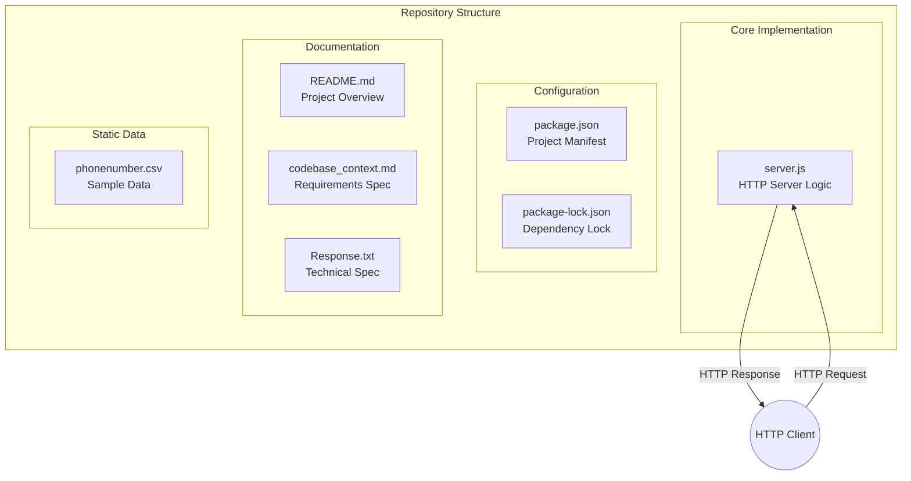
```mermaid
flowchart TB
    subgraph Repository["Repository Structure"]
        direction TB
        subgraph Core["Core Implementation"]
            SERVER[server.js<br/>HTTP Server Logic]
        end
        subgraph Config["Configuration"]
            PKG[package.json<br/>Project Manifest]
            LOCK[package-lock.json<br/>Dependency Lock]
        end
        subgraph Docs["Documentation"]
            README[README.md<br/>Project Overview]
            CONTEXT[codebase_context.md<br/>Requirements Spec]
            RESPONSE[Response.txt<br/>Technical Spec]
        end
        subgraph Data["Static Data"]
            CSV[phonenumber.csv<br/>Sample Data]
        end
    end
    
    CLIENT((HTTP Client)) -->|HTTP Request| SERVER
    SERVER -->|HTTP Response| CLIENT
```

| Component | File | Purpose | Lines of Code |
|-----------|------|---------|---------------|
| HTTP Server | `server.js` | Core server implementation | 15 |
| Project Manifest | `package.json` | npm metadata and scripts | - |
| Dependency Lock | `package-lock.json` | Version pinning (lockfileVersion 3) | - |
| Requirements | `codebase_context (42).md` | Original specification | - |
| Technical Spec | `Response.txt` | Bug analysis and remediation plan | - |
| Sample Data | `phonenumber.csv` | Static data (15 records, not integrated) | - |

#### Core Technical Approach

The implementation leverages Node.js native capabilities exclusively:

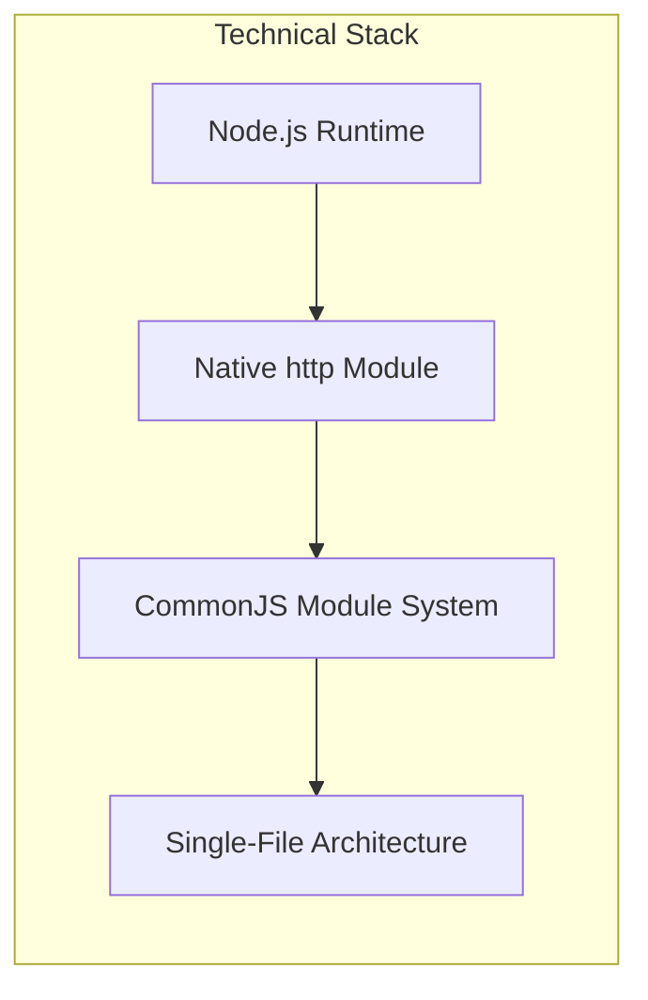
```mermaid
flowchart LR
    subgraph Technical_Stack["Technical Stack"]
        direction TB
        A[Node.js Runtime] --> B[Native http Module]
        B --> C[CommonJS Module System]
        C --> D[Single-File Architecture]
    end
```

| Technical Aspect | Approach | Rationale |
|-----------------|----------|-----------|
| Module System | CommonJS (`require('http')`) | Universal Node.js compatibility |
| HTTP Framework | Native `http` module | Zero dependencies, educational clarity |
| Architecture | Single-file implementation | Minimal complexity for learning |
| Configuration | Hardcoded values | Simplicity over flexibility |

**Server Configuration:**
- **Hostname:** 127.0.0.1 (localhost only)
- **Port:** 3000
- **Response Format:** text/plain
- **Response Body:** "Hello, World!\n"

### 1.2.3 Success Criteria

#### Measurable Objectives

The project defines clear, quantifiable performance targets as documented in `Response.txt`:

| Metric | Target Value | Measurement Method |
|--------|--------------|-------------------|
| Response Time | < 50ms per request | HTTP client timing |
| Memory Usage | < 50MB RSS | Process memory monitoring |
| Concurrent Connections | 100+ simultaneous | Load testing |
| Error Rate | 0% under normal load | Request success ratio |

#### Critical Success Factors

1. **Functional Correctness:** Server must respond to HTTP requests with the expected greeting message
2. **Stability:** Server must maintain operation under specified concurrent load
3. **Resource Efficiency:** Memory and CPU usage must remain within defined bounds
4. **Educational Value:** Code must remain readable and well-documented for tutorial purposes

#### Key Performance Indicators (KPIs)

| KPI | Definition | Target |
|-----|------------|--------|
| Availability | Server uptime during test sessions | 100% |
| Latency (P50) | Median response time | < 25ms |
| Latency (P99) | 99th percentile response time | < 50ms |
| Throughput | Requests handled per second | > 1000 RPS |

## 1.3 Scope

### 1.3.1 In-Scope Elements

#### Core Features and Functionalities

The following capabilities are explicitly within the project scope:

| Feature | Description | Evidence |
|---------|-------------|----------|
| HTTP Server Initialization | Create and start HTTP server instance | `server.js:1, 12-14` |
| Request Handling | Process incoming HTTP requests | `server.js:6-10` |
| Text Response Generation | Return plain text greeting | `server.js:9` |
| Status Code Management | Set HTTP 200 OK response | `server.js:7` |
| Content-Type Header | Specify text/plain MIME type | `server.js:8` |

**Primary User Workflows:**

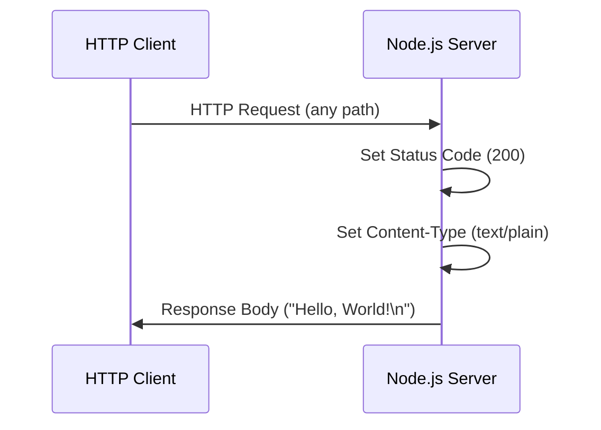
```mermaid
sequenceDiagram
    participant Client as HTTP Client
    participant Server as Node.js Server
    
    Client->>Server: HTTP Request (any path)
    Server->>Server: Set Status Code (200)
    Server->>Server: Set Content-Type (text/plain)
    Server->>Client: Response Body ("Hello, World!\n")
```

#### Implementation Boundaries

| Boundary Type | Specification |
|---------------|---------------|
| System Boundaries | Single Node.js process on localhost |
| Network Interface | 127.0.0.1 only (loopback) |
| Port | 3000 (hardcoded) |
| User Groups | Developers, testers, tutorial consumers |
| Geographic Coverage | Local development/testing environments |
| Data Domains | HTTP text responses only |

#### Essential Technical Requirements

| Requirement | Specification |
|-------------|---------------|
| Runtime | Node.js (any modern version) |
| Dependencies | None (native modules only) |
| Package Manager | npm (lockfileVersion 3) |
| Language | JavaScript (ES5+ compatible) |

### 1.3.2 Out-of-Scope Elements

#### Explicitly Excluded Features

The following capabilities are explicitly excluded from the current project scope, as documented in `Response.txt` section 0.5:

| Excluded Feature | Rationale |
|-----------------|-----------|
| Logging Libraries (winston, morgan) | Console logging sufficient for minimal server |
| Monitoring Instrumentation | Beyond basic production readiness requirements |
| Configuration Management | Environment variables not needed for tutorial |
| Formal Unit Test Files | Integration tests sufficient for validation |
| TypeScript Conversion | Not part of original requirements |
| Express.js or Other Frameworks | Maintaining pure Node.js http module approach |
| Database Connections | No persistent data storage in use |
| Additional Routes/Endpoints | Request routing beyond scope |
| Authentication/Authorization | Security features beyond error handling |
| HTTPS/TLS Support | Protocol upgrade not required |
| Clustering/Load Balancing | Scalability features excluded |
| Health Check Endpoints | Monitoring endpoints separate feature |
| Metrics Collection | Observability beyond error logging |

#### Future Phase Considerations

The following items are candidates for future development phases but are not included in the current scope:

1. **Route Implementation:** Adding path-based routing to serve `/hello` endpoint specifically (addressing current implementation gap with requirements)
2. **Error Handling Enhancement:** Implementing the six production-readiness improvements documented in `Response.txt`
3. **Configuration Externalization:** Moving hostname and port to environment variables
4. **Testing Infrastructure:** Adding formal unit and integration test suites

#### Integration Points Not Covered

| Integration Type | Status |
|-----------------|--------|
| External APIs | Not supported |
| Database Systems | Not supported |
| Message Queues | Not supported |
| Cache Systems | Not supported |
| Cloud Services | Not supported |

#### Unsupported Use Cases

| Use Case | Reason for Exclusion |
|----------|---------------------|
| Production Deployment | Missing production-readiness features |
| Multi-tenant Hosting | No tenant isolation mechanisms |
| Secure Communications | No HTTPS/TLS implementation |
| High-Availability Deployment | No clustering or failover |
| Dynamic Content Generation | Static response only |

### 1.3.3 Implementation Gap Analysis

It should be noted that the current implementation in `server.js` exhibits a deviation from the original requirements specified in `codebase_context (42).md`:

| Aspect | Requirement | Current Implementation |
|--------|-------------|----------------------|
| Endpoint Path | `/hello` | All paths (no routing) |
| Response Text | "Hello world" | "Hello, World!\n" |

This gap is documented for transparency and represents a potential future remediation item.

---

#### References

The following files and artifacts were examined in the preparation of this Introduction section:

- `server.js` - Core HTTP server implementation (15 lines), providing hostname, port, and response handling details
- `package.json` - Project manifest containing name, version, author, license, and description metadata
- `package-lock.json` - Dependency lockfile (version 3) confirming zero external dependencies
- `README.md` - Project overview identifying repository name and purpose
- `codebase_context (42).md` - Original requirements specification defining the project scope
- `Response.txt` - Technical specification containing bug-fix remediation plan, success criteria, and scope boundaries
- `phonenumber.csv` - Static data file (15 message/phone pairs, not integrated with server)

# 2. Product Requirements

## 2.1 Feature Catalog

This section provides a comprehensive catalog of all features identified within the hello_world project, encompassing both implemented capabilities and proposed enhancements documented in the technical analysis.

### 2.1.1 Feature Overview Matrix

The following matrix summarizes all identified features with their current status and priority classifications:

| Feature ID | Feature Name | Category | Priority |
|------------|--------------|----------|----------|
| F-001 | HTTP Server Initialization | Core Infrastructure | Critical |
| F-002 | Request Handling and Response | Core Functionality | Critical |
| F-003 | Server Error Handling | Operational Robustness | Critical |
| F-004 | Graceful Shutdown | Operational Robustness | Critical |
| F-005 | Request Handler Protection | Error Resilience | High |
| F-006 | Client Error Handling | Error Resilience | High |
| F-007 | Input Validation | Defensive Programming | Medium |

| Feature ID | Status | Implementation Evidence |
|------------|--------|------------------------|
| F-001 | Completed | `server.js:1, 3-4, 12-14` |
| F-002 | Completed (with gaps) | `server.js:6-10` |
| F-003 | Proposed | `Response.txt` remediation plan |
| F-004 | Proposed | `Response.txt` remediation plan |
| F-005 | Proposed | `Response.txt` remediation plan |
| F-006 | Proposed | `Response.txt` remediation plan |
| F-007 | Proposed | `Response.txt` remediation plan |

### 2.1.2 Feature F-001: HTTP Server Initialization

#### Feature Metadata

| Attribute | Value |
|-----------|-------|
| Unique ID | F-001 |
| Feature Name | HTTP Server Initialization |
| Feature Category | Core Infrastructure |
| Priority Level | Critical |
| Status | Completed |

#### Description

**Overview:** This feature establishes the foundational HTTP server infrastructure using Node.js native capabilities. The server initialization creates a listening endpoint that accepts incoming HTTP connections on the configured hostname and port.

**Business Value:** Provides the essential runtime infrastructure required for all HTTP-based functionality. Without this feature, no client communication is possible.

**User Benefits:** Developers gain a working HTTP server that can be started with a single command (`node server.js`), demonstrating the simplicity of Node.js server development.

**Technical Context:** The implementation leverages the CommonJS module system to import Node.js's built-in `http` module. The server is configured to bind exclusively to the localhost interface (127.0.0.1) on port 3000, ensuring network isolation appropriate for local development and testing scenarios.

#### Dependencies

| Dependency Type | Description |
|-----------------|-------------|
| Prerequisite Features | None (foundation feature) |
| System Dependencies | Node.js runtime (any modern version) |
| External Dependencies | None (native modules only) |
| Integration Requirements | TCP port 3000 availability |

### 2.1.3 Feature F-002: Request Handling and Response Generation

#### Feature Metadata

| Attribute | Value |
|-----------|-------|
| Unique ID | F-002 |
| Feature Name | Request Handling and Response Generation |
| Feature Category | Core Functionality |
| Priority Level | Critical |
| Status | Completed (with gaps) |

#### Description

**Overview:** This feature implements the core request-response cycle, processing all incoming HTTP requests and generating the standardized greeting response. The handler sets appropriate HTTP status codes, content-type headers, and response body content.

**Business Value:** Delivers the primary user-facing functionality of the tutorial project—responding to HTTP clients with a text greeting. This satisfies the core educational objective of demonstrating HTTP response generation.

**User Benefits:** Users receive immediate, predictable responses to all HTTP requests, enabling them to verify server operation and understand the request-response model.

**Technical Context:** The implementation uses the native `http` module's `createServer` method with a request handler callback. Currently, the handler responds to all incoming request paths with identical content, representing a deviation from the original requirement specifying the `/hello` endpoint specifically.

#### Implementation Gap Analysis

| Aspect | Original Requirement | Current Implementation | Gap Severity |
|--------|---------------------|------------------------|--------------|
| Endpoint Path | `/hello` | All paths (no routing) | Medium |
| Response Text | "Hello world" | "Hello, World!\n" | Low |

The original requirement from `codebase_context (42).md` specifies:
> *"Create a nodejs tutorial project that features one end point '/hello' that returns 'Hello world' to the calling HTTP client."*

#### Dependencies

| Dependency Type | Description |
|-----------------|-------------|
| Prerequisite Features | F-001 (HTTP Server Initialization) |
| System Dependencies | Node.js http module |
| External Dependencies | None |
| Integration Requirements | HTTP/1.1 protocol compliance |

### 2.1.4 Feature F-003: Server Error Handling

#### Feature Metadata

| Attribute | Value |
|-----------|-------|
| Unique ID | F-003 |
| Feature Name | Server Error Handling |
| Feature Category | Operational Robustness |
| Priority Level | Critical |
| Status | Proposed |

#### Description

**Overview:** This proposed feature addresses server-level error conditions that can occur during startup and operation, specifically handling EADDRINUSE (port already in use) and EACCES (permission denied) errors.

**Business Value:** Improves operational reliability by preventing silent failures and providing actionable error information when the server cannot start due to system-level conflicts.

**User Benefits:** Users receive clear error messages when server startup fails, enabling rapid diagnosis and resolution of configuration issues.

**Technical Context:** Implementation requires attaching an error event handler to the server instance (`server.on('error', callback)`) that can distinguish between different error types and respond appropriately with informative console output.

#### Dependencies

| Dependency Type | Description |
|-----------------|-------------|
| Prerequisite Features | F-001 (HTTP Server Initialization) |
| System Dependencies | Node.js EventEmitter pattern |
| External Dependencies | None |
| Integration Requirements | Access to server instance |

### 2.1.5 Feature F-004: Graceful Shutdown

#### Feature Metadata

| Attribute | Value |
|-----------|-------|
| Unique ID | F-004 |
| Feature Name | Graceful Shutdown |
| Feature Category | Operational Robustness |
| Priority Level | Critical |
| Status | Proposed |

#### Description

**Overview:** This proposed feature implements proper signal handling for SIGTERM and SIGINT signals, enabling the server to shut down gracefully by draining active connections before termination.

**Business Value:** Ensures operational integrity during shutdown sequences, preventing abrupt connection termination that could impact connected clients.

**User Benefits:** Developers and operators can safely stop the server without risking data corruption or incomplete request handling.

**Technical Context:** Implementation requires registering process signal handlers that invoke `server.close()` for connection draining, with a fallback forced termination timeout of 10 seconds to prevent indefinite hangs.

#### Dependencies

| Dependency Type | Description |
|-----------------|-------------|
| Prerequisite Features | F-001 (HTTP Server Initialization) |
| System Dependencies | Node.js process signal handling |
| External Dependencies | None |
| Integration Requirements | Access to server instance for close() |

### 2.1.6 Feature F-005: Request Handler Protection

#### Feature Metadata

| Attribute | Value |
|-----------|-------|
| Unique ID | F-005 |
| Feature Name | Request Handler Protection |
| Feature Category | Error Resilience |
| Priority Level | High |
| Status | Proposed |

#### Description

**Overview:** This proposed feature wraps the request handler logic in try-catch blocks to prevent unhandled exceptions from crashing the server process.

**Business Value:** Enhances system stability by containing errors within individual request contexts, maintaining server availability even when individual requests encounter unexpected conditions.

**User Benefits:** Clients receive proper HTTP 500 error responses instead of experiencing connection failures when server-side errors occur.

**Technical Context:** Implementation requires exception handling within the request callback, with checks for `res.headersSent` before attempting to send error responses to avoid protocol violations.

#### Dependencies

| Dependency Type | Description |
|-----------------|-------------|
| Prerequisite Features | F-002 (Request Handling and Response) |
| System Dependencies | JavaScript exception handling |
| External Dependencies | None |
| Integration Requirements | Modification of request handler |

### 2.1.7 Feature F-006: Client Error Handling

#### Feature Metadata

| Attribute | Value |
|-----------|-------|
| Unique ID | F-006 |
| Feature Name | Client Error Handling |
| Feature Category | Error Resilience |
| Priority Level | High |
| Status | Proposed |

#### Description

**Overview:** This proposed feature handles malformed client requests by attaching a clientError event handler to the server instance.

**Business Value:** Improves protocol robustness by gracefully handling invalid HTTP requests without impacting server stability.

**User Benefits:** Clients sending malformed requests receive appropriate HTTP 400 Bad Request responses rather than connection drops.

**Technical Context:** Implementation requires a `server.on('clientError', callback)` handler that writes directly to the socket for clients that have not yet established a valid HTTP session.

#### Dependencies

| Dependency Type | Description |
|-----------------|-------------|
| Prerequisite Features | F-001 (HTTP Server Initialization) |
| System Dependencies | Node.js socket handling |
| External Dependencies | None |
| Integration Requirements | Access to server instance |

### 2.1.8 Feature F-007: Input Validation

#### Feature Metadata

| Attribute | Value |
|-----------|-------|
| Unique ID | F-007 |
| Feature Name | Input Validation |
| Feature Category | Defensive Programming |
| Priority Level | Medium |
| Status | Proposed |

#### Description

**Overview:** This proposed feature validates the presence and type of request (req) and response (res) objects at the start of the request handler.

**Business Value:** Adds a defensive layer against unexpected runtime conditions, further improving server stability.

**User Benefits:** Provides additional protection against edge cases that could cause handler failures.

**Technical Context:** Implementation requires guard clauses at the beginning of the request handler that perform early returns when req or res objects are null or undefined.

#### Dependencies

| Dependency Type | Description |
|-----------------|-------------|
| Prerequisite Features | F-002 (Request Handling and Response) |
| System Dependencies | None |
| External Dependencies | None |
| Integration Requirements | Modification of request handler |

---

## 2.2 Functional Requirements

This section details the specific functional requirements for each feature, organized into structured tables with acceptance criteria and technical specifications.

### 2.2.1 F-001: HTTP Server Initialization Requirements

#### Requirement Details

| Requirement ID | Description | Priority |
|---------------|-------------|----------|
| F-001-RQ-001 | Import Node.js http module using CommonJS require | Must-Have |
| F-001-RQ-002 | Configure hostname to 127.0.0.1 (localhost) | Must-Have |
| F-001-RQ-003 | Configure port to 3000 | Must-Have |
| F-001-RQ-004 | Start server listening on configured endpoint | Must-Have |

| Requirement ID | Acceptance Criteria | Complexity |
|---------------|---------------------|------------|
| F-001-RQ-001 | http module successfully imported without errors | Low |
| F-001-RQ-002 | Server binds exclusively to loopback interface | Low |
| F-001-RQ-003 | Server accepts connections on port 3000 | Low |
| F-001-RQ-004 | Console displays startup confirmation message | Low |

#### Technical Specifications

| Requirement ID | Input Parameters | Output/Response |
|---------------|------------------|-----------------|
| F-001-RQ-001 | Module name: 'http' | http module object |
| F-001-RQ-002 | Hostname constant | Bound interface address |
| F-001-RQ-003 | Port constant | Listening port number |
| F-001-RQ-004 | Hostname, port, callback | Console log confirmation |

#### Performance Criteria

| Metric | Target Value | Evidence |
|--------|--------------|----------|
| Startup Time | < 100ms | Native module loading |
| Memory Footprint | < 50MB RSS | `Response.txt` performance targets |

#### Validation Rules

| Rule Type | Specification |
|-----------|---------------|
| Business Rules | Server must bind to localhost only for security |
| Data Validation | Port must be valid TCP port number (1-65535) |
| Security Requirements | Network access restricted to loopback interface |
| Compliance Requirements | None specified |

### 2.2.2 F-002: Request Handling and Response Requirements

#### Requirement Details

| Requirement ID | Description | Priority |
|---------------|-------------|----------|
| F-002-RQ-001 | Process all incoming HTTP requests | Must-Have |
| F-002-RQ-002 | Set HTTP status code to 200 OK | Must-Have |
| F-002-RQ-003 | Set Content-Type header to text/plain | Must-Have |
| F-002-RQ-004 | Return greeting message in response body | Must-Have |
| F-002-RQ-005 | Route /hello endpoint specifically | Must-Have |

| Requirement ID | Acceptance Criteria | Complexity |
|---------------|---------------------|------------|
| F-002-RQ-001 | All HTTP methods receive response | Low |
| F-002-RQ-002 | Response status code is 200 | Low |
| F-002-RQ-003 | Content-Type header value is 'text/plain' | Low |
| F-002-RQ-004 | Response body contains greeting text | Low |
| F-002-RQ-005 | Only /hello path returns greeting | Medium |

#### Technical Specifications

| Requirement ID | Input Parameters | Output/Response |
|---------------|------------------|-----------------|
| F-002-RQ-001 | req (IncomingMessage) | Processed request |
| F-002-RQ-002 | statusCode: 200 | HTTP status line |
| F-002-RQ-003 | 'Content-Type': 'text/plain' | HTTP header |
| F-002-RQ-004 | 'Hello, World!\n' | Response body |
| F-002-RQ-005 | req.url === '/hello' | Conditional routing |

#### Performance Criteria

| Metric | Target Value | Evidence |
|--------|--------------|----------|
| Response Time | < 50ms per request | `Response.txt` |
| Throughput | > 1000 RPS | `Response.txt` |
| Latency (P50) | < 25ms | `Response.txt` |
| Latency (P99) | < 50ms | `Response.txt` |

#### Validation Rules

| Rule Type | Specification |
|-----------|---------------|
| Business Rules | Response must be human-readable text |
| Data Validation | Response body must not be empty |
| Security Requirements | No sensitive data in response |
| Compliance Requirements | HTTP/1.1 protocol compliance |

#### Implementation Status

| Requirement ID | Status | Notes |
|---------------|--------|-------|
| F-002-RQ-001 | ✅ Implemented | All paths handled |
| F-002-RQ-002 | ✅ Implemented | HTTP 200 returned |
| F-002-RQ-003 | ✅ Implemented | text/plain set |
| F-002-RQ-004 | ✅ Implemented | Greeting returned |
| F-002-RQ-005 | ❌ Not Implemented | Routing absent |

### 2.2.3 F-003: Server Error Handling Requirements

#### Requirement Details

| Requirement ID | Description | Priority |
|---------------|-------------|----------|
| F-003-RQ-001 | Handle EADDRINUSE errors during startup | Should-Have |
| F-003-RQ-002 | Handle EACCES errors during startup | Should-Have |
| F-003-RQ-003 | Log descriptive error messages to console | Should-Have |
| F-003-RQ-004 | Exit process with non-zero code on fatal error | Should-Have |

| Requirement ID | Acceptance Criteria | Complexity |
|---------------|---------------------|------------|
| F-003-RQ-001 | EADDRINUSE triggers error handler | Medium |
| F-003-RQ-002 | EACCES triggers error handler | Medium |
| F-003-RQ-003 | Error messages identify issue clearly | Low |
| F-003-RQ-004 | Process exits with code 1 on error | Low |

#### Technical Specifications

| Requirement ID | Input Parameters | Output/Response |
|---------------|------------------|-----------------|
| F-003-RQ-001 | error.code === 'EADDRINUSE' | Console error message |
| F-003-RQ-002 | error.code === 'EACCES' | Console error message |
| F-003-RQ-003 | Error object properties | Formatted log output |
| F-003-RQ-004 | Exit code: 1 | Process termination |

### 2.2.4 F-004: Graceful Shutdown Requirements

#### Requirement Details

| Requirement ID | Description | Priority |
|---------------|-------------|----------|
| F-004-RQ-001 | Handle SIGTERM signal for shutdown | Should-Have |
| F-004-RQ-002 | Handle SIGINT signal for shutdown | Should-Have |
| F-004-RQ-003 | Drain active connections before exit | Should-Have |
| F-004-RQ-004 | Force exit after 10-second timeout | Should-Have |

| Requirement ID | Acceptance Criteria | Complexity |
|---------------|---------------------|------------|
| F-004-RQ-001 | SIGTERM triggers graceful shutdown | Medium |
| F-004-RQ-002 | SIGINT triggers graceful shutdown | Medium |
| F-004-RQ-003 | server.close() invoked on signal | Medium |
| F-004-RQ-004 | process.exit() after timeout | High |

#### Technical Specifications

| Requirement ID | Input Parameters | Output/Response |
|---------------|------------------|-----------------|
| F-004-RQ-001 | process.on('SIGTERM') | Shutdown sequence |
| F-004-RQ-002 | process.on('SIGINT') | Shutdown sequence |
| F-004-RQ-003 | server.close(callback) | Connection drain |
| F-004-RQ-004 | setTimeout(10000) | Forced exit |

### 2.2.5 F-005: Request Handler Protection Requirements

#### Requirement Details

| Requirement ID | Description | Priority |
|---------------|-------------|----------|
| F-005-RQ-001 | Wrap request handler in try-catch block | Should-Have |
| F-005-RQ-002 | Return HTTP 500 on unhandled exception | Should-Have |
| F-005-RQ-003 | Check headersSent before error response | Should-Have |

| Requirement ID | Acceptance Criteria | Complexity |
|---------------|---------------------|------------|
| F-005-RQ-001 | Exception caught, server continues | Low |
| F-005-RQ-002 | Client receives 500 response | Low |
| F-005-RQ-003 | No duplicate header errors | Low |

### 2.2.6 F-006: Client Error Handling Requirements

#### Requirement Details

| Requirement ID | Description | Priority |
|---------------|-------------|----------|
| F-006-RQ-001 | Attach clientError event handler | Could-Have |
| F-006-RQ-002 | Return HTTP 400 for malformed requests | Could-Have |
| F-006-RQ-003 | Write directly to socket on error | Could-Have |

| Requirement ID | Acceptance Criteria | Complexity |
|---------------|---------------------|------------|
| F-006-RQ-001 | clientError event triggers handler | Medium |
| F-006-RQ-002 | Client receives 400 response | Medium |
| F-006-RQ-003 | Socket handling prevents crashes | Medium |

### 2.2.7 F-007: Input Validation Requirements

#### Requirement Details

| Requirement ID | Description | Priority |
|---------------|-------------|----------|
| F-007-RQ-001 | Validate req object exists and is valid | Could-Have |
| F-007-RQ-002 | Validate res object exists and is valid | Could-Have |
| F-007-RQ-003 | Early return if validation fails | Could-Have |

| Requirement ID | Acceptance Criteria | Complexity |
|---------------|---------------------|------------|
| F-007-RQ-001 | Null/undefined req handled gracefully | Low |
| F-007-RQ-002 | Null/undefined res handled gracefully | Low |
| F-007-RQ-003 | No processing on invalid objects | Low |

---

## 2.3 Feature Relationships

This section documents the dependencies and integration points between features within the hello_world system.

### 2.3.1 Feature Dependencies Map

The following diagram illustrates the dependency relationships between all identified features:

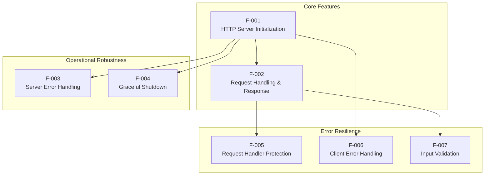
```mermaid
flowchart TD
    subgraph Core["Core Features"]
        F001[F-001<br/>HTTP Server Initialization]
        F002[F-002<br/>Request Handling & Response]
    end
    
    subgraph Robustness["Operational Robustness"]
        F003[F-003<br/>Server Error Handling]
        F004[F-004<br/>Graceful Shutdown]
    end
    
    subgraph Resilience["Error Resilience"]
        F005[F-005<br/>Request Handler Protection]
        F006[F-006<br/>Client Error Handling]
        F007[F-007<br/>Input Validation]
    end
    
    F001 --> F002
    F001 --> F003
    F001 --> F004
    F001 --> F006
    F002 --> F005
    F002 --> F007
```

### 2.3.2 Dependency Matrix

| Feature | Depends On | Required By |
|---------|------------|-------------|
| F-001 | None | F-002, F-003, F-004, F-006 |
| F-002 | F-001 | F-005, F-007 |
| F-003 | F-001 | None |
| F-004 | F-001 | None |
| F-005 | F-002 | None |
| F-006 | F-001 | None |
| F-007 | F-002 | None |

### 2.3.3 Integration Points

All features integrate through the central server instance created by F-001. The following integration points have been identified from the codebase analysis:

| Integration Point | Features Involved | Mechanism |
|-------------------|-------------------|-----------|
| Server Instance | F-001, F-003, F-004, F-006 | EventEmitter pattern |
| Request Handler | F-002, F-005, F-007 | Callback function |
| Response Object | F-002, F-005 | HTTP ServerResponse |
| Process Signals | F-004 | Node.js process module |

### 2.3.4 Shared Components

The following components are shared across multiple features:

| Component | Used By | Location |
|-----------|---------|----------|
| http module | F-001, F-002 | `server.js:1` |
| server instance | F-001, F-003, F-004, F-006 | `server.js:3` |
| hostname constant | F-001 | `server.js:3` |
| port constant | F-001 | `server.js:4` |
| request handler | F-002, F-005, F-007 | `server.js:6-10` |

### 2.3.5 Common Services

Due to the minimal nature of this project, there are no shared services or utilities. All functionality is contained within the single `server.js` file using Node.js native modules exclusively.

---

## 2.4 Implementation Considerations

This section details the technical constraints, performance requirements, and other implementation factors for each feature category.

### 2.4.1 Core Features (F-001, F-002)

#### Technical Constraints

| Constraint | Description | Impact |
|------------|-------------|--------|
| Localhost Binding | Server binds to 127.0.0.1 only | External network access prohibited |
| Hardcoded Port | Port 3000 not configurable | May conflict with other services |
| No Route Implementation | All paths receive same response | Does not match /hello requirement |
| Single Process | No clustering support | Limited to single CPU core |

#### Performance Requirements

As defined in `Response.txt`, the following performance targets apply to core features:

| Metric | Target | Measurement |
|--------|--------|-------------|
| Response Time | < 50ms | HTTP client timing |
| Memory Usage | < 50MB RSS | Process monitoring |
| Concurrent Connections | 100+ | Load testing |
| Throughput | > 1000 RPS | Requests per second |

#### Scalability Considerations

| Factor | Current State | Limitation |
|--------|---------------|------------|
| Horizontal Scaling | Not supported | Single process design |
| Vertical Scaling | Not applicable | Minimal resource usage |
| Load Balancing | Not implemented | Beyond project scope |

#### Security Implications

| Security Aspect | Assessment | Mitigation |
|----------------|------------|------------|
| Network Exposure | Low risk | Localhost binding only |
| Input Injection | Low risk | No user input processing |
| Information Disclosure | Low risk | Static response content |
| Authentication | None required | Tutorial project scope |

#### Maintenance Requirements

| Requirement | Description |
|-------------|-------------|
| Node.js Updates | Monitor for security patches |
| Dependency Audits | None required (zero dependencies) |
| Documentation | Keep README current |

### 2.4.2 Operational Robustness Features (F-003, F-004)

#### Technical Constraints

| Constraint | Description | Impact |
|------------|-------------|--------|
| Event-Based | Requires EventEmitter pattern | Asynchronous handling |
| Signal Availability | Unix signals may vary by platform | Windows compatibility |
| Timeout Handling | Requires timer management | Memory for pending timers |

#### Performance Requirements

| Metric | Target | Context |
|--------|--------|---------|
| Shutdown Time | < 10 seconds | Connection draining timeout |
| Error Detection | < 100ms | Startup error detection |
| Signal Response | Immediate | No processing delay |

#### Scalability Considerations

These features do not impact scalability as they operate at the process lifecycle level.

#### Security Implications

| Security Aspect | Assessment |
|----------------|------------|
| Denial of Service | Graceful shutdown prevents resource exhaustion |
| Error Information Exposure | Avoid exposing internal paths in error messages |

#### Maintenance Requirements

| Requirement | Description |
|-------------|-------------|
| Signal Handler Testing | Verify behavior on target platforms |
| Error Code Coverage | Test all documented error scenarios |

### 2.4.3 Error Resilience Features (F-005, F-006, F-007)

#### Technical Constraints

| Constraint | Description | Impact |
|------------|-------------|--------|
| headersSent Check | Must verify before sending error response | Prevents protocol errors |
| Socket Access | clientError requires direct socket writes | Lower-level handling |
| Type Safety | JavaScript dynamic typing | Runtime validation required |

#### Performance Requirements

| Metric | Target | Context |
|--------|--------|---------|
| Error Response Time | < 50ms | Same as normal response |
| Error Rate | 0% under normal load | `Response.txt` target |

#### Security Implications

| Security Aspect | Assessment |
|----------------|------------|
| Error Message Content | Avoid stack traces in responses |
| Request Validation | Prevent malformed input processing |

---

## 2.5 Traceability Matrix

This section provides traceability from the original requirement through to implementation.

### 2.5.1 Requirement-to-Feature Traceability

| Original Requirement | Feature ID | Status |
|---------------------|------------|--------|
| Create nodejs tutorial project | F-001, F-002 | Completed |
| Features one endpoint '/hello' | F-002-RQ-005 | Not Implemented |
| Returns 'Hello world' | F-002-RQ-004 | Partial (variant text) |
| HTTP client communication | F-002-RQ-001 | Completed |

### 2.5.2 Feature-to-File Traceability

| Feature ID | Implementation File | Line Numbers |
|------------|---------------------|--------------|
| F-001 | `server.js` | 1, 3-4, 12-14 |
| F-002 | `server.js` | 6-10 |
| F-003 | Not implemented | N/A |
| F-004 | Not implemented | N/A |
| F-005 | Not implemented | N/A |
| F-006 | Not implemented | N/A |
| F-007 | Not implemented | N/A |

### 2.5.3 Requirement-to-Test Traceability

| Requirement ID | Test Method | Validation Approach |
|---------------|-------------|---------------------|
| F-001-RQ-001 | Manual | Verify http module import |
| F-001-RQ-002 | Integration | Confirm localhost binding |
| F-001-RQ-003 | Integration | Verify port 3000 access |
| F-001-RQ-004 | Integration | Check server startup log |
| F-002-RQ-001 | Integration | Send HTTP request, verify response |
| F-002-RQ-002 | Integration | Check response status code |
| F-002-RQ-003 | Integration | Verify Content-Type header |
| F-002-RQ-004 | Integration | Verify response body |
| F-002-RQ-005 | Integration | Test path routing |

---

## 2.6 Assumptions and Constraints

### 2.6.1 Documentation Assumptions

| Assumption | Rationale |
|------------|-----------|
| Node.js is pre-installed | Tutorial targets developers with Node.js environment |
| Port 3000 is available | Standard development port assumption |
| Localhost access sufficient | Development/testing context only |
| No persistent data required | Static response application |

### 2.6.2 Technical Constraints Summary

| Constraint Category | Constraints |
|--------------------|-------------|
| Runtime | Node.js (any modern version) |
| Dependencies | None (native modules only) |
| Network | Localhost only (127.0.0.1) |
| Port | 3000 (hardcoded) |
| Protocol | HTTP/1.1 only |

### 2.6.3 Scope Constraints

As documented in `Response.txt` and the technical specification, the following items are explicitly excluded from scope:

| Excluded Item | Rationale |
|---------------|-----------|
| Express.js or frameworks | Pure Node.js approach |
| Database connections | No persistent data |
| Authentication/authorization | Beyond tutorial scope |
| HTTPS/TLS support | Protocol upgrade not required |
| Logging libraries | Console logging sufficient |
| Configuration management | Hardcoded values intentional |

---

## 2.7 References

The following files and artifacts were examined in the preparation of this Product Requirements section:

#### Source Files

- `server.js` - Core HTTP server implementation (15 lines), providing request handler and server initialization logic
- `package.json` - Project manifest containing name, version, author, license, and description metadata
- `package-lock.json` - Dependency lockfile (version 3) confirming zero external dependencies

#### Documentation Files

- `codebase_context (42).md` - Original requirements specification defining the project scope and /hello endpoint requirement
- `Response.txt` - Technical specification containing bug-fix remediation plan, success criteria, performance targets, and explicit scope exclusions
- `README.md` - Project overview identifying repository name and basic purpose

#### Data Files

- `phonenumber.csv` - Static data file (15 message/phone pairs, not integrated with server functionality)

#### Technical Specification Sections Referenced

- Section 1.1 Executive Summary - Project overview and business context
- Section 1.2 System Overview - High-level description and success criteria
- Section 1.3 Scope - In-scope and out-of-scope elements, implementation gap analysis

# 3. Technology Stack

## 3.1 Overview

The hello_world project employs an intentionally minimalist technology stack designed to maximize educational clarity while maintaining zero external dependencies. This architectural decision supports the project's dual purpose as both a Node.js learning resource and a controlled test artifact for backprop platform integration validation.

The technology selection philosophy follows a "less is more" approach where every component is justified by explicit requirements, resulting in a streamlined stack that consists solely of the Node.js runtime and its native HTTP module.

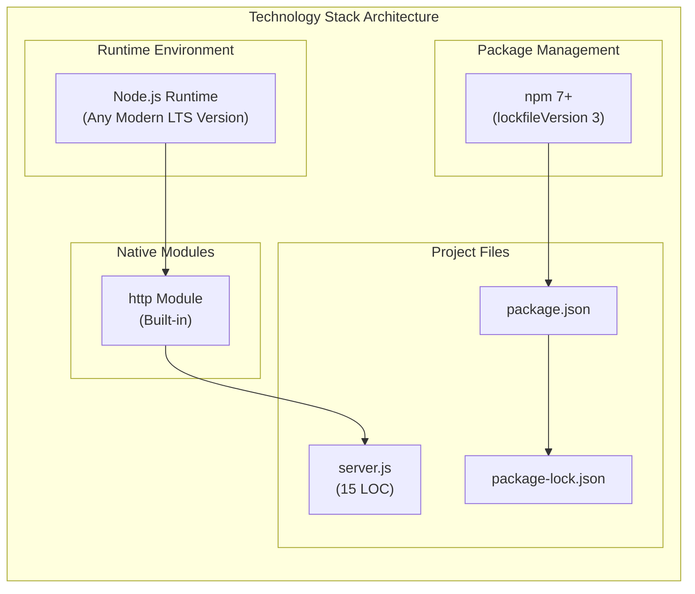
```mermaid
flowchart TB
    subgraph TechStack["Technology Stack Architecture"]
        direction TB
        subgraph Runtime["Runtime Environment"]
            NODE["Node.js Runtime<br/>(Any Modern LTS Version)"]
        end
        subgraph NativeModules["Native Modules"]
            HTTP["http Module<br/>(Built-in)"]
        end
        subgraph PackageManagement["Package Management"]
            NPM["npm 7+<br/>(lockfileVersion 3)"]
        end
        subgraph FileSystem["Project Files"]
            SERVER["server.js<br/>(15 LOC)"]
            PKG["package.json"]
            LOCK["package-lock.json"]
        end
    end
    
    NODE --> HTTP
    NPM --> PKG
    PKG --> LOCK
    HTTP --> SERVER
```

### 3.1.1 Stack Selection Rationale

| Design Principle | Implementation | Benefit |
|-----------------|----------------|---------|
| Zero Dependencies | No external packages | Minimal security surface, no dependency audits required |
| Native Module Usage | Node.js `http` module only | Universal Node.js version compatibility |
| Single-File Architecture | All logic in `server.js` | Maximum educational clarity |
| CommonJS Module System | `require()` syntax | Broadest Node.js version support |

### 3.1.2 Technology Stack Summary

| Layer | Technology | Version/Specification | Status |
|-------|-----------|----------------------|--------|
| Runtime | Node.js | Any modern LTS (recommended: 22.x or 24.x) | Required |
| Language | JavaScript | ES5+ compatible | Required |
| HTTP Framework | Native `http` module | Node.js built-in | Required |
| Package Manager | npm | 7+ (lockfileVersion 3) | Optional |
| External Frameworks | None | N/A | Intentionally Excluded |
| Database | None | N/A | Intentionally Excluded |
| Containerization | None | N/A | Out of Scope |
| CI/CD | None | N/A | Out of Scope |

---

## 3.2 Programming Languages

### 3.2.1 Primary Language: JavaScript (Node.js)

The project utilizes JavaScript as its sole programming language, executed within the Node.js server-side runtime environment. This selection provides direct alignment with the project's educational objectives.

| Attribute | Specification | Evidence |
|-----------|--------------|----------|
| Language | JavaScript | `server.js:1-15` |
| Runtime Environment | Node.js | Tech Spec Section 1.1 |
| Module System | CommonJS | `require('http')` in `server.js:1` |
| ECMAScript Compatibility | ES5+ | No modern syntax features used |
| Strict Mode | Not enforced | Implicit standard mode |

#### Language Features Utilized

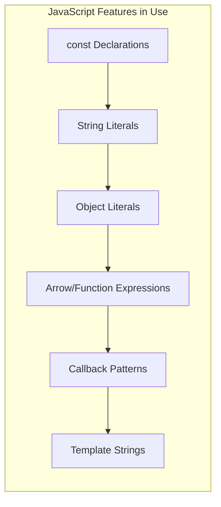
```mermaid
flowchart LR
    subgraph JSFeatures["JavaScript Features in Use"]
        direction TB
        A["const Declarations"] --> B["String Literals"]
        B --> C["Object Literals"]
        C --> D["Arrow/Function Expressions"]
        D --> E["Callback Patterns"]
        E --> F["Template Strings"]
    end
```

| Feature | Usage Location | Purpose |
|---------|---------------|---------|
| `const` declarations | `server.js:1-4` | Immutable variable bindings |
| String literals | `server.js:3,9` | Configuration values and response content |
| Object literals | `server.js:8` | HTTP header specification |
| Callback functions | `server.js:6-10` | Request handler implementation |
| Template literals | `server.js:13` | Console output formatting |

#### Version Compatibility Analysis

The codebase maintains maximum backward compatibility by avoiding modern JavaScript features that would require recent Node.js versions:

| Avoided Feature | Alternative Used | Compatibility Benefit |
|----------------|------------------|----------------------|
| ES6 Modules (`import`) | CommonJS (`require`) | All Node.js versions supported |
| `async/await` | Callback pattern | Node.js < 7.6 compatible |
| Optional chaining (`?.`) | Not needed | Node.js < 14 compatible |
| Nullish coalescing (`??`) | Not needed | Node.js < 14 compatible |

### 3.2.2 Node.js Runtime Requirements

#### Recommended Versions

Based on current Node.js release schedules, the following versions are recommended for running this project:

| Version | Codename | Support Status | End of Life | Recommendation |
|---------|----------|----------------|-------------|----------------|
| 24.x | Krypton | Active LTS | April 2028 | Recommended for new deployments |
| 22.x | Jod | Active LTS | April 2027 | Stable choice for production |
| 20.x | Iron | Maintenance LTS | April 2026 | Acceptable for existing systems |

**Note:** Per Node.js official guidance, "Production applications should only use Active LTS or Maintenance LTS releases." Even-numbered versions receive long-term support of typically 30 months.

#### Minimum Requirements

| Requirement | Specification | Rationale |
|------------|---------------|-----------|
| Minimum Node.js Version | Any modern version | No version-specific features used |
| Recommended Minimum | Node.js 18.x+ | Security updates and performance |
| Module Resolution | CommonJS | No ES modules compilation needed |

### 3.2.3 Language Selection Justification

| Selection Criterion | Assessment | Score |
|--------------------|------------|-------|
| Educational Alignment | JavaScript is the target learning language | ✓ Optimal |
| Native HTTP Support | `http` module requires no additional syntax | ✓ Optimal |
| Platform Ubiquity | Node.js widely installed in development environments | ✓ Optimal |
| Learning Curve | Single language for both server and potential client code | ✓ Optimal |
| Community Support | Extensive documentation and tutorials available | ✓ Optimal |

---

## 3.3 Frameworks & Libraries

### 3.3.1 Framework Strategy: Intentional Exclusion

The project explicitly excludes all external frameworks, representing a deliberate architectural decision rather than an oversight. This "frameworkless" approach serves the project's educational mission by exposing raw HTTP server mechanics.

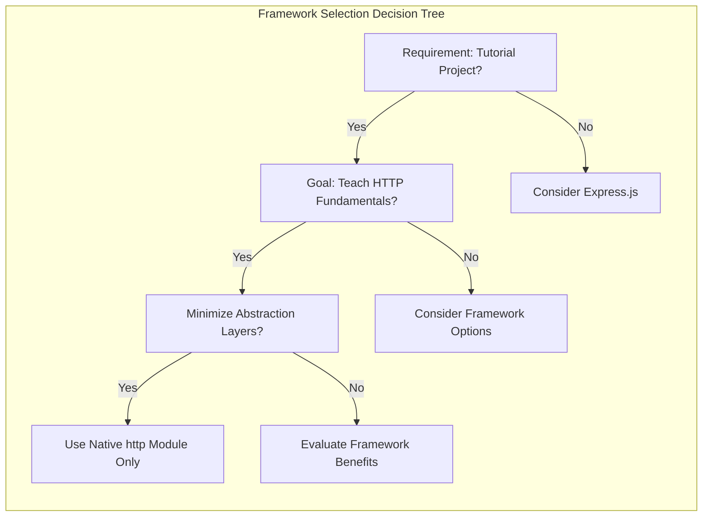
```mermaid
flowchart TB
    subgraph FrameworkDecision["Framework Selection Decision Tree"]
        direction TB
        Q1["Requirement: Tutorial Project?"]
        Q1 -->|Yes| Q2["Goal: Teach HTTP Fundamentals?"]
        Q2 -->|Yes| Q3["Minimize Abstraction Layers?"]
        Q3 -->|Yes| DECISION["Use Native http Module Only"]
        
        Q1 -->|No| ALT1["Consider Express.js"]
        Q2 -->|No| ALT2["Consider Framework Options"]
        Q3 -->|No| ALT3["Evaluate Framework Benefits"]
    end
```

#### Excluded Frameworks

As documented in the Technical Specification Section 1.3.2, the following frameworks are explicitly excluded:

| Framework | Type | Exclusion Rationale |
|-----------|------|---------------------|
| Express.js | HTTP Framework | Adds abstraction layer that obscures HTTP fundamentals |
| Koa | HTTP Framework | Beyond tutorial scope requirements |
| Fastify | HTTP Framework | Unnecessary complexity for single-endpoint tutorial |
| Hapi | HTTP Framework | Enterprise features not required |
| NestJS | Application Framework | TypeScript and architecture patterns beyond scope |

### 3.3.2 Native Module Utilization

The project leverages Node.js built-in modules exclusively, requiring no external library installation:

#### Core Module: `http`

| Attribute | Value | Evidence |
|-----------|-------|----------|
| Module Name | `http` | `server.js:1` |
| Import Syntax | `const http = require('http');` | CommonJS pattern |
| Module Type | Node.js Built-in | No installation required |
| API Functions Used | `createServer()`, `server.listen()` | `server.js:6,12` |

#### HTTP Module API Usage

| API Method | Usage | Purpose |
|------------|-------|---------|
| `http.createServer(callback)` | Creates HTTP server instance | Initialize request handling |
| `response.statusCode` | Set to `200` | HTTP success status |
| `response.setHeader(name, value)` | Set `Content-Type` header | MIME type specification |
| `response.end(body)` | Send response body | Complete HTTP response |
| `server.listen(port, hostname, callback)` | Bind to network interface | Start accepting connections |

### 3.3.3 Framework Exclusion Justification

| Criterion | Native Module Approach | Framework Approach | Decision |
|-----------|----------------------|-------------------|----------|
| Learning Transparency | Full visibility into HTTP mechanics | Abstracted away | Native ✓ |
| Dependency Count | Zero | Multiple packages | Native ✓ |
| Security Surface | Minimal | Increased attack vectors | Native ✓ |
| Maintenance Burden | None | Version updates required | Native ✓ |
| Tutorial Simplicity | 15 lines of code | Boilerplate overhead | Native ✓ |

---

## 3.4 Open Source Dependencies

### 3.4.1 Dependency Strategy: Zero External Dependencies

The project implements a strict zero-dependency policy, with no external npm packages in either runtime or development configurations.

#### Package Manifest Analysis

**`package.json` Configuration:**

| Field | Value | Purpose |
|-------|-------|---------|
| `name` | "hello_world" | Package identifier |
| `version` | "1.0.0" | Semantic version |
| `description` | "Hello world in Node.js" | Package description |
| `main` | "index.js"* | Entry point declaration |
| `license` | "MIT" | Open source license |
| `author` | "hxu" | Package author |

*Note: A documentation gap exists where `package.json` declares `main: "index.js"` while the actual entry point is `server.js`.

#### Dependency Sections

| Dependency Type | Count | Packages |
|-----------------|-------|----------|
| `dependencies` | 0 | None declared |
| `devDependencies` | 0 | None declared |
| `peerDependencies` | 0 | None declared |
| `optionalDependencies` | 0 | None declared |

### 3.4.2 Package Lock Configuration

**`package-lock.json` Analysis:**

| Attribute | Value | Significance |
|-----------|-------|--------------|
| `lockfileVersion` | 3 | npm 7+ format |
| `packages` | Empty (self-reference only) | No external packages |
| Integrity Hashes | None | No external package verification needed |

The lockfile version 3 format indicates compatibility with npm 7 and later versions, while the empty packages section confirms the zero-dependency design.

### 3.4.3 Security Implications of Zero Dependencies

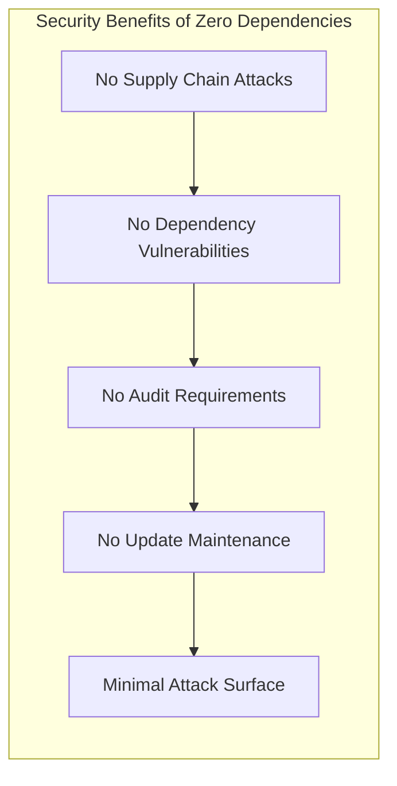
```mermaid
flowchart LR
    subgraph SecurityBenefits["Security Benefits of Zero Dependencies"]
        direction TB
        A["No Supply Chain Attacks"] --> B["No Dependency Vulnerabilities"]
        B --> C["No Audit Requirements"]
        C --> D["No Update Maintenance"]
        D --> E["Minimal Attack Surface"]
    end
```

| Security Aspect | Impact | Evidence |
|----------------|--------|----------|
| Supply Chain Risk | Eliminated | No third-party code execution |
| Vulnerability Exposure | Native Node.js only | Security patches via Node.js updates |
| Dependency Audits | Not required | No `npm audit` concerns |
| License Compliance | Simplified | Only MIT license (project itself) |
| Maintenance Overhead | Minimized | No dependency version management |

### 3.4.4 Dependency Management Considerations

#### npm Registry Configuration

| Configuration | Value | Purpose |
|--------------|-------|---------|
| Registry | npm (default) | Standard public registry |
| Package Scope | Unscoped | Public namespace |
| Publishing | Not configured | Tutorial-only project |

#### Future Dependency Guidance

Should the project scope expand to require external dependencies, the following guidelines apply:

| Category | Recommendation | Rationale |
|----------|----------------|-----------|
| Security | Use `npm audit` before adding packages | Vulnerability detection |
| Licensing | Verify MIT/Apache/BSD compatibility | License compliance |
| Maintenance | Prefer actively maintained packages | Long-term viability |
| Bundle Size | Evaluate package footprint | Performance impact |

---

## 3.5 Third-Party Services

### 3.5.1 External Integration Strategy: None Required

The project operates as a completely self-contained artifact with no external service dependencies. This isolation supports its role as a deterministic test case for platform integration validation.

#### Service Integration Status

| Integration Category | Status | Rationale |
|---------------------|--------|-----------|
| External APIs | Not Supported | Static response design |
| Authentication Services | Not Supported | Beyond tutorial scope |
| Database Services | Not Supported | No persistent data requirements |
| Message Queues | Not Applicable | Single-process architecture |
| Cache Services | Not Applicable | No caching requirements |
| Cloud Services | Not Applicable | Local development focus |
| Monitoring Tools | Not Supported | Console logging sufficient |
| CDN Services | Not Applicable | No static assets served |

### 3.5.2 Integration Points

The project's integration surface is limited to standard protocol interfaces:

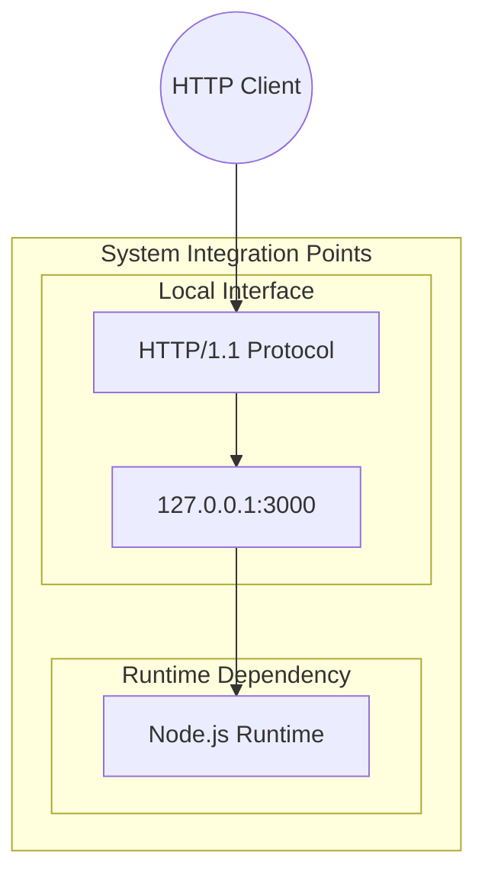
```mermaid
flowchart TB
    subgraph IntegrationPoints["System Integration Points"]
        direction LR
        subgraph LocalOnly["Local Interface"]
            HTTP["HTTP/1.1 Protocol"]
            LOCALHOST["127.0.0.1:3000"]
        end
        subgraph Runtime["Runtime Dependency"]
            NODEJS["Node.js Runtime"]
        end
    end
    
    CLIENT((HTTP Client)) --> HTTP
    HTTP --> LOCALHOST
    LOCALHOST --> NODEJS
```

| Integration Point | Protocol/Interface | Configuration | Evidence |
|-------------------|-------------------|---------------|----------|
| HTTP Communication | HTTP/1.1 | Port 3000 | `server.js:4` |
| Network Interface | Loopback only | 127.0.0.1 | `server.js:3` |
| Node.js Runtime | Process execution | Any modern version | `package.json` |

### 3.5.3 Excluded External Services

As documented in Technical Specification Section 1.3.2, the following external service categories are explicitly out of scope:

| Service Type | Examples | Exclusion Rationale |
|-------------|----------|---------------------|
| Authentication | Auth0, Firebase Auth, OAuth providers | Tutorial doesn't require user identity |
| Databases | MongoDB, PostgreSQL, Redis | No persistent data storage needed |
| Logging Services | Datadog, Splunk, ELK Stack | Console logging meets requirements |
| APM/Monitoring | New Relic, AppDynamics | Beyond basic tutorial scope |
| Cloud Platforms | AWS, GCP, Azure | Local development focus |
| Container Registries | Docker Hub, ECR | No containerization implemented |
| CI/CD Platforms | GitHub Actions, Jenkins | No automated deployment pipeline |

---

## 3.6 Databases & Storage

### 3.6.1 Data Persistence Strategy: Stateless Design

The project implements a completely stateless architecture with no data persistence requirements. Each HTTP request receives an identical response regardless of prior interactions.

#### Storage Implementation Status

| Storage Type | Status | Rationale |
|-------------|--------|-----------|
| Primary Database | None | Static response design |
| Secondary Database | None | No data persistence needed |
| In-Memory Cache | None | No caching requirements |
| File System Storage | None | No file operations |
| Session Storage | None | Stateless request handling |

### 3.6.2 Data Flow Architecture

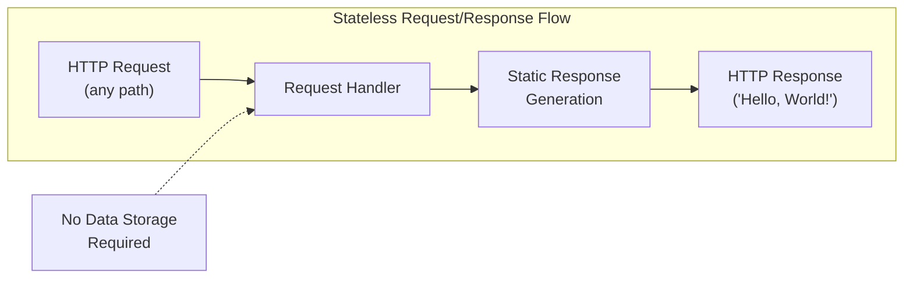
```mermaid
flowchart LR
    subgraph StatelessFlow["Stateless Request/Response Flow"]
        direction LR
        REQ["HTTP Request<br/>(any path)"] --> HANDLER["Request Handler"]
        HANDLER --> STATIC["Static Response<br/>Generation"]
        STATIC --> RESP["HTTP Response<br/>('Hello, World!')"]
    end
    
    NOTE["No Data Storage<br/>Required"]
    NOTE -.-> HANDLER
```

| Data Aspect | Implementation | Evidence |
|-------------|----------------|----------|
| Request Data | Not stored | Immediate response generation |
| Response Data | Hardcoded string | `server.js:9` - `"Hello, World!\n"` |
| State Management | None | No session or context tracking |
| Persistence Layer | Absent | Intentional stateless design |

### 3.6.3 Static Data Files

The repository contains one data file that is **not integrated** with the server functionality:

| File | Contents | Integration Status |
|------|----------|-------------------|
| `phonenumber.csv` | 15 message/phone number pairs | Not consumed by `server.js` |

This file exists in the repository as sample data but serves no functional purpose in the current implementation, as confirmed by code analysis showing no file system operations in `server.js`.

### 3.6.4 Future Database Considerations

Should future requirements necessitate data persistence, the following options would align with the project's educational philosophy:

| Option | Complexity | Learning Value | Recommendation |
|--------|------------|----------------|----------------|
| JSON File Storage | Low | File system operations | Suitable for tutorial expansion |
| SQLite | Medium | SQL fundamentals | Consider for relational data needs |
| In-Memory Store | Low | Data structures | Simple state management |
| MongoDB | Higher | NoSQL concepts | Beyond basic tutorial scope |

---

## 3.7 Development & Deployment

### 3.7.1 Development Environment

#### Package Management

| Tool | Version | Configuration | Evidence |
|------|---------|---------------|----------|
| npm | 7+ | lockfileVersion 3 | `package-lock.json:4` |
| Node.js | Any modern LTS | Required runtime | Tech Spec Section 1.3.1 |

#### npm Scripts Configuration

**From `package.json`:**

| Script | Command | Purpose |
|--------|---------|---------|
| `test` | `echo "Error: no test specified" && exit 1` | Placeholder (no tests implemented) |

The test script placeholder indicates that formal testing infrastructure has not been implemented, consistent with the project's minimal scope.

### 3.7.2 Build System

#### Build Requirements: None

The project requires no build step, transpilation, or compilation:

| Build Aspect | Status | Rationale |
|-------------|--------|-----------|
| Transpilation | Not required | Native JavaScript (ES5+) |
| Bundling | Not required | Single-file architecture |
| Minification | Not applicable | Source runs directly |
| Type Checking | Not applicable | JavaScript (no TypeScript) |
| Asset Processing | Not applicable | No static assets |

#### Execution Model

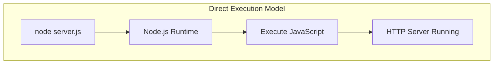
```mermaid
flowchart LR
    subgraph ExecutionFlow["Direct Execution Model"]
        direction LR
        CMD["node server.js"] --> RUNTIME["Node.js Runtime"]
        RUNTIME --> EXECUTE["Execute JavaScript"]
        EXECUTE --> SERVER["HTTP Server Running"]
    end
```

| Step | Command | Result |
|------|---------|--------|
| Start Server | `node server.js` | Server listening on 127.0.0.1:3000 |
| Verify Operation | `curl http://localhost:3000` | Response: "Hello, World!" |
| Stop Server | `Ctrl+C` | Process termination |

### 3.7.3 Containerization

#### Container Strategy: Not Implemented

Containerization is explicitly out of scope for this tutorial project:

| Container Tool | Status | Rationale |
|---------------|--------|-----------|
| Docker | Not configured | Beyond tutorial scope |
| Docker Compose | Not configured | No multi-container requirements |
| Kubernetes | Not applicable | Production orchestration not needed |

**Missing Configuration Files:**
- No `Dockerfile` present
- No `docker-compose.yml` present
- No `.dockerignore` present

### 3.7.4 CI/CD Pipeline

#### Continuous Integration: Not Implemented

No CI/CD pipeline is configured for this project:

| CI/CD Tool | Status | Evidence |
|-----------|--------|----------|
| GitHub Actions | Not configured | No `.github/workflows/` directory |
| Jenkins | Not configured | No `Jenkinsfile` present |
| GitLab CI | Not configured | No `.gitlab-ci.yml` present |
| CircleCI | Not configured | No `.circleci/` directory |

### 3.7.5 Testing Infrastructure

#### Test Implementation Status

| Test Type | Status | Evidence |
|-----------|--------|----------|
| Unit Tests | None | No test files present |
| Integration Tests | Manual only | `package.json:7` - "no test specified" |
| End-to-End Tests | None | No test framework configured |
| Performance Tests | None | Manual verification only |

#### Testing Guidance

For manual integration testing, the following approach is documented:

| Test Case | Command | Expected Result |
|-----------|---------|-----------------|
| Server Startup | `node server.js` | Console output: "Server running at http://127.0.0.1:3000/" |
| HTTP Response | `curl http://localhost:3000` | Body: "Hello, World!\n" |
| Status Code | `curl -I http://localhost:3000` | HTTP/1.1 200 OK |
| Content-Type | `curl -I http://localhost:3000` | Content-Type: text/plain |

### 3.7.6 Version Control

| Aspect | Configuration | Evidence |
|--------|---------------|----------|
| VCS | Git | Repository structure |
| Repository Name | hao-backprop-test | `README.md` |
| Primary Branch | main (assumed) | Standard Git convention |

---

## 3.8 Performance Targets & Technical Specifications

### 3.8.1 Performance Requirements

As documented in Technical Specification Section 2.4, the following performance targets apply:

| Metric | Target Value | Category |
|--------|--------------|----------|
| Response Time | < 50ms per request | Latency |
| Latency (P50) | < 25ms | Latency |
| Latency (P99) | < 50ms | Latency |
| Memory Usage | < 50MB RSS | Resource Efficiency |
| Concurrent Connections | 100+ simultaneous | Scalability |
| Throughput | > 1000 RPS | Performance |
| Error Rate | 0% under normal load | Reliability |
| Startup Time | < 100ms | Operational |
| Shutdown Time | < 10 seconds | Operational |

### 3.8.2 Server Configuration

| Parameter | Value | Location |
|-----------|-------|----------|
| Hostname | 127.0.0.1 | `server.js:3` |
| Port | 3000 | `server.js:4` |
| Content-Type | text/plain | `server.js:8` |
| Status Code | 200 | `server.js:7` |
| Response Body | "Hello, World!\n" | `server.js:9` |

### 3.8.3 Technical Constraints

| Constraint | Description | Impact |
|------------|-------------|--------|
| Localhost Binding | Server binds to 127.0.0.1 only | External network access prohibited |
| Hardcoded Port | Port 3000 not configurable | May conflict with other services |
| Single Process | No clustering support | Limited to single CPU core |
| HTTP Only | No HTTPS/TLS | Plain text communication |

---

## 3.9 Security Considerations

### 3.9.1 Security Posture Assessment

The project's minimal technology stack results in a correspondingly minimal security surface:

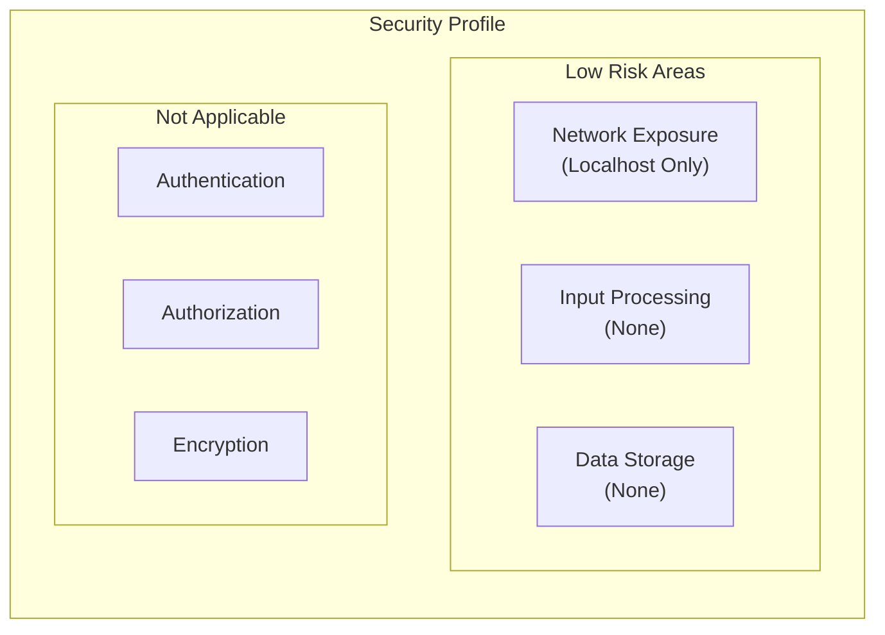
```mermaid
flowchart TB
    subgraph SecurityProfile["Security Profile"]
        direction TB
        subgraph LowRisk["Low Risk Areas"]
            A["Network Exposure<br/>(Localhost Only)"]
            B["Input Processing<br/>(None)"]
            C["Data Storage<br/>(None)"]
        end
        subgraph NotApplicable["Not Applicable"]
            D["Authentication"]
            E["Authorization"]
            F["Encryption"]
        end
    end
```

| Security Aspect | Assessment | Rationale |
|----------------|------------|-----------|
| Network Exposure | Low Risk | Localhost binding only (127.0.0.1) |
| Input Injection | Low Risk | No user input processing |
| Information Disclosure | Low Risk | Static response content |
| Supply Chain Attacks | Eliminated | Zero external dependencies |
| Authentication Bypass | N/A | No authentication required |
| Data Breach | N/A | No data stored |

### 3.9.2 Security Recommendations

| Category | Recommendation | Priority |
|----------|----------------|----------|
| Node.js Updates | Monitor for security patches | Routine |
| Dependency Audits | Not required (zero dependencies) | N/A |
| Network Exposure | Maintain localhost binding for tutorials | Low |
| HTTPS | Consider for any production usage | Future |

---

## 3.10 Technology Stack Summary

### 3.10.1 Component Overview

| Layer | Technology | Version | Status |
|-------|-----------|---------|--------|
| **Runtime** | Node.js | 20.x / 22.x / 24.x LTS | Required |
| **Language** | JavaScript | ES5+ | Required |
| **HTTP Module** | Native `http` | Built-in | Required |
| **Package Manager** | npm | 7+ | Optional |
| **Framework** | None | N/A | Intentionally Excluded |
| **Database** | None | N/A | Intentionally Excluded |
| **Container** | None | N/A | Out of Scope |
| **CI/CD** | None | N/A | Out of Scope |

### 3.10.2 Architectural Alignment

The technology stack directly supports the project's documented architectural principles:

| Principle | Stack Implementation |
|-----------|---------------------|
| Educational Clarity | Single language, native modules, minimal code |
| Zero Dependencies | No external packages, npm audit not required |
| Minimal Complexity | 15 lines of code, single file architecture |
| Universal Compatibility | CommonJS modules, ES5+ JavaScript |
| Predictable Behavior | Static response, deterministic operation |

### 3.10.3 Stack Diagram

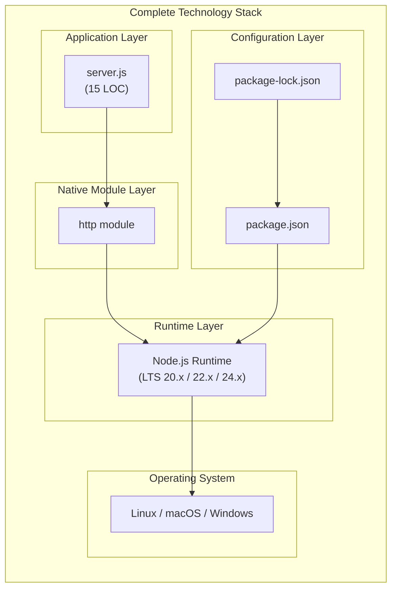
```mermaid
flowchart TB
    subgraph TechnologyStack["Complete Technology Stack"]
        direction TB
        
        subgraph ApplicationLayer["Application Layer"]
            SERVER["server.js<br/>(15 LOC)"]
        end
        
        subgraph NativeLayer["Native Module Layer"]
            HTTP["http module"]
        end
        
        subgraph RuntimeLayer["Runtime Layer"]
            NODE["Node.js Runtime<br/>(LTS 20.x / 22.x / 24.x)"]
        end
        
        subgraph ConfigLayer["Configuration Layer"]
            PKG["package.json"]
            LOCK["package-lock.json"]
        end
        
        subgraph OSLayer["Operating System"]
            OS["Linux / macOS / Windows"]
        end
    end
    
    SERVER --> HTTP
    HTTP --> NODE
    NODE --> OS
    PKG --> NODE
    LOCK --> PKG
```

---

## 3.11 References

The following files and resources were examined in the preparation of this Technology Stack section:

#### Source Files

- `server.js` - Core HTTP server implementation (15 lines), demonstrating native `http` module usage, hostname/port configuration, and request handling
- `package.json` - Project manifest containing name, version, author, license, description, and npm scripts configuration
- `package-lock.json` - Dependency lockfile (lockfileVersion 3) confirming zero external dependencies

#### Technical Specification Sections

- Section 1.1 Executive Summary - Project overview, business context, and value proposition
- Section 1.2 System Overview - High-level description, system components, and technical approach
- Section 1.3 Scope - In-scope elements, explicitly excluded features, and implementation boundaries
- Section 2.4 Implementation Considerations - Technical constraints, performance requirements, and security implications
- Section 2.6 Assumptions and Constraints - Documentation assumptions and technical constraint summary
- Section 2.7 References - File references used throughout documentation

#### External References

- Node.js Official Release Schedule (https://nodejs.org/en/about/previous-releases) - LTS version information and support timelines
- Node.js v24.11.0 LTS Release Notes - Current Active LTS version details
- Node.js v22.x LTS Release Notes - Maintained LTS version information

#### Data Files (Examined but Not Integrated)

- `phonenumber.csv` - Static sample data (15 records) present in repository but not consumed by server functionality

# 4. Process Flowchart

This section provides comprehensive process flow documentation for the hello_world HTTP server system. The flowcharts capture both the current implementation state and proposed enhancements, illustrating system workflows, decision points, error handling paths, and integration patterns.

## 4.1 System Workflow Overview

### 4.1.1 High-Level System Architecture Flow

The hello_world server operates as a single-process HTTP server with a straightforward request-response architecture. The system's primary workflow encompasses server lifecycle management and HTTP request processing.

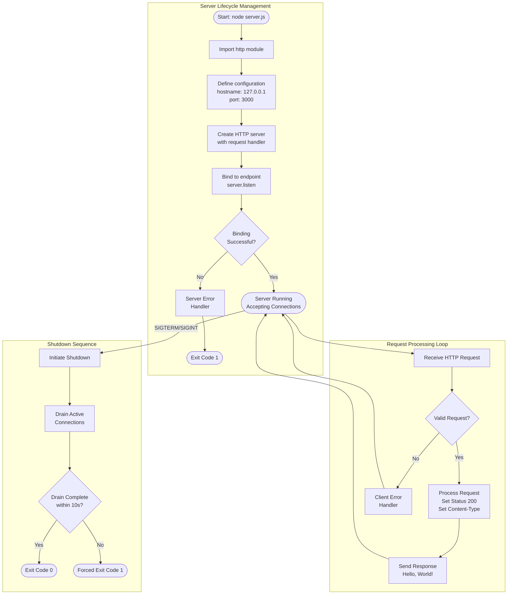
```mermaid
flowchart TB
    subgraph Lifecycle["Server Lifecycle Management"]
        direction TB
        START([Start: node server.js]) --> IMPORT[Import http module]
        IMPORT --> CONFIG[Define configuration<br/>hostname: 127.0.0.1<br/>port: 3000]
        CONFIG --> CREATE[Create HTTP server<br/>with request handler]
        CREATE --> BIND[Bind to endpoint<br/>server.listen]
        BIND --> READY{Binding<br/>Successful?}
        READY -->|Yes| RUNNING([Server Running<br/>Accepting Connections])
        READY -->|No| ERROR[Server Error<br/>Handler]
        ERROR --> EXIT_FAIL([Exit Code 1])
    end

    subgraph RequestLoop["Request Processing Loop"]
        direction TB
        RUNNING --> RECEIVE[Receive HTTP Request]
        RECEIVE --> VALIDATE{Valid Request?}
        VALIDATE -->|Yes| PROCESS[Process Request<br/>Set Status 200<br/>Set Content-Type]
        VALIDATE -->|No| CLIENTERR[Client Error<br/>Handler]
        PROCESS --> RESPOND[Send Response<br/>Hello, World!]
        RESPOND --> RUNNING
        CLIENTERR --> RUNNING
    end

    subgraph ShutdownPath["Shutdown Sequence"]
        direction TB
        RUNNING -->|SIGTERM/SIGINT| SHUTDOWN[Initiate Shutdown]
        SHUTDOWN --> DRAIN[Drain Active<br/>Connections]
        DRAIN --> TIMEOUT{Drain Complete<br/>within 10s?}
        TIMEOUT -->|Yes| CLEAN([Exit Code 0])
        TIMEOUT -->|No| FORCE([Forced Exit Code 1])
    end
```

### 4.1.2 Process Overview Matrix

The following matrix summarizes all major processes within the system:

| Process ID | Process Name | Trigger | Primary Path | Error Path | SLA Target |
|------------|--------------|---------|--------------|------------|------------|
| P-001 | Server Initialization | `node server.js` command | Startup → Listen → Running | Error event → Exit(1) | < 100ms |
| P-002 | Request Handling | HTTP request received | Receive → Process → Respond | Exception → HTTP 500 | < 50ms |
| P-003 | Graceful Shutdown | SIGTERM/SIGINT signal | Signal → Drain → Exit(0) | Timeout → Force Exit(1) | < 10s |
| P-004 | Error Handling | Runtime error event | Detect → Log → Recover/Exit | N/A | < 100ms |

## 4.2 Core Business Process Flows

### 4.2.1 Server Initialization Process (F-001)

The server initialization process establishes the HTTP server infrastructure using Node.js native capabilities. This process is the foundation upon which all other features depend.

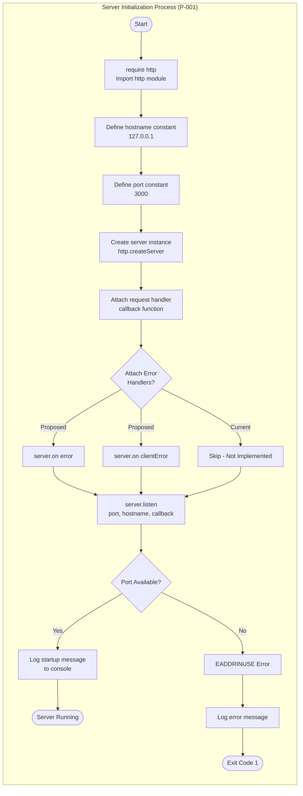
```mermaid
flowchart TD
    subgraph Init["Server Initialization Process (P-001)"]
        direction TB
        A([Start]) --> B["require http<br/>Import http module"]
        B --> C["Define hostname constant<br/>127.0.0.1"]
        C --> D["Define port constant<br/>3000"]
        D --> E["Create server instance<br/>http.createServer"]
        E --> F["Attach request handler<br/>callback function"]
        F --> G{"Attach Error<br/>Handlers?"}
        
        G -->|Proposed| H["server.on error"]
        G -->|Proposed| I["server.on clientError"]
        G -->|Current| J["Skip - Not Implemented"]
        
        H --> K["server.listen<br/>port, hostname, callback"]
        I --> K
        J --> K
        
        K --> L{"Port Available?"}
        L -->|Yes| M["Log startup message<br/>to console"]
        L -->|No| N["EADDRINUSE Error"]
        
        M --> O([Server Running])
        N --> P["Log error message"]
        P --> Q([Exit Code 1])
    end
```

#### Process Steps Detail

| Step | Action | Input | Output | Validation |
|------|--------|-------|--------|------------|
| 1 | Import Module | Module name 'http' | http module object | Module exists check |
| 2 | Set Hostname | Constant definition | hostname = '127.0.0.1' | Valid IP format |
| 3 | Set Port | Constant definition | port = 3000 | Valid port range (1-65535) |
| 4 | Create Server | Request handler callback | Server instance | Valid callback function |
| 5 | Attach Handlers | Event handlers | Registered listeners | Handler is function |
| 6 | Bind to Port | hostname, port, callback | Listening server | Port availability |
| 7 | Log Success | Configuration values | Console message | N/A |

### 4.2.2 HTTP Request-Response Process (F-002)

The core request-response cycle processes all incoming HTTP requests and generates the standardized greeting response.

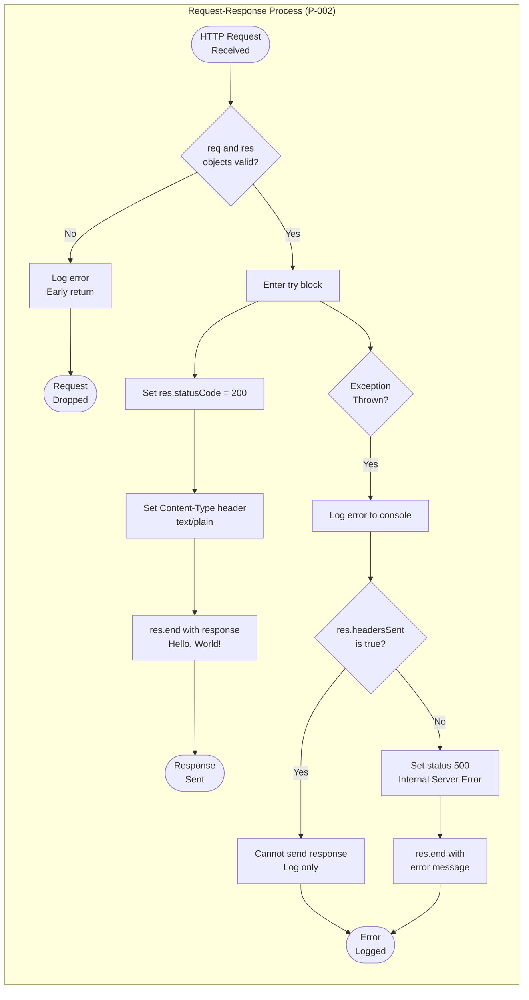
```mermaid
flowchart TD
    subgraph RequestFlow["Request-Response Process (P-002)"]
        direction TB
        START([HTTP Request<br/>Received]) --> VALIDATE{req and res<br/>objects valid?}
        
        VALIDATE -->|No| EARLY_RETURN[Log error<br/>Early return]
        EARLY_RETURN --> END_FAIL([Request<br/>Dropped])
        
        VALIDATE -->|Yes| TRY[Enter try block]
        TRY --> STATUS[Set res.statusCode = 200]
        STATUS --> HEADER[Set Content-Type header<br/>text/plain]
        HEADER --> BODY[res.end with response<br/>Hello, World!]
        BODY --> SUCCESS([Response<br/>Sent])
        
        TRY --> CATCH{Exception<br/>Thrown?}
        CATCH -->|Yes| LOG_ERR[Log error to console]
        LOG_ERR --> CHECK_HEADERS{res.headersSent<br/>is true?}
        
        CHECK_HEADERS -->|Yes| SKIP_RESP[Cannot send response<br/>Log only]
        CHECK_HEADERS -->|No| SEND_500[Set status 500<br/>Internal Server Error]
        
        SKIP_RESP --> END_ERR([Error<br/>Logged])
        SEND_500 --> SEND_ERR_BODY[res.end with<br/>error message]
        SEND_ERR_BODY --> END_ERR
    end
```

#### Decision Point Analysis

| Decision Point | Condition | True Path | False Path | Business Rule |
|---------------|-----------|-----------|------------|---------------|
| Input Validation | req && res valid | Continue processing | Early return | Defensive programming |
| Exception Check | Error thrown in try | Error handler | Normal completion | Process isolation |
| Headers Sent Check | res.headersSent | Log only | Send 500 response | HTTP protocol compliance |

### 4.2.3 Graceful Shutdown Process (F-004)

The graceful shutdown process ensures proper connection draining before server termination.

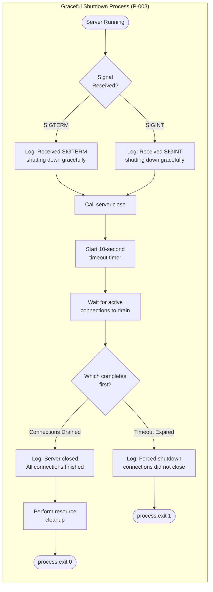
```mermaid
flowchart TD
    subgraph Shutdown["Graceful Shutdown Process (P-003)"]
        direction TB
        RUNNING([Server Running]) --> SIGNAL{Signal<br/>Received?}
        
        SIGNAL -->|SIGTERM| LOG_TERM[Log: Received SIGTERM<br/>shutting down gracefully]
        SIGNAL -->|SIGINT| LOG_INT[Log: Received SIGINT<br/>shutting down gracefully]
        
        LOG_TERM --> CLOSE[Call server.close]
        LOG_INT --> CLOSE
        
        CLOSE --> TIMER[Start 10-second<br/>timeout timer]
        TIMER --> DRAIN[Wait for active<br/>connections to drain]
        
        DRAIN --> RACE{Which completes<br/>first?}
        
        RACE -->|Connections Drained| DRAINED[Log: Server closed<br/>All connections finished]
        RACE -->|Timeout Expired| TIMEOUT[Log: Forced shutdown<br/>connections did not close]
        
        DRAINED --> CLEANUP[Perform resource<br/>cleanup]
        CLEANUP --> EXIT_CLEAN([process.exit 0])
        
        TIMEOUT --> EXIT_FORCE([process.exit 1])
    end
```

#### Timing Constraints

| Phase | Duration Limit | Action on Timeout |
|-------|---------------|-------------------|
| Signal Detection | Immediate | N/A |
| Shutdown Initiation | < 100ms | Log + start drain |
| Connection Drain | 10 seconds | Force termination |
| Cleanup | < 100ms | Skip if timeout |
| Total Shutdown | < 10 seconds | Exit code 1 |

## 4.3 Error Handling Workflows

### 4.3.1 Server Error Handling Flow (F-003)

This workflow handles server-level errors that occur during startup or operation, specifically EADDRINUSE and EACCES conditions.

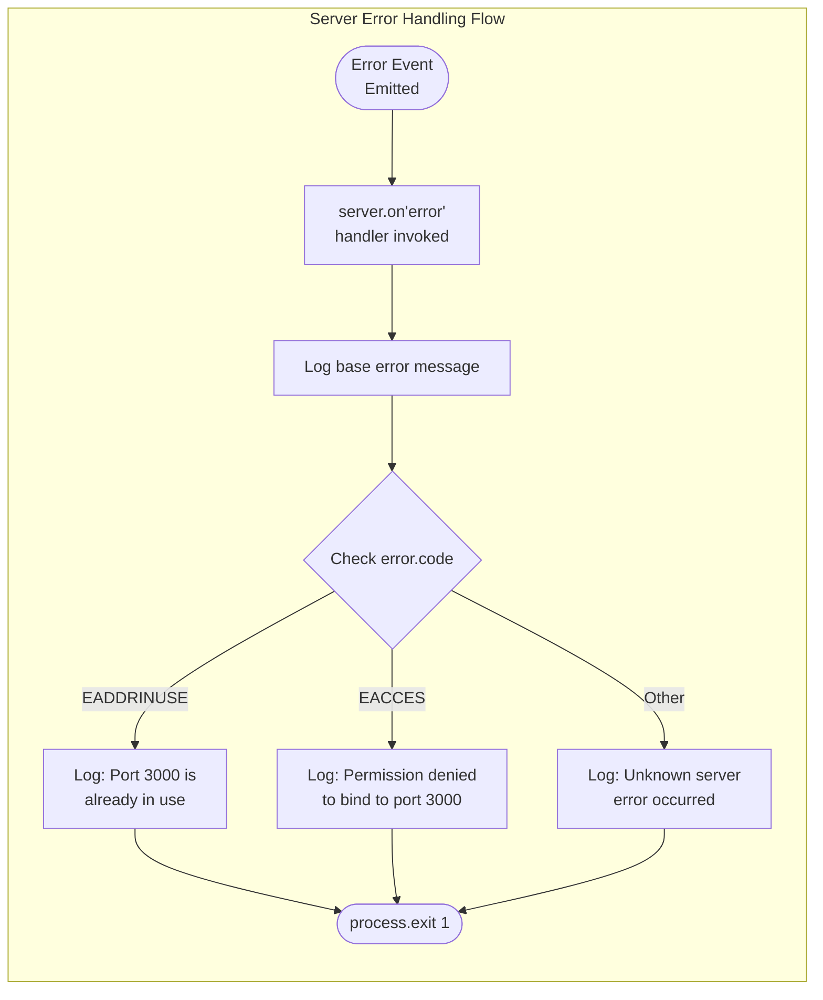
```mermaid
flowchart TD
    subgraph ServerErrors["Server Error Handling Flow"]
        direction TB
        TRIGGER([Error Event<br/>Emitted]) --> HANDLER[server.on'error'<br/>handler invoked]
        
        HANDLER --> LOG_BASE[Log base error message]
        LOG_BASE --> CHECK_CODE{Check error.code}
        
        CHECK_CODE -->|EADDRINUSE| PORT_MSG[Log: Port 3000 is<br/>already in use]
        CHECK_CODE -->|EACCES| PERM_MSG[Log: Permission denied<br/>to bind to port 3000]
        CHECK_CODE -->|Other| GENERIC_MSG[Log: Unknown server<br/>error occurred]
        
        PORT_MSG --> EXIT_ERR([process.exit 1])
        PERM_MSG --> EXIT_ERR
        GENERIC_MSG --> EXIT_ERR
    end
```

### 4.3.2 Client Error Handling Flow (F-006)

This workflow handles malformed HTTP requests from clients before a valid HTTP session is established.

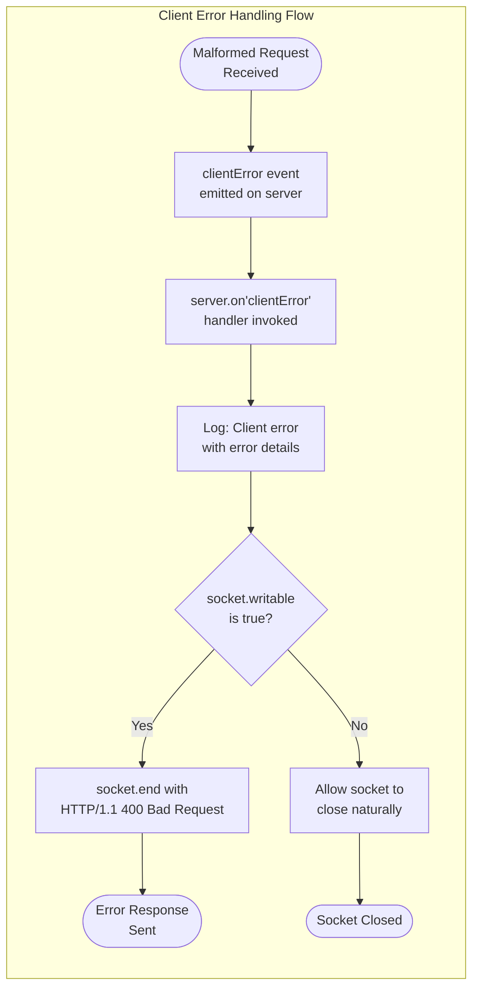
```mermaid
flowchart TD
    subgraph ClientErrors["Client Error Handling Flow"]
        direction TB
        MALFORMED([Malformed Request<br/>Received]) --> EVENT[clientError event<br/>emitted on server]
        
        EVENT --> HANDLER[server.on'clientError'<br/>handler invoked]
        HANDLER --> LOG[Log: Client error<br/>with error details]
        
        LOG --> CHECK_SOCKET{socket.writable<br/>is true?}
        
        CHECK_SOCKET -->|Yes| WRITE[socket.end with<br/>HTTP/1.1 400 Bad Request]
        CHECK_SOCKET -->|No| SKIP[Allow socket to<br/>close naturally]
        
        WRITE --> DONE([Error Response<br/>Sent])
        SKIP --> DONE_ALT([Socket Closed])
    end
```

### 4.3.3 Request Handler Exception Flow (F-005)

This workflow ensures exceptions within the request handler do not crash the server process.

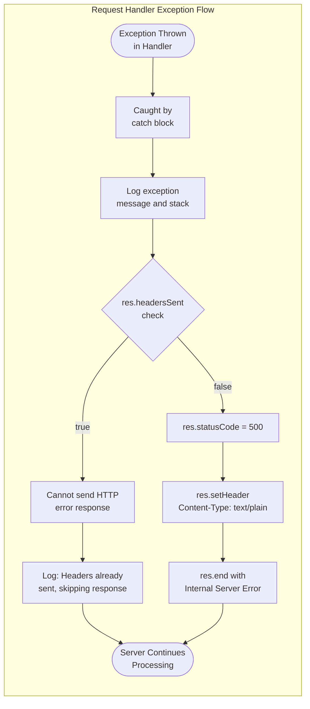
```mermaid
flowchart TD
    subgraph RequestErrors["Request Handler Exception Flow"]
        direction TB
        EXCEPTION([Exception Thrown<br/>in Handler]) --> CATCH[Caught by<br/>catch block]
        
        CATCH --> LOG_EX[Log exception<br/>message and stack]
        LOG_EX --> CHECK_HDR{res.headersSent<br/>check}
        
        CHECK_HDR -->|true| NO_RESP[Cannot send HTTP<br/>error response]
        CHECK_HDR -->|false| SET_STATUS[res.statusCode = 500]
        
        NO_RESP --> LOG_ONLY[Log: Headers already<br/>sent, skipping response]
        SET_STATUS --> SET_TYPE[res.setHeader<br/>Content-Type: text/plain]
        
        LOG_ONLY --> CONTINUE([Server Continues<br/>Processing])
        SET_TYPE --> SEND_ERR[res.end with<br/>Internal Server Error]
        SEND_ERR --> CONTINUE
    end
```

### 4.3.4 Consolidated Error Handling Matrix

| Error Type | Trigger Condition | Handler | Response | Exit Code | Recovery |
|------------|------------------|---------|----------|-----------|----------|
| EADDRINUSE | Port 3000 in use | server.on('error') | Console log | 1 | Manual intervention |
| EACCES | Permission denied | server.on('error') | Console log | 1 | Run as privileged user |
| clientError | Malformed HTTP | server.on('clientError') | HTTP 400 | N/A | Auto-recovery |
| Handler Exception | throw in callback | try-catch | HTTP 500 | N/A | Auto-recovery |
| Validation Failure | null req/res | Guard clause | Log only | N/A | Auto-recovery |

## 4.4 Integration Workflows

### 4.4.1 HTTP Client-Server Interaction Sequence

The following sequence diagram illustrates the interaction between an HTTP client and the hello_world server.

```mermaid
sequenceDiagram
    participant Client as HTTP Client
    participant Server as Node.js Server
    participant Handler as Request Handler
    participant Response as ServerResponse

    Client->>Server: TCP Connection to 127.0.0.1:3000
    Server-->>Client: TCP ACK

    Client->>Server: HTTP Request (GET /any-path)
    Server->>Handler: Invoke request callback(req, res)
    
    alt Input Validation Passes
        Handler->>Handler: Validate req and res objects
        Handler->>Response: res.statusCode = 200
        Handler->>Response: res.setHeader('Content-Type', 'text/plain')
        Handler->>Response: res.end('Hello, World!\n')
        Response-->>Client: HTTP 200 OK with body
    else Input Validation Fails
        Handler->>Handler: Log error
        Handler-->>Server: Early return (no response)
    else Exception Occurs
        Handler->>Handler: Catch exception
        Handler->>Handler: Check res.headersSent
        alt Headers Not Sent
            Handler->>Response: res.statusCode = 500
            Response-->>Client: HTTP 500 Internal Server Error
        else Headers Already Sent
            Handler->>Handler: Log error only
        end
    end

    Client->>Server: Close connection
    Server-->>Client: TCP FIN
```

### 4.4.2 Process Signal Handling Sequence

This sequence diagram illustrates how the server handles operating system signals.

```mermaid
sequenceDiagram
    participant OS as Operating System
    participant Process as Node.js Process
    participant Server as HTTP Server
    participant Connections as Active Connections
    participant Timer as Timeout Timer

    OS->>Process: SIGTERM/SIGINT signal
    Process->>Process: Signal handler invoked
    Process->>Process: Log shutdown message
    
    Process->>Server: server.close()
    Process->>Timer: Start 10-second timeout

    par Connection Draining
        Server->>Connections: Stop accepting new connections
        Connections->>Server: Complete pending requests
        Connections-->>Server: All connections closed
        Server-->>Process: server.close callback fires
    and Timeout Monitoring
        Timer->>Timer: Count down 10 seconds
    end

    alt Connections Closed First
        Process->>Process: Log: Server closed successfully
        Process->>Timer: Clear timeout
        Process->>Process: Perform cleanup
        Process->>OS: process.exit(0)
    else Timeout Fires First
        Timer-->>Process: Timeout callback
        Process->>Process: Log: Forced shutdown
        Process->>OS: process.exit(1)
    end
```

### 4.4.3 Feature Integration Flow

The following diagram shows how all features integrate through the central server instance.

```mermaid
flowchart TB
    subgraph Integration["Feature Integration Architecture"]
        direction TB
        
        subgraph Foundation["Foundation Layer"]
            F001[F-001: HTTP Server<br/>Initialization]
        end
        
        subgraph CoreFunc["Core Functionality"]
            F002[F-002: Request Handling<br/>& Response]
        end
        
        subgraph Robustness["Operational Robustness"]
            F003[F-003: Server Error<br/>Handling]
            F004[F-004: Graceful<br/>Shutdown]
        end
        
        subgraph Resilience["Error Resilience"]
            F005[F-005: Request Handler<br/>Protection]
            F006[F-006: Client Error<br/>Handling]
            F007[F-007: Input<br/>Validation]
        end
        
        F001 -->|Creates| SERVER[(Server<br/>Instance)]
        SERVER -->|Provides| F002
        SERVER -->|Attaches| F003
        SERVER -->|Attaches| F004
        SERVER -->|Attaches| F006
        
        F002 -->|Wraps| F005
        F002 -->|Uses| F007
    end
```

## 4.5 State Transition Diagrams

### 4.5.1 Server State Machine

The server operates through a well-defined set of states with specific transitions.

```mermaid
stateDiagram-v2
    [*] --> Initializing: node server.js

    Initializing --> Running: server.listen() success
    Initializing --> Error: EADDRINUSE/EACCES

    Running --> ShuttingDown: SIGTERM/SIGINT received
    Running --> Running: Process request

    ShuttingDown --> Closed: Connections drained
    ShuttingDown --> ForcedClosed: 10s timeout

    Error --> [*]: Exit code 1
    Closed --> [*]: Exit code 0
    ForcedClosed --> [*]: Exit code 1

    note right of Running
        Accepting connections
        Processing requests
        Normal operation
    end note

    note right of ShuttingDown
        Not accepting new connections
        Draining active connections
        Timeout active
    end note
```

#### State Definitions

| State | Description | Allowed Actions | Exit Condition |
|-------|-------------|-----------------|----------------|
| Initializing | Server binding to port | None | Bind success or failure |
| Running | Accepting and processing requests | Handle requests | Signal received |
| ShuttingDown | Draining connections | Complete pending | Drain complete or timeout |
| Error | Fatal error occurred | None | Process exit |
| Closed | Clean shutdown complete | None | Process exit |
| ForcedClosed | Timeout-triggered shutdown | None | Process exit |

### 4.5.2 Request State Machine

Each HTTP request progresses through a defined state lifecycle.

```mermaid
stateDiagram-v2
    [*] --> Received: HTTP request arrives

    Received --> Validating: Begin processing
    
    Validating --> Rejected: Validation fails
    Validating --> Processing: Validation passes

    Processing --> Responding: Build response
    Processing --> Error: Exception thrown

    Responding --> Completed: res.end() called
    
    Error --> ErrorResponse: headersSent = false
    Error --> LoggedOnly: headersSent = true
    
    ErrorResponse --> Completed: HTTP 500 sent
    LoggedOnly --> Completed: Error logged

    Rejected --> Completed: Early return

    Completed --> [*]: Connection closed
```

#### Request State Transition Rules

| From State | To State | Trigger | Action |
|------------|----------|---------|--------|
| Received | Validating | Request callback invoked | Begin validation |
| Validating | Rejected | req/res null or undefined | Log, early return |
| Validating | Processing | Objects valid | Enter try block |
| Processing | Responding | No exception | Set headers and status |
| Processing | Error | Exception thrown | Enter catch block |
| Responding | Completed | res.end() called | Close response |
| Error | ErrorResponse | Headers not yet sent | Send HTTP 500 |
| Error | LoggedOnly | Headers already sent | Log error only |

### 4.5.3 Connection State Machine

Individual connections follow this state progression:

```mermaid
stateDiagram-v2
    [*] --> Connecting: TCP handshake

    Connecting --> Connected: Handshake complete
    Connecting --> Failed: Connection refused

    Connected --> Receiving: HTTP data arrives
    
    Receiving --> Valid: Parse successful
    Receiving --> Invalid: Parse failed (clientError)

    Valid --> Processing: Route to handler
    Invalid --> BadRequest: Send HTTP 400

    Processing --> Sending: Generate response
    Sending --> Idle: Response complete
    
    Idle --> Receiving: Keep-alive (new request)
    Idle --> Closing: Close requested

    BadRequest --> Closing: Error sent
    Failed --> [*]: Connection failed
    Closing --> [*]: Connection closed
```

## 4.6 Validation Rules and Decision Points

### 4.6.1 Validation Checkpoint Matrix

The system implements validation at multiple checkpoints throughout request processing:

| Checkpoint | Location | Rule | Pass Action | Fail Action |
|------------|----------|------|-------------|-------------|
| Input Validation | Request handler entry | `req !== null && req !== undefined` | Continue | Early return |
| Response Validation | Request handler entry | `res !== null && res !== undefined` | Continue | Early return |
| Port Availability | Server startup | Port 3000 not in use | Bind to port | EADDRINUSE error |
| Permission Check | Server startup | User has port access | Bind to port | EACCES error |
| Headers Sent Check | Error handler | `res.headersSent === false` | Send error response | Log only |
| Socket Writable | Client error handler | `socket.writable === true` | Write error response | Skip write |

### 4.6.2 Business Rules Flowchart

```mermaid
flowchart TD
    subgraph Rules["Business Rules Validation"]
        direction TB
        REQ([Request<br/>Received]) --> BR1{BR-001:<br/>Valid TCP Connection?}
        
        BR1 -->|No| R1[Handle as<br/>clientError]
        BR1 -->|Yes| BR2{BR-002:<br/>Valid HTTP Request?}
        
        BR2 -->|No| R2[HTTP 400<br/>Bad Request]
        BR2 -->|Yes| BR3{BR-003:<br/>req/res objects valid?}
        
        BR3 -->|No| R3[Log error<br/>Early return]
        BR3 -->|Yes| BR4{BR-004:<br/>Handler exception?}
        
        BR4 -->|No| OK[HTTP 200<br/>Hello, World!]
        BR4 -->|Yes| BR5{BR-005:<br/>Headers sent?}
        
        BR5 -->|Yes| R4[Log only<br/>No response]
        BR5 -->|No| R5[HTTP 500<br/>Internal Server Error]
    end
```

### 4.6.3 Authorization Checkpoints

Given the minimal scope of this educational project, authorization is not implemented. The following matrix documents potential authorization points for future enhancement:

| Checkpoint | Current State | Proposed Enhancement | Compliance Requirement |
|------------|--------------|---------------------|----------------------|
| Network Access | Localhost only (127.0.0.1) | IP whitelist | Security best practice |
| Endpoint Access | All paths served | Route-based restrictions | N/A |
| Request Method | All methods accepted | Method filtering | HTTP semantics |
| Rate Limiting | Not implemented | Request throttling | DoS protection |

## 4.7 Timing and SLA Considerations

### 4.7.1 SLA Timeline Diagram

```mermaid
gantt
    title Request Processing SLA Timeline
    dateFormat X
    axisFormat %L ms
    
    section Normal Request
    Request Received       :milestone, m1, 0, 0
    Input Validation      :active, validation, 0, 2
    Set Status Code       :status, after validation, 1
    Set Headers           :headers, after status, 1
    Send Response Body    :body, after headers, 5
    Response Complete     :milestone, m2, 9, 0
    
    section Error Request
    Request Received      :milestone, m3, 0, 0
    Exception Caught      :error, 0, 5
    Error Logging         :logging, after error, 2
    Error Response        :errresp, after logging, 5
    Response Complete     :milestone, m4, 12, 0
    
    section SLA Target
    50ms Target           :crit, sla, 0, 50
```

### 4.7.2 Performance Timing Matrix

| Process | Phase | Target Duration | Measurement Point |
|---------|-------|-----------------|-------------------|
| Startup | Module import | < 10ms | Before createServer |
| Startup | Server creation | < 5ms | After createServer |
| Startup | Port binding | < 50ms | server.listen callback |
| Startup | Total startup | < 100ms | First log message |
| Request | Receive to validate | < 2ms | Handler entry |
| Request | Processing | < 10ms | Before res.end |
| Request | Response send | < 10ms | After res.end |
| Request | Total response | < 50ms | Client receives |
| Request | P50 latency | < 25ms | 50th percentile |
| Request | P99 latency | < 50ms | 99th percentile |
| Shutdown | Signal to close() | Immediate | After log |
| Shutdown | Connection drain | < 10s | Before timeout |
| Shutdown | Total shutdown | < 10s | Process exit |

### 4.7.3 Throughput and Capacity

| Metric | Target Value | Measurement Method |
|--------|--------------|-------------------|
| Requests per Second | > 1000 RPS | Load testing |
| Concurrent Connections | 100+ | Simultaneous requests |
| Memory Usage | < 50MB RSS | Process monitoring |
| Error Rate | 0% | Under normal load |
| Availability | 100% | During test sessions |

### 4.7.4 Timeout Configuration

```mermaid
flowchart LR
    subgraph Timeouts["System Timeout Configuration"]
        direction TB
        T1[Startup Timeout<br/>100ms target] --> T2[Request Timeout<br/>50ms target]
        T2 --> T3[Shutdown Timeout<br/>10 seconds hard limit]
        T3 --> T4[Forced Exit<br/>After timeout expiry]
    end
```

| Timeout | Duration | Trigger | Action on Expiry |
|---------|----------|---------|------------------|
| Startup | < 100ms (target) | node server.js | Consider hung |
| Request | < 50ms (target) | HTTP request | Performance alert |
| Shutdown | 10,000ms (hard) | setTimeout | process.exit(1) |

## 4.8 Process Flow Summary

### 4.8.1 End-to-End User Journey

The complete user journey from server start to request handling to shutdown:

```mermaid
flowchart TB
    subgraph Journey["Complete User Journey"]
        direction TB
        
        subgraph Phase1["Phase 1: Development Setup"]
            DEV([Developer]) --> CMD[Run: node server.js]
            CMD --> STARTUP[Server Initialization]
            STARTUP --> LISTEN[Console: Server running<br/>at http://127.0.0.1:3000/]
        end
        
        subgraph Phase2["Phase 2: Request Cycle"]
            LISTEN --> CLIENT([HTTP Client<br/>Browser/curl])
            CLIENT --> REQ[Send GET Request<br/>to any path]
            REQ --> PROCESS[Server processes<br/>request]
            PROCESS --> RESP[Return: Hello, World!<br/>Status: 200]
            RESP --> CLIENT
        end
        
        subgraph Phase3["Phase 3: Shutdown"]
            CLIENT --> STOP([Developer presses<br/>Ctrl+C])
            STOP --> SIGNAL[SIGINT received]
            SIGNAL --> GRACEFUL[Graceful shutdown<br/>initiated]
            GRACEFUL --> DRAIN[Drain connections]
            DRAIN --> EXIT[Console: Server closed<br/>process.exit 0]
        end
    end
```

### 4.8.2 Critical Path Analysis

The following table identifies critical paths through the system:

| Path Name | Entry Point | Exit Point | Steps | Critical Decision |
|-----------|-------------|------------|-------|-------------------|
| Happy Path | HTTP Request | HTTP 200 | 4 | None |
| Error Path | HTTP Request | HTTP 500 | 5 | Exception thrown |
| Client Error | Malformed Request | HTTP 400 | 3 | Parse failure |
| Startup Failure | node server.js | Exit(1) | 3 | Port unavailable |
| Graceful Shutdown | SIGTERM | Exit(0) | 4 | Connections drained |
| Forced Shutdown | SIGTERM | Exit(1) | 4 | Timeout expired |

### 4.8.3 Data Persistence Points

Due to the stateless nature of this application, no data persistence points exist. All operations are transient:

| Operation | State Duration | Persistence | Recovery Strategy |
|-----------|---------------|-------------|-------------------|
| Server Configuration | Process lifetime | None (in-memory) | Restart required |
| Active Connections | Request lifetime | None | N/A |
| Request Data | Request lifetime | None | N/A |
| Response Data | Response send | None | N/A |
| Error Logs | Console output | None | External capture required |

## 4.9 References

### 4.9.1 Source Files Referenced

| File Path | Relevance to Process Flowchart |
|-----------|-------------------------------|
| `server.js` | Core HTTP server implementation - lines 1-15 define all current process flows including module import, configuration, server creation, request handling, and startup |
| `Response.txt` | Technical specification containing proposed enhancements for error handling (F-003), graceful shutdown (F-004), request handler protection (F-005), client error handling (F-006), and input validation (F-007) |
| `package.json` | Project manifest confirming zero-dependency architecture affecting process design |
| `codebase_context (42).md` | Original requirements specifying /hello endpoint requirement |

### 4.9.2 Technical Specification Sections Referenced

| Section | Information Used |
|---------|------------------|
| 2.1 Feature Catalog | Feature definitions F-001 through F-007 |
| 2.2 Functional Requirements | Detailed requirements for each feature process |
| 2.3 Feature Relationships | Dependency map and integration points |
| 2.4 Implementation Considerations | Performance requirements and technical constraints |
| 2.6 Assumptions and Constraints | Scope boundaries and technical limitations |
| 3.8 Performance Targets | SLA metrics and timing constraints |
| 1.2 System Overview | Architecture context and component relationships |

### 4.9.3 Diagram Inventory

| Diagram Type | Count | Purpose |
|--------------|-------|---------|
| Flowcharts | 11 | Process flows and decision logic |
| Sequence Diagrams | 2 | Integration interactions |
| State Diagrams | 3 | State transitions |
| Gantt Chart | 1 | SLA timeline |
| **Total** | **17** | Complete process documentation |

# 5. System Architecture

This section provides a comprehensive technical reference for the hello_world project architecture—a minimalist Node.js HTTP server designed for educational clarity and backprop platform integration testing. The architectural approach intentionally prioritizes simplicity and transparency over feature richness, utilizing only native Node.js capabilities without external dependencies.

## 5.1 High-Level Architecture

### 5.1.1 System Overview

#### Architectural Style and Rationale

The hello_world system employs a **single-file, single-process monolithic architecture** built exclusively on Node.js native modules. This architectural choice is deliberate and serves the project's dual purpose as both an educational artifact and integration test vehicle.

| Architectural Aspect | Decision | Rationale |
|---------------------|----------|-----------|
| Architecture Style | Single-File Monolith | Maximum educational clarity |
| Module System | CommonJS | Universal Node.js compatibility |
| Dependencies | Zero External | Eliminates supply chain risk |
| Process Model | Single-Process | Simplicity over scalability |

The architecture diverges from typical production patterns by design, emphasizing code comprehensibility over enterprise concerns. This approach enables developers to understand the complete HTTP server lifecycle within 15 lines of code, without framework abstractions obscuring fundamental concepts.

#### Key Architectural Principles

The system adheres to the following architectural principles:

| Principle | Implementation | Benefit |
|-----------|----------------|---------|
| Educational Clarity | Single language, native modules, minimal code | Immediate comprehension |
| Zero Dependencies | No external packages | No npm audit required, minimal security surface |
| Minimal Complexity | 15 lines of code, single file | Reduced cognitive load |
| Universal Compatibility | CommonJS modules, ES5+ JavaScript | Broadest Node.js version support |
| Predictable Behavior | Static response, deterministic operation | Reliable test artifact |

#### System Boundaries and Major Interfaces

The system operates within well-defined boundaries that limit its scope to local development and testing scenarios:

```mermaid
flowchart TB
    subgraph External["External Boundary"]
        CLIENT((HTTP Client<br/>localhost only))
    end
    
    subgraph SystemBoundary["System Boundary - hello_world"]
        direction TB
        subgraph Application["Application Layer"]
            SERVER["server.js<br/>HTTP Server Logic<br/>(15 LOC)"]
        end
        
        subgraph Runtime["Runtime Layer"]
            HTTP["Node.js http Module"]
            NODE["Node.js Runtime"]
        end
        
        subgraph Network["Network Layer"]
            LOOPBACK["127.0.0.1:3000<br/>Loopback Interface"]
        end
    end
    
    CLIENT -->|"HTTP/1.1 Request"| LOOPBACK
    LOOPBACK --> SERVER
    SERVER --> HTTP
    HTTP --> NODE
    SERVER -->|"HTTP/1.1 Response"| CLIENT
```

| Boundary | Specification | Enforcement |
|----------|---------------|-------------|
| Network Interface | 127.0.0.1 (loopback only) | Hardcoded in `server.js:3` |
| Port | 3000 | Hardcoded in `server.js:4` |
| Protocol | HTTP/1.1 (no HTTPS) | Native http module limitation |
| Process Model | Single Node.js process | No clustering implemented |
| External Access | Prohibited | Localhost binding |

### 5.1.2 Core Components

The system comprises a minimal set of components, each serving a specific purpose within the architectural design:

| Component Name | Primary Responsibility | Key Dependencies | Integration Points |
|----------------|----------------------|------------------|-------------------|
| HTTP Server (`server.js`) | Core server implementation | Node.js `http` module | TCP port 3000 |
| Project Manifest (`package.json`) | npm metadata and scripts | npm runtime | `node` and `npm` commands |
| Dependency Lock (`package-lock.json`) | Version pinning | npm package manager | npm install |

| Component Name | Critical Considerations |
|----------------|------------------------|
| HTTP Server (`server.js`) | Single point of failure; no redundancy |
| Project Manifest (`package.json`) | Entry point mismatch (`main: index.js` vs actual `server.js`) |
| Dependency Lock (`package-lock.json`) | lockfileVersion 3; zero dependencies recorded |

#### Component Architecture Diagram

```mermaid
flowchart TB
    subgraph Repository["Repository Structure"]
        direction TB
        
        subgraph Core["Core Implementation"]
            SERVER["server.js<br/>━━━━━━━━━━━━━━━<br/>• HTTP listener<br/>• Request handler<br/>• Response generator<br/>━━━━━━━━━━━━━━━<br/>15 lines of code"]
        end
        
        subgraph Config["Configuration"]
            PKG["package.json<br/>━━━━━━━━━━━━━━━<br/>• Project metadata<br/>• npm scripts<br/>• No dependencies"]
            LOCK["package-lock.json<br/>━━━━━━━━━━━━━━━<br/>• lockfileVersion 3<br/>• Empty packages"]
        end
        
        subgraph Docs["Documentation"]
            README["README.md"]
            CONTEXT["codebase_context.md"]
            RESPONSE["Response.txt"]
        end
    end
    
    PKG -.->|"npm start"| SERVER
    LOCK -.->|"version lock"| PKG
```

### 5.1.3 Data Flow Description

#### Primary Data Flows

The system implements an exceptionally simple request-response data flow with no intermediate processing, transformation, or storage layers:

**Request Flow:**
1. HTTP client initiates TCP connection to 127.0.0.1:3000
2. Client sends HTTP/1.1 request (any method, any path)
3. Node.js `http` module parses request and invokes callback
4. Request handler receives `req` and `res` objects

**Response Flow:**
1. Handler sets HTTP status code (200)
2. Handler sets Content-Type header (`text/plain`)
3. Handler writes response body (`Hello, World!\n`)
4. `res.end()` closes the response stream
5. HTTP response transmitted to client

```mermaid
sequenceDiagram
    participant Client as HTTP Client
    participant TCP as TCP Stack
    participant HTTP as http Module
    participant Handler as Request Handler
    
    Client->>TCP: TCP Connect (127.0.0.1:3000)
    TCP-->>Client: Connection Established
    
    Client->>HTTP: HTTP/1.1 Request
    HTTP->>Handler: (req, res) callback
    
    Note over Handler: res.statusCode = 200
    Note over Handler: res.setHeader('Content-Type', 'text/plain')
    Note over Handler: res.end('Hello, World!\n')
    
    Handler-->>HTTP: Response Object
    HTTP-->>Client: HTTP/1.1 200 OK
    
    Note over Client: Body: Hello, World!
```

#### Integration Patterns and Protocols

| Pattern | Implementation | Description |
|---------|----------------|-------------|
| Request-Response | Synchronous HTTP/1.1 | Standard HTTP request-response cycle |
| Keep-Alive | Node.js default | Connections may be reused |
| Content Negotiation | Static | Always returns `text/plain` |

#### Data Transformation Points

The system performs no data transformation. All requests receive an identical static response regardless of:
- HTTP method (GET, POST, PUT, DELETE, etc.)
- Request path (/, /hello, /any-path)
- Request headers
- Request body

#### Data Stores and Caches

| Store Type | Implementation | Status |
|------------|----------------|--------|
| Database | None | Intentionally excluded |
| Cache | None | Intentionally excluded |
| Session Storage | None | Intentionally excluded |
| File Storage | None | Static responses only |

### 5.1.4 External Integration Points

The system is intentionally isolated with no external integrations, maintaining its role as a self-contained tutorial and test artifact:

| Integration Type | Status | Rationale |
|-----------------|--------|-----------|
| External APIs | Not supported | Tutorial scope limitation |
| Database Systems | Not supported | No persistent data required |
| Message Queues | Not supported | Out of educational scope |
| Cache Systems | Not supported | Static response eliminates need |
| Cloud Services | Not supported | Local development focus |
| Authentication Services | Not supported | Beyond tutorial requirements |

The only integration point is the HTTP protocol interface:

| System Name | Integration Type | Data Exchange Pattern |
|-------------|-----------------|----------------------|
| HTTP Clients | Request-Response | Synchronous HTTP/1.1 |

| System Name | Protocol/Format | SLA Requirements |
|-------------|-----------------|------------------|
| HTTP Clients | HTTP/1.1, text/plain | < 50ms response time |

---

## 5.2 Component Details

### 5.2.1 HTTP Server Component (`server.js`)

#### Purpose and Responsibilities

The HTTP Server component serves as the sole runtime component of the system, fulfilling all operational requirements within a single file:

| Responsibility | Implementation | Code Location |
|----------------|----------------|---------------|
| Module Import | `require('http')` | Line 1 |
| Configuration Definition | hostname, port constants | Lines 3-4 |
| Server Instance Creation | `http.createServer()` | Line 6 |
| Request Handling | Callback function | Lines 6-10 |
| Response Generation | Status, headers, body | Lines 7-9 |
| Port Binding | `server.listen()` | Lines 12-14 |
| Startup Notification | Console logging | Line 13 |

#### Technologies and Frameworks

| Technology | Role | Version |
|------------|------|---------|
| Node.js | Runtime Environment | 20.x / 22.x / 24.x LTS |
| JavaScript | Implementation Language | ES5+ |
| Native `http` Module | HTTP Server Framework | Built-in |
| CommonJS | Module System | Built-in |

#### Key Interfaces and APIs

**Server API:**

| Interface | Type | Description |
|-----------|------|-------------|
| `http.createServer(callback)` | Function | Creates HTTP server with request handler |
| `server.listen(port, hostname, callback)` | Method | Binds server to network interface |
| `req` (IncomingMessage) | Object | HTTP request representation |
| `res` (ServerResponse) | Object | HTTP response interface |

**Response API Methods Used:**

| Method | Purpose | Parameter |
|--------|---------|-----------|
| `res.statusCode =` | Set HTTP status | 200 |
| `res.setHeader()` | Set response header | 'Content-Type', 'text/plain' |
| `res.end()` | Send response body and close | 'Hello, World!\n' |

#### Data Persistence Requirements

The HTTP Server component has no data persistence requirements:

| Persistence Type | Requirement | Implementation |
|-----------------|-------------|----------------|
| Request Logging | None | No persistent logging |
| Session State | None | Stateless operation |
| Configuration | None | Hardcoded values |
| Analytics | None | No metrics collection |

#### Scaling Considerations

| Scaling Dimension | Current Capability | Limitation |
|-------------------|-------------------|------------|
| Horizontal Scaling | Not supported | Single process design |
| Vertical Scaling | Limited benefit | Minimal resource usage |
| Load Balancing | Not implemented | Beyond project scope |
| Clustering | Not supported | No cluster module usage |

The single-process architecture is an intentional constraint that simplifies the educational value of the codebase while limiting production scalability.

### 5.2.2 Component Interaction Diagram

```mermaid
flowchart TB
    subgraph ComponentInteraction["Component Interaction Flow"]
        direction TB
        
        subgraph Startup["Startup Phase"]
            S1["1. require('http')"] --> S2["2. Define hostname/port"]
            S2 --> S3["3. createServer(callback)"]
            S3 --> S4["4. server.listen()"]
            S4 --> S5["5. Log startup message"]
        end
        
        subgraph Runtime["Runtime Phase"]
            R1["HTTP Request Arrives"] --> R2["Invoke Callback"]
            R2 --> R3["Set Status Code"]
            R3 --> R4["Set Content-Type"]
            R4 --> R5["Send Response Body"]
            R5 --> R6["Close Connection"]
        end
        
        S5 --> R1
    end
```

### 5.2.3 Server State Transition Diagram

The server operates through a well-defined set of states during its lifecycle:

```mermaid
stateDiagram-v2
    [*] --> Initializing: node server.js

    Initializing --> Running: server.listen() success
    Initializing --> Error: EADDRINUSE/EACCES

    Running --> ShuttingDown: SIGTERM/SIGINT received
    Running --> Running: Process request

    ShuttingDown --> Closed: Connections drained
    ShuttingDown --> ForcedClosed: 10s timeout

    Error --> [*]: Exit code 1
    Closed --> [*]: Exit code 0
    ForcedClosed --> [*]: Exit code 1

    note right of Running
        Accepting connections
        Processing requests
        Normal operation
    end note

    note right of ShuttingDown
        Not accepting new connections
        Draining active connections
        Timeout active
    end note
```

| State | Description | Exit Condition |
|-------|-------------|----------------|
| Initializing | Server binding to port | Bind success or failure |
| Running | Accepting and processing requests | Signal received |
| ShuttingDown | Draining connections (proposed) | Drain complete or timeout |
| Error | Fatal error occurred | Process exit |
| Closed | Clean shutdown complete | Process exit |
| ForcedClosed | Timeout-triggered shutdown | Process exit |

### 5.2.4 Request Processing Sequence Diagram

```mermaid
sequenceDiagram
    participant C as HTTP Client
    participant S as server.js
    participant H as http Module
    participant R as Response Object
    
    Note over C,R: Normal Request Flow
    
    C->>S: HTTP Request (any path)
    S->>H: createServer callback invoked
    
    activate S
    S->>R: res.statusCode = 200
    S->>R: res.setHeader('Content-Type', 'text/plain')
    S->>R: res.end('Hello, World!\n')
    deactivate S
    
    R-->>C: HTTP/1.1 200 OK
    
    Note over C: Response: Hello, World!
```

---

## 5.3 Technical Decisions

### 5.3.1 Architecture Style Decisions

The architectural decisions for this project prioritize educational value over production readiness:

#### Decision: Zero External Dependencies

| Aspect | Details |
|--------|---------|
| Decision | Exclude all external npm packages |
| Alternatives Considered | Express.js, Fastify, Koa |
| Rationale | Educational clarity, minimal security surface, no supply chain risk |
| Trade-offs | Limited functionality, manual HTTP handling |
| Impact | 15 LOC implementation, immediate startup, no npm audit required |

#### Decision: Single-File Architecture

| Aspect | Details |
|--------|---------|
| Decision | Implement entire server in one file |
| Alternatives Considered | Multi-file modular structure, MVC pattern |
| Rationale | Maximum educational clarity, minimum complexity |
| Trade-offs | Limited extensibility, no separation of concerns |
| Impact | Easy comprehension, complete visibility of server logic |

#### Decision: Localhost-Only Binding

| Aspect | Details |
|--------|---------|
| Decision | Bind exclusively to 127.0.0.1 |
| Alternatives Considered | 0.0.0.0 (all interfaces), configurable binding |
| Rationale | Security for tutorial/test environment |
| Trade-offs | Cannot serve external clients |
| Impact | Prevents external access, suitable for development only |

#### Decision: CommonJS Module System

| Aspect | Details |
|--------|---------|
| Decision | Use `require()` instead of ES Modules |
| Alternatives Considered | ES Modules (`import`/`export`) |
| Rationale | Universal Node.js version compatibility |
| Trade-offs | Older syntax, synchronous loading |
| Impact | Broadest compatibility, familiar syntax for beginners |

### 5.3.2 Architecture Decision Flow

```mermaid
flowchart TB
    subgraph DecisionTree["Architecture Decision Tree"]
        direction TB
        
        Q1{{"Primary Goal?"}}
        Q1 -->|"Education"| D1["Zero Dependencies"]
        Q1 -->|"Production"| ALT1["Use Framework"]
        
        D1 --> Q2{{"Complexity<br/>Tolerance?"}}
        Q2 -->|"Minimal"| D2["Single File"]
        Q2 -->|"Standard"| ALT2["Multi-File"]
        
        D2 --> Q3{{"Access<br/>Scope?"}}
        Q3 -->|"Local Only"| D3["Localhost Binding"]
        Q3 -->|"Network"| ALT3["0.0.0.0 Binding"]
        
        D3 --> Q4{{"Compatibility<br/>Priority?"}}
        Q4 -->|"Maximum"| D4["CommonJS"]
        Q4 -->|"Modern"| ALT4["ES Modules"]
        
        D4 --> RESULT["Final Architecture:<br/>Single-file, zero-dependency,<br/>localhost-only, CommonJS"]
    end
    
    style D1 fill:#90EE90
    style D2 fill:#90EE90
    style D3 fill:#90EE90
    style D4 fill:#90EE90
    style RESULT fill:#87CEEB
```

### 5.3.3 Communication Pattern Choices

| Pattern | Decision | Rationale |
|---------|----------|-----------|
| Request-Response | Synchronous HTTP/1.1 | Simplest model for tutorials |
| Content Type | Static text/plain | No content negotiation needed |
| Error Responses | HTTP status codes | Standard HTTP semantics |
| Connection Model | Keep-alive default | Node.js default behavior |

### 5.3.4 Security Mechanism Selection

| Security Aspect | Decision | Rationale |
|----------------|----------|-----------|
| Network Isolation | Localhost binding only | Prevents external access |
| Authentication | None implemented | Beyond tutorial scope |
| Input Validation | Proposed (not implemented) | Defense against edge cases |
| TLS/HTTPS | Not implemented | Protocol upgrade out of scope |

The security posture is intentionally minimal, reflecting the project's educational focus:

```mermaid
flowchart TB
    subgraph SecurityProfile["Security Profile Assessment"]
        direction LR
        
        subgraph LowRisk["Low Risk Areas"]
            A["Network Exposure<br/>(Localhost Only)"]
            B["Input Processing<br/>(None)"]
            C["Data Storage<br/>(None)"]
        end
        
        subgraph NotApplicable["Not Applicable"]
            D["Authentication"]
            E["Authorization"]
            F["Encryption"]
        end
    end
```

---

## 5.4 Cross-Cutting Concerns

### 5.4.1 Monitoring and Observability

The current implementation provides minimal observability through console output:

| Observability Aspect | Current State | Proposed Enhancement |
|---------------------|---------------|---------------------|
| Startup Logging | Single console.log message | Adequate for tutorial |
| Request Logging | Not implemented | Could add for debugging |
| Error Logging | Not implemented | Proposed in F-003 through F-007 |
| Metrics Collection | Not implemented | Out of scope |
| Health Checks | Not implemented | Out of scope |

#### Current Observability Output

The only observable output is the startup message:
```
Server running at http://127.0.0.1:3000/
```

### 5.4.2 Logging and Tracing Strategy

| Logging Level | Current Implementation | Location |
|--------------|----------------------|----------|
| Info | Startup message only | `server.js:13` |
| Error | Not implemented | Proposed in Response.txt |
| Debug | Not implemented | Out of scope |
| Trace | Not implemented | Out of scope |

**Proposed Logging Enhancements (from Response.txt):**

| Log Event | Trigger | Message Content |
|-----------|---------|-----------------|
| Startup Success | server.listen callback | Current: "Server running at..." |
| Port In Use | EADDRINUSE error | "Port 3000 is already in use" |
| Permission Denied | EACCES error | "Permission denied to bind to port 3000" |
| Client Error | clientError event | "Client error: [error details]" |
| Handler Exception | try-catch | "Request handler error: [exception]" |
| Shutdown Initiated | SIGTERM/SIGINT | "Received signal, shutting down gracefully" |

### 5.4.3 Error Handling Patterns

#### Current Error Handling Limitations

The current implementation lacks comprehensive error handling, creating production-readiness gaps:

| Gap | Impact | Proposed Remediation |
|----|--------|---------------------|
| No server error handling | Silent failures on port conflicts | Add `server.on('error')` handler |
| No graceful shutdown | Abrupt connection termination | Add signal handlers |
| No request handler protection | Server crashes on exceptions | Wrap in try-catch |
| No client error handling | Malformed requests not handled | Add `server.on('clientError')` |
| No input validation | Potential null reference errors | Add guard clauses |

#### Proposed Error Handling Flow

```mermaid
flowchart TB
    subgraph ErrorHandling["Comprehensive Error Handling Architecture"]
        direction TB
        
        subgraph ServerErrors["Server-Level Errors"]
            SE1["EADDRINUSE"] --> SE2["Log: Port in use"]
            SE3["EACCES"] --> SE4["Log: Permission denied"]
            SE2 --> EXIT1["process.exit(1)"]
            SE4 --> EXIT1
        end
        
        subgraph ClientErrors["Client-Level Errors"]
            CE1["Malformed Request"] --> CE2["clientError event"]
            CE2 --> CE3{"socket.writable?"}
            CE3 -->|Yes| CE4["HTTP 400 Bad Request"]
            CE3 -->|No| CE5["Socket closes naturally"]
        end
        
        subgraph RequestErrors["Request Handler Errors"]
            RE1["Exception in handler"] --> RE2["catch block"]
            RE2 --> RE3["Log error"]
            RE3 --> RE4{"res.headersSent?"}
            RE4 -->|No| RE5["HTTP 500 Response"]
            RE4 -->|Yes| RE6["Log only"]
        end
    end
```

#### Error Response Matrix

| Error Type | Trigger | Response | Exit Code |
|------------|---------|----------|-----------|
| EADDRINUSE | Port 3000 occupied | Console log | 1 |
| EACCES | Permission denied | Console log | 1 |
| clientError | Malformed HTTP | HTTP 400 | N/A |
| Handler Exception | throw in callback | HTTP 500 | N/A |
| Validation Failure | null req/res | Log only | N/A |

### 5.4.4 Authentication and Authorization

The system intentionally implements no authentication or authorization mechanisms:

| Security Layer | Status | Rationale |
|---------------|--------|-----------|
| Authentication | Not implemented | Tutorial scope |
| Authorization | Not implemented | Tutorial scope |
| Session Management | Not implemented | Stateless design |
| Access Control | Localhost binding only | Physical access control |

### 5.4.5 Performance Requirements and SLAs

The system defines clear performance targets as documented in the technical specifications:

| Metric | Target Value | Category |
|--------|--------------|----------|
| Response Time | < 50ms per request | Latency |
| Latency (P50) | < 25ms | Latency |
| Latency (P99) | < 50ms | Latency |
| Memory Usage | < 50MB RSS | Resource Efficiency |
| Concurrent Connections | 100+ simultaneous | Scalability |
| Throughput | > 1000 RPS | Performance |
| Error Rate | 0% under normal load | Reliability |
| Startup Time | < 100ms | Operational |
| Shutdown Time | < 10 seconds | Operational |

#### Performance Timing Breakdown

| Phase | Target Duration | Measurement Point |
|-------|-----------------|-------------------|
| Module import | < 10ms | Before createServer |
| Server creation | < 5ms | After createServer |
| Port binding | < 50ms | server.listen callback |
| Total startup | < 100ms | First log message |
| Request validation | < 2ms | Handler entry |
| Request processing | < 10ms | Before res.end |
| Response transmission | < 10ms | After res.end |
| Total response | < 50ms | Client receives |

#### SLA Timeline Visualization

```mermaid
gantt
    title Request Processing SLA Timeline
    dateFormat X
    axisFormat %L ms
    
    section Normal Request
    Request Received       :milestone, m1, 0, 0
    Input Validation      :active, validation, 0, 2
    Set Status Code       :status, after validation, 1
    Set Headers           :headers, after status, 1
    Send Response Body    :body, after headers, 5
    Response Complete     :milestone, m2, 9, 0
    
    section SLA Target
    50ms Target           :crit, sla, 0, 50
```

### 5.4.6 Disaster Recovery Procedures

Given the stateless, ephemeral nature of the system, disaster recovery procedures are minimal:

| Scenario | Recovery Procedure | RTO |
|----------|-------------------|-----|
| Server Crash | Restart with `node server.js` | < 1 second |
| Port Conflict | Terminate conflicting process | Manual intervention |
| Node.js Failure | Reinstall Node.js runtime | Minutes |
| Source File Corruption | Restore from version control | Minutes |

**Recovery Steps:**

1. **Detect Failure:** Server becomes unresponsive or process exits
2. **Diagnose:** Check console output for error messages
3. **Resolve:** Address root cause (port conflict, permission, etc.)
4. **Restart:** Execute `node server.js`
5. **Verify:** Confirm startup message and test HTTP response

---

## 5.5 Architecture Summary

### 5.5.1 Key Architectural Characteristics

| Characteristic | Value | Significance |
|----------------|-------|--------------|
| Total Lines of Code | 15 | Extreme minimalism |
| External Dependencies | 0 | Zero supply chain risk |
| Files | 1 (server.js) | Single-file architecture |
| Processes | 1 | No clustering |
| Network Binding | Localhost only | Security by isolation |
| Protocol | HTTP/1.1 | Standard web protocol |

### 5.5.2 Architecture Alignment with Requirements

| Requirement Source | Requirement | Architecture Support |
|-------------------|-------------|---------------------|
| codebase_context (42).md | Tutorial project | Single-file, minimal code |
| codebase_context (42).md | `/hello` endpoint | Partial (responds to all paths) |
| codebase_context (42).md | Return "Hello world" | Implemented as "Hello, World!\n" |
| Response.txt | < 50ms response | Architecture supports |
| Response.txt | > 1000 RPS | Architecture supports |
| Response.txt | < 50MB memory | Architecture supports |

### 5.5.3 Production Readiness Assessment

| Category | Current Status | Gap Severity |
|----------|---------------|--------------|
| Core Functionality | ✅ Implemented | None |
| Error Handling | ⚠️ Proposed | Critical |
| Graceful Shutdown | ⚠️ Proposed | Critical |
| Logging | ⚠️ Minimal | High |
| Monitoring | ❌ Not implemented | Medium |
| Security | ⚠️ Localhost only | Low (by design) |
| Scalability | ❌ Single process | Low (by design) |

---

## 5.6 References

### 5.6.1 Source Files Examined

- `server.js` - Core HTTP server implementation (15 lines), primary subject of architectural analysis
- `package.json` - Project manifest with npm metadata, scripts, and dependency declarations
- `package-lock.json` - Dependency lockfile (lockfileVersion 3), confirms zero external dependencies
- `README.md` - Project identifier "hao-backprop-test"
- `Response.txt` - Comprehensive technical specification with production readiness gap analysis and proposed remediations
- `codebase_context (42).md` - Original requirements specification defining project scope

### 5.6.2 Technical Specification Sections Referenced

- Section 1.1 Executive Summary - Project context and business requirements
- Section 1.2 System Overview - High-level system description and success criteria
- Section 2.1 Feature Catalog - Complete feature inventory (F-001 through F-007)
- Section 2.4 Implementation Considerations - Technical constraints and requirements
- Section 2.6 Assumptions and Constraints - System limitations and scope boundaries
- Section 3.8 Performance Targets & Technical Specifications - SLA requirements
- Section 3.9 Security Considerations - Security posture assessment
- Section 3.10 Technology Stack Summary - Complete technology inventory
- Section 4.2 Core Business Process Flows - Server initialization and request processing
- Section 4.3 Error Handling Workflows - Proposed error handling patterns
- Section 4.5 State Transition Diagrams - Server and request state machines
- Section 4.7 Timing and SLA Considerations - Performance timing requirements

# 6. SYSTEM COMPONENTS DESIGN

## 6.1 Core Services Architecture

#### Services Architecture

## 6.1 Core Services Architecture

### 6.1.1 Applicability Assessment

**Core Services Architecture is not applicable for this system.**

The hello_world project employs a **single-file, single-process monolithic architecture** that does not implement microservices, distributed architecture, or distinct service components. This architectural choice is deliberate and serves the project's dual purpose as both an educational tutorial and an integration test vehicle for the backprop platform.

#### Architectural Classification

| Architectural Aspect | Decision | Rationale |
|---------------------|----------|-----------|
| Architecture Style | Single-File Monolith | Maximum educational clarity |
| Module System | CommonJS | Universal Node.js compatibility |
| Dependencies | Zero External | Eliminates supply chain risk |
| Process Model | Single-Process | Simplicity over scalability |
| Files | 1 (`server.js`) | Single-file architecture |
| Lines of Code | 15 | Extreme minimalism |

The architecture intentionally diverges from typical production patterns by design, emphasizing code comprehensibility over enterprise concerns. This approach enables developers to understand the complete HTTP server lifecycle within 15 lines of code, without framework abstractions obscuring fundamental concepts.

#### System Boundaries Diagram

```mermaid
flowchart TB
    subgraph External["External Boundary"]
        CLIENT((HTTP Client<br/>localhost only))
    end
    
    subgraph SystemBoundary["System Boundary - hello_world"]
        direction TB
        subgraph Application["Application Layer"]
            SERVER["server.js<br/>HTTP Server Logic<br/>(15 LOC)"]
        end
        
        subgraph Runtime["Runtime Layer"]
            HTTP["Node.js http Module"]
            NODE["Node.js Runtime"]
        end
        
        subgraph Network["Network Layer"]
            LOOPBACK["127.0.0.1:3000<br/>Loopback Interface"]
        end
    end
    
    CLIENT -->|"HTTP/1.1 Request"| LOOPBACK
    LOOPBACK --> SERVER
    SERVER --> HTTP
    HTTP --> NODE
    SERVER -->|"HTTP/1.1 Response"| CLIENT
```

### 6.1.2 Service Components Analysis

#### 6.1.2.1 Why Distributed Services Are Not Required

The system consists of a single runtime component with no service decomposition requirements:

| Service Architecture Concept | Applicability | Justification |
|------------------------------|---------------|---------------|
| Service Boundaries | Not applicable | Single-file monolith with one responsibility |
| Inter-Service Communication | Not applicable | No services to communicate |
| Service Discovery | Not applicable | Single hardcoded endpoint (127.0.0.1:3000) |
| Load Balancing | Explicitly excluded | Single process design, beyond project scope |
| Circuit Breakers | Not applicable | No external service calls to protect |
| Retry Mechanisms | Not applicable | No external dependencies that could fail |

#### 6.1.2.2 Single Component Architecture

The entire system functionality is encapsulated in `server.js`:

| Responsibility | Implementation | Code Location |
|----------------|----------------|---------------|
| Module Import | `require('http')` | Line 1 |
| Configuration Definition | hostname, port constants | Lines 3-4 |
| Server Instance Creation | `http.createServer()` | Line 6 |
| Request Handling | Callback function | Lines 6-10 |
| Response Generation | Status, headers, body | Lines 7-9 |
| Port Binding | `server.listen()` | Lines 12-14 |
| Startup Notification | Console logging | Line 13 |

```mermaid
flowchart TB
    subgraph SingleComponent["Monolithic Component Architecture"]
        direction TB
        
        subgraph ServerJS["server.js (Single Service)"]
            direction LR
            IMPORT["1. Import http"]
            CONFIG["2. Define Config"]
            CREATE["3. Create Server"]
            HANDLER["4. Request Handler"]
            LISTEN["5. Bind Port"]
            LOG["6. Log Startup"]
        end
        
        IMPORT --> CONFIG --> CREATE --> HANDLER --> LISTEN --> LOG
    end
    
    HTTP_REQ([HTTP Request]) --> HANDLER
    HANDLER --> HTTP_RES([HTTP Response])
```

#### 6.1.2.3 Explicitly Excluded Service Features

The following service-architecture-related capabilities are explicitly excluded from the project scope as documented in the technical specification:

| Excluded Feature | Rationale |
|-----------------|-----------|
| Clustering/Load Balancing | Scalability features excluded |
| HTTPS/TLS Support | Protocol upgrade not required |
| External APIs | Not supported |
| Database Systems | No persistent data storage in use |
| Message Queues | Out of educational scope |
| Cache Systems | Static response eliminates need |
| Cloud Services | Local development focus |
| Health Check Endpoints | Monitoring endpoints separate feature |
| Metrics Collection | Observability beyond error logging |
| Authentication/Authorization | Security features beyond error handling |

### 6.1.3 Scalability Design Assessment

#### 6.1.3.1 Current Scalability Limitations

The system explicitly does not implement scalability features, as this is an intentional constraint aligned with the project's tutorial purpose:

| Scaling Dimension | Current Capability | Limitation |
|-------------------|-------------------|------------|
| Horizontal Scaling | Not supported | Single process design |
| Vertical Scaling | Limited benefit | Minimal resource usage |
| Load Balancing | Not implemented | Beyond project scope |
| Clustering | Not supported | No cluster module usage |
| Auto-Scaling | Not applicable | No container/cloud deployment |

```mermaid
flowchart TB
    subgraph ScalabilityAssessment["Scalability Architecture - Not Applicable"]
        direction TB
        
        subgraph CurrentState["Current State"]
            SINGLE["Single Process<br/>Single Server<br/>Single File"]
        end
        
        subgraph NotImplemented["Explicitly Not Implemented"]
            direction LR
            LB["Load Balancer"]
            CLUSTER["Clustering"]
            AUTOSCALE["Auto-Scaling"]
            DISTRIBUTE["Distribution"]
        end
        
        SINGLE -.->|"Not Connected"| LB
        SINGLE -.->|"Not Connected"| CLUSTER
        SINGLE -.->|"Not Connected"| AUTOSCALE
        SINGLE -.->|"Not Connected"| DISTRIBUTE
    end
    
    style LB fill:#f5f5f5,stroke:#ccc,stroke-dasharray: 5 5
    style CLUSTER fill:#f5f5f5,stroke:#ccc,stroke-dasharray: 5 5
    style AUTOSCALE fill:#f5f5f5,stroke:#ccc,stroke-dasharray: 5 5
    style DISTRIBUTE fill:#f5f5f5,stroke:#ccc,stroke-dasharray: 5 5
```

#### 6.1.3.2 Performance Targets Without Scaling

Despite the absence of scalability infrastructure, the system defines clear performance targets achievable through native Node.js capabilities:

| Metric | Target Value | Category |
|--------|--------------|----------|
| Response Time | < 50ms per request | Latency |
| Latency (P50) | < 25ms | Latency |
| Latency (P99) | < 50ms | Latency |
| Memory Usage | < 50MB RSS | Resource Efficiency |
| Concurrent Connections | 100+ simultaneous | Connection Handling |
| Throughput | > 1000 RPS | Performance |
| Error Rate | 0% under normal load | Reliability |
| Startup Time | < 100ms | Operational |

#### 6.1.3.3 Technical Constraints Preventing Scaling

| Constraint | Description | Impact |
|------------|-------------|--------|
| Localhost Binding | Server binds to 127.0.0.1 only | External network access prohibited |
| Hardcoded Port | Port 3000 not configurable | May conflict with other services |
| Single Process | No clustering support | Limited to single CPU core |
| HTTP Only | No HTTPS/TLS | Plain text communication |

### 6.1.4 Resilience Patterns Assessment

#### 6.1.4.1 Current Resilience Status

The system implements minimal resilience patterns consistent with its tutorial scope:

| Resilience Pattern | Current Status | Implementation |
|-------------------|----------------|----------------|
| Fault Tolerance | Minimal | Stateless design enables restart recovery |
| Disaster Recovery | Basic | Restart with `node server.js` |
| Data Redundancy | Not applicable | No persistent data |
| Failover | Not implemented | Single instance only |
| Service Degradation | Not applicable | Single static response |
| Circuit Breakers | Not applicable | No external dependencies |
| Retry Mechanisms | Not applicable | No external calls |
| Health Checks | Not implemented | Explicitly excluded |

#### 6.1.4.2 Stateless Recovery Model

The system relies on a stateless, ephemeral design where recovery is achieved through simple restart procedures:

```mermaid
flowchart TB
    subgraph ResilienceModel["Resilience Model - Restart Recovery"]
        direction TB
        
        FAILURE["Failure Detected"]
        DIAGNOSE["Diagnose via Console"]
        RESOLVE["Resolve Root Cause"]
        RESTART["node server.js"]
        VERIFY["Verify Startup"]
        
        FAILURE --> DIAGNOSE
        DIAGNOSE --> RESOLVE
        RESOLVE --> RESTART
        RESTART --> VERIFY
    end
    
    subgraph FailureTypes["Possible Failure Types"]
        direction LR
        F1["Server Crash"]
        F2["Port Conflict"]
        F3["Node.js Failure"]
        F4["File Corruption"]
    end
    
    F1 --> FAILURE
    F2 --> FAILURE
    F3 --> FAILURE
    F4 --> FAILURE
```

#### 6.1.4.3 Disaster Recovery Procedures

Given the stateless nature of the system, disaster recovery procedures are minimal:

| Scenario | Recovery Procedure | RTO |
|----------|-------------------|-----|
| Server Crash | Restart with `node server.js` | < 1 second |
| Port Conflict | Terminate conflicting process | Manual intervention |
| Node.js Failure | Reinstall Node.js runtime | Minutes |
| Source File Corruption | Restore from version control | Minutes |

**Recovery Steps:**

1. **Detect Failure:** Server becomes unresponsive or process exits
2. **Diagnose:** Check console output for error messages
3. **Resolve:** Address root cause (port conflict, permission, etc.)
4. **Restart:** Execute `node server.js`
5. **Verify:** Confirm startup message and test HTTP response

#### 6.1.4.4 Proposed Error Handling Enhancements

While not currently implemented, the technical specification documents proposed error handling improvements that would enhance resilience:

| Error Type | Trigger | Proposed Response | Exit Code |
|------------|---------|-------------------|-----------|
| EADDRINUSE | Port 3000 occupied | Console log | 1 |
| EACCES | Permission denied | Console log | 1 |
| clientError | Malformed HTTP | HTTP 400 | N/A |
| Handler Exception | throw in callback | HTTP 500 | N/A |

```mermaid
flowchart TB
    subgraph ProposedErrorHandling["Proposed Error Handling Architecture"]
        direction TB
        
        subgraph ServerErrors["Server-Level Errors"]
            SE1["EADDRINUSE"] --> SE2["Log: Port in use"]
            SE3["EACCES"] --> SE4["Log: Permission denied"]
            SE2 --> EXIT1["process.exit(1)"]
            SE4 --> EXIT1
        end
        
        subgraph ClientErrors["Client-Level Errors"]
            CE1["Malformed Request"] --> CE2["clientError event"]
            CE2 --> CE3{"socket.writable?"}
            CE3 -->|Yes| CE4["HTTP 400 Bad Request"]
            CE3 -->|No| CE5["Socket closes naturally"]
        end
        
        subgraph RequestErrors["Request Handler Errors"]
            RE1["Exception in handler"] --> RE2["catch block"]
            RE2 --> RE3["Log error"]
            RE3 --> RE4{"res.headersSent?"}
            RE4 -->|No| RE5["HTTP 500 Response"]
            RE4 -->|Yes| RE6["Log only"]
        end
    end
```

### 6.1.5 Production Readiness Assessment

The system's service architecture is intentionally constrained for educational purposes:

| Category | Current Status | Gap Severity |
|----------|---------------|--------------|
| Core Functionality | ✅ Implemented | None |
| Error Handling | ⚠️ Proposed | Critical |
| Graceful Shutdown | ⚠️ Proposed | Critical |
| Logging | ⚠️ Minimal | High |
| Monitoring | ❌ Not implemented | Medium |
| Security | ⚠️ Localhost only | Low (by design) |
| Scalability | ❌ Single process | Low (by design) |

### 6.1.6 Architectural Rationale

The absence of distributed service architecture is an intentional design decision with clear educational benefits:

| Design Principle | Implementation | Benefit |
|-----------------|----------------|---------|
| Educational Clarity | Single language, native modules, minimal code | Immediate comprehension |
| Zero Dependencies | No external packages | No npm audit required, minimal security surface |
| Minimal Complexity | 15 lines of code, single file | Reduced cognitive load |
| Universal Compatibility | CommonJS modules, ES5+ JavaScript | Broadest Node.js version support |
| Predictable Behavior | Static response, deterministic operation | Reliable test artifact |

### 6.1.7 Summary

The hello_world project does not require Core Services Architecture documentation because:

1. **No Microservices:** The system is a single-file monolith, not a collection of services
2. **No Inter-Service Communication:** There are no services to communicate with each other
3. **No Service Discovery:** Only one hardcoded localhost endpoint exists
4. **No Load Balancing:** Single process design with no clustering
5. **No Circuit Breakers/Retry Mechanisms:** No external service calls to protect
6. **No Horizontal/Vertical Scaling:** Explicitly excluded from scope by design
7. **No Auto-Scaling:** Single process, no container/cloud deployment
8. **No Redundancy:** Stateless design, restart-on-failure approach only
9. **No Failover:** Single instance, localhost-only binding

This architectural simplicity is a feature, not a limitation, enabling the project to fulfill its purpose as a clear, comprehensible tutorial resource and reliable integration test vehicle.

### 6.1.8 References

The following files and technical specification sections were examined for this section:

#### Technical Specification Sections

- `5.1 High-Level Architecture` - Architectural style confirmation, system boundaries, data flows
- `5.2 Component Details` - HTTP server component responsibilities, scaling limitations
- `5.4 Cross-Cutting Concerns` - Error handling patterns, disaster recovery procedures, SLAs
- `5.5 Architecture Summary` - Architectural characteristics, production readiness assessment
- `1.3 Scope` - In-scope and out-of-scope features, explicit exclusions
- `2.4 Implementation Considerations` - Technical constraints, performance requirements, scalability limitations

#### Repository Files

- `server.js` - Complete 15-line HTTP server implementation confirming single-file architecture
- `package.json` - Project manifest confirming zero dependencies, version 1.0.0
- `Response.txt` - Technical specification containing proposed enhancements and scope boundaries

---

## 6.2 Database Design

### 6.2.1 Applicability Assessment

**Database Design is not applicable to this system.**

The hello_world project implements a **completely stateless architecture with zero data persistence requirements**. This is an intentional design decision aligned with the project's dual purpose as both an educational tutorial and an integration test vehicle for the backprop platform. Each HTTP request receives an identical response regardless of prior interactions, eliminating any need for data storage, retrieval, or management systems.

#### 6.2.1.1 Architectural Classification

The system's architecture explicitly excludes all database and storage functionality:

| Architectural Aspect | Decision | Rationale |
|---------------------|----------|-----------|
| Architecture Style | Single-File Monolith | Maximum educational clarity |
| Data Persistence | None | Static response design |
| State Management | Stateless | No session or context tracking |
| Storage Layer | Absent | Intentional exclusion |

#### 6.2.1.2 Storage Implementation Status

| Storage Type | Status | Rationale |
|-------------|--------|-----------|
| Primary Database | None | Static response design |
| Secondary Database | None | No data persistence needed |
| In-Memory Cache | None | No caching requirements |
| File System Storage | None | No file operations |
| Session Storage | None | Stateless request handling |

#### 6.2.1.3 Technology Stack Confirmation

The technology stack explicitly excludes database technologies:

| Layer | Technology | Version | Status |
|-------|-----------|---------|--------|
| **Database** | None | N/A | Intentionally Excluded |
| **ORM/Query Builder** | None | N/A | Not Required |
| **Cache System** | None | N/A | Not Required |
| **File Storage** | None | N/A | Not Required |

### 6.2.2 Evidence Supporting Exclusion

#### 6.2.2.1 Source Code Analysis

The complete `server.js` implementation (15 lines) contains no database-related code:

| Code Element | Present | Database Relevance |
|-------------|---------|-------------------|
| Database driver imports | No | No `mysql`, `pg`, `mongodb`, `sqlite3` |
| ORM imports | No | No `mongoose`, `sequelize`, `prisma`, `typeorm` |
| Connection configurations | No | No connection strings or pool settings |
| Query executions | No | No SQL or NoSQL operations |
| Model definitions | No | No schema or entity definitions |
| Migration logic | No | No version control for database schema |
| File system operations | No | No `fs` module usage |

#### 6.2.2.2 Dependency Analysis

The `package.json` confirms zero external dependencies:

| Dependency Category | Count | Examples |
|---------------------|-------|----------|
| Database Drivers | 0 | No mysql2, pg, mongodb, sqlite3 |
| ORMs | 0 | No sequelize, mongoose, prisma, typeorm |
| Query Builders | 0 | No knex, kysely |
| Caching Libraries | 0 | No redis, memcached |
| Migration Tools | 0 | No db-migrate, flyway |

#### 6.2.2.3 Explicit Scope Exclusions

Database functionality is explicitly listed as out-of-scope in the project requirements:

| Excluded Feature | Rationale |
|-----------------|-----------|
| Database Connections | No persistent data storage in use |
| Cache Systems | Static response eliminates need |
| Session Storage | Stateless request handling |
| File Operations | Beyond tutorial scope |

#### 6.2.2.4 Integration Points Assessment

| Integration Type | Status | Justification |
|-----------------|--------|---------------|
| Database Systems | Not supported | No persistent data required |
| Cache Systems | Not supported | Static response eliminates need |
| Message Queues | Not supported | Out of educational scope |
| File Storage | Not supported | No file operations required |

### 6.2.3 Data Flow Architecture

#### 6.2.3.1 Stateless Request-Response Pattern

The system implements an exceptionally simple data flow with no intermediate storage, transformation, or persistence layers:

```mermaid
flowchart LR
    subgraph StatelessFlow["Stateless Request/Response Flow"]
        direction LR
        REQ["HTTP Request<br/>(any path)"] --> HANDLER["Request Handler"]
        HANDLER --> STATIC["Static Response<br/>Generation"]
        STATIC --> RESP["HTTP Response<br/>('Hello, World!')"]
    end
    
    NOTE["No Data Storage<br/>Required"]
    NOTE -.-> HANDLER
```

#### 6.2.3.2 Data Aspect Analysis

| Data Aspect | Implementation | Evidence |
|-------------|----------------|----------|
| Request Data | Not stored | Immediate response generation |
| Response Data | Hardcoded string | `server.js:9` - `"Hello, World!\n"` |
| State Management | None | No session or context tracking |
| Persistence Layer | Absent | Intentional stateless design |

#### 6.2.3.3 Request Processing Sequence

The following diagram illustrates the complete data flow without any database interaction:

```mermaid
sequenceDiagram
    participant Client as HTTP Client
    participant TCP as TCP Stack
    participant HTTP as http Module
    participant Handler as Request Handler
    
    Client->>TCP: TCP Connect (127.0.0.1:3000)
    TCP-->>Client: Connection Established
    
    Client->>HTTP: HTTP/1.1 Request
    HTTP->>Handler: (req, res) callback
    
    Note over Handler: res.statusCode = 200
    Note over Handler: res.setHeader('Content-Type', 'text/plain')
    Note over Handler: res.end('Hello, World!\n')
    
    Handler-->>HTTP: Response Object
    HTTP-->>Client: HTTP/1.1 200 OK
    
    Note over Client: Body: Hello, World!
    Note over Handler: No database operations
```

#### 6.2.3.4 Data Stores Assessment

| Store Type | Implementation | Status |
|------------|----------------|--------|
| Database | None | Intentionally excluded |
| Cache | None | Intentionally excluded |
| Session Storage | None | Intentionally excluded |
| File Storage | None | Static responses only |

### 6.2.4 Schema Design Assessment

#### 6.2.4.1 Entity Relationships

**Not applicable.** The system has no entities requiring relational modeling. All responses are statically generated without reference to stored data.

| Schema Element | Status | Rationale |
|---------------|--------|-----------|
| Tables/Collections | None | No persistent entities |
| Relationships | None | No entities to relate |
| Primary Keys | None | No records to identify |
| Foreign Keys | None | No referential integrity needed |
| Constraints | None | No data validation required |

#### 6.2.4.2 Data Models and Structures

**Not applicable.** The system defines no data models or structures:

| Model Type | Status | Rationale |
|-----------|--------|-----------|
| Entity Models | None | No business entities |
| Value Objects | None | No complex data types |
| Aggregates | None | No domain boundaries |
| DTOs | None | No data transfer objects |

#### 6.2.4.3 Indexing Strategy

**Not applicable.** With no database and no query operations, indexing strategies are not relevant to this system.

#### 6.2.4.4 Partitioning Approach

**Not applicable.** The absence of data storage eliminates any partitioning requirements.

#### 6.2.4.5 Replication Configuration

**Not applicable.** The stateless design requires no data replication.

#### 6.2.4.6 Backup Architecture

**Not applicable.** With no persistent data, backup procedures are unnecessary. System recovery is achieved through simple restart:

| Recovery Scenario | Procedure | RTO |
|------------------|-----------|-----|
| Server Crash | Restart with `node server.js` | < 1 second |
| Source Corruption | Restore from version control | Minutes |

### 6.2.5 Data Management Assessment

#### 6.2.5.1 Migration Procedures

**Not applicable.** The system has no database schema requiring migration management.

| Migration Aspect | Status | Rationale |
|-----------------|--------|-----------|
| Schema Migrations | None | No database schema |
| Data Migrations | None | No data to migrate |
| Version Control | None | No schema versions |
| Rollback Procedures | None | No migrations to rollback |

#### 6.2.5.2 Versioning Strategy

**Not applicable.** Database versioning is not required as no database exists.

#### 6.2.5.3 Archival Policies

**Not applicable.** With no stored data, archival policies are unnecessary.

#### 6.2.5.4 Data Storage and Retrieval Mechanisms

**Not applicable.** The system generates all responses statically without data retrieval:

| Mechanism | Status | Alternative |
|-----------|--------|-------------|
| CRUD Operations | None | Static response generation |
| Query Execution | None | Hardcoded response string |
| Data Retrieval | None | In-memory string constant |

#### 6.2.5.5 Caching Policies

**Not applicable.** The static response pattern eliminates caching requirements:

| Caching Layer | Status | Rationale |
|--------------|--------|-----------|
| Application Cache | None | Response already in memory |
| Distributed Cache | None | No data to cache |
| Query Cache | None | No database queries |
| Session Cache | None | Stateless design |

### 6.2.6 Compliance Considerations Assessment

#### 6.2.6.1 Data Retention Rules

**Not applicable.** The system retains no data, eliminating retention policy requirements:

| Data Category | Retention Status | Rationale |
|--------------|------------------|-----------|
| User Data | None stored | Stateless design |
| Request Logs | Not persisted | Console output only |
| Transaction Records | None | No transactions |

#### 6.2.6.2 Backup and Fault Tolerance Policies

**Not applicable.** With no persistent data, traditional backup policies do not apply:

| Policy Type | Status | Alternative |
|------------|--------|-------------|
| Database Backup | N/A | Source in version control |
| Point-in-Time Recovery | N/A | Restart recovery model |
| Disaster Recovery | Simple restart | `node server.js` |

#### 6.2.6.3 Privacy Controls

**Not applicable.** The system processes no personal or sensitive data:

| Privacy Aspect | Status | Rationale |
|---------------|--------|-----------|
| PII Storage | None | No data stored |
| Data Encryption | N/A | No data to encrypt |
| Access Logging | None | No data access |
| Anonymization | N/A | No data to anonymize |

#### 6.2.6.4 Audit Mechanisms

**Not applicable.** Without data operations, audit trails are unnecessary:

| Audit Aspect | Status | Rationale |
|-------------|--------|-----------|
| Change Tracking | None | No data changes |
| Access Auditing | None | No data access |
| Query Logging | None | No database queries |

#### 6.2.6.5 Access Controls

**Not applicable.** The system implements no database access controls as no database exists:

| Access Control Type | Status | Rationale |
|--------------------|--------|-----------|
| Database Users | None | No database |
| Role-Based Access | None | No authorization required |
| Row-Level Security | None | No data rows |

### 6.2.7 Performance Optimization Assessment

#### 6.2.7.1 Query Optimization Patterns

**Not applicable.** The system executes no database queries:

| Optimization Technique | Status | Rationale |
|-----------------------|--------|-----------|
| Query Analysis | N/A | No queries to analyze |
| Index Optimization | N/A | No indexes |
| Execution Plans | N/A | No query engine |
| N+1 Prevention | N/A | No ORM queries |

#### 6.2.7.2 Caching Strategy

**Not applicable.** The static response design eliminates caching requirements:

| Cache Type | Status | Alternative |
|-----------|--------|-------------|
| Query Cache | None | No queries |
| Object Cache | None | Static string response |
| Distributed Cache | None | Single process design |

#### 6.2.7.3 Connection Pooling

**Not applicable.** No database connections exist to pool:

| Connection Aspect | Status | Rationale |
|------------------|--------|-----------|
| Pool Configuration | None | No database |
| Connection Limits | N/A | No connections |
| Idle Timeout | N/A | No pool management |

#### 6.2.7.4 Read/Write Splitting

**Not applicable.** The stateless design performs no read or write operations:

| Operation Type | Volume | Database Action |
|---------------|--------|-----------------|
| Reads | 0 | None |
| Writes | 0 | None |

#### 6.2.7.5 Batch Processing Approach

**Not applicable.** No batch data operations are required:

| Batch Operation | Status | Rationale |
|----------------|--------|-----------|
| Bulk Inserts | None | No data insertion |
| Batch Updates | None | No data updates |
| ETL Processes | None | No data transformation |

### 6.2.8 Unintegrated Static Data

#### 6.2.8.1 phonenumber.csv Analysis

The repository contains one data file that exists but is **not integrated** with the server functionality:

| File | Contents | Integration Status |
|------|----------|-------------------|
| `phonenumber.csv` | 15 message/phone number pairs | Not consumed by `server.js` |

This file exists in the repository as sample data but serves no functional purpose in the current implementation. Code analysis confirms `server.js` contains no file system operations, CSV parsing, or data loading logic.

### 6.2.9 Future Database Considerations

#### 6.2.9.1 Potential Evolution Paths

Should future requirements necessitate data persistence, the following options would align with the project's educational philosophy:

| Option | Complexity | Learning Value | Recommendation |
|--------|------------|----------------|----------------|
| JSON File Storage | Low | File system operations | Suitable for tutorial expansion |
| SQLite | Medium | SQL fundamentals | Consider for relational data needs |
| In-Memory Store | Low | Data structures | Simple state management |
| MongoDB | Higher | NoSQL concepts | Beyond basic tutorial scope |

#### 6.2.9.2 Database Introduction Architecture

If database functionality were to be added, the following architecture pattern would be appropriate:

```mermaid
flowchart TB
    subgraph FutureArchitecture["Potential Future Architecture"]
        direction TB
        
        subgraph CurrentState["Current State"]
            REQ1["HTTP Request"] --> HANDLER1["Request Handler"]
            HANDLER1 --> RESP1["Static Response"]
        end
        
        subgraph FutureState["Future State (Not Implemented)"]
            REQ2["HTTP Request"] --> HANDLER2["Request Handler"]
            HANDLER2 --> DB["Database Layer"]
            DB --> HANDLER2
            HANDLER2 --> RESP2["Dynamic Response"]
        end
    end
    
    style DB fill:#f5f5f5,stroke:#ccc,stroke-dasharray: 5 5
    style FutureState fill:#f9f9f9,stroke:#ccc,stroke-dasharray: 5 5
```

### 6.2.10 Design Rationale Summary

#### 6.2.10.1 Why Database Design Is Intentionally Excluded

The absence of database functionality is a deliberate design decision with clear educational benefits:

| Design Principle | Implementation | Benefit |
|-----------------|----------------|---------|
| Educational Clarity | Single language, native modules | Immediate comprehension |
| Zero Dependencies | No external packages | No npm audit required |
| Minimal Complexity | 15 lines of code, single file | Reduced cognitive load |
| Universal Compatibility | CommonJS modules, ES5+ | Broadest Node.js support |
| Predictable Behavior | Static response, deterministic | Reliable test artifact |

#### 6.2.10.2 Summary of Non-Applicability

Database Design is not applicable to this system because:

| Reason | Evidence |
|--------|----------|
| **No Databases** | No SQL, NoSQL, in-memory, or file-based storage |
| **No Data Persistence** | All data is ephemeral; no state between requests |
| **No Data Models** | No entities, schemas, or structures requiring persistence |
| **No Dependencies** | Zero npm packages, no database drivers or ORMs |
| **Intentional Design** | Stateless architecture is a deliberate design choice |
| **Static Responses** | Every request receives identical hardcoded response |

### 6.2.11 References

#### 6.2.11.1 Technical Specification Sections Referenced

| Section | Relevance |
|---------|-----------|
| `3.6 Databases & Storage` | Primary evidence for stateless architecture |
| `5.1 High-Level Architecture` | Confirmed no data stores or caches |
| `6.1 Core Services Architecture` | Confirmed database systems explicitly excluded |
| `3.10 Technology Stack Summary` | Confirmed Database = None (Intentionally Excluded) |
| `1.3 Scope` | Confirmed database connections explicitly out of scope |

#### 6.2.11.2 Repository Files Examined

| File | Relevance |
|------|-----------|
| `server.js` | Core HTTP server implementation - confirms no database code (15 lines, zero database operations) |
| `package.json` | Project manifest - confirms zero dependencies, no database packages |
| `package-lock.json` | Dependency lock file - confirms no packages installed |
| `phonenumber.csv` | Static data file - unintegrated sample data, not consumed by server |

---

## 6.3 Integration Architecture

### 6.3.1 Applicability Assessment

**Integration Architecture is not applicable for this system.**

The hello_world project is a minimal, single-file Node.js HTTP server tutorial that operates as a completely self-contained artifact with no external service dependencies, no APIs to expose or consume, no message processing capabilities, and no external system integrations. This architectural isolation is intentional and serves the project's dual purpose as both an educational resource and an integration test vehicle for the backprop platform.

#### 6.3.1.1 Integration Architecture Non-Applicability Evidence

The following comprehensive assessment demonstrates that integration architecture documentation is not applicable to this system:

| Integration Category | Status | Evidence | Rationale |
|---------------------|--------|----------|-----------|
| External APIs | Not Supported | `server.js` - no API clients | Static response design |
| API Gateway | Not Implemented | Single localhost endpoint | No gateway required |
| Authentication Services | Not Supported | Section 3.9 - N/A status | Beyond tutorial scope |
| Authorization Framework | Not Implemented | No user context | No protected resources |
| Database Systems | Not Supported | Section 6.2 - no persistence | No data storage required |
| Message Queues | Not Applicable | Section 3.5 - excluded | Single-process architecture |
| Stream Processing | Not Implemented | No event streams | Static response only |
| Cache Services | Not Applicable | No caching logic | Static content eliminates need |
| Cloud Services | Not Applicable | Section 1.3 - excluded | Local development focus |
| Third-Party Services | None | `package.json` - zero deps | Self-contained design |

#### 6.3.1.2 Dependency Analysis

Analysis of the project manifest confirms complete absence of external integration libraries:

| Dependency Category | Count | Libraries Present | Impact |
|--------------------|-------|-------------------|--------|
| Runtime Dependencies | 0 | None | No external API clients |
| Development Dependencies | 0 | None | No testing/tooling integrations |
| Native Modules | 1 | `http` only | Minimal integration surface |
| External APIs | 0 | None | No outbound integrations |
| Database Drivers | 0 | None | No data layer integration |
| Message Queue Clients | 0 | None | No async processing |

#### 6.3.1.3 Integration Assessment Diagram

```mermaid
flowchart TB
    subgraph IntegrationAssessment["Integration Architecture Assessment"]
        direction TB
        
        subgraph CurrentState["Current Integration State"]
            direction LR
            SERVER["server.js<br/>Self-Contained<br/>HTTP Server"]
        end
        
        subgraph NotImplemented["Not Implemented - By Design"]
            direction TB
            subgraph APILayer["API Integration Layer"]
                API1["REST API Gateway"]
                API2["GraphQL Endpoint"]
                API3["API Versioning"]
            end
            
            subgraph MessageLayer["Message Processing Layer"]
                MSG1["Message Queues"]
                MSG2["Event Streams"]
                MSG3["Batch Processing"]
            end
            
            subgraph ExternalLayer["External Systems Layer"]
                EXT1["Third-Party APIs"]
                EXT2["Database Systems"]
                EXT3["Authentication Services"]
            end
        end
        
        SERVER -.->|"Not Connected"| APILayer
        SERVER -.->|"Not Connected"| MessageLayer
        SERVER -.->|"Not Connected"| ExternalLayer
    end
    
    style API1 fill:#f5f5f5,stroke:#ccc,stroke-dasharray: 5 5
    style API2 fill:#f5f5f5,stroke:#ccc,stroke-dasharray: 5 5
    style API3 fill:#f5f5f5,stroke:#ccc,stroke-dasharray: 5 5
    style MSG1 fill:#f5f5f5,stroke:#ccc,stroke-dasharray: 5 5
    style MSG2 fill:#f5f5f5,stroke:#ccc,stroke-dasharray: 5 5
    style MSG3 fill:#f5f5f5,stroke:#ccc,stroke-dasharray: 5 5
    style EXT1 fill:#f5f5f5,stroke:#ccc,stroke-dasharray: 5 5
    style EXT2 fill:#f5f5f5,stroke:#ccc,stroke-dasharray: 5 5
    style EXT3 fill:#f5f5f5,stroke:#ccc,stroke-dasharray: 5 5
```

### 6.3.2 API Design Analysis

#### 6.3.2.1 Protocol Specifications

The system does not implement a designed API layer. Instead, it exposes a single, primitive HTTP interface:

| API Design Aspect | Status | Current Implementation |
|-------------------|--------|----------------------|
| Protocol | HTTP/1.1 only | Native `http` module |
| Transport Security | Not implemented | No HTTPS/TLS |
| API Style | None (no routing) | All paths return same response |
| Data Format | text/plain only | Static string response |
| Content Negotiation | Not supported | Fixed Content-Type |
| Request Validation | None | Request body ignored |

#### 6.3.2.2 Authentication Methods

| Authentication Method | Status | Rationale |
|-----------------------|--------|-----------|
| API Keys | Not implemented | No protected resources |
| JWT Tokens | Not implemented | No user identity required |
| OAuth 2.0 | Not implemented | Beyond tutorial scope |
| Basic Auth | Not implemented | No credential storage |
| mTLS | Not implemented | No certificate infrastructure |
| Session Cookies | Not implemented | Stateless design |

#### 6.3.2.3 Authorization Framework

| Authorization Concept | Status | Evidence |
|----------------------|--------|----------|
| Role-Based Access (RBAC) | Not applicable | No user roles defined |
| Attribute-Based Access (ABAC) | Not applicable | No attributes evaluated |
| Permission Scopes | Not applicable | Single public endpoint |
| Resource Policies | Not applicable | No protected resources |
| Access Control Lists | Not applicable | No access restrictions |

#### 6.3.2.4 Rate Limiting Strategy

| Rate Limiting Aspect | Status | Rationale |
|---------------------|--------|-----------|
| Request Throttling | Not implemented | Tutorial scope |
| Quota Management | Not implemented | No usage tracking |
| Burst Control | Not implemented | No traffic shaping |
| Client Identification | Not implemented | Anonymous access |
| Rate Limit Headers | Not implemented | No limit information |

#### 6.3.2.5 Versioning Approach

| Versioning Strategy | Status | Rationale |
|--------------------|--------|-----------|
| URL Path Versioning | Not implemented | No API versions |
| Header Versioning | Not implemented | No version negotiation |
| Query Parameter Versioning | Not implemented | No version selection |
| Content Negotiation | Not implemented | Single response format |

#### 6.3.2.6 Documentation Standards

| Documentation Type | Status | Rationale |
|-------------------|--------|-----------|
| OpenAPI/Swagger | Not provided | No formal API definition |
| API Reference | Not required | Single endpoint behavior |
| SDK Generation | Not applicable | No API contract |
| Postman Collections | Not provided | Manual testing sufficient |

### 6.3.3 Message Processing Assessment

#### 6.3.3.1 Event Processing Patterns

The system implements only synchronous request-response processing with no event-driven patterns:

| Event Pattern | Status | Current Behavior |
|--------------|--------|------------------|
| Event Sourcing | Not implemented | No event store |
| CQRS | Not implemented | No command/query separation |
| Event Bus | Not implemented | No pub/sub mechanism |
| Event Handlers | Not implemented | Direct response only |
| Async Processing | Not implemented | Synchronous only |

#### 6.3.3.2 Message Queue Architecture

| Queue Technology | Status | Rationale |
|-----------------|--------|-----------|
| RabbitMQ | Not integrated | Beyond tutorial scope |
| Apache Kafka | Not integrated | No streaming requirements |
| Amazon SQS | Not integrated | No cloud dependencies |
| Redis Pub/Sub | Not integrated | No message broker needed |
| Bull/BullMQ | Not integrated | No job queue requirements |

#### 6.3.3.3 Stream Processing Design

| Stream Processing Aspect | Status | Rationale |
|-------------------------|--------|-----------|
| Real-time Processing | Not implemented | Static responses |
| Data Pipelines | Not implemented | No data transformation |
| Windowed Operations | Not applicable | No time-based processing |
| State Management | Not applicable | Stateless design |

#### 6.3.3.4 Batch Processing Flows

| Batch Processing Aspect | Status | Rationale |
|------------------------|--------|-----------|
| Scheduled Jobs | Not implemented | No cron-like processing |
| Bulk Operations | Not implemented | No data processing |
| ETL Pipelines | Not applicable | No data extraction |
| Report Generation | Not applicable | No reporting features |

#### 6.3.3.5 Error Handling Strategy

The system's error handling is limited to basic server-level error management without integration-aware patterns:

| Error Handling Pattern | Status | Implementation |
|-----------------------|--------|----------------|
| Retry Logic | Not implemented | No external calls to retry |
| Circuit Breaker | Not applicable | No downstream services |
| Dead Letter Queue | Not applicable | No message processing |
| Compensating Transactions | Not applicable | No distributed transactions |
| Idempotency | Built-in | Static response is inherently idempotent |

#### 6.3.3.6 Request-Response Flow Diagram

The only processing pattern in the system is the basic synchronous HTTP request-response cycle:

```mermaid
sequenceDiagram
    participant Client as HTTP Client
    participant Server as Node.js Server
    participant Handler as Request Handler
    
    Client->>Server: HTTP/1.1 Request (any method/path)
    Server->>Handler: Invoke callback(req, res)
    
    Note over Handler: Synchronous Processing Only
    Handler->>Handler: res.statusCode = 200
    Handler->>Handler: res.setHeader('Content-Type', 'text/plain')
    Handler->>Handler: res.end('Hello, World!\n')
    
    Handler-->>Client: HTTP/1.1 200 OK
    
    Note over Client,Handler: No Async Processing<br/>No Message Queues<br/>No Event Streams
```

### 6.3.4 External Systems Analysis

#### 6.3.4.1 Third-Party Integration Patterns

The system maintains complete isolation from external systems:

| Integration Pattern | Status | Evidence |
|--------------------|--------|----------|
| Direct API Calls | None | No HTTP client libraries |
| Webhook Receivers | None | No webhook endpoints |
| Webhook Senders | None | No outbound notifications |
| Service Discovery | Not implemented | Single hardcoded endpoint |
| Configuration Services | None | Hardcoded values only |

#### 6.3.4.2 Legacy System Interfaces

| Legacy Integration Type | Status | Rationale |
|------------------------|--------|-----------|
| SOAP Web Services | Not supported | Modern HTTP only |
| File-Based Integration | Not implemented | No file processing |
| Database Links | Not implemented | No database layer |
| FTP/SFTP | Not implemented | No file transfer |
| Mainframe Connectors | Not applicable | No enterprise systems |

#### 6.3.4.3 API Gateway Configuration

| Gateway Feature | Status | Rationale |
|-----------------|--------|-----------|
| API Gateway | Not deployed | Single endpoint system |
| Load Balancer | Not implemented | Localhost binding |
| Reverse Proxy | Not configured | Direct connection only |
| SSL Termination | Not applicable | No HTTPS |
| Request Transformation | Not applicable | No routing logic |

#### 6.3.4.4 External Service Contracts

| Contract Type | Status | Evidence |
|--------------|--------|----------|
| OpenAPI Specs | None | No API contract |
| AsyncAPI Specs | None | No async patterns |
| GraphQL Schema | None | No GraphQL endpoint |
| gRPC Proto Files | None | HTTP only |
| Service Level Agreements | None | No external dependencies |

#### 6.3.4.5 Excluded External Services Detail

As documented in the technical specification, the following external service categories are explicitly out of scope:

| Service Type | Examples | Exclusion Rationale |
|-------------|----------|---------------------|
| Authentication | Auth0, Firebase Auth, OAuth providers | Tutorial doesn't require user identity |
| Databases | MongoDB, PostgreSQL, Redis | No persistent data storage needed |
| Logging Services | Datadog, Splunk, ELK Stack | Console logging meets requirements |
| APM/Monitoring | New Relic, AppDynamics | Beyond basic tutorial scope |
| Cloud Platforms | AWS, GCP, Azure | Local development focus |
| Container Registries | Docker Hub, ECR | No containerization implemented |
| CI/CD Platforms | GitHub Actions, Jenkins | No automated deployment pipeline |
| CDN Services | CloudFront, Akamai | No static assets served |
| Email Services | SendGrid, Mailgun | No notification features |
| Payment Services | Stripe, PayPal | No commerce features |

### 6.3.5 Minimal Integration Surface

#### 6.3.5.1 Only Integration Point

Despite the absence of formal integration architecture, the system does expose a single integration point through its HTTP interface:

| Integration Point | Protocol | Configuration | Evidence |
|-------------------|----------|---------------|----------|
| HTTP Communication | HTTP/1.1 | Port 3000 | `server.js:4` |
| Network Interface | Loopback only | 127.0.0.1 | `server.js:3` |
| Node.js Runtime | Process execution | Any modern LTS | `package.json` |

#### 6.3.5.2 Integration Surface Diagram

```mermaid
flowchart TB
    subgraph IntegrationSurface["Minimal Integration Surface"]
        direction TB
        
        subgraph External["External Boundary"]
            CLIENT((HTTP Client<br/>localhost only))
        end
        
        subgraph SystemBoundary["System Boundary - hello_world"]
            direction TB
            
            subgraph NetworkLayer["Network Layer"]
                LOOPBACK["127.0.0.1:3000<br/>Loopback Interface"]
            end
            
            subgraph ApplicationLayer["Application Layer"]
                SERVER["server.js<br/>HTTP Server Logic"]
            end
            
            subgraph RuntimeLayer["Runtime Layer"]
                HTTP["Node.js http Module"]
                NODE["Node.js Runtime"]
            end
        end
        
        CLIENT -->|"HTTP/1.1 Request"| LOOPBACK
        LOOPBACK --> SERVER
        SERVER --> HTTP
        HTTP --> NODE
        SERVER -->|"HTTP/1.1 Response"| CLIENT
    end
```

#### 6.3.5.3 HTTP Interface Characteristics

| Characteristic | Value | Enforcement |
|----------------|-------|-------------|
| Binding Address | 127.0.0.1 | Hardcoded constant |
| Port Number | 3000 | Hardcoded constant |
| Protocol Version | HTTP/1.1 | Native http module |
| Response Format | text/plain | Static header |
| Response Body | "Hello, World!\n" | Static content |
| Supported Methods | All (no discrimination) | No routing logic |
| Supported Paths | All (no routing) | No path validation |

#### 6.3.5.4 Client Interaction Sequence

```mermaid
sequenceDiagram
    participant Client as HTTP Client
    participant TCP as TCP Stack
    participant HTTP as http Module
    participant Handler as Request Handler
    
    Client->>TCP: TCP Connect (127.0.0.1:3000)
    TCP-->>Client: Connection Established
    
    Client->>HTTP: HTTP/1.1 Request
    HTTP->>Handler: (req, res) callback
    
    Note over Handler: res.statusCode = 200
    Note over Handler: res.setHeader('Content-Type', 'text/plain')
    Note over Handler: res.end('Hello, World!\n')
    
    Handler-->>HTTP: Response Object
    HTTP-->>Client: HTTP/1.1 200 OK
    
    Note over Client: Body: Hello, World!
```

### 6.3.6 Architectural Rationale

#### 6.3.6.1 Design Decisions Supporting Non-Integration

The absence of integration architecture is an intentional design decision with documented benefits:

| Design Principle | Implementation | Benefit |
|-----------------|----------------|------------|
| Educational Clarity | Single language, native modules | Immediate comprehension |
| Zero Dependencies | No external packages | No npm audit required, minimal security surface |
| Minimal Complexity | 15 lines of code, single file | Reduced cognitive load |
| Universal Compatibility | CommonJS modules, ES5+ | Broadest Node.js version support |
| Predictable Behavior | Static response, deterministic | Reliable test artifact |
| Self-Contained | No external services | Portable, reproducible |

#### 6.3.6.2 Integration Complexity Avoided

By maintaining a zero-integration architecture, the system avoids the following complexities:

| Complexity Category | Avoided Issue | Benefit |
|--------------------|---------------|---------|
| Dependency Management | Version conflicts, security patches | Zero maintenance overhead |
| Network Reliability | External service outages | 100% self-contained availability |
| Authentication | Token management, credential rotation | No credential storage |
| Rate Limiting | Quota tracking, throttle handling | No usage constraints |
| Data Consistency | Distributed transactions | No consistency concerns |
| Monitoring | Distributed tracing | Simple console logging |
| Deployment | Service coordination | Single artifact deployment |

#### 6.3.6.3 Trade-offs Accepted

| Trade-off | Capability Sacrificed | Value Gained |
|-----------|----------------------|--------------|
| No External APIs | Cannot consume third-party services | Complete independence |
| No Database | Cannot persist data | Stateless simplicity |
| No Message Queues | Cannot process async workflows | Synchronous clarity |
| No Authentication | Cannot protect resources | Unrestricted tutorial access |
| No API Gateway | Cannot scale horizontally | Direct, predictable routing |

### 6.3.7 Summary

The hello_world project does not require Integration Architecture documentation because:

| Integration Aspect | Status | Justification |
|-------------------|--------|---------------|
| API Design | Not applicable | Single static endpoint, no API contract |
| Authentication | Not applicable | No protected resources |
| Authorization | Not applicable | No access control requirements |
| Rate Limiting | Not applicable | No traffic management needs |
| API Versioning | Not applicable | No version evolution expected |
| Message Queues | Not applicable | No async processing requirements |
| Event Streams | Not applicable | No event-driven patterns |
| Batch Processing | Not applicable | No scheduled data processing |
| Third-Party APIs | None | Zero external dependencies |
| Database Integration | None | Stateless design |
| Cloud Services | None | Local development only |
| Service Discovery | Not applicable | Single hardcoded endpoint |
| API Gateway | Not applicable | Localhost binding only |

This architectural simplicity is a feature, not a limitation, enabling the project to fulfill its purpose as a clear, comprehensible tutorial resource and reliable integration test vehicle for the backprop platform.

### 6.3.8 References

The following files and technical specification sections were examined for this section:

#### Repository Files

- `server.js` - Core HTTP server implementation (15 lines), confirming no external integrations, no API framework, no middleware, no database drivers, no message queue clients
- `package.json` - Project manifest confirming zero dependencies (no `dependencies` or `devDependencies` sections)

#### Technical Specification Sections

- `6.1 Core Services Architecture` - Confirms single-file monolith architecture, no microservices, no inter-service communication patterns
- `5.1 High-Level Architecture` - Documents system boundaries, confirms no external integration points
- `3.5 Third-Party Services` - Confirms "None Required" status for all external service categories
- `3.9 Security Considerations` - Documents N/A status for authentication and authorization
- `4.4 Integration Workflows` - Documents HTTP client-server interaction as the only integration pattern
- `1.3 Scope` - Documents explicitly excluded features including external APIs, databases, message queues, authentication, and cloud services

---

## 6.4 Security Architecture

### 6.4.1 Applicability Assessment

**Detailed Security Architecture is not applicable for this system.**

The hello_world project is a minimal, single-file (15 lines of code) Node.js HTTP server designed specifically as an educational tutorial and integration test vehicle. The project intentionally excludes security features to maximize educational clarity and maintain a zero-dependency architecture. This section documents the security posture assessment, standard security practices inherently followed by the design, and the architectural rationale for this approach.

#### 6.4.1.1 Security Architecture Non-Applicability Evidence

The following comprehensive assessment demonstrates that formal security architecture documentation is not required for this system:

| Security Domain | Status | Evidence | Rationale |
|-----------------|--------|----------|-----------|
| Authentication | Not Implemented | `server.js` - no auth code | Tutorial scope limitation |
| Authorization | Not Implemented | Tech Spec 5.4.4 | No protected resources |
| Encryption (TLS/HTTPS) | Not Implemented | Native `http` module only | Protocol upgrade excluded |
| Session Management | Not Implemented | Stateless design | No user context maintained |
| Token Handling | Not Implemented | No JWT, OAuth, API keys | Beyond tutorial scope |
| Data Protection | Not Applicable | No data stored | Static response only |
| Audit Logging | Not Implemented | Console output only | Minimal observability |

#### 6.4.1.2 Security Profile Visualization

```mermaid
flowchart TB
    subgraph SecurityProfile["Security Profile Assessment"]
        direction TB
        
        subgraph LowRisk["Low Risk Areas"]
            A["Network Exposure<br/>(Localhost Only)"]
            B["Input Processing<br/>(None)"]
            C["Data Storage<br/>(None)"]
            D["Dependencies<br/>(Zero External)"]
        end
        
        subgraph NotApplicable["Not Applicable - By Design"]
            E["Authentication"]
            F["Authorization"]
            G["Encryption"]
            H["Session Management"]
        end
    end
    
    style E fill:#f5f5f5,stroke:#ccc,stroke-dasharray: 5 5
    style F fill:#f5f5f5,stroke:#ccc,stroke-dasharray: 5 5
    style G fill:#f5f5f5,stroke:#ccc,stroke-dasharray: 5 5
    style H fill:#f5f5f5,stroke:#ccc,stroke-dasharray: 5 5
```

### 6.4.2 Security Posture Assessment

#### 6.4.2.1 Threat Surface Analysis

The project's minimal technology stack results in a correspondingly minimal security surface, representing an intentional design choice that prioritizes educational clarity over enterprise security requirements.

| Security Aspect | Risk Assessment | Rationale |
|-----------------|-----------------|-----------|
| Network Exposure | Low Risk | Localhost binding only (127.0.0.1) |
| Input Injection | Low Risk | No user input processing |
| Information Disclosure | Low Risk | Static response content |
| Supply Chain Attacks | Eliminated | Zero external dependencies |
| Authentication Bypass | Not Applicable | No authentication required |
| Data Breach | Not Applicable | No data stored |
| Session Hijacking | Not Applicable | No sessions maintained |
| Cross-Site Scripting (XSS) | Not Applicable | No dynamic HTML content |
| Cross-Site Request Forgery (CSRF) | Not Applicable | No state-changing operations |

#### 6.4.2.2 Attack Surface Diagram

```mermaid
flowchart TB
    subgraph AttackSurface["Minimal Attack Surface"]
        direction TB
        
        subgraph ExternalBoundary["External Boundary"]
            CLIENT((HTTP Client))
            BLOCKED((External Network<br/>❌ Blocked))
        end
        
        subgraph NetworkControl["Network Access Control"]
            LOOPBACK["127.0.0.1:3000<br/>Loopback Only"]
        end
        
        subgraph ApplicationBoundary["Application Boundary"]
            SERVER["server.js<br/>15 Lines of Code<br/>Static Response"]
        end
        
        subgraph RuntimeBoundary["Runtime Boundary"]
            NODE["Node.js Runtime<br/>Native http Module"]
        end
    end
    
    CLIENT -->|"HTTP/1.1<br/>Localhost Only"| LOOPBACK
    LOOPBACK --> SERVER
    SERVER --> NODE
    BLOCKED -.->|"Connection Refused"| LOOPBACK
    
    style BLOCKED fill:#ffcccc,stroke:#cc0000,stroke-dasharray: 5 5
```

#### 6.4.2.3 Vulnerability Assessment Matrix

| Vulnerability Category | OWASP Classification | Assessment | Mitigation |
|------------------------|---------------------|------------|------------|
| Injection Attacks | A03:2021 | Not Applicable | No input processing |
| Broken Authentication | A07:2021 | Not Applicable | No authentication |
| Sensitive Data Exposure | A02:2021 | Not Applicable | No sensitive data |
| XML External Entities | A05:2021 | Not Applicable | No XML parsing |
| Broken Access Control | A01:2021 | Not Applicable | No access control |
| Security Misconfiguration | A05:2021 | Low Risk | Minimal configuration |
| Cross-Site Scripting | A03:2021 | Not Applicable | No HTML output |
| Insecure Deserialization | A08:2021 | Not Applicable | No serialization |
| Known Vulnerabilities | A06:2021 | Low Risk | Zero dependencies |
| Insufficient Logging | A09:2021 | Acknowledged | Console output only |

### 6.4.3 Standard Security Practices

While the system does not implement formal security controls, it inherently follows several standard security practices through its minimal design:

#### 6.4.3.1 Network Isolation

The server binds exclusively to the loopback interface, preventing external network access:

| Network Aspect | Implementation | Security Benefit |
|----------------|----------------|------------------|
| Binding Address | 127.0.0.1 (hardcoded) | External connections refused |
| Network Interface | Loopback only | Physical network isolation |
| Remote Access | Prohibited | No remote attack vectors |
| Port Exposure | Local only | Port not visible to network scanners |

**Evidence:** `server.js:3` - `const hostname = '127.0.0.1';`

#### 6.4.3.2 Zero Dependency Security

The absence of external dependencies eliminates an entire class of security vulnerabilities:

| Dependency Security Aspect | Status | Security Benefit |
|---------------------------|--------|------------------|
| npm Packages | None (0 dependencies) | No vulnerable package risk |
| Transitive Dependencies | None | No hidden vulnerability chains |
| Supply Chain Attacks | Eliminated | No malicious package injection |
| Version Conflicts | Not Applicable | No dependency resolution issues |
| Security Audit Requirements | Minimal | Only Node.js runtime to monitor |

**Evidence:** `package.json` - Empty `dependencies` and `devDependencies` sections

#### 6.4.3.3 Minimal Attack Surface

The 15-line implementation provides an exceptionally small attack surface:

| Attack Surface Dimension | Current State | Risk Level |
|--------------------------|---------------|------------|
| Lines of Code | 15 LOC | Minimal |
| Entry Points | 1 (HTTP listener) | Minimal |
| Input Processing | None | Eliminated |
| Dynamic Content | None | Eliminated |
| File System Access | None | Eliminated |
| External API Calls | None | Eliminated |
| Database Queries | None | Eliminated |

#### 6.4.3.4 Stateless Security Model

The stateless design eliminates session-related vulnerabilities:

| Session Security Aspect | Status | Security Benefit |
|-------------------------|--------|------------------|
| Session Tokens | Not Used | No token theft risk |
| Session Storage | Not Implemented | No session data exposure |
| Session Fixation | Not Applicable | No sessions to fix |
| Cookie Security | Not Applicable | No cookies used |
| State Manipulation | Not Applicable | No state maintained |

### 6.4.4 Authentication Framework Assessment

#### 6.4.4.1 Authentication Status

The system intentionally implements no authentication mechanisms, as documented in the technical specification:

| Authentication Aspect | Status | Rationale |
|----------------------|--------|-----------|
| Identity Management | Not Implemented | No user identity required |
| Multi-Factor Authentication | Not Implemented | Tutorial scope limitation |
| Session Management | Not Implemented | Stateless design |
| Token Handling | Not Implemented | No protected resources |
| Password Policies | Not Implemented | No user credentials |

**Evidence:** Tech Spec 5.4.4 - "The system intentionally implements no authentication or authorization mechanisms"

#### 6.4.4.2 Authentication Non-Implementation Diagram

```mermaid
flowchart LR
    subgraph AuthenticationFlow["Authentication Flow - Not Applicable"]
        direction LR
        
        subgraph Request["HTTP Request"]
            CLIENT((Client))
            REQ["Any Request<br/>No Credentials Required"]
        end
        
        subgraph NoAuth["Authentication Layer"]
            AUTH["❌ No Authentication<br/>Check Required"]
        end
        
        subgraph Response["HTTP Response"]
            HANDLER["Request Handler"]
            RES["Static Response<br/>Hello, World!"]
        end
    end
    
    CLIENT --> REQ
    REQ -.->|"Bypass"| AUTH
    REQ --> HANDLER
    HANDLER --> RES
    
    style AUTH fill:#f5f5f5,stroke:#ccc,stroke-dasharray: 5 5
```

#### 6.4.4.3 Authentication Methods Excluded

| Authentication Method | Status | Rationale |
|-----------------------|--------|-----------|
| API Keys | Not Implemented | No protected resources |
| JWT Tokens | Not Implemented | No user identity required |
| OAuth 2.0 | Not Implemented | Beyond tutorial scope |
| Basic Auth | Not Implemented | No credential storage |
| mTLS | Not Implemented | No certificate infrastructure |
| Session Cookies | Not Implemented | Stateless design |
| SAML | Not Implemented | No enterprise SSO requirements |

### 6.4.5 Authorization System Assessment

#### 6.4.5.1 Authorization Status

The system does not implement authorization controls, as there are no protected resources:

| Authorization Aspect | Status | Rationale |
|----------------------|--------|-----------|
| Role-Based Access Control (RBAC) | Not Applicable | No user roles defined |
| Attribute-Based Access Control (ABAC) | Not Applicable | No attributes evaluated |
| Permission Scopes | Not Applicable | Single public endpoint |
| Resource Policies | Not Applicable | No protected resources |
| Access Control Lists (ACLs) | Not Applicable | No access restrictions |
| Audit Logging | Minimal | Console output only |

#### 6.4.5.2 Authorization Non-Implementation Diagram

```mermaid
flowchart TB
    subgraph AuthorizationFlow["Authorization Flow - Not Applicable"]
        direction TB
        
        subgraph Request["Incoming Request"]
            ANY_REQ["Any HTTP Request<br/>Any Method, Any Path"]
        end
        
        subgraph NoAuthz["Authorization Check"]
            AUTHZ["❌ No Authorization<br/>Required"]
        end
        
        subgraph Access["Resource Access"]
            RESOURCE["Single Public Resource<br/>Static Response"]
        end
        
        subgraph Response["Response"]
            RES["HTTP 200 OK<br/>Hello, World!"]
        end
    end
    
    ANY_REQ -.->|"Bypass"| AUTHZ
    ANY_REQ --> RESOURCE
    RESOURCE --> RES
    
    style AUTHZ fill:#f5f5f5,stroke:#ccc,stroke-dasharray: 5 5
```

#### 6.4.5.3 Policy Enforcement Assessment

| Policy Enforcement Concept | Status | Evidence |
|---------------------------|--------|----------|
| Policy Enforcement Points (PEPs) | Not Implemented | No request filtering |
| Policy Decision Points (PDPs) | Not Implemented | No authorization decisions |
| Policy Information Points (PIPs) | Not Implemented | No attribute lookup |
| Policy Administration Points (PAPs) | Not Implemented | No policy management |

### 6.4.6 Data Protection Assessment

#### 6.4.6.1 Data Protection Status

The system does not store, process, or transmit sensitive data, eliminating data protection requirements:

| Data Protection Aspect | Status | Rationale |
|-----------------------|--------|-----------|
| Encryption at Rest | Not Applicable | No data stored |
| Encryption in Transit | Not Implemented | HTTP only (no HTTPS) |
| Key Management | Not Applicable | No encryption keys |
| Data Masking | Not Applicable | No sensitive data |
| Data Classification | Not Applicable | Static response only |
| Compliance Controls | Not Applicable | No regulated data |

#### 6.4.6.2 Data Flow Security Assessment

| Data Flow Element | Security Status | Risk Assessment |
|-------------------|-----------------|-----------------|
| Request Data | Ignored | Low Risk - Not processed |
| Response Data | Static | Low Risk - No sensitive content |
| Storage | None | Not Applicable |
| Transit | Unencrypted (HTTP) | Acceptable - Localhost only |
| Logging | Console only | Low Risk - No sensitive data logged |

#### 6.4.6.3 Communication Security

| Communication Aspect | Implementation | Security Implication |
|---------------------|----------------|---------------------|
| Protocol | HTTP/1.1 | Unencrypted communication |
| TLS/HTTPS | Not Implemented | No transport encryption |
| Certificate Management | Not Applicable | No certificates required |
| Perfect Forward Secrecy | Not Applicable | No TLS configuration |

**Mitigation:** The localhost-only binding ensures that unencrypted HTTP traffic remains on the local machine, preventing network-based eavesdropping.

### 6.4.7 Security Zone Architecture

#### 6.4.7.1 Security Zone Definition

Despite the minimal security implementation, the system operates within a defined security zone model:

| Security Zone | Boundary | Access Control |
|---------------|----------|----------------|
| External Network | Beyond 127.0.0.1 | Connection Refused |
| Localhost Zone | 127.0.0.1 network | Physical access required |
| Application Zone | server.js process | Process isolation |
| Runtime Zone | Node.js runtime | OS-level protection |

#### 6.4.7.2 Security Zone Diagram

```mermaid
flowchart TB
    subgraph SecurityZones["Security Zone Architecture"]
        direction TB
        
        subgraph ExternalZone["External Zone (Untrusted)"]
            EXTERNAL((External<br/>Network))
        end
        
        subgraph DMZ["Demilitarized Zone"]
            DMZ_NOTE["❌ Not Implemented<br/>No DMZ Required"]
        end
        
        subgraph TrustedZone["Trusted Zone (Localhost)"]
            direction TB
            
            subgraph NetworkZone["Network Zone"]
                LOOPBACK["127.0.0.1:3000<br/>Loopback Interface"]
            end
            
            subgraph ApplicationZone["Application Zone"]
                SERVER["server.js<br/>HTTP Server"]
            end
            
            subgraph RuntimeZone["Runtime Zone"]
                NODE["Node.js<br/>Process"]
            end
        end
        
        subgraph DataZone["Data Zone"]
            DATA_NOTE["❌ Not Implemented<br/>No Data Storage"]
        end
    end
    
    EXTERNAL -.->|"Blocked"| LOOPBACK
    LOCAL((Local<br/>Client)) -->|"Allowed"| LOOPBACK
    LOOPBACK --> SERVER
    SERVER --> NODE
    
    style EXTERNAL fill:#ffcccc,stroke:#cc0000
    style DMZ_NOTE fill:#f5f5f5,stroke:#ccc,stroke-dasharray: 5 5
    style DATA_NOTE fill:#f5f5f5,stroke:#ccc,stroke-dasharray: 5 5
```

#### 6.4.7.3 Zone Trust Levels

| Zone | Trust Level | Access Method | Data Sensitivity |
|------|-------------|---------------|------------------|
| External Network | Untrusted | Blocked | N/A |
| Localhost Network | Trusted | Physical access | None |
| Application Process | Trusted | Local execution | None |
| Node.js Runtime | Trusted | OS process | None |

### 6.4.8 Security Controls Matrix

#### 6.4.8.1 Control Implementation Status

| Control Category | Control Type | Implementation | Status |
|-----------------|--------------|----------------|--------|
| Preventive | Input Validation | None required | N/A |
| Preventive | Authentication | Not implemented | Excluded |
| Preventive | Authorization | Not implemented | Excluded |
| Preventive | Encryption | Not implemented | Excluded |
| Detective | Audit Logging | Console only | Minimal |
| Detective | Intrusion Detection | Not implemented | Excluded |
| Corrective | Incident Response | Restart procedure | Basic |
| Recovery | Disaster Recovery | Restart procedure | Basic |

#### 6.4.8.2 Security Control Diagram

```mermaid
flowchart LR
    subgraph SecurityControls["Security Control Framework"]
        direction LR
        
        subgraph Implemented["Implemented Controls"]
            NET["Network Isolation<br/>(Localhost Binding)"]
            DEP["Dependency Security<br/>(Zero Dependencies)"]
            MIN["Minimal Surface<br/>(15 LOC)"]
        end
        
        subgraph Excluded["Excluded Controls"]
            AUTH["Authentication"]
            AUTHZ["Authorization"]
            ENC["Encryption"]
            LOG["Audit Logging"]
        end
    end
    
    style AUTH fill:#f5f5f5,stroke:#ccc,stroke-dasharray: 5 5
    style AUTHZ fill:#f5f5f5,stroke:#ccc,stroke-dasharray: 5 5
    style ENC fill:#f5f5f5,stroke:#ccc,stroke-dasharray: 5 5
    style LOG fill:#f5f5f5,stroke:#ccc,stroke-dasharray: 5 5
```

### 6.4.9 Compliance Assessment

#### 6.4.9.1 Regulatory Compliance Status

The system does not fall under regulatory compliance requirements due to its minimal scope:

| Compliance Framework | Applicability | Rationale |
|---------------------|---------------|-----------|
| GDPR | Not Applicable | No personal data processed |
| HIPAA | Not Applicable | No health information |
| PCI-DSS | Not Applicable | No payment data |
| SOC 2 | Not Applicable | Not a service organization |
| ISO 27001 | Not Applicable | No information assets |
| CCPA | Not Applicable | No consumer data |

#### 6.4.9.2 Compliance Control Matrix

| Control Domain | Requirement | Implementation Status |
|----------------|-------------|----------------------|
| Access Control | User authentication | Not required |
| Data Protection | Encryption standards | Not required |
| Audit Trail | Activity logging | Console output only |
| Incident Response | Breach notification | Not required |
| Data Retention | Storage policies | No data stored |

### 6.4.10 Security Recommendations

#### 6.4.10.1 Current Security Priorities

| Category | Recommendation | Priority |
|----------|----------------|----------|
| Node.js Updates | Monitor for security patches | Routine |
| Dependency Audits | Not required (zero dependencies) | N/A |
| Network Exposure | Maintain localhost binding | Low |
| Error Handling | Implement proposed enhancements | Medium |

#### 6.4.10.2 Production Deployment Recommendations

If this system were to be adapted for production use, the following security enhancements would be required:

| Enhancement | Description | Priority |
|-------------|-------------|----------|
| HTTPS/TLS | Implement TLS encryption | Critical |
| Authentication | Add identity verification | Critical |
| Authorization | Implement access control | Critical |
| Rate Limiting | Prevent abuse | High |
| Logging | Comprehensive audit trail | High |
| Input Validation | Sanitize user input | High |
| Security Headers | Add HTTP security headers | Medium |
| Network Binding | Configure for production network | Medium |

#### 6.4.10.3 Security Enhancement Flow (Future State)

```mermaid
flowchart TB
    subgraph FutureSecurityArchitecture["Future Security Architecture (If Production)"]
        direction TB
        
        subgraph Gateway["API Gateway Layer"]
            TLS["TLS Termination"]
            RATE["Rate Limiting"]
            WAF["Web Application Firewall"]
        end
        
        subgraph AuthLayer["Authentication Layer"]
            AUTHN["Identity Provider"]
            TOKEN["Token Validation"]
        end
        
        subgraph AuthzLayer["Authorization Layer"]
            RBAC["Role-Based Access"]
            POLICY["Policy Engine"]
        end
        
        subgraph AppLayer["Application Layer"]
            VALID["Input Validation"]
            APP["Application Logic"]
            AUDIT["Audit Logging"]
        end
    end
    
    CLIENT((Client)) --> TLS
    TLS --> RATE
    RATE --> WAF
    WAF --> AUTHN
    AUTHN --> TOKEN
    TOKEN --> RBAC
    RBAC --> POLICY
    POLICY --> VALID
    VALID --> APP
    APP --> AUDIT
    
    style TLS fill:#f5f5f5,stroke:#ccc,stroke-dasharray: 5 5
    style RATE fill:#f5f5f5,stroke:#ccc,stroke-dasharray: 5 5
    style WAF fill:#f5f5f5,stroke:#ccc,stroke-dasharray: 5 5
    style AUTHN fill:#f5f5f5,stroke:#ccc,stroke-dasharray: 5 5
    style TOKEN fill:#f5f5f5,stroke:#ccc,stroke-dasharray: 5 5
    style RBAC fill:#f5f5f5,stroke:#ccc,stroke-dasharray: 5 5
    style POLICY fill:#f5f5f5,stroke:#ccc,stroke-dasharray: 5 5
```

### 6.4.11 Architectural Rationale

#### 6.4.11.1 Security Trade-offs Accepted

The minimal security posture is an intentional design decision with clear educational benefits:

| Trade-off | Capability Sacrificed | Value Gained |
|-----------|----------------------|--------------|
| No Authentication | Cannot verify user identity | Immediate access for tutorials |
| No Authorization | Cannot protect resources | Simplified learning experience |
| No Encryption | No transport security | Reduced complexity |
| No Logging | Limited audit capability | Minimal infrastructure |
| No Rate Limiting | No abuse protection | No configuration required |

#### 6.4.11.2 Design Principles Supporting Minimal Security

| Design Principle | Security Implication | Benefit |
|------------------|---------------------|---------|
| Educational Clarity | No security abstractions | Immediate comprehension |
| Zero Dependencies | No security library vulnerabilities | Zero audit overhead |
| Minimal Complexity | Reduced attack surface | Lower risk profile |
| Localhost Binding | Network isolation | External access prevented |
| Static Responses | No injection vectors | Simplified security |

### 6.4.12 Summary

The hello_world project intentionally excludes formal security architecture components to maintain its role as a clear, comprehensible tutorial resource. The security posture is characterized by:

| Security Characteristic | Implementation | Risk Level |
|------------------------|----------------|------------|
| Attack Surface | Minimal (15 LOC, single endpoint) | Low |
| Network Exposure | Localhost only | Low |
| Dependencies | Zero external | Eliminated |
| Authentication | Not implemented | N/A (tutorial) |
| Authorization | Not implemented | N/A (tutorial) |
| Data Protection | Not applicable | N/A (no data) |
| Compliance | Not applicable | N/A (no regulated data) |

This security profile is appropriate for the project's stated purpose as an educational artifact and integration test vehicle, where security features would add unnecessary complexity without corresponding benefit.

### 6.4.13 References

The following files and technical specification sections were examined for this section:

#### Repository Files

- `server.js` - Core HTTP server implementation (15 lines), confirming no authentication, authorization, encryption, or security-related code
- `package.json` - Project manifest confirming zero dependencies (no security libraries)

#### Technical Specification Sections

- `3.9 Security Considerations` - Primary security posture assessment and recommendations
- `5.4 Cross-Cutting Concerns` - Authentication and authorization status documentation
- `6.3 Integration Architecture` - Integration security assessment (authentication methods, authorization framework)
- `5.1 High-Level Architecture` - System boundaries and network binding configuration
- `6.1 Core Services Architecture` - Service architecture and explicitly excluded features
- `1.3 Scope` - Explicitly excluded security features (authentication, HTTPS/TLS)
- `3.10 Technology Stack Summary` - Technology stack confirming no security frameworks
- `1.2 System Overview` - Current system limitations and integration points

## 6.5 Monitoring and Observability

### 6.5.1 Applicability Assessment

**Detailed Monitoring Architecture is not applicable for this system.**

The hello_world project is a minimal, single-file (15 lines of code) Node.js HTTP server designed specifically as an educational tutorial and integration test vehicle. The project intentionally excludes monitoring and observability infrastructure to maintain maximum educational clarity and a zero-dependency architecture. This section documents the applicability assessment, basic monitoring practices inherently followed, and the architectural rationale for this approach.

#### 6.5.1.1 Monitoring Infrastructure Non-Applicability Evidence

The following comprehensive assessment demonstrates that formal monitoring and observability architecture is not required for this system:

| Monitoring Domain | Status | Evidence | Rationale |
|-------------------|--------|----------|-----------|
| Startup Logging | Minimal | `server.js:13` | Single console.log |
| Request Logging | Not Implemented | No code evidence | Tutorial scope |
| Error Logging | Proposed Only | `Response.txt` | Not yet implemented |
| Metrics Collection | Not Implemented | Tech Spec 1.3.2 | Explicitly excluded |
| Health Checks | Not Implemented | Tech Spec 1.3.2 | Explicitly excluded |
| Distributed Tracing | Not Applicable | Single process | No distributed components |
| Alert Management | Not Implemented | No infrastructure | Not applicable |

#### 6.5.1.2 Observability Posture Diagram

```mermaid
flowchart TB
    subgraph ObservabilityProfile["Observability Profile Assessment"]
        direction TB
        
        subgraph Implemented["Implemented - Minimal"]
            A["Startup Logging<br/>(Single console.log)"]
        end
        
        subgraph Proposed["Proposed - Not Implemented"]
            B["Error Logging<br/>(F-003 through F-007)"]
            C["Shutdown Logging"]
        end
        
        subgraph NotApplicable["Not Applicable - By Design"]
            D["Metrics Collection"]
            E["Health Checks"]
            F["Distributed Tracing"]
            G["APM Integration"]
            H["Alert Management"]
        end
    end
    
    style B fill:#f5f5f5,stroke:#ccc,stroke-dasharray: 5 5
    style C fill:#f5f5f5,stroke:#ccc,stroke-dasharray: 5 5
    style D fill:#f5f5f5,stroke:#ccc,stroke-dasharray: 5 5
    style E fill:#f5f5f5,stroke:#ccc,stroke-dasharray: 5 5
    style F fill:#f5f5f5,stroke:#ccc,stroke-dasharray: 5 5
    style G fill:#f5f5f5,stroke:#ccc,stroke-dasharray: 5 5
    style H fill:#f5f5f5,stroke:#ccc,stroke-dasharray: 5 5
```

#### 6.5.1.3 Explicitly Excluded Observability Features

The following monitoring and observability capabilities are explicitly excluded from the project scope, as documented in the technical specification:

| Excluded Feature | Category | Rationale |
|------------------|----------|-----------|
| Logging Libraries (winston, morgan) | Log Aggregation | Console logging sufficient |
| Monitoring Instrumentation | Metrics Collection | Beyond basic production readiness |
| APM Tools (New Relic, AppDynamics, Datadog) | Performance Monitoring | Beyond tutorial scope |
| Health Check Endpoints | Health Monitoring | Monitoring endpoints separate feature |
| Metrics Collection | Business Metrics | Observability beyond error logging |
| Distributed Tracing | Tracing | No microservices architecture |
| Alert Management Systems | Alerting | No monitoring infrastructure |

### 6.5.2 Current Observability Implementation

#### 6.5.2.1 Observable Output

The only observable output in the current implementation is the server startup confirmation message:

| Observable Event | Location | Output |
|------------------|----------|--------|
| Server Startup | `server.js:13` | `Server running at http://127.0.0.1:3000/` |

**Evidence from `server.js` lines 12-14:**
The server.listen callback includes a single console.log statement that confirms successful port binding and displays the accessible URL.

#### 6.5.2.2 Current Observability Architecture

```mermaid
flowchart TB
    subgraph CurrentObservability["Current Observability Architecture"]
        direction TB
        
        subgraph Application["Application Layer"]
            SERVER["server.js<br/>HTTP Server"]
        end
        
        subgraph Observable["Observable Output"]
            STARTUP["Startup Event<br/>console.log()"]
        end
        
        subgraph Output["Output Channel"]
            CONSOLE["Standard Output<br/>(stdout)"]
        end
        
        subgraph NotPresent["Not Present"]
            METRICS["❌ Metrics"]
            TRACES["❌ Traces"]
            ALERTS["❌ Alerts"]
            DASHBOARDS["❌ Dashboards"]
        end
    end
    
    SERVER -->|"server.listen callback"| STARTUP
    STARTUP -->|"console.log"| CONSOLE
    
    style METRICS fill:#f5f5f5,stroke:#ccc,stroke-dasharray: 5 5
    style TRACES fill:#f5f5f5,stroke:#ccc,stroke-dasharray: 5 5
    style ALERTS fill:#f5f5f5,stroke:#ccc,stroke-dasharray: 5 5
    style DASHBOARDS fill:#f5f5f5,stroke:#ccc,stroke-dasharray: 5 5
```

#### 6.5.2.3 Logging Level Assessment

| Logging Level | Current Implementation | Location | Status |
|---------------|------------------------|----------|--------|
| Info | Startup message only | `server.js:13` | Implemented |
| Error | Not implemented | Proposed in Response.txt | Proposed |
| Debug | Not implemented | Out of scope | Excluded |
| Trace | Not implemented | Out of scope | Excluded |
| Warn | Not implemented | Out of scope | Excluded |

### 6.5.3 Basic Monitoring Practices

While formal monitoring infrastructure is not implemented, the system follows basic monitoring practices appropriate for its tutorial scope.

#### 6.5.3.1 Manual Verification Procedures

Since formal health checks are excluded, system verification is performed through manual procedures:

| Test Case | Verification Method | Expected Result |
|-----------|---------------------|-----------------|
| Server Startup | `node server.js` | Console: "Server running at http://127.0.0.1:3000/" |
| HTTP Response | `curl http://localhost:3000` | Body: "Hello, World!\n" |
| Status Code | `curl -I http://localhost:3000` | HTTP/1.1 200 OK |
| Content-Type | Response headers | Content-Type: text/plain |

#### 6.5.3.2 Manual Health Check Flow

```mermaid
flowchart LR
    subgraph ManualHealthCheck["Manual Health Check Process"]
        direction LR
        
        subgraph Start["Initiate Check"]
            COMMAND["Execute curl<br/>or HTTP request"]
        end
        
        subgraph Server["Server Response"]
            RESPONSE["HTTP 200 OK<br/>Hello, World!"]
        end
        
        subgraph Verification["Verify"]
            STATUS["Check Status Code"]
            BODY["Check Response Body"]
            HEADERS["Check Headers"]
        end
        
        subgraph Result["Assessment"]
            HEALTHY["✅ Healthy"]
            UNHEALTHY["❌ Unhealthy"]
        end
    end
    
    COMMAND --> RESPONSE
    RESPONSE --> STATUS
    RESPONSE --> BODY
    RESPONSE --> HEADERS
    STATUS -->|"200"| HEALTHY
    STATUS -->|"Other"| UNHEALTHY
    BODY -->|"Hello, World!"| HEALTHY
    BODY -->|"Other"| UNHEALTHY
```

#### 6.5.3.3 Startup Verification Checklist

| Checkpoint | Verification Method | Success Criteria |
|------------|---------------------|------------------|
| Process Started | Terminal output | No immediate errors |
| Port Bound | Console message | "Server running at..." displayed |
| HTTP Accessible | curl localhost:3000 | Response received |
| Correct Content | Response body | "Hello, World!\n" |

### 6.5.4 Performance Targets and SLA Definitions

Although the system does not implement active monitoring, performance targets are defined as reference specifications for manual testing and validation:

#### 6.5.4.1 Performance SLA Matrix

| Metric | Target Value | Category | Measurement Method |
|--------|--------------|----------|-------------------|
| Response Time | < 50ms | Latency | Manual load testing |
| Latency (P50) | < 25ms | Latency | Percentile analysis |
| Latency (P99) | < 50ms | Latency | Percentile analysis |
| Memory Usage | < 50MB RSS | Resource | Process monitoring |
| Concurrent Connections | 100+ | Scalability | Simultaneous requests |
| Throughput | > 1000 RPS | Performance | Load testing |
| Error Rate | 0% | Reliability | Under normal load |
| Startup Time | < 100ms | Operational | Stopwatch measurement |
| Shutdown Time | < 10 seconds | Operational | Graceful termination |

#### 6.5.4.2 Performance Timing Breakdown

| Phase | Target Duration | Measurement Point |
|-------|-----------------|-------------------|
| Module import | < 10ms | Before createServer |
| Server creation | < 5ms | After createServer |
| Port binding | < 50ms | server.listen callback |
| Total startup | < 100ms | First log message |
| Request validation | < 2ms | Handler entry |
| Request processing | < 10ms | Before res.end |
| Response transmission | < 10ms | After res.end |
| Total response | < 50ms | Client receives |

#### 6.5.4.3 SLA Timeline Visualization

```mermaid
gantt
    title Request Processing SLA Timeline
    dateFormat X
    axisFormat %L ms
    
    section Normal Request
    Request Received       :milestone, m1, 0, 0
    Input Validation      :active, validation, 0, 2
    Set Status Code       :status, after validation, 1
    Set Headers           :headers, after status, 1
    Send Response Body    :body, after headers, 5
    Response Complete     :milestone, m2, 9, 0
    
    section SLA Target
    50ms Target           :crit, sla, 0, 50
```

### 6.5.5 Proposed Observability Enhancements

While not currently implemented, the technical specification documents proposed logging enhancements that would improve observability:

#### 6.5.5.1 Proposed Logging Events

| Log Event | Trigger | Message Content | Status |
|-----------|---------|-----------------|--------|
| Startup Success | server.listen callback | "Server running at..." | Current (Implemented) |
| Port In Use | EADDRINUSE error | "Port 3000 is already in use" | Proposed (F-003) |
| Permission Denied | EACCES error | "Permission denied to bind to port 3000" | Proposed (F-003) |
| Client Error | clientError event | "Client error: [error details]" | Proposed (F-006) |
| Handler Exception | try-catch | "Request handler error: [exception]" | Proposed (F-005) |
| Shutdown Initiated | SIGTERM/SIGINT | "Received signal, shutting down gracefully" | Proposed (F-004) |

#### 6.5.5.2 Proposed Error Logging Flow

```mermaid
flowchart TB
    subgraph ProposedErrorLogging["Proposed Error Logging Architecture"]
        direction TB
        
        subgraph ServerErrors["Server-Level Errors"]
            SE1["EADDRINUSE"] --> SE2["Log: Port in use"]
            SE3["EACCES"] --> SE4["Log: Permission denied"]
            SE2 --> EXIT1["process.exit(1)"]
            SE4 --> EXIT1
        end
        
        subgraph ClientErrors["Client-Level Errors"]
            CE1["Malformed Request"] --> CE2["clientError event"]
            CE2 --> CE3["Log: Client error details"]
            CE3 --> CE4["HTTP 400 Bad Request"]
        end
        
        subgraph RequestErrors["Request Handler Errors"]
            RE1["Exception in handler"] --> RE2["catch block"]
            RE2 --> RE3["Log: Request handler error"]
            RE3 --> RE4["HTTP 500 Response"]
        end
    end
```

#### 6.5.5.3 Error Response Logging Matrix

| Error Type | Trigger | Log Message | HTTP Response | Exit Code |
|------------|---------|-------------|---------------|-----------|
| EADDRINUSE | Port 3000 occupied | "Port 3000 is already in use" | N/A | 1 |
| EACCES | Permission denied | "Permission denied to bind to port 3000" | N/A | 1 |
| clientError | Malformed HTTP | "Client error: [details]" | HTTP 400 | N/A |
| Handler Exception | throw in callback | "Request handler error: [exception]" | HTTP 500 | N/A |
| Validation Failure | null req/res | "Invalid request/response objects" | Log only | N/A |

### 6.5.6 Incident Response Procedures

#### 6.5.6.1 Disaster Recovery Procedures

Given the stateless, ephemeral nature of the system, disaster recovery and incident response procedures are minimal:

| Scenario | Recovery Procedure | Recovery Time Objective |
|----------|-------------------|-------------------------|
| Server Crash | Restart with `node server.js` | < 1 second |
| Port Conflict | Terminate conflicting process | Manual intervention |
| Node.js Failure | Reinstall Node.js runtime | Minutes |
| Source File Corruption | Restore from version control | Minutes |

#### 6.5.6.2 Incident Response Flow

```mermaid
flowchart TB
    subgraph IncidentResponse["Incident Response Flow"]
        direction TB
        
        FAILURE["Failure Detected<br/>(Manual Discovery)"] --> DIAGNOSE["Diagnose via Console"]
        DIAGNOSE --> RESOLVE["Resolve Root Cause"]
        RESOLVE --> RESTART["node server.js"]
        RESTART --> VERIFY["Verify Startup Message"]
        VERIFY --> TEST["Test HTTP Response"]
        TEST --> CONFIRM["Confirm Recovery"]
    end
    
    subgraph FailureTypes["Possible Failure Types"]
        direction LR
        F1["Server Crash"]
        F2["Port Conflict"]
        F3["Node.js Failure"]
        F4["File Corruption"]
    end
    
    F1 --> FAILURE
    F2 --> FAILURE
    F3 --> FAILURE
    F4 --> FAILURE
```

#### 6.5.6.3 Recovery Steps Documentation

| Step | Action | Verification |
|------|--------|--------------|
| 1. Detect | Server unresponsive or process exits | No response to HTTP requests |
| 2. Diagnose | Check console output for errors | Review terminal for error messages |
| 3. Resolve | Address root cause | Clear port conflict, fix permissions |
| 4. Restart | Execute `node server.js` | Observe command execution |
| 5. Verify | Confirm startup message | "Server running at..." displayed |
| 6. Test | Issue HTTP request | Receive "Hello, World!" response |

### 6.5.7 Monitoring Architecture Assessment

#### 6.5.7.1 Why Formal Monitoring Is Not Required

The system's architectural characteristics eliminate the need for formal monitoring infrastructure:

| Architectural Aspect | Impact on Monitoring | Assessment |
|---------------------|---------------------|------------|
| Single-file (15 LOC) | No distributed components to trace | Tracing not applicable |
| Zero dependencies | Nothing external to monitor | Dependency monitoring not needed |
| Static response | No business logic metrics | Business metrics not applicable |
| Localhost-only binding | No production deployment | Production monitoring not needed |
| Tutorial purpose | Educational clarity prioritized | Complexity intentionally avoided |
| Stateless design | No state to monitor | State monitoring not applicable |

#### 6.5.7.2 Monitoring Non-Architecture Diagram

```mermaid
flowchart TB
    subgraph MonitoringAssessment["Monitoring Architecture - Not Applicable"]
        direction TB
        
        subgraph CurrentState["Current State"]
            SINGLE["Single Process<br/>Single File<br/>Single Output"]
        end
        
        subgraph NotImplemented["Explicitly Not Implemented"]
            direction LR
            METRICS["Metrics Collection"]
            LOGS["Log Aggregation"]
            TRACES["Distributed Tracing"]
            ALERTS["Alert Management"]
            DASHBOARDS["Dashboards"]
        end
        
        SINGLE -.->|"Not Connected"| METRICS
        SINGLE -.->|"Not Connected"| LOGS
        SINGLE -.->|"Not Connected"| TRACES
        SINGLE -.->|"Not Connected"| ALERTS
        SINGLE -.->|"Not Connected"| DASHBOARDS
    end
    
    style METRICS fill:#f5f5f5,stroke:#ccc,stroke-dasharray: 5 5
    style LOGS fill:#f5f5f5,stroke:#ccc,stroke-dasharray: 5 5
    style TRACES fill:#f5f5f5,stroke:#ccc,stroke-dasharray: 5 5
    style ALERTS fill:#f5f5f5,stroke:#ccc,stroke-dasharray: 5 5
    style DASHBOARDS fill:#f5f5f5,stroke:#ccc,stroke-dasharray: 5 5
```

#### 6.5.7.3 Observability Feature Comparison

| Observability Feature | Enterprise Standard | This System | Gap Rationale |
|----------------------|---------------------|-------------|---------------|
| Centralized Logging | ELK Stack, Splunk | console.log only | Tutorial scope |
| Metrics Platform | Prometheus, Datadog | Not implemented | Beyond requirements |
| Tracing System | Jaeger, Zipkin | Not applicable | Single process |
| Alerting Platform | PagerDuty, OpsGenie | Not implemented | No monitoring data |
| Dashboard System | Grafana, Kibana | Not implemented | No metrics to display |
| Health Endpoints | /health, /ready | Not implemented | Explicitly excluded |

### 6.5.8 Production Monitoring Recommendations

#### 6.5.8.1 Current Production Readiness Status

| Category | Current Status | Gap Severity |
|----------|----------------|--------------|
| Core Functionality | ✅ Implemented | None |
| Error Handling | ⚠️ Proposed | Critical |
| Graceful Shutdown | ⚠️ Proposed | Critical |
| Logging | ⚠️ Minimal | High |
| Monitoring | ❌ Not implemented | Medium |
| Security | ⚠️ Localhost only | Low (by design) |
| Scalability | ❌ Single process | Low (by design) |

#### 6.5.8.2 Future Enhancement Recommendations

If this system were to be adapted for production use, the following monitoring enhancements would be recommended:

| Enhancement | Description | Priority |
|-------------|-------------|----------|
| Structured Logging | JSON-formatted log output | High |
| Health Endpoint | /health endpoint for liveness checks | High |
| Request Logging | Log all incoming requests | Medium |
| Error Tracking | Structured error reporting | Medium |
| Metrics Endpoint | /metrics for Prometheus scraping | Medium |
| Tracing Headers | Support for trace context propagation | Low |

#### 6.5.8.3 Future Monitoring Architecture (If Production)

```mermaid
flowchart TB
    subgraph FutureMonitoring["Future Monitoring Architecture (If Production)"]
        direction TB
        
        subgraph Application["Application Layer"]
            APP["Node.js Server"]
            HEALTH["/health Endpoint"]
            METRICS["/metrics Endpoint"]
        end
        
        subgraph Collection["Collection Layer"]
            LOGS["Log Aggregator"]
            PROM["Prometheus"]
        end
        
        subgraph Visualization["Visualization Layer"]
            GRAFANA["Grafana Dashboards"]
        end
        
        subgraph Alerting["Alerting Layer"]
            ALERTMGR["Alert Manager"]
        end
    end
    
    APP -->|"stdout"| LOGS
    HEALTH -->|"HTTP"| PROM
    METRICS -->|"HTTP"| PROM
    PROM --> GRAFANA
    PROM --> ALERTMGR
    
    style LOGS fill:#f5f5f5,stroke:#ccc,stroke-dasharray: 5 5
    style PROM fill:#f5f5f5,stroke:#ccc,stroke-dasharray: 5 5
    style GRAFANA fill:#f5f5f5,stroke:#ccc,stroke-dasharray: 5 5
    style ALERTMGR fill:#f5f5f5,stroke:#ccc,stroke-dasharray: 5 5
```

### 6.5.9 Architectural Rationale

#### 6.5.9.1 Design Trade-offs Accepted

The minimal observability posture is an intentional design decision with clear educational benefits:

| Trade-off | Capability Sacrificed | Value Gained |
|-----------|----------------------|--------------|
| No Metrics | Cannot measure performance | Reduced complexity |
| No Tracing | Cannot trace requests | Single-file simplicity |
| No Health Checks | Cannot automate monitoring | No additional endpoints |
| No Alerting | Cannot receive notifications | No infrastructure required |
| No Dashboards | Cannot visualize metrics | No metrics to display |

#### 6.5.9.2 Design Principles Supporting Minimal Observability

| Design Principle | Observability Implication | Benefit |
|------------------|---------------------------|---------|
| Educational Clarity | No monitoring abstractions | Immediate comprehension |
| Zero Dependencies | No logging library overhead | Zero audit overhead |
| Minimal Complexity | Console output only | Lower cognitive load |
| Tutorial Focus | Production features excluded | Focused learning experience |
| Static Response | No variable behavior to monitor | Predictable operation |

### 6.5.10 Summary

The hello_world project intentionally excludes formal monitoring and observability architecture to maintain its role as a clear, comprehensible tutorial resource. The observability posture is characterized by:

| Observability Characteristic | Implementation | Assessment |
|------------------------------|----------------|------------|
| Logging | Minimal (startup only) | Appropriate |
| Metrics | Not implemented | Not applicable |
| Tracing | Not implemented | Not applicable |
| Health Checks | Manual verification | Appropriate |
| Alerting | Not implemented | Not applicable |
| Dashboards | Not implemented | Not applicable |
| Incident Response | Restart-based recovery | Appropriate |

This observability profile is appropriate for the project's stated purpose as an educational artifact and integration test vehicle, where monitoring infrastructure would add unnecessary complexity without corresponding benefit.

### 6.5.11 References

The following files and technical specification sections were examined for this section:

#### Repository Files

- `server.js` - Core HTTP server implementation (15 lines), confirming single console.log output at line 13, no metrics, tracing, or health check code
- `package.json` - Project manifest confirming zero dependencies (no logging or monitoring libraries)
- `Response.txt` - Technical specification containing proposed error handling improvements and explicitly excluded monitoring features

#### Technical Specification Sections

- `5.4 Cross-Cutting Concerns` - Monitoring status, logging strategy, error handling patterns, performance SLAs, disaster recovery procedures
- `6.1 Core Services Architecture` - Applicability assessment, explicitly excluded features including health checks and metrics collection
- `4.3 Error Handling Workflows` - Proposed error handling flows and logging events
- `4.7 Timing and SLA Considerations` - SLA timeline, performance timing matrix, timeout configuration
- `5.5 Architecture Summary` - Production readiness assessment
- `6.4 Security Architecture` - Audit logging status (console output only), OWASP A09:2021 insufficient logging acknowledgment
- `1.3 Scope` - In-scope and out-of-scope features, explicitly excluded monitoring instrumentation

## 6.6 Testing Strategy

### 6.6.1 Applicability Assessment

**Detailed Testing Strategy is minimally applicable for this system.**

The hello_world project is a minimal, single-file (15 lines of code) Node.js HTTP server designed specifically as an educational tutorial and integration test vehicle for the backprop platform. The project intentionally excludes formal testing infrastructure to maintain maximum educational clarity and a zero-dependency architecture. This section documents the applicability assessment, manual verification procedures, and the basic unit testing approach that would be employed if formal testing were required.

#### 6.6.1.1 Testing Infrastructure Non-Applicability Evidence

The following comprehensive assessment demonstrates that formal testing architecture is not required for this system:

| Testing Domain | Status | Evidence | Rationale |
|----------------|--------|----------|-----------|
| Unit Tests | Not Implemented | `package.json:7` | Tutorial scope limitation |
| Integration Tests | Manual Only | No test files present | Manual curl verification sufficient |
| End-to-End Tests | Not Implemented | No test framework | Beyond tutorial requirements |
| Performance Tests | Manual Only | No automated benchmarks | Manual verification acceptable |
| CI/CD Pipeline | Not Configured | No `.github/workflows/` | Explicitly excluded |
| Test Framework | None | No Jest, Mocha, etc. | Zero dependency policy |

#### 6.6.1.2 Testing Profile Visualization

```mermaid
flowchart TB
    subgraph TestingProfile["Testing Profile Assessment"]
        direction TB
        
        subgraph Implemented["Implemented - Manual"]
            A["Manual HTTP Testing<br/>(curl commands)"]
            B["Startup Verification<br/>(console output)"]
        end
        
        subgraph NotApplicable["Not Applicable - By Design"]
            C["Unit Test Framework"]
            D["Integration Test Suite"]
            E["E2E Automation"]
            F["CI/CD Pipeline"]
            G["Test Coverage Tools"]
            H["Performance Benchmarks"]
        end
    end
    
    style C fill:#f5f5f5,stroke:#ccc,stroke-dasharray: 5 5
    style D fill:#f5f5f5,stroke:#ccc,stroke-dasharray: 5 5
    style E fill:#f5f5f5,stroke:#ccc,stroke-dasharray: 5 5
    style F fill:#f5f5f5,stroke:#ccc,stroke-dasharray: 5 5
    style G fill:#f5f5f5,stroke:#ccc,stroke-dasharray: 5 5
    style H fill:#f5f5f5,stroke:#ccc,stroke-dasharray: 5 5
```

#### 6.6.1.3 Explicitly Excluded Testing Features

The following testing capabilities are explicitly excluded from the project scope, as documented in Technical Specification Section 1.3.2:

| Excluded Feature | Category | Rationale |
|------------------|----------|-----------|
| Formal Unit Test Files | Unit Testing | Integration tests sufficient for validation |
| Jest/Mocha/Chai | Test Framework | Zero dependency policy maintained |
| Code Coverage Tools (Istanbul/NYC) | Quality Metrics | Beyond tutorial scope |
| CI/CD Pipeline | Test Automation | Tutorial project excludes automation |
| Docker Test Containers | Test Environment | Containerization explicitly excluded |
| Load Testing Tools (k6, Artillery) | Performance Testing | Manual verification acceptable |

---

### 6.6.2 Testing Approach

#### 6.6.2.1 Unit Testing

#### Current Status

No unit testing framework is implemented. The test script in `package.json` contains a placeholder:

| Script | Command | Status |
|--------|---------|--------|
| `npm test` | `echo "Error: no test specified" && exit 1` | Placeholder Only |

#### Basic Unit Testing Approach (If Required)

If formal unit testing were required for this project, the following approach would be employed using Node.js built-in `assert` module to maintain the zero-dependency architecture:

| Testing Aspect | Specification | Rationale |
|----------------|---------------|-----------|
| Framework | Node.js built-in `assert` module | Zero dependency policy |
| Test File Location | `test/server.test.js` | Standard convention |
| Test Runner | `node --test` (Node.js 18+) | Native test runner |
| Mocking Strategy | Manual mocks for `http` module | No mock libraries |
| Code Coverage | Manual assessment | No coverage tools |
| Naming Convention | `test_[feature]_[scenario]` | Descriptive naming |

#### Test Organization Structure

```mermaid
flowchart TB
    subgraph ProposedTestStructure["Proposed Test Structure (If Implemented)"]
        direction TB
        
        subgraph Root["Project Root"]
            SERVERJS["server.js<br/>(15 LOC)"]
            PKG["package.json"]
        end
        
        subgraph TestDir["test/ (Proposed)"]
            UNIT["server.test.js<br/>(Unit Tests)"]
            INTEG["integration.test.js<br/>(HTTP Tests)"]
            FIXTURES["fixtures/<br/>(Test Data)"]
        end
    end
    
    style TestDir fill:#f5f5f5,stroke:#ccc,stroke-dasharray: 5 5
    style UNIT fill:#f5f5f5,stroke:#ccc,stroke-dasharray: 5 5
    style INTEG fill:#f5f5f5,stroke:#ccc,stroke-dasharray: 5 5
    style FIXTURES fill:#f5f5f5,stroke:#ccc,stroke-dasharray: 5 5
```

#### Testable Components Analysis

| Component | Lines | Testable Behavior | Complexity |
|-----------|-------|-------------------|------------|
| HTTP Module Import | Line 1 | Module loads without error | Low |
| Hostname Constant | Line 3 | Value equals '127.0.0.1' | Low |
| Port Constant | Line 4 | Value equals 3000 | Low |
| Request Handler | Lines 6-10 | Response configuration | Low |
| Server Creation | Line 12 | Server instance returned | Low |
| Server Listening | Lines 12-14 | Callback executed | Low |

#### 6.6.2.2 Integration Testing

#### Current Implementation: Manual Verification

Integration testing is performed manually using command-line tools. This approach is documented as the official verification method:

| Test Case | Command | Expected Result |
|-----------|---------|-----------------|
| Server Startup | `node server.js` | Console: "Server running at http://127.0.0.1:3000/" |
| HTTP Response Body | `curl http://localhost:3000` | Body: "Hello, World!\n" |
| HTTP Status Code | `curl -I http://localhost:3000` | HTTP/1.1 200 OK |
| Content-Type Header | `curl -I http://localhost:3000` | Content-Type: text/plain |

#### Manual Integration Test Script

The following shell script represents the manual integration test approach:

| Test Phase | Command Sequence | Verification |
|------------|------------------|--------------|
| Start Server | `node server.js &` | Background process |
| Capture PID | `SERVER_PID=$!` | Process ID stored |
| Wait for Ready | `sleep 1` | Allow binding |
| Execute Request | `curl -s http://127.0.0.1:3000/` | Capture response |
| Verify Response | Compare output to "Hello, World!\n" | String match |
| Cleanup | `kill $SERVER_PID` | Terminate server |

#### Integration Test Flow Diagram

```mermaid
flowchart TB
    subgraph ManualIntegrationTest["Manual Integration Test Flow"]
        direction TB
        
        START([Start Test]) --> LAUNCH["Launch Server<br/>node server.js &"]
        LAUNCH --> WAIT["Wait for Binding<br/>sleep 1"]
        WAIT --> REQUEST["Issue HTTP Request<br/>curl localhost:3000"]
        REQUEST --> VERIFY{Verify Response}
        
        VERIFY -->|"200 OK + Hello, World!"| PASS([Test PASS])
        VERIFY -->|"Unexpected Response"| FAIL([Test FAIL])
        
        PASS --> CLEANUP["Terminate Server<br/>kill $SERVER_PID"]
        FAIL --> CLEANUP
        CLEANUP --> DONE([Test Complete])
    end
```

#### External Service Mocking

| Service | Mock Requirement | Status |
|---------|------------------|--------|
| External APIs | None | Not applicable (no integrations) |
| Databases | None | Not applicable (stateless) |
| Third-Party Services | None | Not applicable (zero dependencies) |

#### 6.6.2.3 End-to-End Testing

#### Current Status: Not Implemented

End-to-end testing automation is not implemented due to the tutorial scope limitation.

| E2E Aspect | Status | Rationale |
|------------|--------|-----------|
| UI Automation | Not applicable | No user interface |
| Browser Testing | Not applicable | No web frontend |
| Multi-Component Testing | Not applicable | Single component only |
| Data Flow Verification | Manual only | Static response |

#### E2E Test Scenarios (Manual)

| Scenario ID | Description | Steps | Expected Outcome |
|-------------|-------------|-------|------------------|
| E2E-001 | Basic Request/Response | Start server → Request → Verify | "Hello, World!" returned |
| E2E-002 | Multiple Requests | Start server → 10 requests → All succeed | All responses identical |
| E2E-003 | Server Restart | Start → Stop → Restart → Request | Successful recovery |

---

### 6.6.3 Test Automation

#### 6.6.3.1 CI/CD Integration Status

No CI/CD pipeline is configured for this project:

| CI/CD Tool | Status | Evidence |
|------------|--------|----------|
| GitHub Actions | Not configured | No `.github/workflows/` directory |
| Jenkins | Not configured | No `Jenkinsfile` present |
| GitLab CI | Not configured | No `.gitlab-ci.yml` present |
| CircleCI | Not configured | No `.circleci/` directory |
| Travis CI | Not configured | No `.travis.yml` present |

#### 6.6.3.2 Proposed Test Automation (If Required)

If automated testing were implemented, the following approach would be employed:

| Automation Aspect | Specification |
|-------------------|---------------|
| Trigger Events | On push to main branch, on pull request |
| Test Execution | Sequential (single test file) |
| Timeout | 30 seconds per test |
| Retry Policy | No retries (deterministic tests) |
| Artifact Storage | Console output only |

#### Proposed CI/CD Test Flow

```mermaid
flowchart LR
    subgraph ProposedCICD["Proposed CI/CD Flow (If Implemented)"]
        direction LR
        
        PUSH["Code Push"] --> TRIGGER["Workflow<br/>Triggered"]
        TRIGGER --> CHECKOUT["Checkout<br/>Code"]
        CHECKOUT --> SETUP["Setup<br/>Node.js"]
        SETUP --> INSTALL["npm install<br/>(No deps)"]
        INSTALL --> TEST["npm test"]
        TEST --> REPORT["Report<br/>Results"]
    end
    
    style PUSH fill:#f5f5f5,stroke:#ccc,stroke-dasharray: 5 5
    style TRIGGER fill:#f5f5f5,stroke:#ccc,stroke-dasharray: 5 5
    style CHECKOUT fill:#f5f5f5,stroke:#ccc,stroke-dasharray: 5 5
    style SETUP fill:#f5f5f5,stroke:#ccc,stroke-dasharray: 5 5
    style INSTALL fill:#f5f5f5,stroke:#ccc,stroke-dasharray: 5 5
    style TEST fill:#f5f5f5,stroke:#ccc,stroke-dasharray: 5 5
    style REPORT fill:#f5f5f5,stroke:#ccc,stroke-dasharray: 5 5
```

#### 6.6.3.3 Failed Test Handling

| Failure Scenario | Handling Strategy | Recovery Action |
|------------------|-------------------|-----------------|
| Server Startup Failure | Log error details | Review console output |
| HTTP Response Mismatch | Display expected vs actual | Debug response generation |
| Port Already In Use | EADDRINUSE logged | Terminate conflicting process |
| Timeout | Test marked as failed | Restart test execution |

#### 6.6.3.4 Flaky Test Management

| Management Strategy | Implementation |
|--------------------|----------------|
| Test Isolation | Each test starts fresh server instance |
| Deterministic Assertions | Static response ensures consistency |
| Resource Cleanup | Server terminated after each test |
| Flaky Test Detection | Not applicable (deterministic behavior) |

---

### 6.6.4 Quality Metrics

#### 6.6.4.1 Code Coverage Targets

Due to the minimal codebase (15 LOC) and zero-dependency policy, formal code coverage tools are not implemented:

| Coverage Metric | Target | Status |
|-----------------|--------|--------|
| Line Coverage | 100% (achievable) | Not measured |
| Branch Coverage | 100% (no branches) | Not measured |
| Function Coverage | 100% (single handler) | Not measured |
| Statement Coverage | 100% (15 statements) | Not measured |

#### Coverage Assessment by Code Section

| Code Section | Lines | Coverage Possibility |
|--------------|-------|---------------------|
| Module Import | 1 | Trivially covered by execution |
| Constant Declarations | 3-4 | Covered by any request |
| Request Handler | 6-10 | Covered by HTTP request |
| Server Creation & Listen | 12-14 | Covered by startup |

#### 6.6.4.2 Test Success Rate Requirements

| Metric | Target | Rationale |
|--------|--------|-----------|
| Pass Rate | 100% | Deterministic behavior expected |
| Failure Tolerance | 0% | All tests must pass |
| Regression Rate | 0% | No regressions acceptable |

#### 6.6.4.3 Performance Test Thresholds

Performance targets defined in Technical Specification Section 3.8.1 serve as acceptance criteria:

| Metric | Target Value | Category | Measurement Method |
|--------|--------------|----------|-------------------|
| Response Time | < 50ms per request | Latency | HTTP client timing |
| Latency (P50) | < 25ms | Latency | Percentile analysis |
| Latency (P99) | < 50ms | Latency | Percentile analysis |
| Memory Usage | < 50MB RSS | Resource | Process monitoring |
| Concurrent Connections | 100+ simultaneous | Scalability | Load testing |
| Throughput | > 1000 RPS | Performance | Requests per second |
| Error Rate | 0% under normal load | Reliability | Request success ratio |
| Startup Time | < 100ms | Operational | Stopwatch measurement |
| Shutdown Time | < 10 seconds | Operational | Graceful termination |

#### 6.6.4.4 Quality Gates

| Gate | Criteria | Enforcement |
|------|----------|-------------|
| Build Gate | `node server.js` executes without error | Manual verification |
| Test Gate | Manual HTTP request succeeds | curl command |
| Performance Gate | Response within 50ms | Manual timing |
| Documentation Gate | README accurate | Manual review |

---

### 6.6.5 Test Requirements Matrix

#### 6.6.5.1 Functional Requirements Acceptance Criteria

The following acceptance criteria from Technical Specification Section 2.2 define the test requirements:

#### F-001: HTTP Server Initialization

| Requirement ID | Test Case | Expected Result | Status |
|---------------|-----------|-----------------|--------|
| F-001-RQ-001 | Import http module | Module loads without error | Implemented |
| F-001-RQ-002 | Bind to localhost | Server binds to 127.0.0.1 | Implemented |
| F-001-RQ-003 | Listen on port 3000 | Port 3000 accepts connections | Implemented |
| F-001-RQ-004 | Display startup message | Console shows "Server running..." | Implemented |

#### F-002: Request Handling and Response

| Requirement ID | Test Case | Expected Result | Status |
|---------------|-----------|-----------------|--------|
| F-002-RQ-001 | Handle HTTP request | All HTTP methods receive response | Implemented |
| F-002-RQ-002 | Set status code | Response status is 200 OK | Implemented |
| F-002-RQ-003 | Set Content-Type | Header is 'text/plain' | Implemented |
| F-002-RQ-004 | Return greeting | Body contains "Hello, World!\n" | Implemented |
| F-002-RQ-005 | Route /hello path | Only /hello returns greeting | Not Implemented |

#### F-003 through F-007: Proposed Features (Not Implemented)

| Feature | Test Scenario | Expected Behavior | Status |
|---------|--------------|-------------------|--------|
| F-003 | EADDRINUSE error | Log error, exit with code 1 | Proposed |
| F-003 | EACCES error | Log error, exit with code 1 | Proposed |
| F-004 | SIGTERM received | Graceful shutdown initiated | Proposed |
| F-004 | SIGINT received | Graceful shutdown initiated | Proposed |
| F-005 | Handler exception | HTTP 500 returned | Proposed |
| F-006 | Malformed request | HTTP 400 returned | Proposed |
| F-007 | null req/res | Request ignored gracefully | Proposed |

#### 6.6.5.2 Error Scenario Test Cases

| Error Type | Trigger Method | Expected Response | Exit Code |
|------------|----------------|-------------------|-----------|
| EADDRINUSE | Start second server instance | "Port 3000 is already in use" | 1 |
| EACCES | Attempt privileged port | "Permission denied to bind" | 1 |
| clientError | Send malformed HTTP | HTTP 400 Bad Request | N/A |
| Handler Exception | Force throw in handler | HTTP 500 Internal Server Error | N/A |
| Validation Failure | Pass null req/res | Log error, continue | N/A |

---

### 6.6.6 Test Environment Architecture

#### 6.6.6.1 Test Environment Requirements

| Requirement | Specification | Rationale |
|-------------|---------------|-----------|
| Operating System | Any Unix-like or Windows | Cross-platform Node.js |
| Node.js Version | Any modern LTS (14+) | Native module support |
| Network Access | Localhost only | 127.0.0.1 binding |
| Dependencies | None | Zero dependency policy |
| Disk Space | < 1MB | Minimal source files |
| Memory | < 50MB RSS | Performance target |

#### 6.6.6.2 Test Environment Architecture Diagram

```mermaid
flowchart TB
    subgraph TestEnvironment["Test Environment Architecture"]
        direction TB
        
        subgraph Developer["Developer Machine"]
            subgraph Runtime["Node.js Runtime"]
                SERVER["server.js<br/>(15 LOC)"]
            end
            
            subgraph TestTools["Test Tools"]
                CURL["curl<br/>(HTTP client)"]
                TERMINAL["Terminal<br/>(Console verification)"]
            end
            
            subgraph Network["Local Network"]
                LOOPBACK["127.0.0.1:3000<br/>(Loopback Interface)"]
            end
        end
    end
    
    SERVER -->|"Listen"| LOOPBACK
    CURL -->|"HTTP Request"| LOOPBACK
    LOOPBACK -->|"HTTP Response"| CURL
    SERVER -->|"console.log"| TERMINAL
```

#### 6.6.6.3 Test Data Flow

```mermaid
flowchart LR
    subgraph TestDataFlow["Test Data Flow"]
        direction LR
        
        subgraph Input["Test Input"]
            REQ["HTTP Request<br/>(Any path)"]
        end
        
        subgraph Processing["Server Processing"]
            HANDLER["Request Handler<br/>Set status: 200<br/>Set type: text/plain"]
        end
        
        subgraph Output["Test Output"]
            RES["HTTP Response<br/>Hello, World!"]
        end
        
        subgraph Verification["Verification"]
            CHECK["Assert Response<br/>Status = 200<br/>Body = Hello, World!"]
        end
    end
    
    REQ --> HANDLER
    HANDLER --> RES
    RES --> CHECK
```

---

### 6.6.7 Security Testing Requirements

#### 6.6.7.1 Security Testing Assessment

Due to the minimal attack surface and localhost-only binding, comprehensive security testing is not required:

| Security Test Category | Applicability | Rationale |
|------------------------|---------------|-----------|
| Penetration Testing | Not Required | Localhost-only, no external access |
| Vulnerability Scanning | Minimal | Zero external dependencies |
| Authentication Testing | Not Applicable | No authentication implemented |
| Authorization Testing | Not Applicable | No protected resources |
| Input Injection Testing | Low Priority | No user input processing |
| OWASP Testing | Minimal | Most categories not applicable |

#### 6.6.7.2 OWASP Security Testing Matrix

| OWASP Category | Test Requirement | Assessment |
|----------------|------------------|------------|
| A01:2021 Broken Access Control | None | No access control implemented |
| A02:2021 Cryptographic Failures | None | No cryptography used |
| A03:2021 Injection | Minimal | No input processing |
| A04:2021 Insecure Design | Low | Intentionally minimal design |
| A05:2021 Security Misconfiguration | Low | Minimal configuration |
| A06:2021 Vulnerable Components | None | Zero dependencies |
| A07:2021 Auth Failures | None | No authentication |
| A08:2021 Data Integrity Failures | None | No data processing |
| A09:2021 Logging Failures | Acknowledged | Console output only |
| A10:2021 SSRF | None | No external requests |

---

### 6.6.8 Test Execution Flow

#### 6.6.8.1 Manual Test Execution Procedure

```mermaid
flowchart TB
    subgraph TestExecution["Manual Test Execution Flow"]
        direction TB
        
        START([Begin Testing]) --> PREREQ["Verify Prerequisites<br/>Node.js installed"]
        PREREQ --> LAUNCH["Launch Server<br/>node server.js"]
        LAUNCH --> VERIFY_START["Verify Startup Message<br/>Console output"]
        
        VERIFY_START -->|"Message displayed"| TEST_HTTP["Execute HTTP Tests"]
        VERIFY_START -->|"No message"| FAIL_START([Startup Failed])
        
        TEST_HTTP --> CHECK_STATUS["Check Status Code<br/>curl -I localhost:3000"]
        CHECK_STATUS --> CHECK_BODY["Check Response Body<br/>curl localhost:3000"]
        CHECK_BODY --> CHECK_HEADERS["Check Headers<br/>Content-Type: text/plain"]
        
        CHECK_HEADERS --> EVALUATE{All Tests Pass?}
        
        EVALUATE -->|"Yes"| PASS([All Tests PASSED])
        EVALUATE -->|"No"| FAIL([Tests FAILED])
        
        PASS --> CLEANUP["Terminate Server<br/>Ctrl+C"]
        FAIL --> CLEANUP
        
        CLEANUP --> DONE([Testing Complete])
    end
```

#### 6.6.8.2 Test Execution Checklist

| Step | Action | Verification Criteria |
|------|--------|----------------------|
| 1 | Install Node.js | `node --version` returns version |
| 2 | Navigate to project | `ls server.js` shows file |
| 3 | Start server | `node server.js` |
| 4 | Verify startup | Console shows "Server running..." |
| 5 | Test HTTP response | `curl http://localhost:3000` returns "Hello, World!" |
| 6 | Test status code | `curl -I http://localhost:3000` shows "HTTP/1.1 200 OK" |
| 7 | Test Content-Type | Response includes "Content-Type: text/plain" |
| 8 | Stop server | Ctrl+C terminates process |

---

### 6.6.9 Future Testing Recommendations

#### 6.6.9.1 Recommended Testing Frameworks

If this project were to grow beyond its tutorial scope, the following testing frameworks would be recommended:

| Framework | Use Case | Rationale |
|-----------|----------|-----------|
| Node.js `--test` | Unit tests | Native, zero dependencies |
| Jest | Full testing suite | Popular, comprehensive |
| Mocha + Chai | Unit/Integration | Flexible, mature |
| Supertest | HTTP testing | Express-compatible |
| k6 | Load testing | Performance validation |

#### 6.6.9.2 Future Test Infrastructure

| Enhancement | Description | Priority |
|-------------|-------------|----------|
| Add Jest | Unit test framework | High (if scaling) |
| Add GitHub Actions | CI/CD automation | High (if scaling) |
| Add Code Coverage | Istanbul/NYC integration | Medium |
| Add Performance Tests | Load testing suite | Medium |
| Add E2E Tests | Full workflow validation | Low |

#### 6.6.9.3 Test Maturity Model

| Maturity Level | Current State | Future State |
|----------------|---------------|--------------|
| Level 0: Ad-hoc | ✅ Manual testing | Baseline |
| Level 1: Repeatable | ✅ Documented procedures | Achieved |
| Level 2: Defined | ❌ Automated tests | If scaling |
| Level 3: Managed | ❌ Coverage metrics | If scaling |
| Level 4: Optimized | ❌ Continuous improvement | If scaling |

---

### 6.6.10 Summary

The hello_world project intentionally excludes formal testing infrastructure to maintain its role as a clear, comprehensible tutorial resource. The testing strategy is characterized by:

| Testing Characteristic | Implementation | Assessment |
|------------------------|----------------|------------|
| Unit Testing | Not implemented | Not required |
| Integration Testing | Manual (curl) | Appropriate |
| E2E Testing | Not implemented | Not applicable |
| Performance Testing | Manual verification | Appropriate |
| Security Testing | Minimal | Appropriate |
| CI/CD Integration | Not configured | Not required |
| Code Coverage | Not measured | Not required |

This testing profile is appropriate for the project's stated purpose as an educational artifact and integration test vehicle, where formal testing infrastructure would add unnecessary complexity without corresponding benefit. The manual verification procedures documented in this section provide sufficient validation for the project's limited scope.

### 6.6.11 References

The following files and technical specification sections were examined for this section:

#### Repository Files

- `server.js` - Core HTTP server implementation (15 lines), confirming testable components and behavior
- `package.json` - Project manifest confirming test placeholder script (`npm test` returns error) and zero dependencies

#### Technical Specification Sections

- `1.3 Scope` - In-scope and out-of-scope features, explicitly excluded testing infrastructure, future phase considerations
- `2.2 Functional Requirements` - Acceptance criteria for features F-001 through F-007 defining test cases
- `2.4 Implementation Considerations` - Performance requirements and maintenance testing requirements
- `3.7 Development & Deployment` - Testing infrastructure status, manual verification guidance, CI/CD pipeline status
- `3.8 Performance Targets & Technical Specifications` - Performance test thresholds and SLA definitions
- `4.3 Error Handling Workflows` - Error test scenarios and expected behaviors for EADDRINUSE, EACCES, clientError
- `6.4 Security Architecture` - Security testing assessment, OWASP vulnerability assessment matrix
- `6.5 Monitoring and Observability` - Manual verification procedures, SLA timeline, incident response procedures

# 7. User Interface Design

## 7.1 Overview

### 7.1.1 User Interface Applicability Assessment

**No user interface required.**

The hello_world project is a minimal Node.js HTTP server tutorial that operates exclusively as a backend service. This system is intentionally designed without any user interface components, as it serves a focused purpose as both an educational resource and an integration test vehicle for the backprop platform.

### 7.1.2 Evidence of Non-Applicability

The following comprehensive assessment demonstrates that user interface documentation is not applicable to this system:

| UI Category | Status | Evidence | Rationale |
|-------------|--------|----------|-----------|
| HTML Templates | Not Present | Repository file listing | No `.html` files exist |
| CSS Stylesheets | Not Present | Repository file listing | No `.css` files exist |
| Client-Side JavaScript | Not Present | Repository file listing | No frontend `.js` files |
| Frontend Framework | Not Implemented | `package.json` - zero dependencies | No React, Vue, Angular, etc. |
| View Engines | Not Implemented | `server.js` - no templating | No EJS, Pug, Handlebars |
| Static Assets | Not Served | `server.js:8` - `text/plain` only | No image, font, or media serving |
| Browser Rendering | Not Supported | Response format is plain text | No HTML content negotiation |
| Web UI Folders | Not Present | Repository structure | No `views/`, `public/`, `static/`, `frontend/`, or `client/` directories |

### 7.1.3 Repository Structure Confirmation

Analysis of the complete repository structure confirms the absence of any UI-related files:

```mermaid
flowchart TB
    subgraph Repository["Repository Structure Analysis"]
        direction TB
        
        subgraph Present["Files Present"]
            SERVER["server.js<br/>Backend HTTP Server"]
            PKG["package.json<br/>Project Manifest"]
            LOCK["package-lock.json<br/>Dependency Lock"]
            README["README.md<br/>Documentation"]
            CONTEXT["codebase_context.md<br/>Requirements"]
            RESPONSE["Response.txt<br/>Technical Spec"]
            CSV["phonenumber.csv<br/>Static Data"]
        end
        
        subgraph NotPresent["UI Files NOT Present"]
            direction TB
            HTML["No HTML Files"]
            CSS["No CSS Files"]
            FRONTEND_JS["No Frontend JavaScript"]
            TEMPLATES["No Template Files"]
            ASSETS["No Static Assets"]
            UI_FRAMEWORK["No UI Framework Files"]
        end
    end
    
    style HTML fill:#f5f5f5,stroke:#ccc,stroke-dasharray: 5 5
    style CSS fill:#f5f5f5,stroke:#ccc,stroke-dasharray: 5 5
    style FRONTEND_JS fill:#f5f5f5,stroke:#ccc,stroke-dasharray: 5 5
    style TEMPLATES fill:#f5f5f5,stroke:#ccc,stroke-dasharray: 5 5
    style ASSETS fill:#f5f5f5,stroke:#ccc,stroke-dasharray: 5 5
    style UI_FRAMEWORK fill:#f5f5f5,stroke:#ccc,stroke-dasharray: 5 5
```

| File Count | Category | Files Present |
|------------|----------|---------------|
| 7 | Total Repository Files | `server.js`, `package.json`, `package-lock.json`, `README.md`, `codebase_context (42).md`, `Response.txt`, `phonenumber.csv` |
| 0 | HTML Files | None |
| 0 | CSS Files | None |
| 0 | Frontend JavaScript | None |
| 0 | Template Files | None |
| 0 | UI Component Files | None |

## 7.2 System Interaction Model

### 7.2.1 Interface Type Classification

The hello_world system exposes a single programmatic interface rather than a visual user interface:

| Interface Type | Status | Implementation |
|----------------|--------|----------------|
| Web Browser UI | Not Supported | No HTML rendering |
| Command Line UI | Not Implemented | No CLI arguments parsed |
| REST API | Minimal | Single endpoint, static response |
| GraphQL API | Not Implemented | No GraphQL schema |
| WebSocket Interface | Not Implemented | HTTP only |

### 7.2.2 HTTP Interface as Primary Interaction Point

The system's only interaction point is through HTTP protocol communication, returning plain text responses:

```mermaid
sequenceDiagram
    participant User as User/Developer
    participant Client as HTTP Client Tool
    participant Server as hello_world Server
    
    Note over User,Client: Programmatic Interaction Only
    
    User->>Client: Execute HTTP Request<br/>(curl, Postman, browser)
    Client->>Server: HTTP/1.1 Request<br/>ANY method, ANY path
    
    Server->>Server: Set statusCode = 200
    Server->>Server: Set Content-Type: text/plain
    Server->>Server: Set body = "Hello, World!\n"
    
    Server-->>Client: HTTP/1.1 200 OK<br/>Content-Type: text/plain<br/><br/>Hello, World!
    Client-->>User: Display plain text response
    
    Note over User,Server: No Visual UI Rendering<br/>No Interactive Elements<br/>No Form Processing
```

### 7.2.3 Interaction Characteristics

| Characteristic | Value | Evidence |
|----------------|-------|----------|
| Response Content-Type | `text/plain` | `server.js:8` |
| Response Body | `Hello, World!\n` | `server.js:9` |
| HTTP Status Code | 200 | `server.js:7` |
| Routing Logic | None | Single handler for all requests |
| Request Body Processing | None | Request body ignored |
| Query Parameter Handling | None | Query strings ignored |
| Session Management | None | Stateless responses |

## 7.3 Client Access Methods

### 7.3.1 Supported HTTP Client Types

While the system has no visual interface, it can be accessed by various HTTP client tools for testing and integration purposes:

| Client Type | Example Usage | Response Handling |
|-------------|---------------|-------------------|
| Command Line | `curl http://127.0.0.1:3000/` | Plain text output to terminal |
| API Testing Tools | Postman, Insomnia | Display in response body panel |
| Web Browser | Navigate to URL | Display plain text (no formatting) |
| Programmatic Clients | Node.js `http`, Python `requests` | String response for integration |
| Load Testing Tools | Apache Bench, k6 | Response validation |

### 7.3.2 Access Configuration

| Parameter | Value | Location |
|-----------|-------|----------|
| Host | `127.0.0.1` | `server.js:3` |
| Port | `3000` | `server.js:4` |
| Protocol | HTTP/1.1 | Native `http` module |
| Full URL | `http://127.0.0.1:3000/` | Combination |

### 7.3.3 Client Interaction Diagram

```mermaid
flowchart TB
    subgraph ClientAccess["Client Access Methods"]
        direction TB
        
        subgraph Tools["HTTP Client Tools"]
            CURL["curl<br/>Command Line"]
            POSTMAN["Postman<br/>API Testing"]
            BROWSER["Web Browser<br/>Direct Access"]
            CODE["Code Libraries<br/>http, axios, requests"]
        end
        
        subgraph Server["hello_world Server"]
            ENDPOINT["http://127.0.0.1:3000/<br/>━━━━━━━━━━━━━━━<br/>Response: text/plain<br/>Body: Hello, World!"]
        end
        
        subgraph Response["Response Type"]
            PLAIN["Plain Text Only<br/>No HTML Rendering<br/>No Styling<br/>No Interactivity"]
        end
    end
    
    CURL -->|HTTP Request| ENDPOINT
    POSTMAN -->|HTTP Request| ENDPOINT
    BROWSER -->|HTTP Request| ENDPOINT
    CODE -->|HTTP Request| ENDPOINT
    
    ENDPOINT -->|text/plain| PLAIN
```

## 7.4 UI Technology Assessment

### 7.4.1 Frontend Technologies - Not Applicable

The following frontend technologies are explicitly not used in this project:

| Technology Category | Technology | Status | Rationale |
|--------------------|------------|--------|-----------|
| UI Frameworks | React, Vue, Angular, Svelte | Not Used | Backend-only service |
| CSS Frameworks | Bootstrap, Tailwind, Material UI | Not Used | No styling required |
| Template Engines | EJS, Pug, Handlebars, Mustache | Not Used | Plain text responses only |
| Build Tools | Webpack, Vite, Parcel, Rollup | Not Used | No frontend bundling |
| CSS Preprocessors | Sass, Less, PostCSS | Not Used | No CSS files |
| State Management | Redux, MobX, Pinia, Vuex | Not Used | No client-side state |
| Routing Libraries | React Router, Vue Router | Not Used | No client-side routing |

### 7.4.2 Dependency Verification

Analysis of `package.json` confirms zero dependencies, including no UI-related packages:

| Dependency Section | Count | UI Libraries |
|-------------------|-------|--------------|
| `dependencies` | 0 | None |
| `devDependencies` | 0 | None |
| `peerDependencies` | 0 | None |
| `optionalDependencies` | 0 | None |

## 7.5 Architectural Rationale

### 7.5.1 Design Decisions Supporting No-UI Architecture

The absence of a user interface is an intentional design decision aligned with the project's educational purpose:

| Design Principle | Implementation | Benefit |
|-----------------|----------------|---------|
| Educational Clarity | Single-file, backend-only | Immediate comprehension of HTTP fundamentals |
| Minimal Complexity | 15 lines of code | Reduced cognitive load |
| Zero Dependencies | No UI frameworks | No npm audit required |
| Protocol Focus | HTTP/1.1 demonstration | Clear request-response understanding |
| Testing Simplicity | Plain text responses | Easy validation with any HTTP client |

### 7.5.2 Intentional Scope Exclusions

As documented in the technical specification, the project explicitly excludes UI-related features:

| Excluded Feature | Category | Documented Location |
|-----------------|----------|---------------------|
| HTML Responses | Content Type | Section 6.3 - text/plain only |
| Static File Serving | Asset Delivery | Section 1.3 - Scope Exclusions |
| Template Rendering | View Layer | Section 3.3 - No frameworks |
| Client-Side JavaScript | Frontend Code | Section 5.1 - Backend only |
| CSS Styling | Visual Design | Repository analysis - No CSS files |
| Interactive Elements | User Interaction | Section 6.3 - Static response |

### 7.5.3 Trade-offs Analysis

| Trade-off | Capability Sacrificed | Value Gained |
|-----------|----------------------|--------------|
| No Web UI | Visual browser experience | Code simplicity |
| No Templates | Dynamic content generation | Predictable responses |
| No Forms | User input processing | Reduced attack surface |
| No JavaScript | Client-side interactivity | Zero frontend complexity |
| No CSS | Visual styling | Smaller codebase |

## 7.6 Alternative Interaction Approaches

### 7.6.1 Console Output Interface

The system provides minimal console output for server status information:

| Output Type | Message | Trigger |
|-------------|---------|---------|
| Server Start | `Server running at http://127.0.0.1:3000/` | `server.listen()` callback |

This console message serves as the only "interface" to indicate server operational status, visible to the developer running the server process.

### 7.6.2 Future UI Considerations

Should a user interface be required in future iterations, the following additions would be necessary:

| Component | Technology Options | Implementation Effort |
|-----------|-------------------|----------------------|
| View Engine | EJS, Pug, Handlebars | Add dependency + template files |
| Static Serving | `express.static()` or native | Add route handler + public folder |
| Frontend Framework | React, Vue, Angular | Significant architectural change |
| CSS Framework | Tailwind, Bootstrap | Add stylesheet + build process |
| Build Pipeline | Webpack, Vite | Add configuration + dev server |

These additions are currently out of scope per the project's educational mandate.

## 7.7 Summary

### 7.7.1 UI Design Conclusion

The hello_world project does not require User Interface Design documentation because:

| Assessment Criteria | Finding | Conclusion |
|--------------------|---------|------------|
| HTML Files | None present | No web pages to design |
| CSS Files | None present | No styling to document |
| Frontend JavaScript | None present | No client-side behavior |
| UI Frameworks | Zero dependencies | No component architecture |
| Template Engines | Not implemented | No view layer |
| Static Assets | Not served | No images, fonts, or media |
| Response Type | `text/plain` only | No rendered content |
| Project Purpose | Educational HTTP tutorial | UI beyond scope |

### 7.7.2 System Interaction Summary Diagram

```mermaid
flowchart TB
    subgraph Summary["User Interface Design Summary"]
        direction TB
        
        subgraph SystemType["System Classification"]
            BACKEND["Backend-Only HTTP Server<br/>━━━━━━━━━━━━━━━<br/>• Node.js native http module<br/>• Single-file implementation<br/>• 15 lines of code<br/>• Zero dependencies"]
        end
        
        subgraph Interface["Interface Type"]
            HTTP["HTTP Protocol Interface<br/>━━━━━━━━━━━━━━━<br/>• Protocol: HTTP/1.1<br/>• Host: 127.0.0.1<br/>• Port: 3000<br/>• Content-Type: text/plain"]
        end
        
        subgraph UIStatus["UI Status"]
            NONE["No User Interface<br/>━━━━━━━━━━━━━━━<br/>• No HTML rendering<br/>• No CSS styling<br/>• No frontend JavaScript<br/>• No template engine<br/>• No static file serving"]
        end
        
        subgraph Rationale["Design Rationale"]
            WHY["Educational Focus<br/>━━━━━━━━━━━━━━━<br/>• Maximum code clarity<br/>• Minimal complexity<br/>• HTTP fundamentals focus<br/>• Integration test vehicle"]
        end
    end
    
    BACKEND --> HTTP
    HTTP --> NONE
    NONE --> WHY
```

This architectural simplicity is a feature, not a limitation, enabling the project to fulfill its purpose as a clear, comprehensible HTTP server tutorial resource and reliable integration test vehicle for the backprop platform.

## 7.8 References

### 7.8.1 Repository Files Examined

| File Path | Relevance to Section |
|-----------|---------------------|
| `server.js` | Core server implementation confirming plain text response (`text/plain`), no HTML rendering, no template engine |
| `package.json` | Project manifest confirming zero dependencies, no UI framework packages |
| `package-lock.json` | Dependency lock confirming empty packages section |
| `README.md` | Project documentation confirming test project purpose |

### 7.8.2 Technical Specification Sections Referenced

| Section | Information Obtained |
|---------|---------------------|
| Section 1.2 System Overview | Confirmed single-file architecture, localhost binding, plain text responses |
| Section 5.1 High-Level Architecture | Verified backend-only design, no frontend layer in architecture diagrams |
| Section 6.3 Integration Architecture | Confirmed `text/plain` content type, no HTML responses, no web UI |

### 7.8.3 Repository Structure Analysis

| Analysis Type | Scope | Finding |
|---------------|-------|---------|
| File Extension Search | `.html`, `.css`, `.jsx`, `.tsx`, `.vue` | No matches found |
| Directory Search | `views/`, `templates/`, `public/`, `static/`, `frontend/`, `client/` | No directories found |
| Dependency Analysis | `package.json` dependencies | Zero external packages |

# 8. Infrastructure

## 8.1 Overview

### 8.1.1 Infrastructure Applicability Assessment

**Detailed Infrastructure Architecture is not applicable for this system.**

The hello_world project is a minimal, single-file (15 lines of code) Node.js HTTP server designed specifically as an educational tutorial and integration test vehicle for the backprop platform. The project intentionally excludes deployment infrastructure to maintain maximum educational clarity and a zero-dependency architecture. This section documents the applicability assessment, explains the architectural rationale, and provides the minimal build and distribution requirements appropriate for this system's scope.

#### 8.1.1.1 Non-Applicability Evidence Matrix

The following comprehensive assessment demonstrates that formal infrastructure architecture is not required:

| Infrastructure Domain | Status | Evidence | Rationale |
|----------------------|--------|----------|-----------|
| Cloud Services | Not Applicable | Tech Spec 1.3.2 | Local development focus |
| Containerization | Not Implemented | No Dockerfile present | Beyond tutorial scope |
| Orchestration | Not Applicable | Single process design | No clustering required |
| CI/CD Pipeline | Not Configured | No workflow files | Tutorial project |
| Load Balancing | Not Applicable | Localhost-only binding | Single user testing |

#### 8.1.1.2 Excluded Infrastructure Components

As documented in the technical specification, the following infrastructure capabilities are explicitly excluded from the project scope:

| Excluded Component | Category | Documented Exclusion |
|-------------------|----------|---------------------|
| Docker | Containerization | Tech Spec 3.7.3: "Beyond tutorial scope" |
| Docker Compose | Containerization | No multi-container requirements |
| Kubernetes | Orchestration | Production orchestration not needed |
| GitHub Actions | CI/CD | No `.github/workflows/` directory |
| Jenkins | CI/CD | No `Jenkinsfile` present |
| GitLab CI | CI/CD | No `.gitlab-ci.yml` present |
| CircleCI | CI/CD | No `.circleci/` directory |
| Terraform | IaC | No `.tf` files present |
| CloudFormation | IaC | No cloud infrastructure |
| AWS/Azure/GCP | Cloud | Local development only |

### 8.1.2 Architectural Rationale

The absence of formal infrastructure is an intentional design decision that directly supports the project's educational mission.

#### 8.1.2.1 Design Principles Supporting Minimal Infrastructure

| Design Principle | Infrastructure Implication | Educational Benefit |
|------------------|---------------------------|---------------------|
| Educational Clarity | No deployment abstractions | Immediate comprehension |
| Zero Dependencies | No infrastructure tooling | Zero audit overhead |
| Minimal Complexity | Direct execution model | Lower cognitive load |
| Universal Compatibility | OS-agnostic execution | Broadest accessibility |
| Predictable Behavior | No environment variance | Reliable tutorial experience |

#### 8.1.2.2 Trade-offs Accepted

| Trade-off | Capability Sacrificed | Value Gained |
|-----------|----------------------|--------------|
| No Cloud Deployment | Cannot scale horizontally | No cloud costs or complexity |
| No Containerization | Cannot ensure consistent environments | No Docker knowledge required |
| No CI/CD | Cannot automate builds | No pipeline complexity |
| No Load Balancing | Cannot handle high traffic | Single-file simplicity |
| No Monitoring | Cannot observe production metrics | Focused learning experience |

### 8.1.3 Infrastructure Non-Architecture Diagram

```mermaid
flowchart TB
    subgraph InfrastructureAssessment["Infrastructure Assessment - Not Applicable"]
        direction TB
        
        subgraph CurrentState["Current State: Direct Execution"]
            DEV["Developer Machine"]
            NODE["Node.js Runtime"]
            SERVER["server.js<br/>(15 LOC)"]
            LOCAL["localhost:3000"]
        end
        
        subgraph NotImplemented["Explicitly Not Implemented"]
            direction LR
            CLOUD["☐ Cloud Services"]
            DOCKER["☐ Containerization"]
            K8S["☐ Orchestration"]
            CICD["☐ CI/CD Pipeline"]
            LB["☐ Load Balancing"]
        end
        
        DEV --> NODE
        NODE --> SERVER
        SERVER --> LOCAL
        
        SERVER -.->|"Not Connected"| CLOUD
        SERVER -.->|"Not Connected"| DOCKER
        SERVER -.->|"Not Connected"| K8S
        SERVER -.->|"Not Connected"| CICD
        SERVER -.->|"Not Connected"| LB
    end
```

---

## 8.2 Minimal Build and Distribution Requirements

### 8.2.1 Execution Model

The hello_world project follows a direct execution model requiring no build step, transpilation, or compilation. This represents the simplest possible deployment pattern.

#### 8.2.1.1 Direct Execution Flow

```mermaid
flowchart LR
    subgraph ExecutionFlow["Direct Execution Model"]
        direction LR
        CMD["node server.js"] --> RUNTIME["Node.js Runtime"]
        RUNTIME --> PARSE["Parse JavaScript"]
        PARSE --> EXECUTE["Execute Code"]
        EXECUTE --> SERVER["HTTP Server Running"]
        SERVER --> LISTEN["Listening on<br/>127.0.0.1:3000"]
    end
```

#### 8.2.1.2 Build System Assessment

| Build Aspect | Status | Rationale |
|--------------|--------|-----------|
| Transpilation | Not required | Native JavaScript (ES5+) |
| Bundling | Not required | Single-file architecture |
| Minification | Not applicable | Source runs directly |
| Type Checking | Not applicable | JavaScript (no TypeScript) |
| Asset Processing | Not applicable | No static assets |
| Compilation | Not required | Interpreted language |

### 8.2.2 Runtime Requirements

#### 8.2.2.1 Core Runtime Specification

| Requirement | Specification | Evidence |
|-------------|---------------|----------|
| Runtime | Node.js | Required for execution |
| Supported Versions | 20.x / 22.x / 24.x LTS | Tech Spec 3.10.1 |
| Language | JavaScript (ES5+ compatible) | CommonJS module system |
| Module System | CommonJS | `require('http')` pattern |
| Dependencies | None (0 external packages) | `package.json` dependencies |
| Package Manager | npm 7+ (optional) | lockfileVersion 3 |

#### 8.2.2.2 Operating System Compatibility

| Operating System | Compatibility | Notes |
|------------------|---------------|-------|
| Linux | ✅ Fully Supported | All major distributions |
| macOS | ✅ Fully Supported | Intel and Apple Silicon |
| Windows | ✅ Fully Supported | Windows 10/11, WSL |

### 8.2.3 Technology Stack Overview

#### 8.2.3.1 Complete Technology Stack Diagram

```mermaid
flowchart TB
    subgraph TechnologyStack["Complete Technology Stack"]
        direction TB
        
        subgraph ApplicationLayer["Application Layer"]
            SERVER["server.js<br/>(15 LOC)"]
        end
        
        subgraph NativeLayer["Native Module Layer"]
            HTTP["Node.js http Module<br/>(Built-in)"]
        end
        
        subgraph RuntimeLayer["Runtime Layer"]
            NODE["Node.js Runtime<br/>(LTS 20.x / 22.x / 24.x)"]
        end
        
        subgraph ConfigLayer["Configuration Layer"]
            PKG["package.json"]
            LOCK["package-lock.json"]
        end
        
        subgraph OSLayer["Operating System Layer"]
            OS["Linux / macOS / Windows"]
        end
    end
    
    SERVER --> HTTP
    HTTP --> NODE
    NODE --> OS
    PKG -.-> NODE
    LOCK -.-> PKG
```

#### 8.2.3.2 Stack Component Summary

| Layer | Technology | Version | Status |
|-------|-----------|---------|--------|
| Runtime | Node.js | 20.x / 22.x / 24.x LTS | Required |
| Language | JavaScript | ES5+ | Required |
| HTTP Module | Native `http` | Built-in | Required |
| Package Manager | npm | 7+ | Optional |
| Framework | None | N/A | Intentionally Excluded |
| Database | None | N/A | Intentionally Excluded |
| Container | None | N/A | Out of Scope |
| CI/CD | None | N/A | Out of Scope |

### 8.2.4 Startup and Verification Procedures

#### 8.2.4.1 Startup Commands

| Step | Command | Expected Result |
|------|---------|-----------------|
| Start Server | `node server.js` | Console: "Server running at http://127.0.0.1:3000/" |
| Verify Operation | `curl http://localhost:3000` | Response: "Hello, World!\n" |
| Check Status Code | `curl -I http://localhost:3000` | HTTP/1.1 200 OK |
| Stop Server | `Ctrl+C` | Process termination |

#### 8.2.4.2 Startup Sequence Diagram

```mermaid
sequenceDiagram
    participant User as Developer
    participant Terminal as Terminal
    participant Node as Node.js
    participant Server as HTTP Server
    participant Console as Console Output
    
    User->>Terminal: node server.js
    Terminal->>Node: Execute JavaScript
    Node->>Server: require('http')
    Node->>Server: createServer(handler)
    Server->>Server: server.listen(3000, '127.0.0.1')
    Server->>Console: "Server running at..."
    Console-->>User: Startup confirmation
    
    Note over User,Console: Server is now accepting connections
    
    User->>Server: curl http://localhost:3000
    Server-->>User: "Hello, World!\n"
```

#### 8.2.4.3 Verification Checklist

| Checkpoint | Verification Method | Success Criteria |
|------------|---------------------|------------------|
| Node.js Installed | `node --version` | Version number displayed |
| Process Started | Terminal output | No immediate errors |
| Port Bound | Console message | "Server running at..." displayed |
| HTTP Accessible | `curl localhost:3000` | Response received |
| Correct Content | Response body | "Hello, World!\n" |
| Correct Headers | `curl -I localhost:3000` | Content-Type: text/plain |

---

## 8.3 Network Configuration

### 8.3.1 Network Binding Specification

The server is hardcoded to bind exclusively to the localhost loopback interface, prohibiting external network access by design.

#### 8.3.1.1 Network Parameters

| Parameter | Value | Location | Enforcement |
|-----------|-------|----------|-------------|
| Hostname | 127.0.0.1 | `server.js:3` | Hardcoded |
| Port | 3000 | `server.js:4` | Hardcoded |
| Protocol | HTTP/1.1 | Native http module | Module limitation |
| Interface | Loopback only | Hardcoded binding | Security by design |

#### 8.3.1.2 Network Architecture Diagram

```mermaid
flowchart TB
    subgraph NetworkArchitecture["Network Architecture - Localhost Only"]
        direction TB
        
        subgraph ExternalNetwork["External Network - Blocked"]
            EXTERNAL["External Clients<br/>❌ Access Denied"]
        end
        
        subgraph LocalMachine["Local Machine"]
            subgraph LoopbackInterface["Loopback Interface (127.0.0.1)"]
                PORT["Port 3000"]
            end
            
            subgraph ApplicationProcess["Application Process"]
                SERVER["HTTP Server<br/>server.js"]
            end
            
            subgraph LocalClients["Local Clients - Permitted"]
                CURL["curl"]
                BROWSER["Browser"]
                POSTMAN["API Tools"]
            end
        end
    end
    
    EXTERNAL -.->|"❌ Blocked"| PORT
    CURL -->|"✅ Permitted"| PORT
    BROWSER -->|"✅ Permitted"| PORT
    POSTMAN -->|"✅ Permitted"| PORT
    PORT --> SERVER
    SERVER -->|"Response"| PORT
```

#### 8.3.1.3 Security Implications

| Security Aspect | Implementation | Benefit |
|----------------|----------------|---------|
| Network Isolation | Localhost-only binding | No remote attack surface |
| No HTTPS Required | No TLS certificate management | Simplified setup |
| Single User Access | Physical machine access required | Implicit authentication |
| No Firewall Rules | No external ports exposed | Zero network configuration |

---

## 8.4 Resource Requirements

### 8.4.1 Compute Requirements

#### 8.4.1.1 Minimum Resource Specification

| Resource | Minimum | Recommended | Evidence |
|----------|---------|-------------|----------|
| CPU | 1 core | 1 core | Single-threaded Node.js |
| RAM | 64 MB | 128 MB | Tech Spec: < 50MB RSS target |
| Disk Space | 10 MB | 50 MB | Repository + Node.js |
| Network | Loopback only | Loopback only | No external network |

#### 8.4.1.2 Performance Targets

| Metric | Target Value | Category |
|--------|--------------|----------|
| Response Time | < 50ms | Latency |
| Latency (P50) | < 25ms | Latency |
| Latency (P99) | < 50ms | Latency |
| Memory Usage | < 50MB RSS | Resource Efficiency |
| Concurrent Connections | 100+ | Connection Handling |
| Throughput | > 1000 RPS | Performance |
| Startup Time | < 100ms | Operational |
| Shutdown Time | < 10 seconds | Operational |

#### 8.4.1.3 Performance Timing Breakdown

| Phase | Target Duration | Measurement Point |
|-------|-----------------|-------------------|
| Module import | < 10ms | Before createServer |
| Server creation | < 5ms | After createServer |
| Port binding | < 50ms | server.listen callback |
| Total startup | < 100ms | First log message |
| Request validation | < 2ms | Handler entry |
| Request processing | < 10ms | Before res.end |
| Response transmission | < 10ms | After res.end |
| Total response | < 50ms | Client receives |

---

## 8.5 Deployment Workflow

### 8.5.1 Manual Deployment Process

Given the minimal nature of this system, deployment consists of a simple manual process.

#### 8.5.1.1 Deployment Steps

| Step | Action | Verification |
|------|--------|--------------|
| 1 | Install Node.js LTS | `node --version` returns version |
| 2 | Clone/Copy repository | Files present in directory |
| 3 | Navigate to directory | `cd` to project folder |
| 4 | Start server | `node server.js` |
| 5 | Verify operation | `curl http://localhost:3000` |

#### 8.5.1.2 Deployment Workflow Diagram

```mermaid
flowchart TB
    subgraph DeploymentWorkflow["Manual Deployment Workflow"]
        direction TB
        
        subgraph Prerequisites["Prerequisites"]
            INSTALL["Install Node.js LTS"]
            VERIFY_NODE["Verify: node --version"]
        end
        
        subgraph Acquisition["Code Acquisition"]
            CLONE["Clone Repository<br/>or<br/>Copy Files"]
        end
        
        subgraph Execution["Execution"]
            NAVIGATE["cd to project directory"]
            START["node server.js"]
            CONFIRM["Observe startup message"]
        end
        
        subgraph Validation["Validation"]
            TEST["curl http://localhost:3000"]
            CHECK["Verify 'Hello, World!' response"]
        end
        
        INSTALL --> VERIFY_NODE
        VERIFY_NODE --> CLONE
        CLONE --> NAVIGATE
        NAVIGATE --> START
        START --> CONFIRM
        CONFIRM --> TEST
        TEST --> CHECK
    end
```

### 8.5.2 Environment Configuration

#### 8.5.2.1 Configuration Parameters

All configuration is hardcoded in `server.js`:

| Parameter | Value | Hardcoded Location | Modifiable |
|-----------|-------|-------------------|------------|
| Hostname | 127.0.0.1 | `server.js:3` | Source edit only |
| Port | 3000 | `server.js:4` | Source edit only |
| Response Text | "Hello, World!\n" | `server.js:9` | Source edit only |
| Content-Type | text/plain | `server.js:8` | Source edit only |
| Status Code | 200 | `server.js:7` | Source edit only |

#### 8.5.2.2 No Environment-Based Configuration

| Configuration Pattern | Status | Rationale |
|----------------------|--------|-----------|
| Environment Variables | Not Implemented | Tutorial simplicity |
| Configuration Files | Not Implemented | Single-file architecture |
| Command-Line Arguments | Not Implemented | Hardcoded values |
| External Configuration Service | Not Applicable | No external dependencies |

---

## 8.6 Disaster Recovery

### 8.6.1 Recovery Procedures

Given the stateless, ephemeral nature of the system, disaster recovery procedures are minimal and straightforward.

#### 8.6.1.1 Recovery Scenario Matrix

| Scenario | Recovery Procedure | Recovery Time |
|----------|-------------------|---------------|
| Server Crash | Restart with `node server.js` | < 1 second |
| Port Conflict | Terminate conflicting process | Manual intervention |
| Node.js Failure | Reinstall Node.js runtime | Minutes |
| Source File Corruption | Restore from version control | Minutes |
| Machine Failure | Set up new machine | Hours |

#### 8.6.1.2 Recovery Flow Diagram

```mermaid
flowchart TB
    subgraph RecoveryFlow["Disaster Recovery Flow"]
        direction TB
        
        FAILURE["Failure Detected"] --> DIAGNOSE["Diagnose via Console"]
        
        DIAGNOSE --> CRASH{"Crash Type?"}
        
        CRASH -->|"Process Exit"| RESTART["Restart: node server.js"]
        CRASH -->|"Port Conflict"| KILLPORT["Terminate conflicting process"]
        CRASH -->|"Node.js Error"| REINSTALL["Reinstall Node.js"]
        CRASH -->|"File Corruption"| RESTORE["Restore from VCS"]
        
        RESTART --> VERIFY["Verify Startup Message"]
        KILLPORT --> RESTART
        REINSTALL --> RESTART
        RESTORE --> RESTART
        
        VERIFY --> TEST["Test HTTP Response"]
        TEST --> CONFIRM["✅ Recovery Complete"]
    end
```

#### 8.6.1.3 Recovery Steps Documentation

| Step | Action | Verification |
|------|--------|--------------|
| 1. Detect | Server unresponsive or process exits | No response to HTTP requests |
| 2. Diagnose | Check console output for errors | Review terminal for error messages |
| 3. Resolve | Address root cause | Clear port conflict, fix permissions |
| 4. Restart | Execute `node server.js` | Observe command execution |
| 5. Verify | Confirm startup message | "Server running at..." displayed |
| 6. Test | Issue HTTP request | Receive "Hello, World!" response |

### 8.6.2 Data Recovery Considerations

| Data Category | Recovery Strategy | Notes |
|---------------|-------------------|-------|
| Application State | None required | Stateless server |
| Session Data | None required | No sessions implemented |
| Persistent Data | None required | No database |
| Configuration | Source control | Hardcoded in `server.js` |

---

## 8.7 Infrastructure Cost Assessment

### 8.7.1 Cost Analysis

This project incurs zero infrastructure costs due to its local development focus.

#### 8.7.1.1 Cost Breakdown

| Cost Category | Monthly Cost | Notes |
|---------------|--------------|-------|
| Cloud Compute | $0 | Not used |
| Cloud Storage | $0 | Not used |
| Database | $0 | Not implemented |
| Network | $0 | Localhost only |
| Container Registry | $0 | No containerization |
| CI/CD Pipeline | $0 | Not configured |
| Monitoring | $0 | Not implemented |
| **Total** | **$0** | Local execution only |

#### 8.7.1.2 Resource Consumption Comparison

| Aspect | Typical Production Server | This Project | Difference |
|--------|--------------------------|--------------|------------|
| Cloud Cost | $50-500/month | $0 | 100% savings |
| Dependencies | 100-500 packages | 0 packages | Zero maintenance |
| Configuration Files | 10-50 files | 3 files | 90%+ reduction |
| Infrastructure Code | 500-5000 lines | 0 lines | No IaC required |
| Deployment Time | Minutes | < 1 second | Instant |

---

## 8.8 Future Infrastructure Considerations

### 8.8.1 Production Migration Path

If this tutorial project were to be adapted for production use, the following infrastructure components would be recommended:

#### 8.8.1.1 Recommended Production Infrastructure

| Component | Recommendation | Priority |
|-----------|----------------|----------|
| Containerization | Docker with multi-stage build | High |
| Orchestration | Kubernetes or Docker Compose | Medium |
| CI/CD | GitHub Actions or GitLab CI | High |
| Monitoring | Prometheus + Grafana | Medium |
| Load Balancing | NGINX or cloud LB | High |
| HTTPS | Let's Encrypt certificates | Critical |
| Configuration | Environment variables | High |

#### 8.8.1.2 Hypothetical Production Architecture

```mermaid
flowchart TB
    subgraph ProductionArchitecture["Hypothetical Production Architecture<br/>(Not Implemented)"]
        direction TB
        
        subgraph LoadBalancer["Load Balancer Layer"]
            LB["NGINX / Cloud LB<br/>(HTTPS Termination)"]
        end
        
        subgraph ApplicationLayer["Application Layer"]
            POD1["Pod 1<br/>server.js"]
            POD2["Pod 2<br/>server.js"]
            POD3["Pod 3<br/>server.js"]
        end
        
        subgraph Orchestration["Orchestration Layer"]
            K8S["Kubernetes<br/>(Auto-scaling)"]
        end
        
        subgraph Monitoring["Monitoring Layer"]
            PROM["Prometheus"]
            GRAFANA["Grafana"]
        end
        
        subgraph CICD["CI/CD Pipeline"]
            GHA["GitHub Actions"]
            REGISTRY["Container Registry"]
        end
    end
    
    LB --> POD1
    LB --> POD2
    LB --> POD3
    K8S --> POD1
    K8S --> POD2
    K8S --> POD3
    POD1 --> PROM
    POD2 --> PROM
    POD3 --> PROM
    PROM --> GRAFANA
    GHA --> REGISTRY
    REGISTRY --> K8S
```

> **Note:** This diagram represents a hypothetical production architecture and is explicitly not implemented in the current project.

### 8.8.2 Migration Complexity Assessment

| Migration Step | Complexity | Effort Estimate |
|----------------|------------|-----------------|
| Add Dockerfile | Low | 1-2 hours |
| Add CI/CD Pipeline | Medium | 4-8 hours |
| Add Kubernetes Manifests | Medium | 4-8 hours |
| Add HTTPS Support | Medium | 2-4 hours |
| Add Monitoring | Medium | 4-8 hours |
| Add Configuration Management | Low | 2-4 hours |
| **Total Migration** | **Medium** | **2-4 days** |

---

## 8.9 Infrastructure Summary

### 8.9.1 Key Infrastructure Characteristics

| Characteristic | Value | Significance |
|----------------|-------|--------------|
| Infrastructure Complexity | None | Zero operational overhead |
| Deployment Method | Direct execution | No build or deploy pipeline |
| Cloud Dependencies | None | No cloud costs |
| Container Dependencies | None | No Docker required |
| External Dependencies | None | Zero supply chain risk |
| Network Exposure | Localhost only | Maximum security |
| Configuration Complexity | None | Hardcoded values |
| Recovery Complexity | Minimal | Simple restart |

### 8.9.2 Infrastructure Alignment with Requirements

| Requirement | Infrastructure Support | Assessment |
|-------------|----------------------|------------|
| Educational Clarity | No infrastructure complexity | ✅ Aligned |
| Zero Dependencies | No infrastructure tools | ✅ Aligned |
| Tutorial Scope | Direct execution model | ✅ Aligned |
| Integration Testing | Predictable environment | ✅ Aligned |
| Local Development | Localhost binding | ✅ Aligned |

### 8.9.3 Summary Statement

The hello_world project intentionally excludes formal infrastructure architecture to maintain its role as a clear, comprehensible tutorial resource. The infrastructure profile is characterized by:

- **Direct execution** with no build step
- **Zero cloud services** - runs entirely locally
- **No containerization** - beyond tutorial scope
- **No CI/CD pipeline** - manual execution only
- **Minimal recovery procedures** - simple process restart
- **Zero infrastructure costs** - no external services

This infrastructure profile is appropriate for the project's stated purpose as an educational artifact and integration test vehicle, where deployment complexity would add unnecessary overhead without corresponding benefit.

---

## 8.10 References

### 8.10.1 Repository Files Examined

| File | Relevance |
|------|-----------|
| `server.js` | Core HTTP server implementation (15 LOC); network binding (127.0.0.1:3000); no infrastructure code |
| `package.json` | Project manifest; zero dependencies confirmed; no build scripts |
| `package-lock.json` | Dependency lock (lockfileVersion 3); empty packages section |
| `README.md` | Project overview; no deployment instructions |

### 8.10.2 Technical Specification Sections Referenced

| Section | Content Retrieved |
|---------|-------------------|
| `1.1 Executive Summary` | Project purpose and stakeholder context |
| `1.3 Scope` | In-scope and out-of-scope features; infrastructure exclusions |
| `3.7 Development & Deployment` | Build system, containerization, CI/CD status |
| `3.10 Technology Stack Summary` | Complete technology stack; infrastructure components |
| `5.1 High-Level Architecture` | System boundaries; network configuration |
| `5.4 Cross-Cutting Concerns` | Performance targets; disaster recovery |
| `5.5 Architecture Summary` | Production readiness assessment |
| `6.5 Monitoring and Observability` | Observability architecture assessment |

### 8.10.3 Infrastructure Components Verified as Not Present

| Component Category | Verification Method |
|-------------------|---------------------|
| Docker Configuration | No `Dockerfile` or `docker-compose.yml` in repository |
| CI/CD Workflows | No `.github/workflows/`, `Jenkinsfile`, or `.gitlab-ci.yml` |
| Infrastructure as Code | No Terraform (`.tf`) or CloudFormation files |
| Kubernetes Manifests | No `.yaml` deployment or service files |
| Build Configuration | No `Makefile`, `webpack.config.js`, or build scripts |

# 9. Appendices

## 9.1 Additional Technical Information

This section consolidates supplementary technical reference material that complements the specifications documented throughout this Technical Specification document. This information provides quick-reference tables for operational parameters, configuration values, and system constraints.

### 9.1.1 Project Metadata Summary

The following table provides a consolidated view of project identification and attribution information derived from the project manifest and repository documentation.

| Attribute | Value | Source |
|-----------|-------|--------|
| Project Name | hello_world | `package.json` |
| Repository Name | hao-backprop-test | `README.md` |
| Version | 1.0.0 | `package.json` |
| License | MIT | `package.json` |
| Author | hxu | `package.json` |
| Main Entry Point | server.js | Source analysis |
| Total Lines of Code | 15 | `server.js` |
| External Dependencies | 0 | `package.json` |
| lockfileVersion | 3 | `package-lock.json` |

#### 9.1.1.1 Entry Point Discrepancy

A configuration discrepancy exists between the declared and actual entry points:

| Attribute | Declared Value | Actual Value | Impact |
|-----------|---------------|--------------|--------|
| Entry Point | index.js | server.js | No functional impact for `node server.js` execution |

This discrepancy should be addressed by updating the `main` field in `package.json` to reference `server.js`.

### 9.1.2 Server Configuration Reference

All server configuration parameters are hardcoded within `server.js` with no external configuration mechanism.

| Parameter | Value | Location | Modifiable |
|-----------|-------|----------|------------|
| Hostname | 127.0.0.1 | `server.js:3` | Source edit only |
| Port | 3000 | `server.js:4` | Source edit only |
| Protocol | HTTP/1.1 | Native http module | Not configurable |
| Content-Type | text/plain | `server.js:8` | Source edit only |
| Status Code | 200 OK | `server.js:7` | Source edit only |
| Response Body | "Hello, World!\n" | `server.js:9` | Source edit only |

#### 9.1.2.1 Network Binding Visualization

```mermaid
flowchart LR
    subgraph NetworkBinding["Server Network Binding Configuration"]
        direction LR
        
        subgraph Loopback["Loopback Interface"]
            IP["127.0.0.1"]
        end
        
        subgraph Port["Port Configuration"]
            PORT["Port 3000"]
        end
        
        subgraph Protocol["Protocol Layer"]
            PROTO["HTTP/1.1"]
        end
        
        IP --> PORT
        PORT --> PROTO
    end
    
    CLIENT((Local Client)) -->|"HTTP Request"| IP
```

### 9.1.3 Performance SLA Reference

Performance targets established throughout this document are consolidated below for operational reference.

| Metric | Target Value | Category | Measurement Method |
|--------|--------------|----------|-------------------|
| Response Time | < 50ms | Latency | HTTP client timing |
| P50 Latency | < 25ms | Latency | Percentile analysis |
| P99 Latency | < 50ms | Latency | Percentile analysis |
| Memory (RSS) | < 50MB | Resource | Process monitoring |
| Concurrent Connections | 100+ | Scalability | Load testing |
| Throughput | > 1000 RPS | Performance | Requests per second |
| Error Rate | 0% | Reliability | Request success ratio |
| Startup Time | < 100ms | Operational | Stopwatch measurement |
| Shutdown Time | < 10 seconds | Operational | Graceful termination |

### 9.1.4 Error Code Reference

The following error codes and HTTP status codes are relevant to this system's operation and error handling.

#### 9.1.4.1 POSIX Error Codes

| Error Code | Description | Trigger Condition | Resolution |
|------------|-------------|-------------------|------------|
| EADDRINUSE | Port already in use | Port 3000 bound by another process | Terminate conflicting process |
| EACCES | Permission denied | Insufficient privileges for port binding | Run with elevated privileges or use port > 1024 |

#### 9.1.4.2 HTTP Status Codes

| Status Code | Meaning | Usage Context |
|-------------|---------|---------------|
| 200 OK | Success | Standard response for all requests |
| 400 Bad Request | Client error | Malformed HTTP request (proposed F-006) |
| 500 Internal Server Error | Server error | Handler exception (proposed F-005) |

### 9.1.5 Node.js Version Compatibility Matrix

Based on current Node.js release schedules and the project's minimal feature requirements, the following versions are supported.

| Version | Codename | Support Status | End of Life | Recommendation |
|---------|----------|----------------|-------------|----------------|
| 24.x | Krypton | Active LTS | April 2028 | Recommended for new deployments |
| 22.x | Jod | Active LTS | April 2027 | Stable choice for production |
| 20.x | Iron | Maintenance LTS | April 2026 | Acceptable for existing systems |
| 18.x | Hydrogen | Maintenance LTS | April 2025 | Minimum recommended |

#### 9.1.5.1 Feature Compatibility Assessment

| JavaScript Feature | Minimum Node.js Version | Used in Project |
|-------------------|------------------------|-----------------|
| CommonJS modules | All versions | Yes (`require()`) |
| const/let declarations | 4.0+ | Yes |
| Template literals | 4.0+ | Yes |
| Arrow functions | 4.0+ | No |
| async/await | 7.6+ | No |
| Optional chaining | 14.0+ | No |
| Nullish coalescing | 14.0+ | No |

### 9.1.6 Feature Implementation Status

The following table provides a consolidated view of all identified features with their current implementation status.

| Feature ID | Feature Name | Category | Priority | Status |
|------------|--------------|----------|----------|--------|
| F-001 | HTTP Server Initialization | Core Infrastructure | Critical | Completed |
| F-002 | Request Handling and Response | Core Functionality | Critical | Completed (with gaps) |
| F-003 | Server Error Handling | Operational Robustness | Critical | Proposed |
| F-004 | Graceful Shutdown | Operational Robustness | Critical | Proposed |
| F-005 | Request Handler Protection | Error Resilience | High | Proposed |
| F-006 | Client Error Handling | Error Resilience | High | Proposed |
| F-007 | Input Validation | Defensive Programming | Medium | Proposed |

#### 9.1.6.1 Implementation Gap Detail

| Gap ID | Description | Impact | Remediation |
|--------|-------------|--------|-------------|
| GAP-001 | Endpoint routing not implemented | All paths return same response | Implement path-based routing for `/hello` |
| GAP-002 | Response text variation | "Hello, World!\n" vs required "Hello world" | Update response string |
| GAP-003 | No error handling | Silent failures possible | Implement F-003 through F-007 |

### 9.1.7 File Inventory

Complete inventory of files in the project repository.

| File Name | Purpose | Lines | Status |
|-----------|---------|-------|--------|
| server.js | Core HTTP server implementation | 15 | Active |
| package.json | npm project manifest | ~10 | Active |
| package-lock.json | Dependency lock file | ~6 | Active |
| README.md | Project documentation | ~2 | Active |
| Response.txt | Technical specification input | ~200+ | Reference |
| codebase_context (42).md | Original requirements | ~10 | Reference |
| phonenumber.csv | Static data file (unused) | 15 | Inactive |

---

## 9.2 Glossary

This glossary defines technical terms used throughout the Technical Specification document to ensure consistent understanding across all stakeholders.

### 9.2.1 General Terms

| Term | Definition |
|------|------------|
| **Backprop Platform** | Integration testing platform for which this project serves as a test vehicle for validation workflows. |
| **Callback Function** | A function passed as an argument to another function, executed after an operation completes; used extensively in Node.js asynchronous patterns. |
| **CommonJS** | The module system used by Node.js for importing and exporting modules using `require()` and `module.exports` syntax. |
| **Event Handler** | A function that responds to system events such as errors, signals, or HTTP requests; registered using the `.on()` method in Node.js. |
| **Guard Clause** | A defensive programming pattern that validates inputs at function entry and returns early if validation fails. |
| **Hardcoded Values** | Configuration values embedded directly in source code rather than loaded from external configuration files or environment variables. |
| **Idempotency** | A property where an operation produces the same result regardless of how many times it is executed; the static response is inherently idempotent. |
| **Monolithic Architecture** | A single-file, single-process architectural pattern where all code resides in one deployment unit. |
| **Request Handler** | The function that processes incoming HTTP requests and generates responses; passed to `http.createServer()`. |
| **Static Response** | Fixed, unchanging content returned to all requests regardless of input parameters, path, or method. |
| **Stateless Design** | An architectural pattern where no state is maintained between requests; each request is independent. |
| **Zero Dependencies** | An architectural decision to use only built-in Node.js modules without any external npm packages. |

### 9.2.2 Network and Protocol Terms

| Term | Definition |
|------|------------|
| **Localhost** | The local network interface bound to IP address 127.0.0.1, also known as the loopback interface. |
| **Loopback Interface** | A network interface that routes traffic back to the same machine; connections to 127.0.0.1 never leave the local system. |
| **Port Binding** | The process of associating a server process with a specific TCP port number to receive incoming connections. |
| **Keep-Alive** | HTTP connection reuse feature that maintains TCP connections between requests; enabled by default in Node.js. |
| **Content Negotiation** | HTTP mechanism for serving different representations of a resource; not implemented in this system (fixed text/plain). |

### 9.2.3 Node.js and JavaScript Terms

| Term | Definition |
|------|------------|
| **Node.js** | A JavaScript runtime environment built on Chrome's V8 engine for executing JavaScript on servers. |
| **npm** | Node Package Manager; the default package manager for Node.js used to install and manage dependencies. |
| **Template Literal** | A JavaScript string literal allowing embedded expressions using backticks (`); used for console output formatting. |
| **LTS (Long Term Support)** | Node.js versions that receive security updates and bug fixes for an extended period (typically 30 months). |
| **V8 Engine** | Google's open-source JavaScript engine that powers Node.js and Chrome browser. |

### 9.2.4 HTTP Framework Terms (Excluded Technologies)

| Term | Definition |
|------|------------|
| **Express.js** | Popular Node.js HTTP framework providing routing, middleware, and request handling abstractions; explicitly excluded from this project. |
| **Fastify** | High-performance Node.js HTTP framework with schema validation; excluded from project scope. |
| **Hapi** | Enterprise-focused Node.js framework with built-in authentication and caching; excluded from project scope. |
| **Koa** | Minimalist Node.js HTTP framework created by Express.js team; excluded from project scope. |
| **NestJS** | Progressive Node.js framework with TypeScript support and Angular-style architecture; excluded from project scope. |

### 9.2.5 Error Handling Terms

| Term | Definition |
|------|------------|
| **Graceful Shutdown** | A controlled server termination process that drains active connections before exit, ensuring no requests are abruptly terminated. |
| **Circuit Breaker** | A design pattern that prevents cascading failures by stopping requests to failing services; not applicable to this stateless system. |
| **Dead Letter Queue** | A queue for storing messages that cannot be processed; not applicable to this synchronous request-response system. |
| **Exception Propagation** | The process by which thrown exceptions bubble up through the call stack if not caught. |

### 9.2.6 Security Terms

| Term | Definition |
|------|------------|
| **Attack Surface** | The sum of different points where an unauthorized user can try to enter or extract data; minimized to 15 LOC in this system. |
| **Supply Chain Attack** | A security compromise through vulnerabilities in third-party dependencies; eliminated by zero-dependency architecture. |
| **Transport Layer Security** | Cryptographic protocol for secure communication; not implemented (HTTP only). |
| **OWASP** | Open Web Application Security Project; provides security testing guidelines and vulnerability classifications. |

### 9.2.7 Testing Terms

| Term | Definition |
|------|------------|
| **Unit Testing** | Testing individual components in isolation; not implemented but could use Node.js built-in `assert` module. |
| **Integration Testing** | Testing component interactions; performed manually via curl commands. |
| **End-to-End Testing** | Testing complete workflows from user perspective; not applicable (no user interface). |
| **Code Coverage** | Metric measuring the percentage of code executed during testing; not measured for this minimal codebase. |
| **Flaky Test** | A test that produces inconsistent results; not applicable due to deterministic behavior. |

---

## 9.3 Acronyms

This section provides expanded forms for all acronyms used throughout the Technical Specification document, organized by category.

### 9.3.1 General Technology Acronyms

| Acronym | Expansion | Context |
|---------|-----------|---------|
| API | Application Programming Interface | General software integration |
| BSD | Berkeley Software Distribution | Open source license type |
| CDN | Content Delivery Network | Static asset distribution |
| CI/CD | Continuous Integration / Continuous Deployment | Automated build and deploy |
| CPU | Central Processing Unit | Hardware resource |
| CSV | Comma-Separated Values | Data file format |
| DTO | Data Transfer Object | Data structure pattern |
| ETL | Extract, Transform, Load | Data processing pattern |
| JSON | JavaScript Object Notation | Data interchange format |
| LOC | Lines of Code | Code metric |
| LTS | Long Term Support | Node.js release policy |
| MIT | Massachusetts Institute of Technology | Open source license |
| SDK | Software Development Kit | Development tools |
| URL | Uniform Resource Locator | Web address format |
| VCS | Version Control System | Source code management |

### 9.3.2 Web and Network Acronyms

| Acronym | Expansion | Context |
|---------|-----------|---------|
| CDN | Content Delivery Network | Asset distribution |
| DMZ | Demilitarized Zone | Network security zone |
| FTP | File Transfer Protocol | File transfer |
| gRPC | gRPC Remote Procedure Call | Service communication |
| HTTP | HyperText Transfer Protocol | Web communication |
| HTTPS | HyperText Transfer Protocol Secure | Encrypted web communication |
| MIME | Multipurpose Internet Mail Extensions | Content type specification |
| REST | Representational State Transfer | API architectural style |
| RPS | Requests Per Second | Performance metric |
| SFTP | SSH File Transfer Protocol | Secure file transfer |
| TCP | Transmission Control Protocol | Network transport layer |
| TLS | Transport Layer Security | Encryption protocol |

### 9.3.3 Node.js and JavaScript Acronyms

| Acronym | Expansion | Context |
|---------|-----------|---------|
| ES5/ES6 | ECMAScript Version 5 / Version 6 | JavaScript language standards |
| npm | Node Package Manager | Package management |
| NYC | New York Code | JavaScript code coverage tool |
| RSS | Resident Set Size | Memory usage metric |

### 9.3.4 Security Acronyms

| Acronym | Expansion | Context |
|---------|-----------|---------|
| ABAC | Attribute-Based Access Control | Authorization model |
| ACL | Access Control List | Permission management |
| CCPA | California Consumer Privacy Act | Privacy regulation |
| CSRF | Cross-Site Request Forgery | Security vulnerability |
| GDPR | General Data Protection Regulation | Privacy regulation |
| HIPAA | Health Insurance Portability and Accountability Act | Healthcare data regulation |
| JWT | JSON Web Token | Authentication token format |
| mTLS | Mutual Transport Layer Security | Two-way authentication |
| OAuth | Open Authorization | Authorization framework |
| OWASP | Open Web Application Security Project | Security standards organization |
| PAP | Policy Administration Point | Authorization architecture |
| PCI-DSS | Payment Card Industry Data Security Standard | Payment security |
| PDP | Policy Decision Point | Authorization architecture |
| PEP | Policy Enforcement Point | Authorization architecture |
| PII | Personally Identifiable Information | Data classification |
| PIP | Policy Information Point | Authorization architecture |
| RBAC | Role-Based Access Control | Authorization model |
| SAML | Security Assertion Markup Language | Federation protocol |
| SOC | Service Organization Control | Compliance framework |
| SSRF | Server-Side Request Forgery | Security vulnerability |
| SSO | Single Sign-On | Authentication pattern |
| WAF | Web Application Firewall | Security control |
| XSS | Cross-Site Scripting | Security vulnerability |

### 9.3.5 Performance and Monitoring Acronyms

| Acronym | Expansion | Context |
|---------|-----------|---------|
| APM | Application Performance Monitoring | Observability |
| KPI | Key Performance Indicator | Business metric |
| P50/P99 | 50th/99th Percentile | Latency measurement |
| RTO | Recovery Time Objective | Disaster recovery |
| SLA | Service Level Agreement | Performance contract |

### 9.3.6 Architecture and Design Acronyms

| Acronym | Expansion | Context |
|---------|-----------|---------|
| CQRS | Command Query Responsibility Segregation | Architectural pattern |
| E2E | End-to-End | Testing scope |
| ORM | Object-Relational Mapping | Database abstraction |
| SQL | Structured Query Language | Database query language |
| NoSQL | Not Only SQL | Non-relational databases |

### 9.3.7 Process Signal Acronyms

| Acronym | Expansion | Context |
|---------|-----------|---------|
| SIGINT | Signal Interrupt | Process termination (Ctrl+C) |
| SIGTERM | Signal Terminate | Graceful shutdown request |

### 9.3.8 Error Code Acronyms

| Acronym | Expansion | Context |
|---------|-----------|---------|
| EACCES | Error: Access Permission Denied | POSIX error code |
| EADDRINUSE | Error: Address Already In Use | POSIX error code for port conflicts |

---

## 9.4 Quick Reference Cards

### 9.4.1 Server Operations Quick Reference

```mermaid
flowchart TB
    subgraph QuickRef["Server Operations Quick Reference"]
        direction TB
        
        subgraph Start["Starting the Server"]
            S1["cd project-directory"]
            S2["node server.js"]
            S3["Observe: Server running at http://127.0.0.1:3000/"]
        end
        
        subgraph Test["Testing the Server"]
            T1["curl http://localhost:3000"]
            T2["Expected: Hello, World!"]
        end
        
        subgraph Stop["Stopping the Server"]
            P1["Press Ctrl+C"]
            P2["Or: kill <PID>"]
        end
        
        S1 --> S2
        S2 --> S3
        S3 --> T1
        T1 --> T2
        T2 --> P1
    end
```

### 9.4.2 Troubleshooting Quick Reference

| Symptom | Possible Cause | Resolution |
|---------|---------------|------------|
| "EADDRINUSE" error | Port 3000 in use | Find and terminate process using port 3000 |
| "EACCES" error | Permission denied | Use port > 1024 or run with elevated privileges |
| No console output | Server didn't start | Check Node.js installation |
| Connection refused | Server not running | Start server with `node server.js` |
| Empty response | Server error | Check console for error messages |

### 9.4.3 Command Reference

| Purpose | Command |
|---------|---------|
| Check Node.js version | `node --version` |
| Start server | `node server.js` |
| Start via npm | `npm start` |
| Test response | `curl http://localhost:3000` |
| Test with headers | `curl -I http://localhost:3000` |
| Check port usage | `lsof -i :3000` (Unix/Mac) or `netstat -ano \| findstr :3000` (Windows) |

---

## 9.5 References

### 9.5.1 Repository Files Examined

The following files were examined in the preparation of this Appendices section:

| File Path | Description | Relevance |
|-----------|-------------|-----------|
| `server.js` | Core HTTP server implementation | Primary source for configuration values and operational parameters |
| `package.json` | Project manifest | Source for project metadata, version, license, and scripts |
| `package-lock.json` | Dependency lock file | Confirmation of zero dependencies |
| `README.md` | Project documentation | Repository name and purpose |
| `Response.txt` | Technical specification input | Feature definitions and remediation plans |
| `codebase_context (42).md` | Original requirements | Requirement specifications and scope definition |

### 9.5.2 Technical Specification Sections Referenced

The following Technical Specification sections were cross-referenced to compile comprehensive appendix content:

| Section | Purpose |
|---------|---------|
| 1.1 Executive Summary | Project overview and stakeholder identification |
| 1.2 System Overview | High-level system description |
| 1.3 Scope | In-scope and out-of-scope element definitions |
| 2.1 Feature Catalog | Complete feature listing and status |
| 3.2 Programming Languages | JavaScript/Node.js specifications |
| 3.3 Frameworks & Libraries | Framework exclusion rationale |
| 3.8 Performance Targets | SLA definitions and performance metrics |
| 3.10 Technology Stack Summary | Complete technology stack reference |
| 4.3 Error Handling Workflows | Error code definitions and handling procedures |
| 5.1 High-Level Architecture | Architectural patterns and boundaries |
| 5.4 Cross-Cutting Concerns | Monitoring, logging, and security considerations |
| 6.3 Integration Architecture | Integration patterns and exclusions |
| 6.4 Security Architecture | Security terminology and compliance frameworks |
| 6.6 Testing Strategy | Testing terminology and procedures |
| 8.5 Deployment Workflow | Operational procedures and configuration |

### 9.5.3 External Resources

| Resource | URL | Purpose |
|----------|-----|---------|
| Node.js Official Documentation | https://nodejs.org/docs/ | Runtime and API reference |
| Node.js Release Schedule | https://nodejs.org/en/about/releases/ | LTS version information |
| npm Documentation | https://docs.npmjs.com/ | Package manager reference |
| OWASP Top Ten | https://owasp.org/www-project-top-ten/ | Security vulnerability classifications |

---

*End of Appendices*