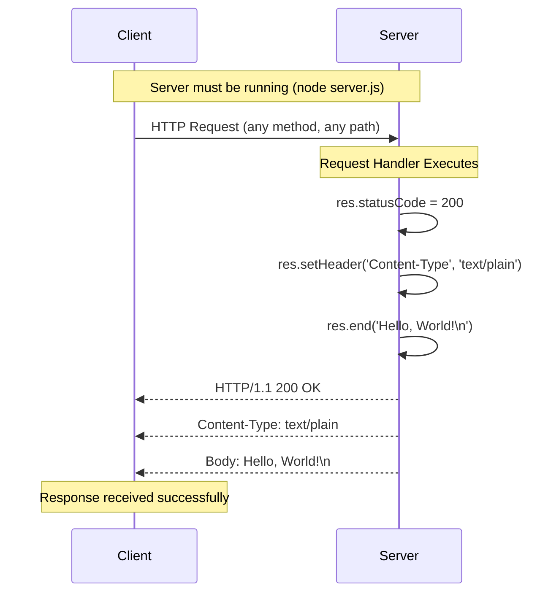

# API Reference

> HTTP endpoint reference documentation for the Node.js Hello World server.

## Table of Contents

- [Overview](#overview)
- [Base URL](#base-url)
- [Endpoints](#endpoints)
- [Request Format](#request-format)
- [Response Format](#response-format)
- [Examples](#examples)
- [Error Handling](#error-handling)
- [Request/Response Flow](#requestresponse-flow)
- [Related Documentation](#related-documentation)

---

## Overview

### Purpose

This document provides a complete HTTP endpoint reference for the Node.js server implemented in `server.js`. The server is a minimal HTTP implementation designed to demonstrate Node.js server fundamentals.

### Architecture Summary

The server implements a simple, stateless HTTP architecture:

- **Single Endpoint Behavior**: All paths return the same response
- **Method Agnostic**: Responds identically to any HTTP method
- **No Routing**: No URL pattern matching or routing logic
- **No Middleware**: Direct request-to-response handling

### API Characteristics

| Characteristic | Value |
|----------------|-------|
| **Protocol** | HTTP/1.1 |
| **Authentication** | None required |
| **Rate Limiting** | None implemented |
| **CORS** | Not configured |
| **Content Negotiation** | Not implemented |

---

## Base URL

### Default Configuration

The server binds to localhost on port 3000 by default:

```
http://127.0.0.1:3000
```

### Configuration Details

| Component | Value | Source | Description |
|-----------|-------|--------|-------------|
| **Protocol** | `http://` | Hardcoded | HTTP protocol (not HTTPS) |
| **Hostname** | `127.0.0.1` | `server.js:3` | Loopback address (localhost only) |
| **Port** | `3000` | `server.js:4` | TCP port for connections |

**Source Reference**: `server.js:3-4`
```javascript
const hostname = '127.0.0.1';
const port = 3000;
```

### Localhost Binding Explained

The server binds to `127.0.0.1` (the loopback interface), which means:

- ✅ Accessible from the same machine only
- ✅ Cannot be reached from external networks
- ✅ Safe for local development
- ❌ Not accessible from other devices on your network

### Alternative Access Methods

| URL | Description |
|-----|-------------|
| `http://127.0.0.1:3000` | IPv4 loopback address |
| `http://localhost:3000` | DNS name for loopback (depends on hosts file) |

> **Note**: For detailed configuration options and how to modify the binding, see [Server Documentation](SERVER.md#configuration).

---

## Endpoints

### Root Endpoint (All Paths)

The server does not implement routing. **Every request to any path receives the same response.**

#### Endpoint Specification

| Property | Value |
|----------|-------|
| **Path** | `/*` (any path) |
| **Method** | ANY (GET, POST, PUT, DELETE, PATCH, OPTIONS, HEAD, etc.) |
| **Authentication** | None |
| **Request Body** | Ignored |
| **Query Parameters** | Ignored |
| **Headers** | Ignored |

#### Behavior

The request handler in `server.js` processes all incoming requests identically:

**Source Reference**: `server.js:6-10`
```javascript
const server = http.createServer((req, res) => {
  res.statusCode = 200;
  res.setHeader('Content-Type', 'text/plain');
  res.end('Hello, World!\n');
});
```

Key observations:
- The `req` object (request) is received but never inspected
- No routing logic based on `req.url`
- No method checking based on `req.method`
- Response is always the same regardless of input

#### Path Examples

All of these requests return the same response:

| Path | Method | Same Response? |
|------|--------|----------------|
| `/` | GET | ✅ Yes |
| `/hello` | GET | ✅ Yes |
| `/api/users` | POST | ✅ Yes |
| `/any/path/here` | PUT | ✅ Yes |
| `/with?query=params` | GET | ✅ Yes |

---

## Request Format

### General Request Structure

The server accepts any valid HTTP request. There are no requirements for:

- **Headers**: No required headers (Content-Type, Authorization, etc.)
- **Body**: Request body is accepted but ignored
- **Query Parameters**: Accepted but ignored
- **URL Path**: Any valid URL path is accepted
- **HTTP Method**: Any standard HTTP method works

### Minimum Valid Request

The simplest valid request requires only the HTTP method and path:

```http
GET / HTTP/1.1
Host: 127.0.0.1:3000
```

### Request Parameters

| Parameter Type | Required | Processed | Notes |
|----------------|----------|-----------|-------|
| HTTP Method | ✅ Yes | ❌ No | Any method accepted, all treated equally |
| URL Path | ✅ Yes | ❌ No | Any path accepted, not parsed |
| Query String | ❌ No | ❌ No | Accepted but ignored |
| Headers | ❌ No | ❌ No | Not validated or processed |
| Body | ❌ No | ❌ No | Accepted but not read |

### Authentication

No authentication is required or implemented. The server responds to all requests without any credential verification.

---

## Response Format

### Response Structure

Every successful request receives an identical response:

| Component | Value | Source |
|-----------|-------|--------|
| **Status Code** | `200 OK` | `server.js:7` |
| **Content-Type** | `text/plain` | `server.js:8` |
| **Body** | `Hello, World!\n` | `server.js:9` |

### Response Details

#### Status Code: 200 OK

**Source Reference**: `server.js:7`
```javascript
res.statusCode = 200;
```

The HTTP 200 status code indicates successful processing. The server always returns 200 regardless of:
- The requested path
- The HTTP method used
- The request headers or body

#### Content-Type Header

**Source Reference**: `server.js:8`
```javascript
res.setHeader('Content-Type', 'text/plain');
```

The response is plain text (not JSON, HTML, or other formats):
- MIME type: `text/plain`
- Character encoding: UTF-8 (default)
- No charset explicitly specified

#### Response Body

**Source Reference**: `server.js:9`
```javascript
res.end('Hello, World!\n');
```

The response body is a fixed string:
- Content: `Hello, World!` followed by a newline character (`\n`)
- Length: 14 bytes (13 characters + newline)
- Format: Plain text

### Complete HTTP Response

A full HTTP response looks like:

```http
HTTP/1.1 200 OK
Content-Type: text/plain
Date: [current date/time]
Connection: keep-alive
Transfer-Encoding: chunked

Hello, World!
```

> **Note**: Additional headers like `Date`, `Connection`, and `Transfer-Encoding` are added automatically by Node.js.

---

## Examples

### Using curl

#### Basic GET Request

```bash
curl http://127.0.0.1:3000/
```

**Expected Output:**
```
Hello, World!
```

#### GET Request to Different Path

```bash
curl http://127.0.0.1:3000/hello
```

**Expected Output:**
```
Hello, World!
```

#### POST Request

```bash
curl -X POST http://127.0.0.1:3000/
```

**Expected Output:**
```
Hello, World!
```

#### POST with Data (data is ignored)

```bash
curl -X POST -d "name=test" http://127.0.0.1:3000/
```

**Expected Output:**
```
Hello, World!
```

#### Request with Custom Headers (headers are ignored)

```bash
curl -H "Authorization: Bearer token123" http://127.0.0.1:3000/
```

**Expected Output:**
```
Hello, World!
```

#### View Response Headers

```bash
curl -i http://127.0.0.1:3000/
```

**Expected Output:**
```
HTTP/1.1 200 OK
Content-Type: text/plain
Date: Tue, 03 Dec 2024 12:00:00 GMT
Connection: keep-alive
Transfer-Encoding: chunked

Hello, World!
```

#### Verbose Output (Full Request/Response Details)

```bash
curl -v http://127.0.0.1:3000/
```

### Using wget

```bash
wget -qO- http://127.0.0.1:3000/
```

**Expected Output:**
```
Hello, World!
```

### Using Browser

1. Open any web browser
2. Navigate to: `http://127.0.0.1:3000/` or `http://localhost:3000/`
3. The page displays: `Hello, World!`

### Using JavaScript (Node.js)

```javascript
const http = require('http');

http.get('http://127.0.0.1:3000/', (res) => {
  let data = '';
  res.on('data', (chunk) => data += chunk);
  res.on('end', () => console.log(data));
});
```

### Using JavaScript (Browser Fetch API)

```javascript
fetch('http://127.0.0.1:3000/')
  .then(response => response.text())
  .then(data => console.log(data));
```

> **Note**: Browser fetch may encounter CORS issues if the request originates from a different origin.

### Using Python

```python
import requests

response = requests.get('http://127.0.0.1:3000/')
print(response.text)  # Output: Hello, World!
```

---

## Error Handling

### Current Implementation

The server **does not implement error handling**. All requests receive the same 200 OK response.

| Scenario | Expected Behavior | Actual Behavior |
|----------|-------------------|-----------------|
| Valid GET request | 200 OK | ✅ 200 OK |
| Invalid path | 404 Not Found | ❌ 200 OK |
| Unsupported method | 405 Method Not Allowed | ❌ 200 OK |
| Malformed request | 400 Bad Request | ❌ 200 OK |
| Server error | 500 Internal Error | ❌ 200 OK |

### No Validation

The server does not validate:
- Request paths
- HTTP methods
- Request headers
- Request body content
- Query parameters

### Error Scenarios Not Handled

| Error Type | Description | Server Response |
|------------|-------------|-----------------|
| **Invalid URL** | Non-existent resource | Returns 200 with "Hello, World!" |
| **Method Not Allowed** | DELETE on read-only resource | Returns 200 with "Hello, World!" |
| **Bad Request** | Malformed input | Returns 200 with "Hello, World!" |
| **Unauthorized** | Missing credentials | Returns 200 with "Hello, World!" |

### Connection-Level Errors

Errors at the connection level (before request handling) will result in standard behavior:

| Scenario | Result |
|----------|--------|
| Server not running | `Connection refused` error on client |
| Port blocked by firewall | `Connection timeout` on client |
| Invalid hostname | DNS resolution failure on client |

### Future Considerations

For production use, consider implementing:
- Route-specific handlers with 404 responses for unknown paths
- HTTP method validation with 405 responses
- Request body validation with 400 responses
- Authentication with 401/403 responses
- Internal error handling with 500 responses

---

## Request/Response Flow

### Sequence Diagram

The following diagram illustrates the complete request/response cycle:



### Flow Description

1. **Client Initiates Request**: Any HTTP client sends a request to `http://127.0.0.1:3000`
2. **Server Receives Request**: The Node.js HTTP server accepts the connection
3. **Handler Executes**: The callback function in `http.createServer()` runs
4. **Status Set**: Response status code set to 200
5. **Header Set**: Content-Type header set to `text/plain`
6. **Response Sent**: `res.end()` sends the body and closes the response
7. **Client Receives**: The client receives the complete HTTP response

### Processing Time

The server provides near-instantaneous responses:

| Stage | Typical Duration |
|-------|------------------|
| Connection establishment | ~1-5ms (localhost) |
| Request parsing | <1ms |
| Handler execution | <1ms |
| Response transmission | <1ms |
| **Total round-trip** | **~5-10ms** (localhost) |

---

## Related Documentation

### Internal Documentation

| Document | Description |
|----------|-------------|
| [Server Documentation](SERVER.md) | Technical details of server.js implementation |
| [Testing Guide](TESTING.md) | How to test the server and API endpoints |

### External Resources

| Resource | Link |
|----------|------|
| Node.js HTTP Documentation | [https://nodejs.org/api/http.html](https://nodejs.org/api/http.html) |
| HTTP Status Codes | [MDN HTTP Status](https://developer.mozilla.org/en-US/docs/Web/HTTP/Status) |
| curl Manual | [https://curl.se/docs/manual.html](https://curl.se/docs/manual.html) |

---

## Quick Reference Card

### Server Info

| Property | Value |
|----------|-------|
| Base URL | `http://127.0.0.1:3000` |
| Protocol | HTTP/1.1 |
| Authentication | None |

### Request

| Property | Value |
|----------|-------|
| Methods | Any (GET, POST, PUT, DELETE, etc.) |
| Paths | Any path accepted |
| Headers | None required |
| Body | Optional (ignored) |

### Response

| Property | Value |
|----------|-------|
| Status | `200 OK` |
| Content-Type | `text/plain` |
| Body | `Hello, World!\n` |

### Quick Test

```bash
# Start server
node server.js

# Test endpoint (in another terminal)
curl http://127.0.0.1:3000/
# Output: Hello, World!
```

---

*This API reference documents the HTTP endpoint implementation in server.js. For implementation details, see [Server Documentation](SERVER.md).*
