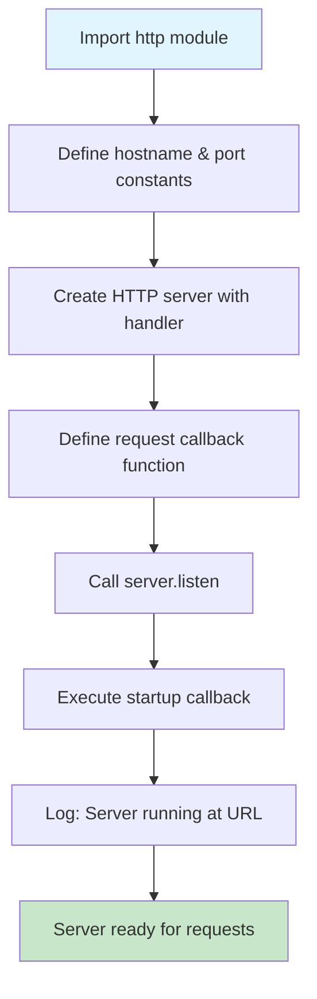
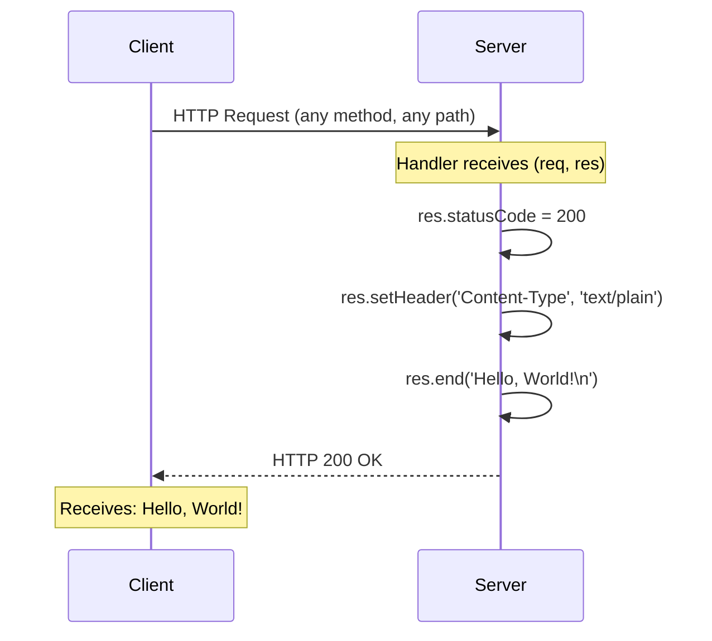
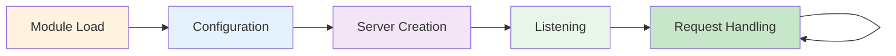

# Server.js Technical Documentation

> Comprehensive technical documentation for the Node.js HTTP server implementation.

## Table of Contents

- [Module Overview](#module-overview)
- [Dependencies](#dependencies)
- [Configuration](#configuration)
- [Code Walkthrough](#code-walkthrough)
- [Request Handler](#request-handler)
- [Server Lifecycle](#server-lifecycle)
- [Examples](#examples)
- [Troubleshooting](#troubleshooting)
- [Related Documentation](#related-documentation)

---

## Module Overview

### Purpose

The `server.js` file implements a minimal HTTP server using Node.js core modules. This server responds to all incoming HTTP requests with a plain text "Hello, World!" message, making it an ideal starting point for understanding Node.js server fundamentals.

### File Information

| Attribute | Value |
|-----------|-------|
| **File Name** | `server.js` |
| **Location** | Repository root |
| **Total Lines** | 15 |
| **Type** | Node.js HTTP Server |
| **Entry Point** | Run directly with `node server.js` |

### Capabilities

- **HTTP Server**: Creates and manages an HTTP server instance
- **Request Handling**: Responds to all incoming HTTP requests
- **Console Logging**: Outputs server status on startup
- **Configurable Binding**: Hostname and port are easily modifiable

### Server Architecture



---

## Dependencies

### Core Dependencies

This server uses only Node.js built-in modules, requiring **no external package installations**.

| Module | Type | Import Statement | Purpose |
|--------|------|------------------|---------|
| `http` | Core (built-in) | `const http = require('http');` | Create HTTP server and handle requests |

**Source Reference**: `server.js:1`
```javascript
const http = require('http');
```

### Why the http Module?

The `http` module is a Node.js core module that provides:
- `http.createServer()` - Factory function to create HTTP servers
- Request/Response objects with full HTTP protocol support
- Event-driven, non-blocking I/O model
- Built-in support for HTTP methods, headers, and status codes

### No External Dependencies

This project intentionally has **zero external dependencies** (no npm packages required). This ensures:
- Minimal attack surface
- No version conflicts
- Fast startup time
- Simplified deployment
- Easy learning curve for beginners

---

## Configuration

### Server Configuration Options

The server uses two configurable constants to define its network binding:

| Option | Value | Line | Description |
|--------|-------|------|-------------|
| `hostname` | `'127.0.0.1'` | Line 3 | IP address the server binds to (localhost) |
| `port` | `3000` | Line 4 | TCP port number for incoming connections |

**Source Reference**: `server.js:3-4`
```javascript
const hostname = '127.0.0.1';
const port = 3000;
```

### Response Configuration

| Option | Value | Line | Description |
|--------|-------|------|-------------|
| `Content-Type` | `'text/plain'` | Line 8 | MIME type of the response body |
| Status Code | `200` | Line 7 | HTTP status indicating success |
| Response Body | `'Hello, World!\n'` | Line 9 | Plain text content returned to client |

### Configuration Details

#### Hostname (`127.0.0.1`)

- **Meaning**: Loopback address (localhost)
- **Accessibility**: Only accessible from the local machine
- **Security**: Prevents external network access by default
- **Alternative**: Use `'0.0.0.0'` to allow connections from any IP address

#### Port (`3000`)

- **Range**: Valid port numbers are 1-65535
- **Privileged Ports**: Ports below 1024 require root/admin privileges
- **Common Alternatives**: 8080, 8000, 5000
- **Production**: Typically port 80 (HTTP) or 443 (HTTPS)

### How to Modify Configuration

To change the server binding, edit the constants in `server.js`:

```javascript
// Example: Bind to all interfaces on port 8080
const hostname = '0.0.0.0';  // Accept connections from any IP
const port = 8080;           // Change to your preferred port
```

**⚠️ Security Warning**: Setting `hostname` to `'0.0.0.0'` exposes the server to your entire network. Only do this in trusted environments.

---

## Code Walkthrough

### Complete Source Code

Below is the complete `server.js` implementation with line numbers:

```javascript
1   const http = require('http');
2   
3   const hostname = '127.0.0.1';
4   const port = 3000;
5   
6   const server = http.createServer((req, res) => {
7     res.statusCode = 200;
8     res.setHeader('Content-Type', 'text/plain');
9     res.end('Hello, World!\n');
10  });
11  
12  server.listen(port, hostname, () => {
13    console.log(`Server running at http://${hostname}:${port}/`);
14  });
15  
```

### Line-by-Line Explanation

#### Line 1: Module Import
```javascript
const http = require('http');
```
- **Purpose**: Imports the built-in Node.js HTTP module
- **`require()`**: Node.js CommonJS module loading function
- **`const`**: Declares an immutable binding to the http module
- **Returns**: The http module object with server creation methods

#### Lines 3-4: Configuration Constants
```javascript
const hostname = '127.0.0.1';
const port = 3000;
```
- **`hostname`**: String containing the IP address for server binding
- **`port`**: Number specifying the TCP port to listen on
- **`const`**: These values remain unchanged during server runtime

#### Lines 6-10: Server Creation
```javascript
const server = http.createServer((req, res) => {
  res.statusCode = 200;
  res.setHeader('Content-Type', 'text/plain');
  res.end('Hello, World!\n');
});
```
- **`http.createServer()`**: Factory method that creates an HTTP server instance
- **Callback Function**: `(req, res) => {...}` is the request handler
- **`req`**: IncomingMessage object containing request details
- **`res`**: ServerResponse object for sending the response
- **`server`**: The HTTP server instance (returned by createServer)

#### Lines 12-14: Server Startup
```javascript
server.listen(port, hostname, () => {
  console.log(`Server running at http://${hostname}:${port}/`);
});
```
- **`server.listen()`**: Starts the server and begins accepting connections
- **Parameters**: port, hostname, and an optional callback
- **Callback**: Executed once the server is successfully listening
- **Template Literal**: Dynamically constructs the server URL for logging

---

## Request Handler

### Handler Implementation

The request handler is defined as an arrow function callback passed to `http.createServer()`:

**Source Reference**: `server.js:6-10`
```javascript
const server = http.createServer((req, res) => {
  res.statusCode = 200;
  res.setHeader('Content-Type', 'text/plain');
  res.end('Hello, World!\n');
});
```

### Handler Parameters

| Parameter | Type | Description |
|-----------|------|-------------|
| `req` | `http.IncomingMessage` | Contains request details (method, URL, headers, body) |
| `res` | `http.ServerResponse` | Used to construct and send the HTTP response |

### Response Construction

#### Step 1: Set Status Code (Line 7)
```javascript
res.statusCode = 200;
```
- Sets HTTP status code to `200 OK`
- Indicates successful request processing
- This is the default status code, but explicitly setting it improves clarity

#### Step 2: Set Headers (Line 8)
```javascript
res.setHeader('Content-Type', 'text/plain');
```
- Sets the `Content-Type` response header
- `text/plain` indicates plain text content (not HTML, JSON, etc.)
- Helps clients understand how to interpret the response body

#### Step 3: Send Response (Line 9)
```javascript
res.end('Hello, World!\n');
```
- Writes `'Hello, World!\n'` to the response body
- Signals that the response is complete
- Closes the connection (for HTTP/1.1 without keep-alive)
- The `\n` adds a newline for clean terminal output

### Request/Response Flow



### Important Behavior Notes

1. **Universal Response**: The handler responds identically to ALL requests regardless of:
   - HTTP method (GET, POST, PUT, DELETE, etc.)
   - Request path (`/`, `/hello`, `/api/users`, etc.)
   - Request headers
   - Request body

2. **No Routing**: There is no URL routing logic - every path returns the same response

3. **No Validation**: The server does not validate requests in any way

4. **No Error Handling**: The handler has no try-catch blocks or error responses

---

## Server Lifecycle

### Lifecycle Stages



### Stage 1: Module Load

When `node server.js` is executed:
1. Node.js runtime initializes
2. The `http` module is loaded into memory
3. Module APIs become available for use

### Stage 2: Configuration

Configuration constants are initialized:
- `hostname` set to `'127.0.0.1'`
- `port` set to `3000`

These values are evaluated once at startup and remain constant.

### Stage 3: Server Creation

The `http.createServer()` call:
1. Creates a new HTTP server instance
2. Registers the request handler callback
3. Returns the server object (not yet listening)

### Stage 4: Listening

**Source Reference**: `server.js:12-14`
```javascript
server.listen(port, hostname, () => {
  console.log(`Server running at http://${hostname}:${port}/`);
});
```

The `server.listen()` call:
1. Binds the server to the specified hostname and port
2. Opens a TCP socket to accept incoming connections
3. Transitions the server to "listening" state
4. Executes the callback function once bound successfully

**Expected Console Output**:
```
Server running at http://127.0.0.1:3000/
```

### Stage 5: Request Handling (Ongoing)

Once listening, the server:
1. Waits for incoming HTTP connections
2. For each request, invokes the registered handler
3. Processes requests sequentially (single-threaded)
4. Continues indefinitely until process termination

### Shutdown Behavior

**⚠️ Note**: This server does not implement graceful shutdown.

To stop the server:
- Press `Ctrl+C` in the terminal (sends SIGINT)
- Use `kill <pid>` command
- Process will terminate immediately

For production servers, you should implement:
- SIGTERM/SIGINT signal handlers
- Connection draining
- Graceful shutdown with timeout

---

## Examples

### Starting the Server

#### Basic Startup
```bash
# Navigate to the project directory
cd /path/to/hello_world

# Start the server
node server.js
```

**Expected Output**:
```
Server running at http://127.0.0.1:3000/
```

#### Background Startup
```bash
# Start server in background (Unix/Linux/macOS)
node server.js &

# Start server in background (Windows PowerShell)
Start-Process node -ArgumentList "server.js" -NoNewWindow
```

### Making HTTP Requests

#### Using curl

```bash
# Basic GET request
curl http://127.0.0.1:3000/

# Output: Hello, World!
```

```bash
# GET request to any path (same response)
curl http://127.0.0.1:3000/hello
curl http://127.0.0.1:3000/api/users
curl http://127.0.0.1:3000/any/path/works

# All output: Hello, World!
```

```bash
# Verbose output to see headers
curl -v http://127.0.0.1:3000/

# Shows: < HTTP/1.1 200 OK
#        < Content-Type: text/plain
```

```bash
# Different HTTP methods (all return same response)
curl -X POST http://127.0.0.1:3000/
curl -X PUT http://127.0.0.1:3000/
curl -X DELETE http://127.0.0.1:3000/

# All output: Hello, World!
```

#### Using a Web Browser

1. Open your preferred web browser
2. Navigate to: `http://127.0.0.1:3000/`
3. The browser will display: `Hello, World!`

#### Using wget

```bash
wget -qO- http://127.0.0.1:3000/

# Output: Hello, World!
```

#### Using Node.js

```javascript
// test-client.js
const http = require('http');

const options = {
  hostname: '127.0.0.1',
  port: 3000,
  path: '/',
  method: 'GET'
};

const req = http.request(options, (res) => {
  console.log(`Status Code: ${res.statusCode}`);
  res.on('data', (chunk) => {
    console.log(`Body: ${chunk}`);
  });
});

req.end();
```

### Stopping the Server

```bash
# Method 1: Ctrl+C (if running in foreground)
# Press Ctrl+C in the terminal

# Method 2: Find and kill the process
# Unix/Linux/macOS:
lsof -i :3000
kill <PID>

# Windows:
netstat -ano | findstr :3000
taskkill /PID <PID> /F
```

---

## Troubleshooting

### Common Errors and Solutions

#### EADDRINUSE: Port Already in Use

**Error Message**:
```
Error: listen EADDRINUSE: address already in use 127.0.0.1:3000
```

**Cause**: Another process is already using port 3000.

**Solutions**:

1. **Find and stop the other process**:
   ```bash
   # Unix/Linux/macOS
   lsof -i :3000
   kill -9 <PID>
   
   # Windows
   netstat -ano | findstr :3000
   taskkill /PID <PID> /F
   ```

2. **Use a different port**:
   ```javascript
   // Modify server.js line 4
   const port = 3001;  // or any available port
   ```

---

#### EACCES: Permission Denied

**Error Message**:
```
Error: listen EACCES: permission denied 127.0.0.1:80
```

**Cause**: Attempting to bind to a privileged port (below 1024) without root/admin privileges.

**Solutions**:

1. **Use an unprivileged port (recommended)**:
   ```javascript
   const port = 3000;  // Any port >= 1024
   ```

2. **Run with elevated privileges (not recommended for development)**:
   ```bash
   # Unix/Linux/macOS
   sudo node server.js
   
   # Windows: Run terminal as Administrator
   ```

---

#### Connection Refused

**Error Message**:
```
curl: (7) Failed to connect to 127.0.0.1 port 3000: Connection refused
```

**Cause**: The server is not running.

**Solutions**:

1. **Verify the server is running**:
   ```bash
   # Check if process exists
   ps aux | grep "node server.js"
   
   # Or check if port is listening
   lsof -i :3000  # Unix/Linux/macOS
   netstat -an | findstr :3000  # Windows
   ```

2. **Start the server**:
   ```bash
   node server.js
   ```

---

#### Cannot Access from Another Machine

**Symptom**: Server works locally but cannot be accessed from other machines on the network.

**Cause**: Server is bound to `127.0.0.1` (localhost only).

**Solution**: Modify the hostname to accept all connections:
```javascript
// Change server.js line 3
const hostname = '0.0.0.0';  // Accept from any IP
```

⚠️ **Security Warning**: This exposes your server to your entire network.

---

#### Module Not Found

**Error Message**:
```
Error: Cannot find module 'http'
```

**Cause**: Corrupted Node.js installation or incorrect Node.js version.

**Solutions**:

1. **Verify Node.js installation**:
   ```bash
   node --version  # Should output version number
   npm --version   # Should output version number
   ```

2. **Reinstall Node.js**:
   - Download from [nodejs.org](https://nodejs.org)
   - Install the LTS (Long Term Support) version

---

### Diagnostic Commands

```bash
# Check Node.js version
node --version

# Check if server process is running
ps aux | grep node

# Check what's using port 3000
lsof -i :3000  # Unix/Linux/macOS
netstat -ano | findstr :3000  # Windows

# Test server response
curl -v http://127.0.0.1:3000/

# Check server output/logs
# (run server in foreground to see console output)
node server.js
```

---

## Related Documentation

For more detailed information, see the following documentation files:

- **[API Reference](API.md)** - Complete HTTP endpoint documentation with request/response specifications
- **[Testing Guide](TESTING.md)** - Test strategy, test cases, and execution procedures

### External Resources

- [Node.js HTTP Module Documentation](https://nodejs.org/api/http.html)
- [Node.js Getting Started Guide](https://nodejs.org/en/learn/getting-started/introduction-to-nodejs)

---

## Version History

| Version | Date | Description |
|---------|------|-------------|
| 1.0.0 | Initial | Initial documentation for server.js |

---

*This documentation was generated for the hello_world Node.js HTTP server project.*
