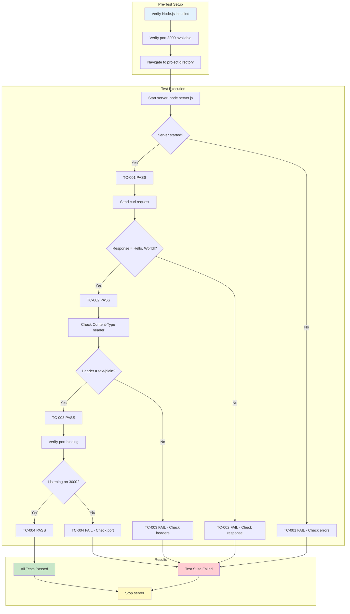
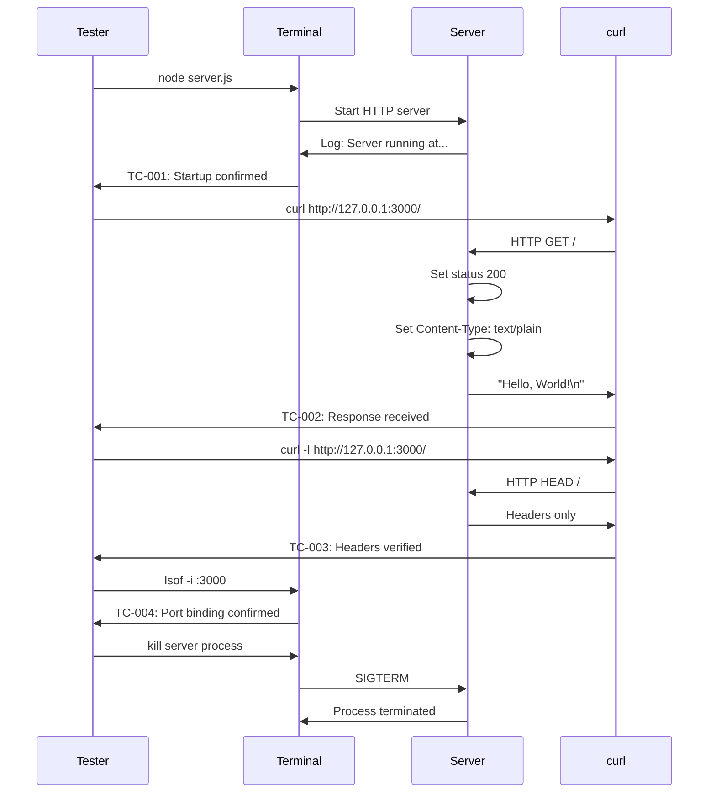

# Testing Guide

> Test strategy and documentation for the Node.js HTTP server project.

## Table of Contents

- [Test Strategy](#test-strategy)
- [Test Environment](#test-environment)
- [Test Framework Recommendations](#test-framework-recommendations)
- [Test Cases](#test-cases)
- [Running Tests](#running-tests)
- [Expected Results](#expected-results)
- [Coverage Targets](#coverage-targets)
- [Test Execution Flow](#test-execution-flow)
- [Related Documentation](#related-documentation)

---

## Test Strategy

### Overview

This document outlines the testing approach for the Node.js HTTP server implemented in `server.js`. Given the minimal nature of this server, the testing strategy focuses on verifying core functionality: server startup, request handling, response format, and header configuration.

### Testing Philosophy

For this minimal HTTP server, the testing philosophy emphasizes:

1. **Simplicity**: Tests should be straightforward and easy to understand
2. **Completeness**: Cover all functional aspects despite the minimal codebase
3. **Reproducibility**: Tests should produce consistent results across environments
4. **Documentation**: Tests serve as living documentation of expected behavior

### Testing Approaches

#### Manual Testing

Manual testing is the quickest way to verify server functionality during development:

| Method | Tool | Use Case |
|--------|------|----------|
| Terminal requests | `curl` | Quick endpoint testing |
| Browser access | Any web browser | Visual verification |
| Network inspection | Browser DevTools | Header and response analysis |

#### Automated Testing

For production readiness and continuous integration, automated tests are recommended:

| Type | Framework | Purpose |
|------|-----------|---------|
| Unit Tests | Jest | Test individual components |
| Integration Tests | Supertest | Test HTTP request/response cycle |
| End-to-End Tests | curl scripts | Validate complete workflow |

### Current Test Status

**Source Reference**: `package.json:7`
```json
"test": "echo \"Error: no test specified\" && exit 1"
```

> **Note**: The current project has a placeholder test script. No automated tests are currently implemented. This documentation provides guidance for implementing a comprehensive test suite.

---

## Test Environment

### Runtime Requirements

| Requirement | Minimum Version | Recommended Version | Notes |
|-------------|-----------------|---------------------|-------|
| **Node.js** | v12.0.0 | v20.x (LTS) | JavaScript runtime |
| **npm** | v6.0.0 | v10.x | Package manager (bundled with Node.js) |

### Operating System Compatibility

| OS | Status | Notes |
|----|--------|-------|
| macOS | ✅ Supported | Fully tested |
| Linux | ✅ Supported | Fully tested |
| Windows | ✅ Supported | Use PowerShell or WSL for curl |

### Required Tools for Manual Testing

#### curl

Command-line HTTP client for making requests to the server.

**Installation**:

| Platform | Command |
|----------|---------|
| macOS | Pre-installed or `brew install curl` |
| Ubuntu/Debian | `sudo apt-get install curl` |
| CentOS/RHEL | `sudo yum install curl` |
| Windows | Pre-installed in Windows 10+ or use WSL |

**Version Check**:
```bash
curl --version
```

#### Web Browser

Any modern web browser can be used for visual testing:

- Chrome / Chromium
- Firefox
- Safari
- Edge

### Network Requirements

| Component | Value | Purpose |
|-----------|-------|---------|
| **Hostname** | `127.0.0.1` | Server binding address |
| **Port** | `3000` | Server listening port |
| **Protocol** | HTTP | No TLS/SSL required |

> **Important**: Ensure port 3000 is available and not blocked by firewall rules.

### Pre-Test Checklist

Before running tests, verify:

- [ ] Node.js is installed (`node --version`)
- [ ] Server file exists (`ls server.js`)
- [ ] Port 3000 is available (`lsof -i :3000` on macOS/Linux)
- [ ] curl is installed (`curl --version`)

---

## Test Framework Recommendations

### Recommended Test Stack

While no test framework is currently installed, the following stack is recommended for comprehensive testing:

| Package | Version | Registry | Purpose |
|---------|---------|----------|---------|
| **Jest** | 29.7.0 | npm | Test runner and assertion library |
| **Supertest** | 6.3.3 | npm | HTTP assertion library |

> **Note**: These are recommendations only. Installation and configuration are outside the scope of this documentation task.

### Jest

Jest is a comprehensive JavaScript testing framework developed by Facebook.

**Key Features**:
- Zero configuration for most projects
- Built-in assertion library
- Snapshot testing
- Code coverage reporting
- Parallel test execution

**Installation** (when ready to implement):
```bash
npm install --save-dev jest
```

**Package.json Configuration**:
```json
{
  "scripts": {
    "test": "jest"
  }
}
```

### Supertest

Supertest provides a high-level abstraction for testing HTTP servers.

**Key Features**:
- Fluent API for HTTP assertions
- Works seamlessly with Jest
- Tests actual HTTP behavior
- No need to start server separately

**Installation** (when ready to implement):
```bash
npm install --save-dev supertest
```

### Example Test Structure

When implementing automated tests, organize files as follows:

```
hello_world/
├── server.js
├── package.json
├── __tests__/
│   ├── server.test.js       # Server startup tests
│   └── api.test.js          # API endpoint tests
└── docs/
    └── TESTING.md           # This file
```

### Sample Test File

```javascript
// __tests__/server.test.js
const http = require('http');

describe('Server', () => {
  let server;

  beforeAll((done) => {
    // Import and start server
    server = require('../server');
    done();
  });

  afterAll((done) => {
    // Close server after tests
    server.close(done);
  });

  test('should respond with Hello, World!', (done) => {
    http.get('http://127.0.0.1:3000/', (res) => {
      let data = '';
      res.on('data', (chunk) => data += chunk);
      res.on('end', () => {
        expect(data).toBe('Hello, World!\n');
        done();
      });
    });
  });
});
```

### Sample Supertest Test

```javascript
// __tests__/api.test.js
const request = require('supertest');
const http = require('http');

// Create server instance for testing
const server = http.createServer((req, res) => {
  res.statusCode = 200;
  res.setHeader('Content-Type', 'text/plain');
  res.end('Hello, World!\n');
});

describe('API Endpoints', () => {
  test('GET / returns 200 with Hello, World!', async () => {
    const response = await request(server)
      .get('/')
      .expect(200)
      .expect('Content-Type', /text\/plain/);
    
    expect(response.text).toBe('Hello, World!\n');
  });

  test('GET /any/path returns same response', async () => {
    const response = await request(server)
      .get('/any/path')
      .expect(200);
    
    expect(response.text).toBe('Hello, World!\n');
  });
});
```

---

## Test Cases

### Test Case Summary Table

| ID | Name | Category | Priority |
|----|------|----------|----------|
| TC-001 | Server Startup | Startup | High |
| TC-002 | GET Request Response | Functionality | High |
| TC-003 | Response Headers | Functionality | Medium |
| TC-004 | Port Binding | Configuration | Medium |

---

### TC-001: Server Starts Successfully

**Description**: Verify that the server starts without errors and logs the expected startup message.

| Attribute | Value |
|-----------|-------|
| **Test ID** | TC-001 |
| **Category** | Startup |
| **Priority** | High |
| **Prerequisites** | Node.js installed, port 3000 available |

**Source Reference**: `server.js:12-14`
```javascript
server.listen(port, hostname, () => {
  console.log(`Server running at http://${hostname}:${port}/`);
});
```

**Test Steps**:

1. Open a terminal window
2. Navigate to the project directory
3. Execute `node server.js`
4. Observe console output

**Expected Result**:
```
Server running at http://127.0.0.1:3000/
```

**Verification Command**:
```bash
# Start server and capture output
node server.js &
sleep 1
# Server should be running - verify with curl
curl -s http://127.0.0.1:3000/ > /dev/null && echo "Server is responding"
# Stop server
kill %1
```

**Pass Criteria**:
- Server process starts without errors
- Console displays the startup message with correct URL
- Server remains running and responsive

**Fail Criteria**:
- Node.js throws an error on startup
- Port binding fails (EADDRINUSE error)
- No console output appears

---

### TC-002: GET Request Returns Hello, World!

**Description**: Verify that HTTP requests to any path return a 200 status code with "Hello, World!\n" as the response body.

| Attribute | Value |
|-----------|-------|
| **Test ID** | TC-002 |
| **Category** | Functionality |
| **Priority** | High |
| **Prerequisites** | Server running on port 3000 |

**Source Reference**: `server.js:6-10`
```javascript
const server = http.createServer((req, res) => {
  res.statusCode = 200;
  res.setHeader('Content-Type', 'text/plain');
  res.end('Hello, World!\n');
});
```

**Test Steps**:

1. Ensure server is running (`node server.js`)
2. Send a GET request to `http://127.0.0.1:3000/`
3. Verify response status code is 200
4. Verify response body is "Hello, World!\n"

**Test Commands**:

```bash
# Basic GET request
curl http://127.0.0.1:3000/

# GET request with verbose output
curl -v http://127.0.0.1:3000/

# GET request showing only status code
curl -s -o /dev/null -w "%{http_code}" http://127.0.0.1:3000/
```

**Expected Result**:
```
Hello, World!
```

**Pass Criteria**:
- HTTP status code is 200
- Response body exactly matches "Hello, World!\n" (including newline)
- Response is received within reasonable time (<1 second)

**Fail Criteria**:
- Status code is not 200
- Response body differs from expected
- Connection refused or timeout

**Additional Verification** (Any Path):
```bash
# All paths should return the same response
curl http://127.0.0.1:3000/
curl http://127.0.0.1:3000/test
curl http://127.0.0.1:3000/any/path/here
curl http://127.0.0.1:3000/api/v1/users
```

---

### TC-003: Response Headers Correct

**Description**: Verify that the server responds with the correct Content-Type header set to "text/plain".

| Attribute | Value |
|-----------|-------|
| **Test ID** | TC-003 |
| **Category** | Functionality |
| **Priority** | Medium |
| **Prerequisites** | Server running on port 3000 |

**Source Reference**: `server.js:8`
```javascript
res.setHeader('Content-Type', 'text/plain');
```

**Test Steps**:

1. Ensure server is running
2. Send a request with header inspection enabled
3. Verify Content-Type header is present
4. Verify Content-Type value is "text/plain"

**Test Command**:
```bash
# Show response headers only
curl -I http://127.0.0.1:3000/

# Show all headers with response
curl -v http://127.0.0.1:3000/

# Extract specific header
curl -s -I http://127.0.0.1:3000/ | grep -i "content-type"
```

**Expected Headers**:
```
HTTP/1.1 200 OK
Content-Type: text/plain
Date: <current date>
Connection: keep-alive
Keep-Alive: timeout=5
Transfer-Encoding: chunked
```

**Required Header Verification**:

| Header | Expected Value | Required |
|--------|----------------|----------|
| Content-Type | text/plain | Yes |
| Status | 200 OK | Yes |
| Date | (any valid date) | Yes (auto-generated) |
| Connection | keep-alive | No (default) |

**Pass Criteria**:
- Content-Type header is present
- Content-Type value is "text/plain" (case-insensitive match)
- HTTP status line shows "200 OK"

**Fail Criteria**:
- Content-Type header missing
- Content-Type value incorrect
- Other unexpected headers that indicate errors

---

### TC-004: Server Binds to Configured Port

**Description**: Verify that the server listens on the configured port (3000) and hostname (127.0.0.1).

| Attribute | Value |
|-----------|-------|
| **Test ID** | TC-004 |
| **Category** | Configuration |
| **Priority** | Medium |
| **Prerequisites** | Port 3000 available |

**Source Reference**: `server.js:3-4`
```javascript
const hostname = '127.0.0.1';
const port = 3000;
```

**Test Steps**:

1. Ensure no other process is using port 3000
2. Start the server
3. Verify port 3000 is now in use by the server
4. Verify the server is accessible only on 127.0.0.1

**Test Commands**:

```bash
# Check port before starting server (should be empty)
lsof -i :3000

# Start server
node server.js &

# Check port is now in use
lsof -i :3000

# Verify server is accessible on correct address
curl http://127.0.0.1:3000/

# Alternative: Use netstat
netstat -an | grep 3000
```

**Expected Port Status**:
```bash
# lsof output showing Node.js listening on port 3000
COMMAND   PID  USER   FD   TYPE  DEVICE SIZE/OFF NODE NAME
node    12345  user   20u  IPv4  0x...  0t0       TCP 127.0.0.1:3000 (LISTEN)
```

**Pass Criteria**:
- Server binds successfully to port 3000
- Server is accessible via 127.0.0.1:3000
- No binding errors occur

**Fail Criteria**:
- EADDRINUSE error (port already in use)
- Server binds to wrong port
- Server not accessible on 127.0.0.1

**Troubleshooting Port Conflicts**:
```bash
# Find process using port 3000
lsof -i :3000

# Kill process using port 3000 (use with caution)
kill -9 $(lsof -t -i :3000)
```

---

## Running Tests

### Manual Testing Procedures

#### Quick Verification

The fastest way to verify server functionality:

```bash
# 1. Start the server (in background)
node server.js &

# 2. Test the endpoint
curl http://127.0.0.1:3000/

# 3. Stop the server
kill %1
```

#### Complete Manual Test Suite

Execute all manual tests in sequence:

```bash
#!/bin/bash
# complete-test.sh - Manual test script

echo "=== Starting Manual Test Suite ==="

# Test 1: Server Startup (TC-001)
echo -e "\n--- TC-001: Server Startup ---"
node server.js &
SERVER_PID=$!
sleep 1
if ps -p $SERVER_PID > /dev/null; then
    echo "✅ PASS: Server started successfully (PID: $SERVER_PID)"
else
    echo "❌ FAIL: Server failed to start"
    exit 1
fi

# Test 2: GET Request (TC-002)
echo -e "\n--- TC-002: GET Request Response ---"
RESPONSE=$(curl -s http://127.0.0.1:3000/)
if [ "$RESPONSE" = "Hello, World!" ]; then
    echo "✅ PASS: Response matches expected value"
else
    echo "❌ FAIL: Response was '$RESPONSE'"
fi

# Test 3: Headers (TC-003)
echo -e "\n--- TC-003: Response Headers ---"
CONTENT_TYPE=$(curl -sI http://127.0.0.1:3000/ | grep -i "content-type" | tr -d '\r')
if [[ "$CONTENT_TYPE" == *"text/plain"* ]]; then
    echo "✅ PASS: Content-Type is text/plain"
else
    echo "❌ FAIL: Content-Type was '$CONTENT_TYPE'"
fi

# Test 4: Port Binding (TC-004)
echo -e "\n--- TC-004: Port Binding ---"
PORT_CHECK=$(curl -s -o /dev/null -w "%{http_code}" http://127.0.0.1:3000/)
if [ "$PORT_CHECK" = "200" ]; then
    echo "✅ PASS: Server responding on port 3000"
else
    echo "❌ FAIL: Server not responding (HTTP $PORT_CHECK)"
fi

# Cleanup
echo -e "\n--- Cleanup ---"
kill $SERVER_PID 2>/dev/null
echo "Server stopped"

echo -e "\n=== Test Suite Complete ==="
```

**Usage**:
```bash
# Save the script
chmod +x complete-test.sh

# Run tests
./complete-test.sh
```

### Browser Testing

#### Steps for Browser Testing

1. **Start the server**:
   ```bash
   node server.js
   ```

2. **Open a web browser** (Chrome, Firefox, Safari, Edge)

3. **Navigate to**: `http://127.0.0.1:3000/`

4. **Expected display**:
   ```
   Hello, World!
   ```

5. **Inspect headers** (in Developer Tools):
   - Press `F12` or `Cmd+Option+I` (macOS) / `Ctrl+Shift+I` (Windows/Linux)
   - Navigate to "Network" tab
   - Refresh the page
   - Click on the request to view headers

### Automated Testing (Future Implementation)

When automated tests are implemented, they should be run using:

```bash
# Install dependencies
npm install --save-dev jest supertest

# Run all tests
npm test

# Run tests with coverage
npm test -- --coverage

# Run tests in watch mode (development)
npm test -- --watch

# Run specific test file
npm test -- __tests__/server.test.js
```

---

## Expected Results

### Success Criteria Summary

| Test ID | Test Name | Success Indicator |
|---------|-----------|-------------------|
| TC-001 | Server Startup | Console shows "Server running at http://127.0.0.1:3000/" |
| TC-002 | GET Request | Response body is "Hello, World!\n", status 200 |
| TC-003 | Headers | Content-Type header is "text/plain" |
| TC-004 | Port Binding | Server accessible on 127.0.0.1:3000 |

### Console Output Examples

#### Successful Server Startup
```
$ node server.js
Server running at http://127.0.0.1:3000/
```

#### Successful curl Request
```
$ curl http://127.0.0.1:3000/
Hello, World!
```

#### Successful Header Check
```
$ curl -I http://127.0.0.1:3000/
HTTP/1.1 200 OK
Content-Type: text/plain
Date: Tue, 03 Dec 2024 12:00:00 GMT
Connection: keep-alive
Keep-Alive: timeout=5
Transfer-Encoding: chunked
```

### Error Scenarios and Expected Messages

| Scenario | Error Message | Resolution |
|----------|--------------|------------|
| Port in use | `Error: listen EADDRINUSE :::3000` | Stop conflicting process or use different port |
| Node.js not installed | `command not found: node` | Install Node.js |
| File not found | `Error: Cannot find module './server.js'` | Navigate to correct directory |
| Permission denied | `Error: listen EACCES: permission denied` | Use port > 1024 or run with elevated privileges |

---

## Coverage Targets

### Recommended Coverage Metrics

For a production-ready test suite, target the following coverage levels:

| Metric | Target | Description |
|--------|--------|-------------|
| **Line Coverage** | 100% | Every line of code executed by tests |
| **Branch Coverage** | 100% | All conditional branches tested (N/A for this simple server) |
| **Function Coverage** | 100% | All functions called by tests |
| **Statement Coverage** | 100% | All statements executed |

### Coverage Breakdown by Component

| Component | Lines | Target Coverage | Notes |
|-----------|-------|-----------------|-------|
| HTTP module import | 1 | 100% | Covered by any test that loads server |
| Configuration | 2 | 100% | Covered by startup test |
| Request handler | 4 | 100% | Covered by request tests |
| Server listener | 3 | 100% | Covered by startup test |
| **Total** | **10** | **100%** | All functional lines |

### Areas Requiring Test Coverage

| Area | Priority | Test Type | Notes |
|------|----------|-----------|-------|
| Server startup | High | Integration | Verify successful initialization |
| Request handling | High | Integration | Verify response body and status |
| Header configuration | Medium | Integration | Verify Content-Type header |
| Error scenarios | Medium | Unit | Port conflicts, invalid requests |
| Graceful shutdown | Low | Integration | Server cleanup on termination |

### Coverage Report (Projected)

When Jest coverage is implemented:

```
--------------------|---------|----------|---------|---------|-------------------
File                | % Stmts | % Branch | % Funcs | % Lines | Uncovered Line #s 
--------------------|---------|----------|---------|---------|-------------------
All files           |     100 |      100 |     100 |     100 |                   
 server.js          |     100 |      100 |     100 |     100 |                   
--------------------|---------|----------|---------|---------|-------------------
```

### Running Coverage Analysis

```bash
# Generate coverage report
npm test -- --coverage

# Generate HTML coverage report
npm test -- --coverage --coverageReporters="html"

# View HTML report
open coverage/index.html
```

---

## Test Execution Flow

### Visual Test Flow



### Test Execution Sequence



---

## Related Documentation

### Project Documentation

| Document | Description | Link |
|----------|-------------|------|
| **Server Documentation** | Technical documentation for server.js implementation | [docs/SERVER.md](SERVER.md) |
| **API Reference** | HTTP endpoint specifications and examples | [docs/API.md](API.md) |
| **README** | Project overview and quick start guide | [README.md](../README.md) |

### External Resources

| Resource | Description |
|----------|-------------|
| [Node.js HTTP Module](https://nodejs.org/api/http.html) | Official Node.js HTTP documentation |
| [Jest Documentation](https://jestjs.io/docs/getting-started) | Jest testing framework documentation |
| [Supertest Documentation](https://github.com/ladjs/supertest#readme) | Supertest HTTP assertions documentation |
| [curl Manual](https://curl.se/docs/manual.html) | curl command-line tool documentation |

### Navigation

```
README.md (Project Overview)
├── docs/SERVER.md (Server Implementation Details)
│   └── docs/TESTING.md (You are here)
├── docs/API.md (Endpoint Reference)
│   └── docs/TESTING.md (You are here)
└── docs/TESTING.md (You are here)
    ├── → docs/SERVER.md (What is being tested)
    └── → docs/API.md (Expected API behavior)
```

---

## Document Information

| Attribute | Value |
|-----------|-------|
| **Document Title** | Testing Guide |
| **Version** | 1.0.0 |
| **Last Updated** | December 2024 |
| **Author** | Documentation Team |
| **Status** | Complete |

### Source Code References

| Source File | Lines Referenced | Section |
|-------------|------------------|---------|
| `server.js` | 1 | Dependencies |
| `server.js` | 3-4 | Configuration |
| `server.js` | 6-10 | Request Handler |
| `server.js` | 12-14 | Server Lifecycle |
| `package.json` | 7 | Current Test Status |

---

*For questions about server implementation, see [Server Documentation](SERVER.md). For API endpoint details, see [API Reference](API.md).*
